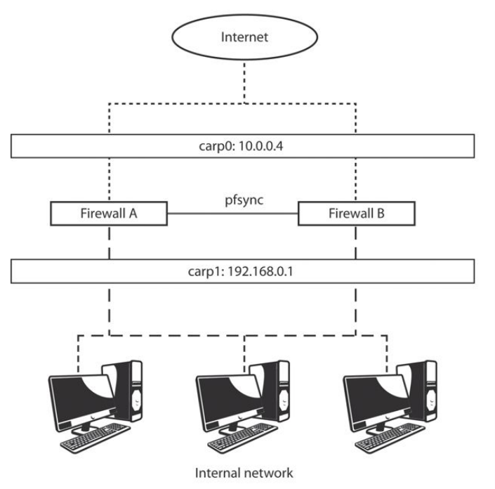
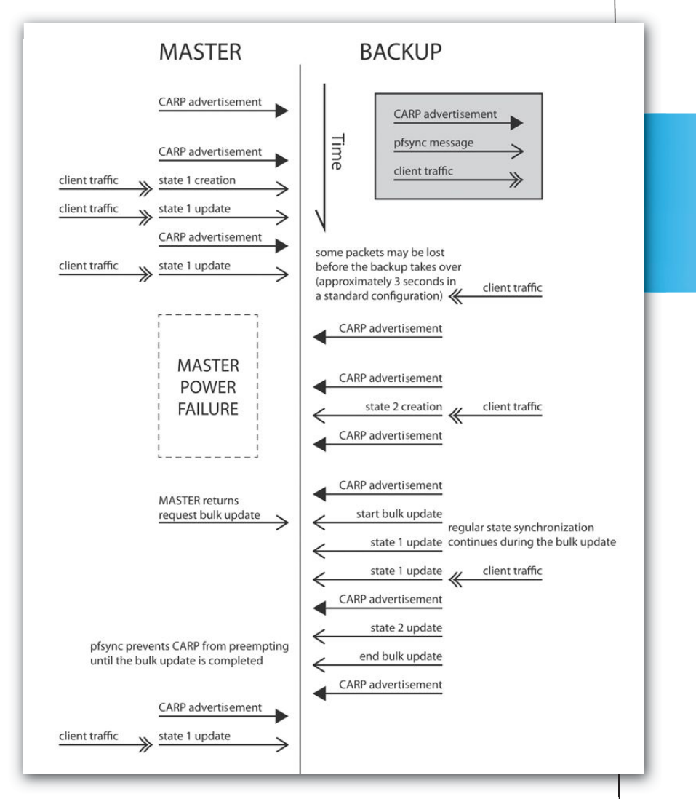
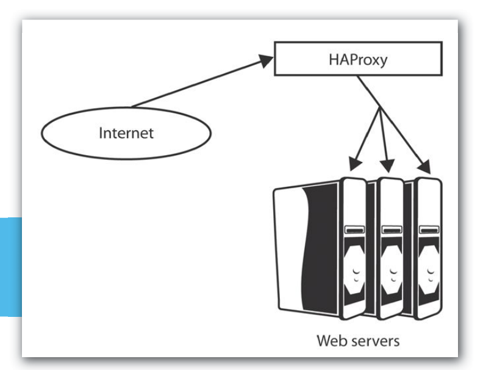
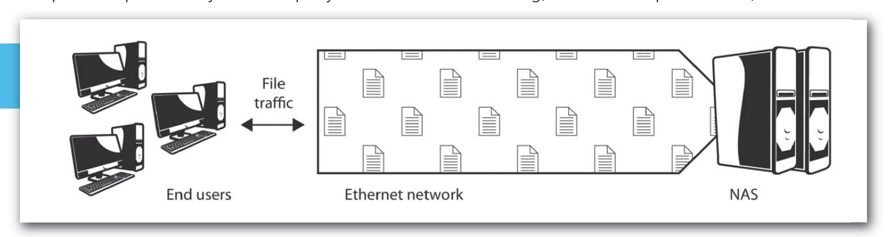
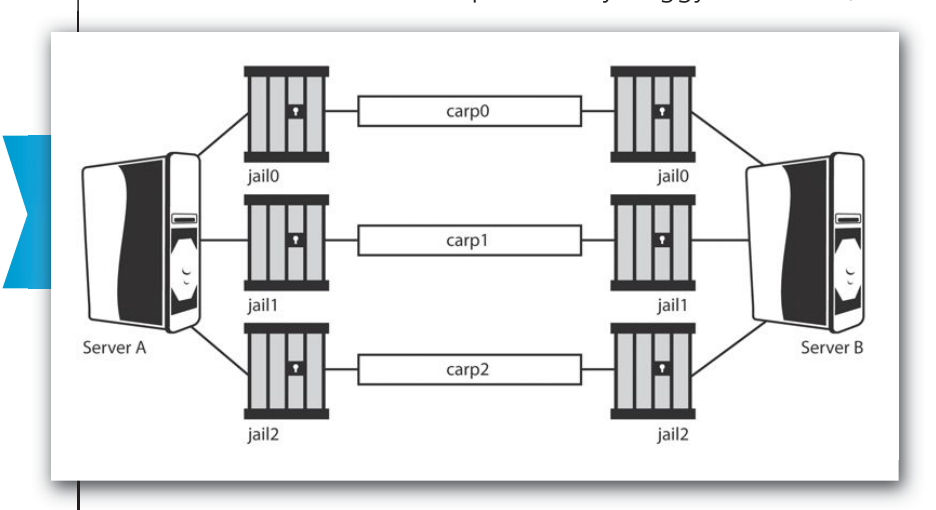

# FreeBSD 与商业工作负载：NYI 的托管服务

作者：Joseph Kong

本文探讨 FreeBSD 在商业工作负载中的角色。我们将讨论运营 ISP（尤其是托管服务）所面临的挑战，并展示 FreeBSD 提供的一些独特解决方案。为便于阐述，我们以总部位于纽约的 ISP——NYI 为案例。NYI 提供主机托管、独立服务器、Web 与邮件托管、托管服务、交钥匙灾难恢复、业务连续性方案。NYI 专注于为金融、建筑、时尚、法律、生命科学、媒体和房地产行业提供关键任务数据服务。

托管服务是指将日常管理职责外包出去，以改善运营的做法。在信息技术（IT）领域采用托管服务，组织可以免除维护设备与基础设施的负担，让 IT 人员专注于核心业务。托管服务提供商本质上提供以下益处：

- **保障可靠性**——保持网络持续运行，最大限度减少停机时间，包括防范恶意软件。
- **保持更新**——及时更新硬件和软件，并跟上带宽需求的增长。

## 挑战与解决方案

在 NYI 提供托管服务涉及若干挑战，包括与更广泛的互联网交互、确保高可用性、从数据丢失中恢复、隔离系统与数据。每个挑战都通过基于 FreeBSD 的方案得到解决。

### 外部威胁（或互联网层面）

IT 安全与恶意软件威胁持续增长。据赛门铁克称，“恶意代码和其他不受欢迎程序的发布速度可能超过合法软件应用。”[^2] 防火墙如今是抵御来自公共互联网威胁的事实标准。然而，在大多数网络上，防火墙是单点故障。一旦防火墙宕机，进出内部网络的访问就会停滞，实际上为你的客户造成了停机。

FreeBSD 提供三个组件——PF、CARP 和 pfsync——NYI 将它们组合使用，使系统保持良好防护且零停机。

包过滤系统（PF）即防火墙。NYI 至少并行部署两台防火墙，其中一台为主，其余为备。所有流量都经过主防火墙，若主防火墙故障，备份防火墙会接管主防火墙的身份并继续工作。现有连接保留，流量继续流转，仿佛什么都没发生。此配置的额外好处是，可不影响网络，维护和升级防火墙——只需逐台将防火墙下线即可。

通用地址冗余协议（CARP）允许备份防火墙接管主防火墙的身份。CARP 的主要目的是让同一网段上的多台主机共享一个 IP 地址。[^3] 在每个 CARP 组中，主防火墙（称为主节点）持有共享 IP 地址，响应发往它的任何流量或地址解析协议（ARP）请求。主防火墙定期发送 CARP 通告，备份防火墙监听此通告。若备份防火墙在设定时间内未收到主防火墙的通告，就会开始发送自己的通告。通告最频繁的备份防火墙将成为新的主防火墙。

pfsync 是同步防火墙状态表的系统。正是借助它，备份防火墙才能在主防火墙故障时保留主防火墙的连接。主防火墙发送包含其状态信息的 pfsync 消息。为确保每台备份防火墙都同步，备份防火墙会复制这些消息并同样发送出去。

在图 1 中，两台防火墙（A 和 B）各有三个网络接口。位于 **10.0.0.0/24** 子网的接口连接外部网络（即互联网）。位于 **192.168.0.0/24** 子网的接口连接内部网络。第三个接口通过交叉网线将两台防火墙互连，形成 pfsync 消息的专用链路。图 2 展示了典型故障转移场景的事件时间线。

### 高可用性

全天候运营长期以来是 ISP 行业的基本要求。客户遍布全球多个时区，任何时间的服务中断都会影响客户，而无法访问在线系统的客户必然不满。为确保服务高可用，NYI 使用 FreeBSD Ports 树中的 HAProxy，配合前文讨论的 CARP。

HAProxy 是 TCP/HTTP 负载均衡器，通过将传入请求分散到多台 Web 服务器来提升网站和 Web 服务的性能，确保没有任何单台服务器过载。

在图 3 中，HAProxy 接收来自外部网络（即互联网）的请求，并将其转发到内部网络中负载最轻的 Web 服务器。

如前所述，CARP 允许备份系统接管主系统的身份。为确保其三大托管配置（Men’s Journal、Rolling Stone 和 Us Magazine）的高可用，NYI 部署了一对运行 HAProxy 配合 CARP 的机器。若主负载均衡机故障，备份机将接管主机的身份并接替其工作。

由此可见，CARP 不仅能为防火墙提供故障转移冗余，也能为其他系统提供。作为另一个例子，NYI 在其部分托管互联网协议安全（IPsec）虚拟专用网（VPN）中部署 CARP。

### 灾难恢复

备份与数据恢复长期以来都是数据中心的标准规范，对托管服务提供商同样至关重要。任何数据丢失都可能严重影响公司盈利。NYI 利用 FreeBSD 的 GEOM 镜像来降低此风险。

GEOM 镜像是 FreeBSD 实现 RAID 1 的方式，通过在两块或更多磁盘驱动器上生成数据集的精确副本（即镜像）来创建可靠的数据存储。当一块驱动器故障时，数据仍可由其他正常驱动器提供，管理员可不打断用户，更换故障驱动器。

GEOM 镜像的有趣特性是它也可用于快速克隆服务器。NYI 的流程如下：

1. 从镜像中移除一块驱动器。
2. 在该驱动器上执行 **fsck(8)**；这会检查一致性并修复驱动器上任何受损的文件系统。
3. 挂载驱动器以调整设置；挂载驱动器使其可通过操作系统的文件系统访问。
4. 按需调整设置。
5. 卸载驱动器。
6. 将驱动器放入新服务器。

如果无需调整任何设置，可跳过第 3 至 5 步。除 GEOM 镜像外，NYI 还使用 FreeNAS、ZFS 和 rsync 做异地备份，以降低数据丢失风险。

FreeNAS 基于 FreeBSD 的嵌入式版本，提供开源的网络附加存储（NAS）方案。NAS 系统向网络上的其他设备提供数据存储，并以文件而非磁盘块为单位通信。

在图 4 中，终端用户通过以太网络向 NAS 系统读写文件。

NYI 部署多台 FreeNAS 机器，拥有超过 20 TB 的存储空间，用于存放异地备份。

ZFS 是 FreeNAS（也可选由 FreeBSD）使用的文件系统。其特性包括支持大容量存储、防数据损坏、持续完整性校验、数据自动修复、软件 RAID（RAID-Z）、瞬时文件系统快照等。简而言之，ZFS 从上到下为数据完整性而设计，这在管理备份时尤为理想。

rsync 是 NYI 用于将整台机器文件系统异地备份到 FreeNAS 机器的网络协议。rsync 通过增量编码最小化数据传输，以差异形式而非完整文件传输数据。首次完整备份后，rsync 只传输本地副本与备份副本之间的差异。

### 隔离

出于安全目的，服务之间清晰、明确的隔离始终是系统管理员面临的挑战。传统 Unix 系统提供 **chroot(2)**；然而 **chroot(2)** 存在若干局限（例如，它无法抵御 root 用户的故意篡改）。FreeBSD 通过 jails 改进并完善了传统的 **chroot(2)** 概念。

FreeBSD jails 隔离系统。每个 jail 是运行在主机上的虚拟环境，拥有自己的文件、进程、用户和 root 用户。与 **chroot(2)** 仅将进程限制在文件系统的特定视图中不同，jails 限制进程对系统其余部分的操作。jail 中的进程处于沙箱中。[^8]

jails 的使用示例：NYI 的小规模托管客户 Expand the Room，需要为其正在开发的网站搭建预发布和生产环境。方案是一台 FreeBSD 机器，运行两个在各方面都相同、仅 IP 地址和主机名不同的 jail。

NYI 还在内部使用 jails 来实现硬件高效的域名系统（DNS）服务器。例如，一台 FreeBSD 机器可能包含用于递归 DNS 的 jail、用于权威客户 DNS 的第二个 jail 和用于权威 NYI DNS 的第三个 jail。然后，这些 jail 中的每个 DNS 服务器在机器集群内使用 CARP 确保故障转移冗余。图 5 展示了这一点。

在图 5 中，两台服务器（A 和 B）用于提供三种不同的服务。每个服务包含在自己的 jail（jail0、jail1 或 jail2）中，并使用 CARP 确保高可用。

### 管理客户期望

管理客户期望始终是挑战。客户期望并要求他们的东西“正常工作”，并且接近 100% 的正常运行时间。这一点因托管服务提供商无法控制客户使用的客户端软件而加剧，兼容性成为问题。FreeBSD 的开源本质有助于应对此挑战。

例如，NYI 的大型托管客户使用了一款特别有缺陷的 SSH 客户端，该客户端期望质询响应密码提示为“Password: ”（注意冒号后有空格）。然而 FreeBSD 中的提示是“Password:”（冒号后无空格），这导致 SSH 客户端认证失败。由于 FreeBSD 是开源的，NYI 可以轻松为 FreeBSD 的 SSH 服务器打补丁，在密码提示中加入空格，让客户能继续使用其选择的客户端。

## 结论

1996 年 NYI 成立时，FreeBSD 是唯一可用的开源 Unix。如今，出于本文所述的种种原因等，FreeBSD 继续驱动着 NYI。NYI 的首席严谨官 Boris Kochergin 对 NYI 使用 FreeBSD 的原因补充了以下内容：

> FreeBSD 文档优秀。《FreeBSD Handbook》涵盖 FreeBSD 的日常使用，清晰、简洁，为管理员学习系统提供了便捷途径。FreeBSD 是开源的，代码组织良好，因此理解和全面掌握它既容易也可行。最后，FreeBSD 延续了 BSD 赋能互联网的传统！[^9]

## 关于 NYI

NYI 成立于 1996 年，总部位于华尔街核心地带。其核心服务包括主机托管、独立服务器、Web 与邮件托管、托管服务、交钥匙灾难恢复、业务连续性方案。NYI 拥有并维护自己的数据中心，凭借其高带宽连接合作伙伴（Zayo、Verizon Business、Optimum Lightpath、AT&T、Level 3 和 GTT），NYI 专注于为金融、建筑、时尚、法律、生命科学、媒体和房地产行业提供关键任务数据服务。NYI 符合 SSAE 16 Type II 标准，同时符合 PCI 和 HIPAA 合规要求。关于 NYI 的更多信息，请访问 <https://www.nyi.net/>。

---

**Joseph Kong** 是自学的计算机爱好者，涉足漏洞利用开发、逆向代码工程、rootkit 开发和系统编程（FreeBSD、Linux 和 Windows）。他是广受好评的《Designing BSD Rootkits》和《FreeBSD 设备驱动程序开发》的作者。关于 Joseph Kong 的更多信息，请访问 <https://www.thestackframe.org/>，或在 Twitter 上关注他 `@JosephJKong`。

[^1]: “Managed services,”最后修改于 2013 年 8 月 1 日，<https://en.wikipedia.org/wiki/Managed_services>。
[^2]: “Symantec Internet Security Threat Report: Trends for July–December ’07,”2008 年 4 月，第 29 页。
[^3]: “PF: Firewall Redundancy with CARP and pfsync,”最后修改于 2013 年 5 月 1 日，<https://www.openbsd.org/faq/pf/carp.html>。
[^4]: 图 1 改编自 “Firewall Failover with pfsync and CARP,”访问于 2013 年 8 月 14 日，<https://www.countersiege.com/doc/pfsync-carp/>。
[^5]: 图 2 改编自 “Firewall Failover with pfsync and CARP,”访问于 2013 年 8 月 14 日，<https://www.countersiege.com/doc/pfsync-carp/>。
[^6]: 图 3 改编自 “HAProxy,”访问于 2013 年 8 月 14 日，<https://haproxy.1wt.eu/>。
[^7]: 图 4 改编自 “Big data meets big storage,”访问于 2013 年 8 月 14 日，<https://arstechnica.com/business/2011/05/isilon-overview/2/>。
[^8]: “FreeBSD jail,”最后修改于 2013 年 6 月 8 日，<https://en.wikipedia.org/wiki/FreeBSD_jail>。
[^9]: 最早广泛使用的 TCP/IP 实现来自 BSD。
