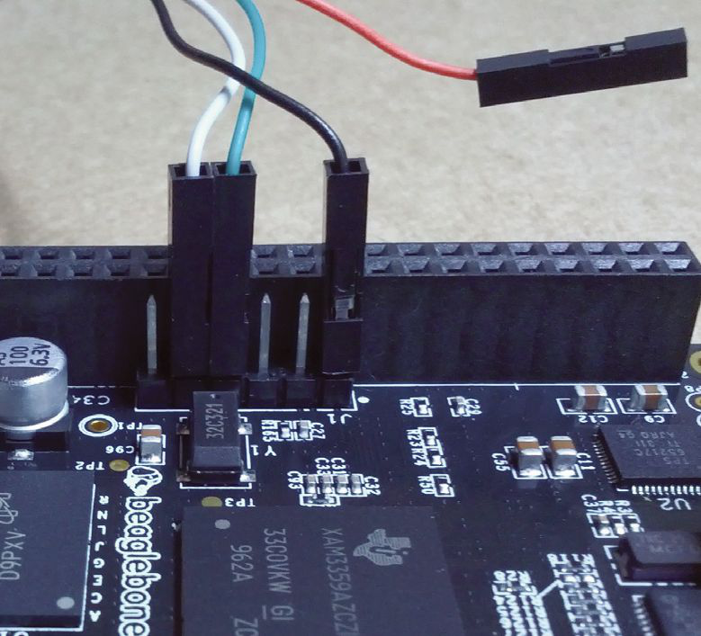
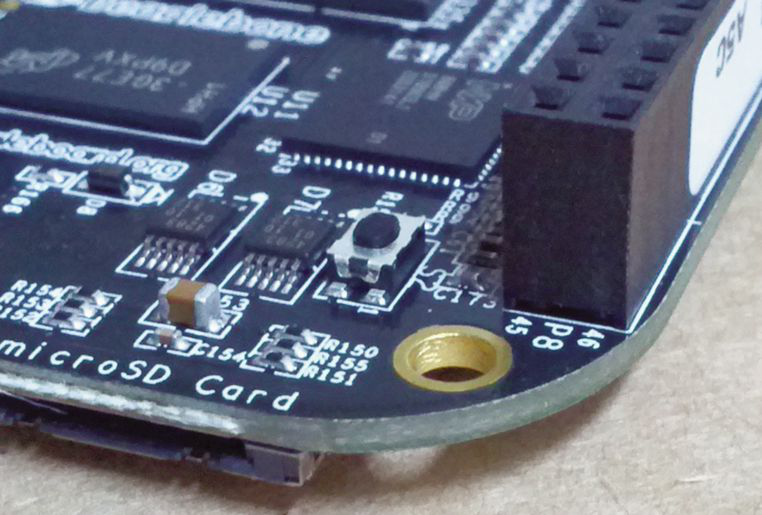
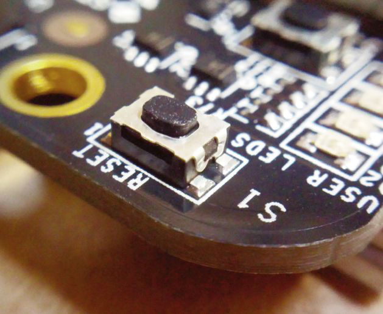

# BeagleBone Black 上的 FreeBSD 入门

作者：Tim Kientzle

BeagleBone Black（BBB）是一款售价 45 美元、可放进 Altoids 薄荷糖铁盒的 PC。它采用与早期 BeagleBone（白色电路板）相同的德州仪器“Sitara”芯片，但价格更低、性能大幅提升。

从 BeagleBoard.org 网站可以看到，BeagleBone Black 的潜力巨大。下方侧栏列出了若干可能的应用场景。最棒的是，BBB 可以运行标准的 FreeBSD 系统，并配备你所期望的全部工具和支持。

## 可能的应用场景

- **微型服务器**：1GHz ARM Cortex A8 处理器、512MB 内存、10/100 以太网和 2GB 闪存，足以运行个人或小型办公室的 Web 或邮件服务器。
- **嵌入式**：BBB 提供丰富的 GPIO 和硬件扩展支持，基本运行功耗仅 2.5 瓦。（USB 需要额外供电。）
- **教育**：低廉的价格和可扩展性使 BBB 成为学习软硬件开发的好选择。

## FreeBSD 在 BBB 上的现状

BeagleBone 和树莓派等新兴 ARM 系统引发了开发者对 FreeBSD/ARM 的浓厚兴趣。过去一年中，FreeBSD 的大部分组件——引导加载器、内核、工具链、驱动、用户态和 Ports——在 ARM 平台上都有显著改进。

目前，FreeBSD 开发分支对 BBB 的支持相当完善：

- 串口控制台（需要类似 Adafruit #954 的适配线缆）。
- 完整的 FreeBSD 引导加载器，包括启动时模块加载和 Forth 脚本。
- 基于设备树的内核。
- Micro-SD 和 eMMC 支持。
- USB 主机支持。
- 实验性 USB 客户端支持（BBB 可作为 USB 设备使用）。
- 10/100 以太网。
- FreeBSD/ARM 现在使用 clang 作为默认编译器。
- FreeBSD/ARM 现在使用 EABI 调用约定，性能略好且与其他编译器兼容性更佳；如果你有此变更前编译的二进制或库，需要重新编译。
- FreeBSD 可以在 BBB 上原生重新构建和升级。
- 越来越多的 Ports 可在 BBB 上构建和运行。

> **作者提醒**：本文基于 2013 年 9 月时 FreeBSD 开发分支的状态撰写。到 FreeBSD 10 最终发布时，许多内容可能发生变化。如需最新信息，请到 FreeBSD/ARM 或 FreeBSD current 邮件列表询问。

不过，仍有若干领域需要改进：

- FreeBSD 打包团队计划建立公开的 ARM 软件包仓库，但目前尚未就绪。
- 视频和音频驱动尚未编写。
- 不支持扩展 cape。

## 你的第一次 FreeBSD 启动

要启动 FreeBSD，首先需要构建一张装有 FreeBSD 的存储卡，然后从该卡启动 BBB。

需要准备：

- BeagleBone Black。
- 5V 电源或 Mini-USB 线。
- 4GB 或更大容量的存储卡。
- 串口线缆，如 Adafruit #954 或 FTDI TTL-232R-3V3（可选但强烈建议）。

### 1. 构建或下载 FreeBSD 镜像

下面将介绍如何自行构建 FreeBSD 镜像。要快速上手，可从 FreeBSD.org 网站下载镜像：

- <ftp://ftp.freebsd.org/pub/FreeBSD/snapshots/>
- <http://ftp.freebsd.org/pub/FreeBSD/snapshots/>

> **注意**：“快照”镜像是用当时 FreeBSD 开发分支中的源码构建的。FreeBSD 10 最终确定后（预计 2013 年底前），会发布稳定镜像。下载的镜像通常是压缩的，需要先解压才能写入 micro-SD 卡。

### 2. 写入 Micro-SD 卡

`dd` 工具用于原始数据复制，比如从原始镜像初始化磁盘。首先需要将 SD 卡连接到电脑（可能需要某种适配器），并识别正确的设备名。

最简单的做法是先在连接 SD 卡之前执行：

```sh
$ ls -l /dev
```

然后连接 SD 卡后再执行一次：

```sh
$ ls -l /dev
```

新增的条目应一目了然。

如果 SD 卡已经格式化，你会看到每个分区对应若干条目。由于我们要覆盖整张卡，需要识别基础设备名，通常是几个字母加单个数字（如 `da7`、`mmc4` 或 `sdhci0`）。

此任务需要为 `dd` 命令提供三个参数：输入文件（`if`）、输出设备（`of`）和复制时使用的块大小（`bs`）。块大小可以不指定，但默认值会导致操作非常慢。

例如，如果你的 micro-SD 连接为 `da7`，完整命令如下：

```sh
$ dd if=FreeBSD-BeagleBone.img \
of=/dev/da7 bs=8m
```

根据系统安全设置，你可能需要以 root 身份运行此命令。

### 3a.（可选但推荐）连接串口线缆

制作好 SD 卡后，就可以连接 BeagleBone Black 并启动 FreeBSD 了。由于 FreeBSD 尚不支持 BBB 的 HDMI 输出，建议使用串口线缆以便观察启动过程。没有串口线缆，只能等启动完成后再尝试通过 SSH 连接，出问题时难以诊断。

BBB 有低压串行接口，需要专用适配线缆。务必使用 3.3V 适配器，因为类似线缆还有 5V 和 1.8V 版本，与 BBB 不兼容（图 1）。



串口适配器由主机 USB 供电，只要插入 USB 就开始工作，即使 BBB 尚未通电。

在 FreeBSD 上使用 `cu` 工具，指定 115200 波特率和相应的 tty 设备：

```sh
# cu -s 115200 -l /dev/ttyU0
```

当然，在真正通电之前你看不到任何输出。

### 3b. 打开终端窗口

### 4. 按住启动开关并通电

此时，BBB 不应连接任何电源。如果已经连接了 5V 电源或 mini-USB 线，请先拔掉，仔细阅读以下说明。（BBB 从 eMMC 还是 micro-SD 启动的具体逻辑略复杂。我多次因 BBB 从错误的源启动而困惑。）

“启动开关”决定 BBB 从 eMMC（默认）还是从 micro-SD 启动（图 2）。要可靠地从 micro-SD 启动，必须：

- 按住启动开关
- 通电
- 数到 3
- 释放启动开关



BBB 的电源芯片会记住启动开关状态，因此它会继续从 micro-SD 启动和重启，直到完全断开电源。

> **提示**：如果需要重启，保持电源连接并轻按重置开关（图 3），它将从同一源重启。



> **提示**：如果出现随机关机，且使用的是 mini-USB 线供电，尝试改用独立的 5V 电源。BBB 的功耗需求恰好在标准 USB 端口供电能力的边缘。

> **提示**：如果看到四个 LED 快速闪烁，说明从 eMMC 启动了 Linux 镜像。断开电源，按住启动开关，再试一次。

## 启动时你会看到什么

如果你熟悉 FreeBSD 在 i386 或 amd64 PC 上的启动过程，BBB 的启动流程会非常眼熟，只是略有不同。最明显的区别是初始启动阶段由“U-Boot”处理——一个支持多种硬件的 GPL 引导加载器项目。

### 1. MLO/SPL：U-Boot 第一阶段

当 TI Sitara 芯片首次初始化时，它无法访问主内存。因此，第一启动阶段必须装入 128K 的片内内存。

```sh
U-Boot SPL 2013.04
(Aug 03 2013 - 21:27:30)
OMAP SD/MMC: 0
reading bb-uboot.img
reading bb-uboot.img
```

U-Boot 提供一个名为 SPL 的小程序，TI Sitara 芯片从名为“MLO”的文件加载它。这个程序刚好够初始化 DRAM 芯片并从 micro-SD 卡加载主 U-Boot 程序。

### 2. U-Boot 主加载器

U-Boot 是一个 GPL 许可的引导加载器，支持多种硬件。尽管最初为 Linux 开发，U-Boot 强健的硬件支持、可脚本化和活跃的社区使其也是引导 FreeBSD 的好选择。

```sh
U-Boot 2013.04 (Aug 03 2013 -
21:27:30)
... other messages ...
reading bb-uEnv.txt
reading bbubldr @8f246240
240468 bytes read in 33 ms (6.9 MiB/s)
reading bboneblk.dtb
14210 bytes read in 7 ms (1.9 MiB/s)
Booting from mmc ...
## Starting application at 0x88000054
...
```

U-Boot 首先初始化 USB、网络和 MMC/SD 接口。一旦 MMC/SD 初始化完成，它将三个文件读入内存：

- `bb-uEnv.txt`：默认为空，但你可以编辑此文件以重新定义 U-Boot 的启动函数。
- `bbubldr`：下一步将运行的 FreeBSD 引导加载器。
- `bboneblk.dtb`：下文介绍的 DTB 文件。

### 3. 关于 DTB 文件

面向新款嵌入式处理器的操作系统越来越多地使用“设备树”文件——有时称为“扁平设备树”（fdt）——来初始化内核。该文件列出所有外设，帮助内核决定启用哪些驱动。设备树需编译：源码版本称为 DTS，编译后的二进制版本称为 DTB 文件。

U-Boot 初始化时会检查当前运行的硬件，然后将对应的 DTB 文件加载到内存。此数据并不直接由 U-Boot 或 ubldr 使用，但最终会传递给 FreeBSD 内核。此安排的关键优势：完全相同的内核既能运行在 BeagleBone 上，也能运行在 BeagleBone Black 上，因为 RAM 数量、驱动器数量等关键配置由 DTB 提供。最终，FreeBSD/ARM 开发者希望用一个 GENERIC 内核引导多种主板。这需要内核方面更多工作，确保各种主板支持例程能共存；也需要引导加载器方面更多工作，确保所有加载器都正确向内核提供 DTB 文件。

### 4. FreeBSD Ubldr

U-Boot 对 BBB 硬件了如指掌并知道如何初始化，但对 FreeBSD 内核和模块一无所知。因此 BBB 使用 U-Boot 加载“ubldr”。它本质上与用于在 i386/amd64 上引导 FreeBSD 的“BTX loader”相同，只是做了若干修改以适配 U-Boot 而非 PC BIOS（因此得名“ubldr”，即“U-Boot 兼容 LoaDeR”）。

```sh
Card did not respond to voltage
select!
Number of U-Boot devices: 2
FreeBSD/armv6 U-Boot loader, Revision
1.2
(root@fci386.localdomain, Fri Aug 16
12:59:51 PDT 2013)
DRAM: 256MB
Device: disk
Loading /boot/defaults/loader.conf
/boot/kernel/kernel
data=0x449864+0x17d3c8
syms=[0x4+0x82890+0x4+0x4ec85]
Hit [Enter] to boot immediately, or
any other key for command prompt.
Booting [/boot/kernel/kernel]...
```

### 5. 加载 loader.rc、loader.conf

Ubldr 拉入大量标准 FreeBSD 配置。具体而言，它读取 **loader.conf** 和可能的 **loader.rc**。这些可用于将内核模块加载到内存，使其在内核首次启动时可用。

### 6. 加载 FreeBSD 内核

Ubldr 此时可以加载 FreeBSD 内核本体。

### 7. 启动 FreeBSD 内核

一切就绪后，ubldr 实际启动 FreeBSD 内核。ubldr 打印的最后几行表明它将如何启动内核：

```sh
Booting [/boot/kernel/kernel]...
Using DTB provided by U-Boot.
Kernel entry at 0x80200100...
Kernel args: (null)
```

### 8. 初始化 FreeBSD 内核

与严重依赖 U-Boot 的 ubldr 不同，FreeBSD 内核完全独立运行。因此它必须先建立自己的内存管理和控制台处理。完成后，内核可以显示第一条消息：

```sh
KDB: debugger backends: ddb
KDB: current backend: ddb
Copyright (c) 1992-2013 The FreeBSD
Project.
Copyright (c) 1979, 1980, 1983, 1986,
1988, 1989, 1991, 1992, 1993, 1994
The Regents of the University
of California. All rights reserved.
FreeBSD is a registered trademark of
The FreeBSD Foundation.
FreeBSD 10.0-CURRENT #0 r254265: Fri
Aug 16 12:58:43 PDT 2013
root@fci386.localdomain:/usr/..../src/
sys/BEAGLEBONE arm
```

内核随后使用设备树数据识别每个需要初始化的系统。

### 9. 启动 FreeBSD 用户态

FreeBSD 内核完成所有初始化后，挂载根文件系统，以便从 SD 文件系统加载第一批程序。以下是内核打印的最后几条消息：

```sh
Trying to mount root from
ufs:/dev/mmcsd0s2a [rw,noatime]...
warning: no time-of-day clock regis-
tered, system time will not be set
accurately
```

（此处的警告是预期的，因为 BBB 没有电池供电的 RTC。）

如果你用过 FreeBSD、Linux 或任何类似系统，剩余的启动步骤应当相当熟悉：rc 系统运行一组脚本以配置各种标准系统，包括 SSHd 和 NTPd 等网络服务。首次启动可能需要一些时间，因为某些服务需要建立其初始配置。最明显的是，SSHd 服务需要为此特定机器创建加密密钥。

最后，系统准备就绪，可接受登录：

```sh
Wed Sep 4 00:46:40 UTC 2013
FreeBSD/arm (beaglebone) (ttyu0)
login:
```

大多数 BBB 镜像会自动配置以太网端口并启动 sshd。因此此时你也可以通过 SSH 远程连接。

## 在 BeagleBone Black 上使用 FreeBSD

BBB 运行完全标准的 FreeBSD 系统，如果你熟悉 i386 或 amd64 上的 FreeBSD，会觉得如鱼得水。以下是一些入门提示：

**以太网**：网络接口是 `cpsw0`。你可以用 `ifconfig` 命令配置它，或编辑 **/etc/rc.conf** 让它在每次启动时设置。大多数 FreeBSD 镜像默认启用 DHCP。

**时间**：由于 BBB 没有电池供电时钟，你需要在启动时手动设置时间，或使用 NTP 从网络获取时间。

**磁盘**：外部 micro-SD 接口名为 `mmcsd0`。BBB 的标准 FreeBSD 镜像分两个分区：

- `mmcsd0s1` 是包含 U-Boot 和其他启动文件的 FAT 切片
- `mmcsd0s2` 是 FreeBSD 使用的切片

`mmcsd0s2a` 上的根分区通常使用带日志的软更新（SU+J）格式化。SU+J 让系统在断电恢复后能快速重启。

**eMMC**：2GB 内置 eMMC 芯片可用作 `mmcsd1`。通过支持 8 位传输，它比 micro-SD 接口快得多。BBB 出厂时 eMMC 预装了 Linux 发行版，但你可以轻松重新格式化并用作 FreeBSD 的额外驱动器。我们预计很快就能直接在 eMMC 上安装并启动 FreeBSD。

**SU+J**：BBB 没有关机按钮；通常直接断电。如果在断电时有软件正在运行，这会导致数据丢失。使用“UFS 带日志的软更新”（UFS SU+J）虽不能防止数据丢失，但似乎能很好地避免致命的文件系统损坏。

**Swap**：虽然 512MB 内存足以应对许多用途，但你可能希望启用一些 swap。出于多种原因，人们通常在根分区上使用 swap 文件而非单独的 swap 分区。可用 `swapctl -l` 查看你使用的镜像是否已配置 swap。若未配置，添加 swap 文件很简单：

1. 创建文件：

```sh
# dd if=/dev/zero of=/usr/swap0 bs=1m count=768
```

2. 在 **/etc/fstab** 中添加以下行并重启：

```ini
md none swap sw,file=/usr/swap0 0 0
```

**Ports**：如果有网络访问，安装 Ports 树相当简单：

```sh
$ portsnap fetch
$ portsnap extract
```

然后就可以像往常一样构建并安装 Ports。例如，安装 Apache Web 服务器：

```sh
$ cd /usr/ports/www/apache24
$ make
$ make install
```

**软件包**：FreeBSD 打包团队计划提供与新打包管理工具 `pkg` 兼容的 ARM 软件包。截至 2013 年 9 月，此功能尚未实现。许多人成功使用 Poudriere 自动构建自己的软件包集。

**USB**：USB 在 BBB 上通常工作良好。USB 驱动器、USB 网络适配器和打印机均成功使用。但有一个注意点：除非 BBB 连接了独立电源，否则不要插入任何 USB 外设。如果通过 mini-USB 线供电并连接任何 USB 设备，BBB 很可能会关机。

## 更新 FreeBSD

一旦 FreeBSD 运行起来，你可以下载 FreeBSD 源代码并在 BBB 上直接重新构建。

> **注意**：

- BBB 上完整系统重新构建可能需要多达两天时间，取决于若干因素。
- 完整源代码检出超过 2G，无法放入 eMMC。
- FreeBSD-CURRENT（也称 `head` 分支）是当前开发分支；既有最新特性，也有最新 bug。

你可以使用 `svnlite` 命令（如今是 FreeBSD 的标准组件）从 FreeBSD 项目的 Subversion 仓库检出源代码：

```sh
$ svnlite co http://svn.freebsd.org/base/head /usr/src
$ cd /usr/src
```

阅读 **/usr/src/UPDATING**，尤其是末尾附近的概述信息，其中列出了常见的升级场景。通常，从源代码完整升级如下：

```sh
$ cd /usr/src
$ make buildworld
$ make kernel
<reboot>
$ cd /usr/src
$ mergemaster -p
$ make installworld
$ mergemaster
<reboot>
```

UPDATING 文件还说明了如何进行部分更新、仅内核更新，以及若干部分升级技巧。

## 构建你自己的 FreeBSD 镜像

如果你熟悉从源代码构建和升级 FreeBSD 的流程，可以使用 Crochet 工具在快速的 i386 或 amd64 机器上构建自定义 BBB 镜像。这尤其便于跟踪 FreeBSD 对 BBB 支持的最新改进。

详细说明见：<https://github.com/kientzle/crochet-freebsd>。以下是简要概述：

1. 获取 Crochet。你需要安装 `devel/git` 软件包，然后获取 Crochet 脚本副本：

```sh
$ git clone https://github.com/kientzle/crochet-freebsd
```

要更新，在源目录内使用 `git pull` 命令。

2. 创建配置文件 `beagleblack.sh`，内容如下：

```sh
board_setup BeagleBone
option ImageSize 3900mb
option UsrSrc
option UsrPorts
FREEBSD_SRC=${TOPDIR}/src
```

此处的 `option` 行会在 **/usr/src** 预装完整 FreeBSD 源代码树，在 **/usr/ports** 预装完整 Ports 树。省略这些行会得到更小的镜像。

3. 构建镜像：

```sh
# ./crochet.sh -c beagleblack.sh
```

脚本首先检查你是否拥有所有必需的源代码和工具。如有缺失，会打印获取它们的说明。一旦备齐所有组件，快速 PC 可在大约一小时内编译完整的 FreeBSD 系统并组装镜像。

---

**Tim Kientzle** 担任 FreeBSD 提交者 10 年，使用 FreeBSD 的时间更长。最近他在为 BeagleBone 和树莓派开发镜像构建工具和启动支持。
