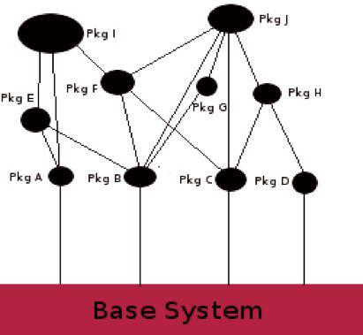
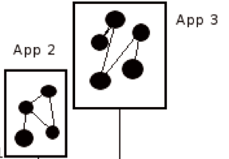
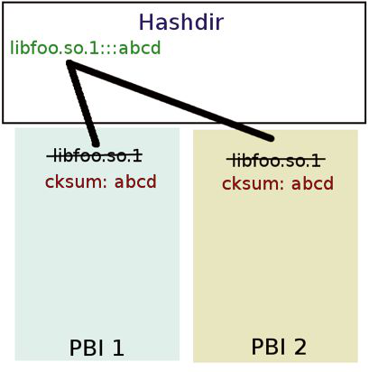
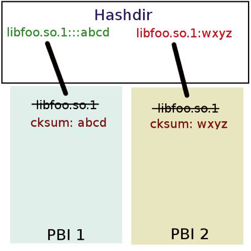

# 从 1.x 到 11.x：PBI 格式的持续演进

- 原文：[From 1.x to 11.x: The ongoing Evolution of the PBI Format](https://freebsdfoundation.org/wp-content/uploads/2014/03/From-1.x-to-11.x-The-ongoing-Evolution-of-the-PBI-Format.pdf)
- 作者：**Kris Moore**

PC-BSD 自早期起就采用了一种独特的包管理形式，称为 PBI，即 PUSH BUTTON INSTALLER（一键安装器）。

虽然 PBI 格式随着 PC-BSD 的每次主版本发布而不断变化和演进，但其基本概念和原则始终未变：提供一种方式，让应用以自包含的方式安装到系统中，而不引入混乱的依赖解析问题。原则上，这意味着用户可以安全地升级或降级应用（例如 Firefox），而不必担心对构成系统其余部分的包（如 X、GTK、KDE 等）做出改动。

图 1 展示了典型依赖驱动包系统的简化样貌。这是 FreeBSD 和 Linux 系统中最常见的模型。它有一些好处，比如节省磁盘空间，但也给任何更新系统带来了大量复杂度。当用户想要发起包的升级时，往往需要包管理系统解析纠结的依赖网，在典型的桌面应用中可能轻易牵涉数百个包。以 Firefox 为例，这可能让新用户困惑：为什么看起来“无关”的包（如 GTK、Gnome 等）也得改动。即便所有包的升级都正确完成，我们仍面临另一个潜在问题——新的 bug 或回归。有经验的计算机用户或许能找到变通办法，但普通用户只会纳闷：为什么给浏览器做个简单更新，会导致桌面里的其他东西罢工。

**图 1**

图 2 展示了 PBI 系统如何与系统上其他已装软件交互的简化版本。在此模型中，每个应用以“bundle”（包束）形式分发，安装到各自的目录中（如 **/usr/pbi/firefox**），不影响系统上既有的包布局。这让升级应用变得简单：只需更新 bundle 内容，可以是二进制差异更新，也可以是整体替换。通过消除依赖关系，用户可以随心所欲地添加、移除和更新应用，最坏情况下也只影响那个特定的应用。

**图 2**

在 PC-BSD 中，把应用迁移到这一模型极大提升了系统可靠性和一致性。但它也带来不少需要克服的技术难题。第一个难题是处理系统膨胀，它源于不同 PBI bundle 中存有同一文件的多份副本。在 PC-BSD 9 中，这通过实现“hash”目录来解决。该目录由 PBI 守护进程创建和管理，后者跟踪 PBI bundle 之间共享的二进制文件和库。

在图 3 中，两个 PBI bundle 都包含 **libfoo.so.1** 的同一副本。此时，PBI 守护进程把该库移入 hash 目录，并附上文件校验和，然后为每个 PBI bundle 创建该文件的硬链接回指。

**图 3**

在 PBI bundle 升级期间，守护进程再次跟踪该 bundle 的共享二进制文件和库。如图 4 所示，当检测到现有库的新版本时，hash 目录中会放入该新库的副本，并再次硬链接回现有 PBI bundle。PBI 守护进程持续监控此目录，当文件的硬链接计数降到 1 时，就将其移除。

**图 4**

在近期发布的 PC-BSD 10.0 中，PBI 系统再次经过了一些改进。在以往所有版本的 PBI 中，应用都是从 Ports 树中使用自定义 `LOCALBASE` 设置专门编译而来。这是为了强制应用和库以自包含方式运作，让它们到 **/usr/pbi/<appname>** 目录而非默认的系统 **/usr/local** 目录中查找相关数据。这虽提供了自包含的可行方案，却也带来一些独特挑战。首先，它暴露出 Ports 和应用中不少 bug，这些应用预期自己的数据位于系统目录。修复这些问题有的简单有的复杂，非常耗时。其次，由于包用自定义 `LOCALBASE` 编译，每个 PBI 都需要从头编译。这意味着构建者不得不耗费大量周期重新编译相同的库，仅仅为了在最终二进制、库和配置文件中链接一些不同的位置变量。

在 9.x 生命周期中，引入了不少增强来减轻这种构建负担，比如 ccache 支持、包缓存等。然而进入 10.0 发布流程时我们清楚，要让 PBI 仓库在规模上可扩展，就必须从根本上解决这个问题。随着新的 pkgng 和 poudriere 工具使从零构建整个 Ports 树变得容易，我们开始研究如何从单个 pkgng 仓库构建 PBI，同时仍保持“自包含”原则。从包组装 PBI（而非从源码构建）的想法，有望将每个 PBI 的构建时间从数小时缩短到几分钟。然而这仍留下运行时的问题待解。我们尝试过多种方案，从使用 Jail 到对二进制做字符串替换，但无一证明可行。在研究使用 Jail 的想法时，我想到：如果 Jail 可用于虚拟化整个 FreeBSD 系统，那有没有可能做“jail-lite”，只虚拟化 **/usr/local** 的内容——这正是我们的包所在之处？我还见过几种 Jail 实现，它们用 nullfs 挂载的技巧在多个 Jail 之间共享单个 FreeBSD world。

这些想法在我把玩 Ports 树中的 jailme 工具时汇到了一起。我没有用调用在 Jail 内执行应用的方式，而是修改该工具做一些 nullfs 挂载，把对 jail 的调用替换为 chroot，并为 PBI 执行创建“虚拟”的 **/usr/local** 空间。于是“PBI 容器”的概念诞生了。这立刻赋予我们所寻求的益处：能够用一组以标准 **/usr/local** `LOCABASE` 编译的包来组装任意数量的 PBI 文件。此外，它大幅降低了运行应用所需的复杂度，因为我们不必再“强制”应用只从自己的 **/usr/pbi** 目录加载库。PBI 执行时，只能访问其位于 **/usr/local** 的自身文件。

这个虚拟 **/usr/local** 是通过在 PBI 目标可执行文件前放置 wrapper 二进制实现的。目标 PBI 启动时，该 wrapper 首先检查“虚拟”容器环境是否已创建。如未创建，它会执行一些 nullfs 挂载，在 **/usr/pbi/.mounts/<app>** 创建运行系统的副本。然后 PBI 自己的 **/usr/local** 替换会被挂载进该目录，替换系统版本。虚拟容器创建完成后，wrapper 二进制随后重建容器的 ldconfig hints 文件于 **/var/run**，为执行准备新的 **/usr/local** 目录。最后 wrapper 会 chroot 进入环境并按调用执行目标应用。整个过程通常在一秒或更短时间内完成，且只需在 PBI 首次运行时做一次，使后续执行近乎瞬时。容器环境保持活跃，直到系统重启或 PBI 被移除。

对于需要在容器外运行命令的应用，我们添加了一些回调机制，允许在系统的 **/usr/local** 空间运行其他 PBI 或命令。这些映射到 xdg-open 和 open-with 命令，通常用于以用户指定的应用打开文件。例如，在邮件应用中点击 URL 并将其传递给用户默认的 Web 浏览器，就用到了这一机制。

运行时问题解决后，我们回过头来审视这一变更给构建基础设施带来的收益。PC-BSD 的 9.x 系列 PBI 仓库已增长到远超一千个 PBI，在现代服务器上从零完整重建轻松就要 3-4 周。这一变更把同样一套应用的构建时间降到了仅仅 48 小时！

PC-BSD 10.0 发布完成后，我们开始思考 PBI 在 11.0 版或可能的 12.0 版的下一阶段演进。库去重问题已解决，PBI 容器也已实现，路线图上的下一步是寻找方式降低 PBI 的下载体积。由于 PBI 完全自包含，每个 PBI 的总下载量非常大，每个 PBI 文件中常常包含相同的文件和库。虽然安装后发生的去重解决了已安装应用的这一问题，我们也希望找到方式降低 PBI 文件的总下载体积。这不仅能节省终端用户的下载时间，还能减少我们服务器上 PBI 的总存储占用。

可能的解决方案是让 PBI 仅仅成为“meta-file”（元文件）。该文件提供桌面和 mime 信息，以及构成该 PBI 的包列表。安装期间，可解析此包列表并用作蓝图，用缓存的 pkgng 包将 PBI 重组为容器。由于许多 PBI 使用的包是相同的，这让我们可以只获取特定 PBI 所需的缺失包。一旦所有包都缓存在磁盘上，安装器就能把它们重组为已安装的 PBI。此方法会大幅缩小线上传输的数据量，也开启了有趣的想法，比如通过调整重组进容器的特定包来让 PBI 可定制。所有这些都能在维护主系统包（构成桌面或服务器安装）和其他 PBI 容器完整性的前提下完成。对于仍想要“离线”体验、把单个 PBI 文件复制到 USB 并安装到未联网系统上的用户，我们可以提供机制，把各种元数据和包组装成单一文件供安装。

PBI 格式多年来已大幅演进，我们相信它会随每个主版本继续改进。同时始终坚守让应用的安装和升级尽可能简单、零风险的愿景。希望参与讨论和开发的用户，欢迎在 PC-BSD 开发者邮件列表上与我们联系。

---

**Kris Moore** 是 PC-BSD 项目的创始人和首席开发者。他也是广受欢迎的 BSDNow 视频播客的联合主持人。不在家编程时，他周游世界，在 Linux 和 BSD 会议上演讲和教程，探讨各种 BSD 相关主题。他目前与妻子和五个孩子居住在美国田纳西州，业余时间（极为有限）喜欢弹贝斯吉他和玩电子游戏。

## PBI 格式延伸阅读

- <http://wiki.pcbsd.org/index.php/PBI_Manager/10.0>
- <http://wiki.pcbsd.org/index.php/PBI9_Format>
- <http://www.bsdcan.org/2008/schedule/events/81.en.html>
- <http://bsdtalk.blogspot.com/2008/02/bsdtalk141-pbi4-with-kris-moore.html>
- <http://2011.eurobsdcon.org/talks.html#moore>
