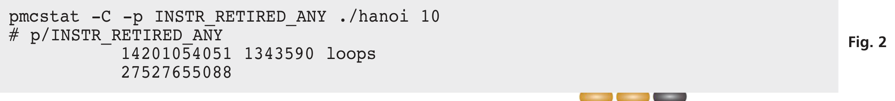
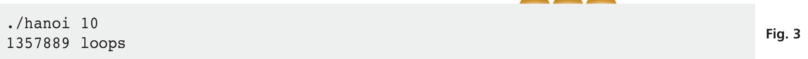
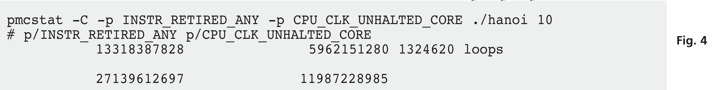
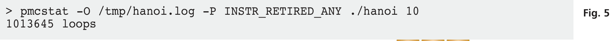
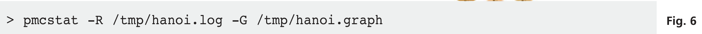
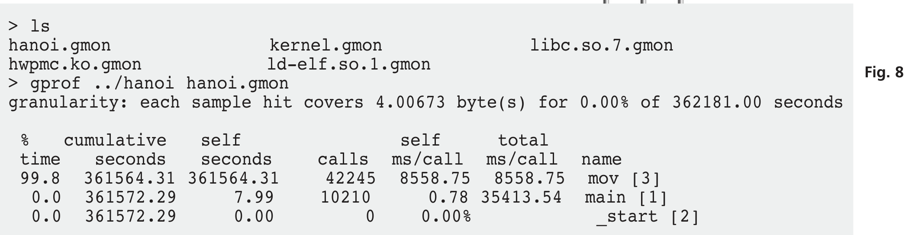
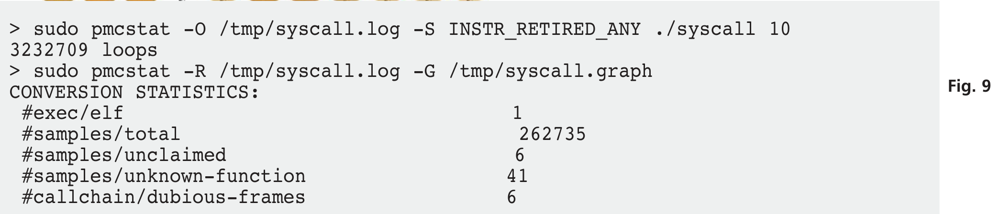
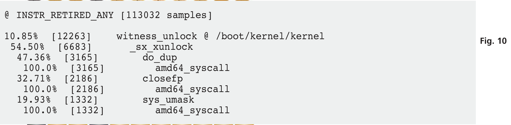
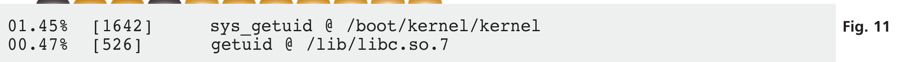

# 用 hwpmc(4) 理解应用与系统性能

- 原文：[Understanding Application and System Performance with hwpmc(4)](https://freebsdfoundation.org/wp-content/uploads/2014/03/Understanding-Application-and-System-Performance-with-HWPMC4.pdf)
- 作者：**George Neville-Neil**

过去几年里，体系结构与内存变得越来越复杂。这种增加的复杂度让理解软件性能比以往任何时候都更困难。幸运的是，CPU 设计者在芯片中加入了特性，让开发者和管理员能以极小的开销更好地理解软件性能。FreeBSD 上的硬件性能监控计数器（Hardware Performance Monitoring Counters）hwpmc(4) 驱动及其相关工具，为软件开发者——以及对系统性能感兴趣的任何人——提供了一种方式，更好地理解他们的软件在多大程度上高效利用了底层硬件、应用、操作系统本身。hwpmc 子系统利用了 CPU 设计者专门预留的硬件特定寄存器，唯一目的就是理解系统的运行时性能。

## 那是 20 年前……

在早期版本的 BSD 软件中，性能通过基于软件的性能分析系统及相关工具 gprof 测量。这里的 g 代表 graph，即调用图。要进行性能分析的软件在编译时带有一组标志，指示最终程序应包含特殊的钩子，告诉操作系统定期收集性能信息。程序执行完成后，这些性能分析信息由 gprof 程序整理并呈现给用户。

基于软件的性能分析系统有几个问题。首先，软件性能分析计算开销大。根据性能分析器运行的频率，可能引入 10% 到 20% 量级的开销惩罚。对于短程序，性能分析的开销可能轻易超过被分析的代码本身，导致测量结果毫无用处。

第二个问题是，基于软件的性能分析方案改变了最终二进制程序的执行流，意味着被分析的代码与最终交付给客户的软件并非一一对应。虽然可以把性能分析过的二进制交付给客户，但分析过的二进制引入的开销会导致整体系统性能下降，这不可接受。

基于软件的性能分析带来的第三个问题是，终端用户无法自行测量自己系统的性能。客户拿到未做性能分析的二进制应用，无法给二进制加上性能分析以发现该程序是否是系统低效的来源。基于硬件的性能方案改善了其中一些问题。

## 基于硬件的性能监控计数器

随着 CPU 晶体管密度越来越高，功能集越来越大，CPU 设计者得以加入专门寄存器来计数与系统性能相关的事件。最初可计数的事件类型和数量都很少，只有寥寥几种事件和一两个计数寄存器。只能计数已执行的指令或一级缓存的未命中次数。在现代 Intel CPU 上，可计数数百种事件类型，并有足够的计数寄存器同时记录 7 种不同事件。

使用基于硬件的性能监控计数器时，需要记住几个术语。事件（event）是芯片能为你计数的任何东西，比如已退休（retired）的指令数、分支预测未命数、取内存所需周期数等。计数寄存器（counting register）是可计数事件的场所。事件可用两种不同模式记录，并以两种不同范围计数。事件可简单计数，或配置 CPU 在计数器达到设定值时中断操作系统，hwpmc(4) 驱动将此事件记录到日志供日后分析。计数事件给出原始数字，告诉程序员在特定时间单位内某事件发生了多少次。采样事件（sampled event）比计数事件复杂。在事件采样中，系统被设置为每当某数量的事件发生后，采样指令指针以及可能的程序调用链。采样让系统展示事件在软件中何处发生，帮助程序员定位性能问题的源头。事件可在两种范围之一中计数和采样。进程范围仅在目标程序当前执行时记录事件。系统范围在所有时刻记录事件，与采样模式结合时，将不仅展示被测程序的性能，还展示系统中所有程序（包括操作系统本身）的性能。事件可在系统或进程模式中计数，也可在系统或进程模式中采样。

## 用 hwpmc 测量性能

学习在自己的程序中使用 hwpmc 的最简单方式，是尝试几个刻意构造的示例。unixbench 基准测试套件是一套广为人知、易于理解的程序集，试图确定软硬件的速度。我们将用 pmc 工具测量 unixbench 中几个程序的性能，以给出清晰的示例。

本文中的示例运行于一台联想 Thinkpad X230，搭载主频 2.9GHz 的 Core i7 处理器。

**列表 X**

```c
int main(argc, argv)
int argc;
char *argv[];
{
    /* ... (此处略) ... */
    while(1) {
        mov(disk,1,3);
        iter++;
    }
    exit(0);
}

void mov(int n, int f, int t)
{
    int o;
    if(n == 1) {
        num[f]--;
        num[t]++;
        return;
    }
    o = other(f,t);
    mov(n-1,f,o);
    mov(1,f,t);
    mov(n-1,o,t);
}
```

在使用 hwpmc(4) 驱动前，必须将其加载到内核中。要测量系统级性能，你还需要在希望使用 hwpmc 的机器上拥有 root 权限。默认的 GENERIC 内核在启动时不加载 hwpmc。要以 root 身份加载 hwpmc，发出以下命令（图 1）。

**图 1**

```sh
# kldload hwpmc
hwpmc: SOFT/16/64/0x67<INT,USR,SYS,REA,WRI> TSC/1/64/0x20<REA>
IAP/4/48/0x3ff<INT,USR,SYS,EDG,THR,REA,WRI,INV,QUA,PRC>
IAF/3/48/0x67<INT,USR,SYS,REA,WRI>
```

hwpmc(4) 驱动加载后会报告它在 CPU 上找到的计数寄存器的数量、类型和宽度。输出因处理器而异，甚至同一厂商系列内也不同。在上面的示例中，有 16 个软计数器、1 个时间戳计数器、4 个可编程计数器和 3 个固定计数器。某些事件只能在特定类型的寄存器中计数，如果你试图在不接受该事件的寄存器中计数事件，会得到错误。大多数情况下你只需知道每类寄存器的数量，因为系统在你请求时会尝试正确分配事件。如果用户试图在固定型寄存器（IAF）中计数 4 个只可能在该类型中计数的事件，工具会报告错误并退出，不计数任何事件。

可计数的事件类型用 `pmccontrol -L` 命令列出。本机上可计数 194 种可能事件，但别担心，我们不会逐一介绍。

通常首先进行的程序测量之一，是程序在特定时间内执行的原始指令数。事件 `INSTR_RETIRED_ANY` 计数已执行的指令。术语“退休”（retired）的使用，是因为在 CPU 术语中执行一条指令的结束叫做退休。

图 2 展示了 hanoi 基准测试运行 10 秒时已退休指令的简单累计计数。此时我们不必关心 hanoi 程序的细节，稍后深入。第一列是程序整个运行期间退休的指令数，最后一个数字显示累计总数 27527655088。在 hanoi 程序运行的 10 秒内执行了 1343590 个循环，这一输出来自 hanoi 程序本身，与 hwpmc 无关。

**图 2**



```sh
pmcstat -C -p INSTR_RETIRED_ANY ./hanoi 10
# p/INSTR_RETIRED_ANY
14201054051 1343590 loops
27527655088
```

作为对比，我们在不启用性能监控系统的情况下运行了 hanoi 程序。根据 hanoi 在 10 秒内能执行的循环数（图 3），我们看到 hwpmc 引入的开销不到 2%。

**图 3**



```sh
./hanoi 10
1357889 loops
```

代码效率的常见度量是每指令周期数（Cycles Per Instruction，CPI），通过同时计数已退休指令和测试运行期间的周期数，再相除得到。图 4 中的命令同时计数已退休指令和时钟周期。用时钟周期除以已退休指令数得到 CPI 为 0.44，根据 Intel 的优化手册，这是可接受的值。CPI 较高（比如大于 1）表示指令耗时比应有更长。关于使用 Intel PMC 事件进行 CPI 和一般性能调优的完整讨论，参见：<http://www.intel.com/content/dam/www/public/us/en/documents/manuals/64-ia-32-architectures-optimization-manual.pdf>

**图 4**



```sh
pmcstat -C -p INSTR_RETIRED_ANY -p CPU_CLK_UNHALTED_CORE ./hanoi 10
# p/INSTR_RETIRED_ANY p/CPU_CLK_UNHALTED_CORE
13318387828 5962151280 1324620 loops
27139612697 11987228985
```

计数事件给出整个程序效率的整体概念。要更深入地查看一段代码时间花在哪里，需要使用采样模式。

图 5 所示命令使用了上例中的已退休指令事件，但切换到采样模式（由大写 P 命令行开关指示），并将结果输出存储到 **/tmp/hanoi.log** 日志文件。没有 output 选项，整个日志会输出到 stdout，不太有用。

**图 5**



```sh
> pmcstat -O /tmp/hanoi.log -P INSTR_RETIRED_ANY ./hanoi 10
1013645 loops
```

事件收集完成后，我们用 pmcstat 分析日志文件，看哪些函数占用了最多指令。我们在图 6 中处理收集的日志文件以生成图文件。图文件（hanoi.graph）中的输出展示了占用事件百分比最大的函数，从最大开始依次到最小。

**图 6**



```sh
> pmcstat -R /tmp/hanoi.log -G /tmp/hanoi.graph
```

图 7 的输出显示 `mov()` 例程（见列表 X 中的代码）占据了最大数量的样本，而程序的 `main()` 例程样本很少。结果正如我们对该程序的预期。

**图 7**

```sh
@ INSTR_RETIRED_ANY [365189 samples]
99.17% [362173] mov @ /usr/home/gnn/svn/headports/benchmarks/unixbench/work/unixbench-4.1.0/pgms/hanoi
99.61% [360744] mov
97.57% [351963] mov
90.90% [319928] mov
09.10% [32035] main
02.43% [8781] main
100.0% [8781] _start
00.39% [1429] main
100.0% [1429] _start
```

pmcstat 的输出还可以另一种方式展示，作为 gprof(1) 输出 `pmcstat -R /tmp/hanoi.log -g`（图 7）。用 `-g` 参数处理同一日志会创建按事件分的目录 **INSTR_RETIRED_ANY/**，其中包含采样时使用中的每个程序、库和内核的输出文件。处理 hanoi.gmon 文件得到图 8 所示输出。这种情况下，时间具有误导性。seconds 列中的数字代表被计数的事件，而非秒，但这样的输出便于简短阅读。我们仍然看到 `mov()` 例程是事件的最大消费者，占据了与该程序相关的所有事件的 99.8%。

**图 8**



```sh
> ls
hanoi.gmon kernel.gmon libc.so.7.gmon
hwpmc.ko.gmon ld-elf.so.1.gmon
> gprof ../hanoi hanoi.gmon
granularity: each sample hit covers 4.00673 byte(s) for 0.00% of 362181.00 seconds
% cumulative self self total
time seconds seconds calls ms/call ms/call name
99.8 361564.31 361564.31 42245 8558.75 8558.75 mov [3]
0.0 361572.29 7.99 10210 0.78 35413.54 main [1]
0.0 361572.29 0.00 0 0.00% _start [2]
```

到目前为止，我们展示的 hwpmc 系统仅在进程范围内工作。hanoi 程序意在仅展示 CPU 性能，与底层操作系统没有交互。现在我们转到 syscall 基准测试，它展示了操作系统本身某一方面——系统调用速度——的性能。

我们在列表 Y 中看到 syscall 程序的主循环。该基准通过重复复制文件描述符、获取进程 ID 和用户 ID、设置 umask 来测量操作系统系统调用的速度。这些调用各自的工作量相对进入和退出内核所需的工作而言非常小，因此是测量系统调用机制本身开销的良好目标。

**列表 Y**

```c
while (1) {
    close(dup(0));
    getpid();
    getuid();
    umask(022);
    iter++;
}
```

我们在图 9 中收集样本并生成图文件。图文件包含超过 5000 行输出，包括与 syscall 基准测试程序无关的函数。本例中我们使用系统范围的事件收集，因此我们收集了当前系统上运行的所有各种进程的事件，包括撰写本文所用的 Emacs。图文件的前几行见图 10。

**图 9**



```sh
# pmcstat -O /tmp/syscall.log -S INSTR_RETIRED_ANY ./syscall 10
3232709 loops
# pmcstat -R /tmp/syscall.log -G /tmp/syscall.graph
CONVERSION STATISTICS:
#exec/elf 1
#samples/total 262735
#samples/unclaimed 6
#samples/unknown-function 41
#callchain/dubious-frames 6
```

最大数量的样本——10%——来自 `witness_unlock()` 内核例程。沿图向下，我们看到构成针对 `witness_unlock()` 记录的 12263 个事件的组成成分，包括 `do_dup()`、`closefp()` 和 `sys_umask()`，它们是被 `dup()`、`close()` 和 `umask()` 系统调用调用的内核侧例程。最便宜的系统调用 `getuid()` 和 `getpid()` 直到文件靠后才出现。有趣的对比是 libc 上计数的事件数与内核上计数的事件数。图 11 展示了针对库版 `getuid` 与系统调用内核侧 `sys_getuid` 计数的事件数。C 库中的样板代码与内核中的相比微不足道，这告诉我们此代码最大的提速空间在于改进内核侧代码。`getpid()` 和 `getuid()` 都是琐碎调用，但在基准测试中用于确定系统调用的开销。

**图 10**



```sh
@ INSTR_RETIRED_ANY [113032 samples]
10.85% [12263] witness_unlock @ /boot/kernel/kernel
54.50% [6683] _sx_xunlock
47.36% [3165] do_dup
100.0% [3165] amd64_syscall
32.71% [2186] closefp
100.0% [2186] amd64_syscall
19.93% [1332] sys_umask
100.0% [1332] amd64_syscall
```

**图 11**



```sh
01.45% [1642] sys_getuid @ /boot/kernel/kernel
00.47% [526] getuid @ /lib/libc.so.7
```

## 计数器无处不在

hwpmc 最初只在少量 Intel 和 AMD 处理器上可用，现已扩展覆盖 ARM 和 MIPS 处理器，让开发者能够在流行的嵌入式系统上分析代码。事件和计数器是体系结构特定的，但基本概念相同。hwpmc 系统还为常见事件提供了便捷别名，例如 `cycles` 代表 CPU 周期计数器，`instructions` 代表已退休指令。别名始终是小写，而体系结构特定的计数器（如 `INSTR_RETIRED_ANY`）是大写。事件别名几乎存在于 FreeBSD 支持的所有处理器上，这使编写可移植的性能分析脚本更容易。

随着 CPU 厂商推出新处理器，hwpmc 系统也得到扩展，以支持更新的事件和更新的计数寄存器集。如果你想理解正在编写的软件或整体系统的性能特征，hwpmc 系统及其工具是绝佳的起点。

---

**George Neville-Neil** 出于兴趣和盈利目的从事网络和操作系统代码工作。他还讲授与计算机编程相关的各类课程。他的专业兴趣领域包括代码考古、操作系统、网络和安全。他与 Marshall Kirk McKusick 合著了《The Design and Implementation of the FreeBSD Operating System》，也是 ACM Queue 杂志 Kode Vicious 专栏的作者。Neville-Neil 在波士顿的东北大学获得计算机科学学士学位。他是 ACM、Usenix 协会和 IEEE 的会员。他热爱骑行和旅行，现居纽约。
