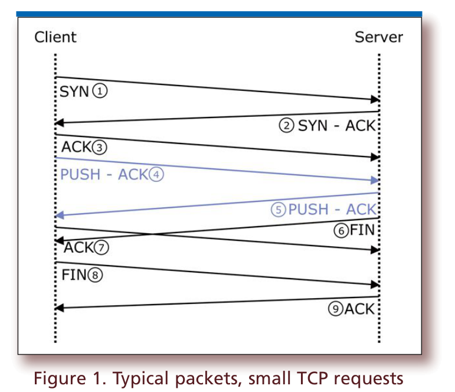
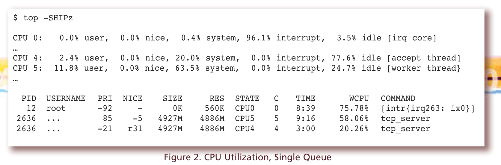
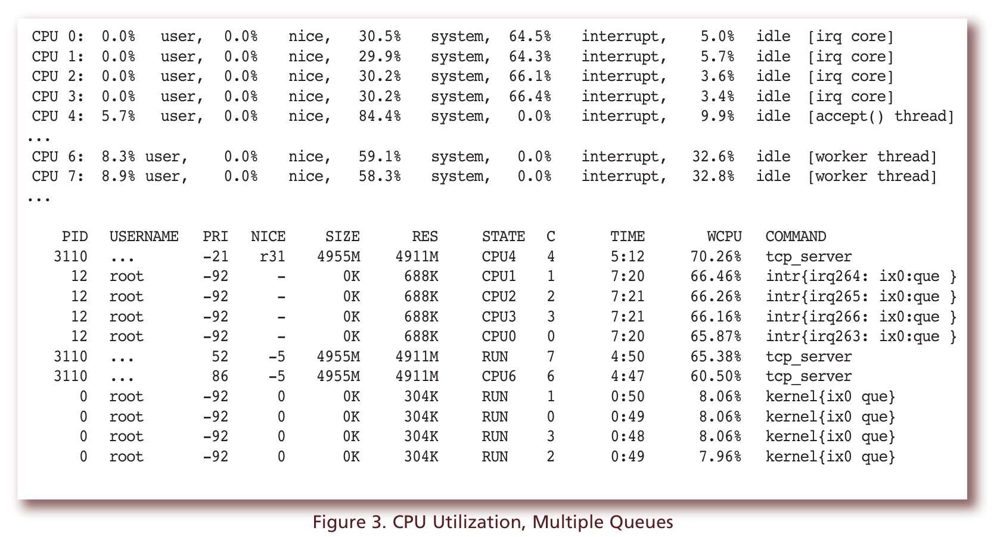
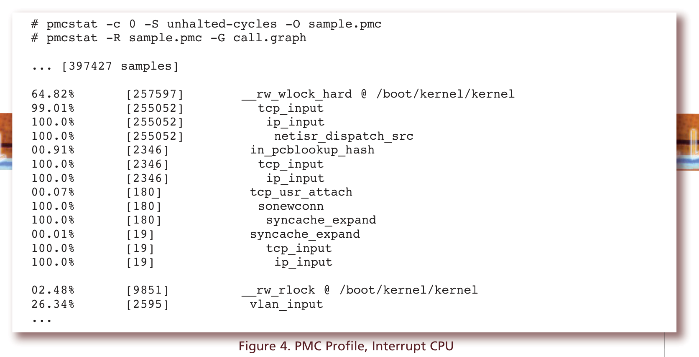
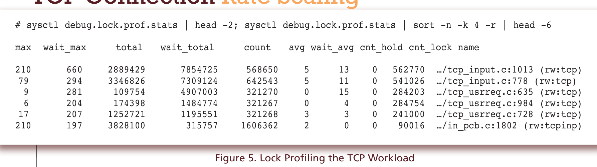
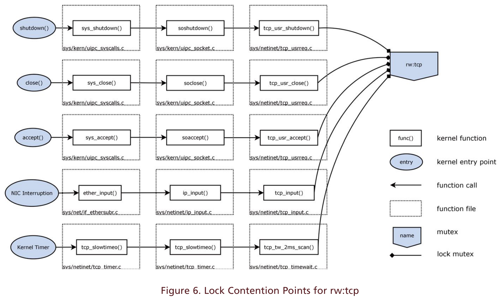

# TCP 连接速率扩展

- 原文：[TCP Connection Rate Scaling](https://freebsdfoundation.org/our-work/journal/browser-based-edition/networking/tcp-connection-rate-scaling/)
- 作者：**Michael Bentkofsky 与 Julien Charbon**

当今的商品服务器，单块网卡（NIC）端口带宽达 10+ G、处理器核数达数十，其网络与处理能力足以在最小型服务器上承载最严苛的网络服务。

随着基于 Web 的服务的流行，人们大量关注扩展这类服务，以应对上一个十年中诸如 C10K 问题（<http://en.wikipedia.org/wiki/C10k_problem>）的挑战——即在单台服务器上同时处理 10,000 条连接。使用非阻塞 I/O 和事件通知（如 `kqueue()`）实现的现代服务器软件可处理数万条并发连接。如今的新挑战瞄准在单台服务器上同时服务多达一百万条连接。当前的 NIC 硬件足以支持，但要把连接数继续推高，剩余的挑战之一便是扩展单台服务器可服务的 TCP 连接速率（<http://blog.whatsapp.com/index.php/2012/01/1-million-is-so-2011/>）。本文考察若干类型的基于 TCP 的服务，其中首要的扩展问题是处理现代服务器硬件上最高速率的 TCP 连接建立。这与向数百万条已建立的 TCP 连接提供内容是不同的挑战。此类服务包括：

- 基于 TCP 的 DNS 服务（<http://tools.ietf.org/html/rfc5966>）
- 单次请求与响应的 HTTP 服务，例如在线证书状态协议（OCSP）服务
- 域名注册局的 Whois 服务

## FreeBSD 中的扩展

在上述示例中，TCP 上的 DNS 是我们预期会在互联网上增长的那种流量——随着 DNSSEC 的采用导致 DNS 响应变大（<https://www.dns-oarc.net/node/199>），且服务提供商使用 TCP 以减少与无连接协议（如用户数据报协议 UDP）相关的攻击向量。为深入这一扩展挑战，图 1 展示了与建立 TCP 连接、交换请求与响应数据以及拆除该 TCP 连接相关联的数据包。



图 1. 典型数据包，小型 TCP 请求

在本用例中，客户端发起连接 SYN（1），服务器以 SYN/ACK（2）响应，客户端以 ACK（3）建立连接。客户端到服务器的请求数据包在（4）中发送，服务器到客户端的响应数据包在（5）中。这代表向服务器发送请求并向客户端返回响应。服务器在（6）中发起连接拆除，响应在（7）中被确认。客户端拆除其侧连接（8），服务器最终确认客户端的 FIN（9）。任一端都可以发起连接拆除，因此（6）、（7）和（8）的次序可能略有不同。

在该数据包流中，我们可以做出若干观察：

- 共交换 9 个数据包，其中 5 个从客户端发往服务器，4 个从服务器发往客户端。
- 连接建立和拆除有相当大的开销，（4）和（5）中两台机器之间只交换了两个数据包的数据。虽然同一连接上可以交换更多数据，但本工作流考虑的是小型请求和响应。
- 此类通信通常以小型数据包交换为主，取决于请求和响应的大小。本文一般考虑小型请求和响应，以分析扩展这类交换的最坏情形场景。

这一数据包交换被视为 TCP 小型请求与响应问题的规范形式。虽然数据包流可能略有不同——例如客户端与服务器同时发起连接拆除，或 FIN 由任一端附带在数据包中发送——但这些差异不会显著改变扩展的本质。

对于这一数据包流，我们考虑要扩展到当前可用网卡的带宽容量所需付出的努力。每个数据包至少有 78 字节：

- 12 字节帧间间隔
- 8 字节前导码 + 帧起始定界符
- 18 字节以太网（源和目的 MAC、类型、校验和）
- 20 字节 IP 头部（无选项的 IPv4）
- 至少 20 字节 TCP 头部

如果我们假设带宽主要受出站（响应）数据包限制，对于规范的数据包流，可以按每个请求计算出口带宽消耗：

| 数据包类型 | 字节数 | 说明 |
| :--------: | :----: | :--- |
| （2）SYN - ACK | 98 | 78 + MSS、SACK、wscale、timestamps |
| （5）PSH - ACK | 90+ | 78 + timestamps + 响应负载 |
| （6）FIN | 90 | 78 + timestamps |
| （9）ACK | 90 | 78 + timestamps |
| 出站总计 | 368 + 响应负载 | |

额外的负载、VLAN 标记（802.1Q）、略不同的数据包计数以及额外的 TCP 选项都可能增加累计请求大小，因此若我们假设入站或出站聚合数据包大小在 500 到 1000 字节之间，单块吉比特网卡端口应争取每秒累计服务约 125,000 到 250,000 次这类请求——相当于每秒 625,000 到 125 万个入站数据包，以及每秒 500,000 到 100 万个出站数据包。

我们测量一台多核服务器在应用中不引入任何额外开销的情况下如何处理这一负载。应用是在 FreeBSD 10.0 上运行的简单 TCP 服务器，用户态应用在一个线程中监听套接字，把新连接的文件描述符分配给多个其他线程——称为“工作线程”。所有线程通过 `cpu_set` 绑定到独立核，且用户线程数不超过总核数。工作线程用 `kqueue()` 服务多条连接，用单次 `receive` 读取请求数据，用单次 `send` 生成响应，然后关闭连接。

在客户端，使用大量客户端源 IP 地址和端口从私有网络发起多个请求。虽然客户端容量超出本文范围，但客户端软件的基准测试能每秒创建数十万条连接。

在大约每秒 56,000 条连接——即 225 – 450 Mbits/sec 的带宽——时，我们看到的 CPU 利用率见图 2。CPU 0 上的瓶颈源于 NIC 收发数据包的中断处理。幸运的是，这一瓶颈可以通过使用 NIC 的接收端扩展（RSS）特性克服——它把流量分发到多个队列，并通过消息信号中断（MSI 或 MSI-X）把中断处理派发到多个 CPU。



图 2. CPU 利用率，单队列

```sh
$ top -SHIPz
CPU 0: 0.0% user, 0.0% nice, 0.4% system, 96.1% interrupt, 3.5% idle [irq core]
…
CPU 4: 2.4% user, 0.0% nice, 20.0% system, 0.0% interrupt, 77.6% idle [accept thread]
CPU 5: 11.8% user, 0.0% nice, 63.5% system, 0.0% interrupt, 24.7% idle [worker thread}
…
PID USERNAME PRI NICE SIZE RES STATE C TIME WCPU COMMAND
12 root -92 - 0K 560K CPU0 0 8:39 75.78% [intr{irq263: ix0}]
2636 ... 85 -5 4927M 4886M CPU5 5 9:16 58.06% tcp_server
2636 ... -21 r31 4927M 4886M CPU4 4 3:00 20.26% tcp_server
```

启用 RSS 后，NIC 被配置为拥有多个接收硬件队列，MSI 允许来自 NIC 的中断被定向到负载较轻的特定 CPU 核。NIC 基于数据包的哈希函数（通常是源和目的 IP 与端口的哈希）将数据包分发到接收队列。在 FreeBSD 中，此配置部分在设备驱动程序初始化中设置，然后中断处理可通过 `cpuset` 钉到特定核。经过合理配置的驱动以及对处理中断的 CPU 的明智选择，我们应当看到处理负载更多地转移到负载较轻的核上。

如果所有数据包处理都能并行进行，我们预期容量随接收队列数和专用接收处理 CPU 数线性扩展，直到遇到下一个瓶颈。然而，图 3 所示的测试结果与此不符：每秒 62,000 条连接，或 250 到 500 Mbits/sec 带宽。在该配置中有四个 NIC 队列分别亲和到四个 CPU。由于图 2 提示 CPU 5 负载很高，我们在用户态应用中又加了一个线程处理请求。我们注意到中断处理已经耗尽了四个专用 CPU，并且迹象表明接受新连接的线程和处理请求的两个线程都消耗了大量系统时间。



图 3. CPU 利用率，多队列

```sh
CPU 0: 0.0% user, 0.0% nice, 30.5% system, 64.5% interrupt, 5.0% idle [irq core]
CPU 1: 0.0% user, 0.0% nice, 29.9% system, 64.3% interrupt, 5.7% idle [irq core]
CPU 2: 0.0% user, 0.0% nice, 30.2% system, 66.1% interrupt, 3.6% idle [irq core]
CPU 3: 0.0% user, 0.0% nice, 30.2% system, 66.4% interrupt, 3.4% idle [irq core]
CPU 4: 5.7% user, 0.0% nice, 84.4% system, 0.0% interrupt, 9.9% idle [accept() thread]
...
CPU 6: 8.3% user, 0.0% nice, 59.1% system, 0.0% interrupt, 32.6% idle [worker thread]
CPU 7: 8.9% user, 0.0% nice, 58.3% system, 0.0% interrupt, 32.8% idle [worker thread]
...
PID USERNAME PRI NICE SIZE RES STATE C TIME WCPU COMMAND
3110 ... -21 r31 4955M 4911M CPU4 4 5:12 70.26% tcp_server
12 root -92 - 0K 688K CPU1 1 7:20 66.46% intr{irq264: ix0:que }
12 root -92 - 0K 688K CPU2 2 7:21 66.26% intr{irq265: ix0:que }
12 root -92 - 0K 688K CPU3 3 7:21 66.16% intr{irq266: ix0:que }
12 root -92 - 0K 688K CPU0 0 7:20 65.87% intr{irq263: ix0:que }
3110 ... 52 -5 4955M 4911M RUN 7 4:50 65.38% tcp_server
3110 ... 86 -5 4955M 4911M CPU6 6 4:47 60.50% tcp_server
0 root -92 0 0K 304K RUN 1 0:50 8.06% kernel{ix0 que}
0 root -92 0 0K 304K RUN 0 0:49 8.06% kernel{ix0 que}
0 root -92 0 0K 304K RUN 3 0:48 8.06% kernel{ix0 que}
0 root -92 0 0K 304K RUN 2 0:49 7.96% kernel{ix0 que}
```

为分析为什么把 TCP 输入处理负载分发到多个 MSI 接收队列没有按预期扩展，我们在其中一个处理中断的 CPU 上使用性能监控计数器（PMC）做了性能剖析，见图 4。



图 4. PMC 性能剖析，中断 CPU

```sh
# pmcstat -c 0 -S unhalted-cycles -O sample.pmc
# pmcstat -R sample.pmc -G call.graph
... [397427 samples]
64.82% [257597] __rw_wlock_hard @ /boot/kernel/kernel
99.01% [255052] tcp_input
100.0% [255052] ip_input
100.0% [255052] netisr_dispatch_src
00.91% [2346] in_pcblookup_hash
100.0% [2346] tcp_input
100.0% [2346] ip_input
00.07% [180] tcp_usr_attach
100.0% [180] sonewconn
100.0% [180] syncache_expand
00.01% [19] syncache_expand
100.0% [19] tcp_input
100.0% [19] ip_input
02.48% [9851] __rw_rlock @ /boot/kernel/kernel
26.34% [2595] vlan_input
...
```

按此性能剖析，该核超过 50% 的 CPU 时间花在 `__rw_wlock_hard()` 上，而这个内核函数主要由 `tcp_input()` 调用。`__rw_wlock_hard()` 是读者/写者内核锁实现（**rwlock(9)**）的一部分，更确切地说，该函数的目标是获取该锁的独占访问。运行内核锁性能分析（**LOCK_LOCK_PROFILING(9)**）并按每个锁的累计等待时间（`wait_total`，单位微秒）排序，可得到竞争锁的详细信息，见图 5。



图 5. TCP 负载的锁性能分析

```sh
# sysctl debug.lock.prof.stats | head -2; sysctl debug.lock.prof.stats | sort -n -k 4 -r | head -6
max wait_max total wait_total count avg wait_avg cnt_hold cnt_lock name
210 660 2889429 7854725 568650 5 13 0 562770 …/tcp_input.c:1013 (rw:tcp)
79 294 3346826 7309124 642543 5 11 0 541026 …/tcp_input.c:778 (rw:tcp)
9 281 109754 4907003 321270 0 15 0 284203 …/tcp_usrreq.c:635 (rw:tcp)
6 204 174398 1484774 321267 0 4 0 284754 …/tcp_usrreq.c:984 (rw:tcp)
17 207 1252721 1195551 321268 3 3 0 241000 …/tcp_usrreq.c:728 (rw:tcp)
210 197 3828100 315757 1606362 2 0 0 90016 …/in_pcb.c:1802 (rw:tcpinp)
```

该负载的主要竞争点是 `rw:tcp` 锁。查看该锁的热点调用点，按排名依次为：

1. `sys/netinet/tcp_input.c:1013`：`tcp_input()`
2. `sys/netinet/tcp_input.c:778`：`tcp_input()`
3. `sys/netinet/tcp_usrreq.c:635`：`tcp_usr_accept()`
4. `sys/netinet/tcp_usrreq.c:984`：`tcp_usr_close()`
5. `sys/netinet/tcp_usrreq.c:728`：`tcp_usr_shutdown()`

`tcp_input()` 中的前两处锁由内核在每个 TCP 数据包上调用时获取，而后三处调用对应用户态 TCP 服务器的套接字系统调用。逐包获取的锁在以下条件下在 `tcp_input()` 中被获取：

- SYN、FIN 或 RST 任一 TCP 标志被置位
- TCP 连接状态为 ESTABLISHED 之外的任一状态

观察交换的数据包及相应的 TCP 连接状态（见下表），我们看到五个接收到的数据包中有四个会导致 `rw:tcp` 写锁被获取。由于该锁对所有 TCP 套接字全局共享，这一竞争似乎是限制通过 RSS 扩展的主要因素。

| # | 入站包 | 出站包 | 状态（前） | 状态（后） | tcp_input 中锁定 rw:tcp？ |
| - | :----: | :----: | :--------: | :--------: | :-----------------------: |
| 1 | SYN（1） | SYN + ACK（2） | None | SYN-RECEIVED | 是，WLOCK |
| 2 | ACK（3） | | SYN-RECEIVED | ESTABLISHED | 是，WLOCK |
| 3 | PSH（4） | PSH（5） | ESTABLISHED | ESTABLISHED | 否 |
| 4 | FIN（6） | | ESTABLISHED | FIN-WAIT-1 | |
| 5 | ACK（7） | | FIN-WAIT-1 | FIN-WAIT-2 | 是，WLOCK |
| 6 | FIN（8） | ACK（9） | FIN-WAIT-2 | TIME-WAIT | 是，WLOCK |

图 6 显示 `rw:tcp` 上的竞争点包括来自 NIC 中断驱动的任务、数据包处理、来自用户态系统调用，以及来自其他周期性定时器任务（如 TCP TIME-WAIT 定时器）。

`rw:tcp` 锁保护为 TCP 状态定义的全局数据结构，包括：

- 用于在结构体（`struct inpcb`）间搜索的哈希表（`struct inpcbinfo.ipi_hashbase`）
- 用于扫描结构体的全局列表（`struct inpcbinfo.ipi_listhead`）
- 第 4 层特定的附加结构，包括 TCP 中处于 TIME-WAIT 状态的套接字列表

该锁被定义为读者-写者锁，因此多个读任务可同时搜索，但只有一个任务能更新，同时阻塞所有读者。当 `inpcb` 结构体被添加或移除时，写者锁被持有。在 TCP 上下文中，这发生在以 ACK（3）完成连接建立时，以及连接被完全拆除且 TIME-WAIT 完成时。

除全局 `rw:tcp` 锁外，每个 `inpcb` 还有一把名为 `rw:tcpinp` 的锁。该锁在更新每条连接的信息时被持有。对长寿命连接而言，每把 `rw:tcpinp` 锁可能被持有和释放多次，但这只会引发每条连接的竞争，而非跨所有连接。虽然短寿命连接很少引发竞争，但多把锁需要一套成熟的加锁顺序以避免死锁。这套成熟的顺序是：当两把锁都要持有时，必须先锁 `rw:tcp`（全局锁），再锁 `rw:tcpinp`（每连接锁）。如前所述，五个接收到的数据包中有四个会导致两把锁同时被持有。

除本文考虑的正常数据包处理和用户态系统调用外，还有其他情况下 `rw:tcp` 锁会被持有。其他例子包括设置了 TCP RST 标志的入站数据包、无法分配资源或达到系统配置限制的情形，甚至如 TCP 拥塞控制算法被重配置等罕见情形。考虑修改加锁策略以扩展连接速率时，也必须仔细注意这些其他处理路径，以避免可能的死锁或全局结构损坏。虽然复杂，但似乎存在若干机会可以减少全局 `rw:tcp` 锁的竞争。分析该锁被获取的路径可以看出几种有希望的方法：

1. 完全避免 `rw:tcp` 锁，尤其是用户态系统调用驱动的路径。
2. 在当前使用 `rw:tcp` 锁之处新增更细粒度的锁。
3. 切换为 `rw:tcp` 读锁，以允许关键代码路径中的并发。

作为第一种缓解手段的示例，避免在 `accept()` 系统调用中加 `rw:tcp` 锁的实现已被采纳，将出现在未来版本的 FreeBSD 中（<http://www.freebsd.org/cgi/query-pr.cgi?pr=183659>）。似乎还有其他类似机会。

作为第二种缓解手段的示例，针对公司大规模网络服务上 TIME-WAIT 状态连接的过期处理，一种替代实现也正被采纳（<http://svnweb.freebsd.org/base?view=revision&revision=264321>）。该实现不通过锁 `rw:tcp` 来管理全局 TIME-WAIT 列表，而是创建了一把新锁 `rw:tcptw`。虽然 `rw:tcp` 锁仍被用于最终销毁 `inpcb` 结构体，但它只被短暂持有，且不会在遍历过期列表期间持有。

使用上述两个补丁的早期性能结果显示，这些技术有助于扩展连接速率。借助 `accept()` 系统调用避免和 TIME-WAIT 单独细粒度锁，我们看到连接速率从每秒 62,000 条提升到每秒 69,000 条。提升幅度虽不算大，但看来这两种技术还有进一步应用空间。



图 6. `rw:tcp` 的锁竞争点

这项工作将继续探索在数据包处理中引入更多并行的可能性。虽然在早期开发阶段，但第三种技术看起来很有前景。早期性能结果暗示，该技术可超过每秒 120,000 条连接，利用 480 – 960 Mbits/sec 的带宽。

虽然高连接速率对许多网络服务（包括流媒体或具有长寿命连接的服务）而言可能并不典型，但这类应用确实存在。处理能够占满单块吉比特网卡的高连接速率的挑战已近在咫尺，尽管要达成该目标仍有更多工作要做。

---

**Julien Charbon** 是 Verisign, Inc. 的软件开发工程师。Julien 在公司的大规模网络服务 ATLAS 平台及相关大规模网络服务上工作。Julien 与 FreeBSD 合作完成过移植软件、开发修复与补丁以及网络性能研究等工作。

**Michael Bentkofsky** 是 Verisign, Inc. 的首席软件工程师，领导其 ATLAS 平台的开发。他曾在实施大规模、持续可用的 TCP 服务的团队中工作，包括 .COM 和 .NET 顶级域的 DNS 与 Whois 服务，以及用于证书校验的在线证书状态协议（OCSP）。
