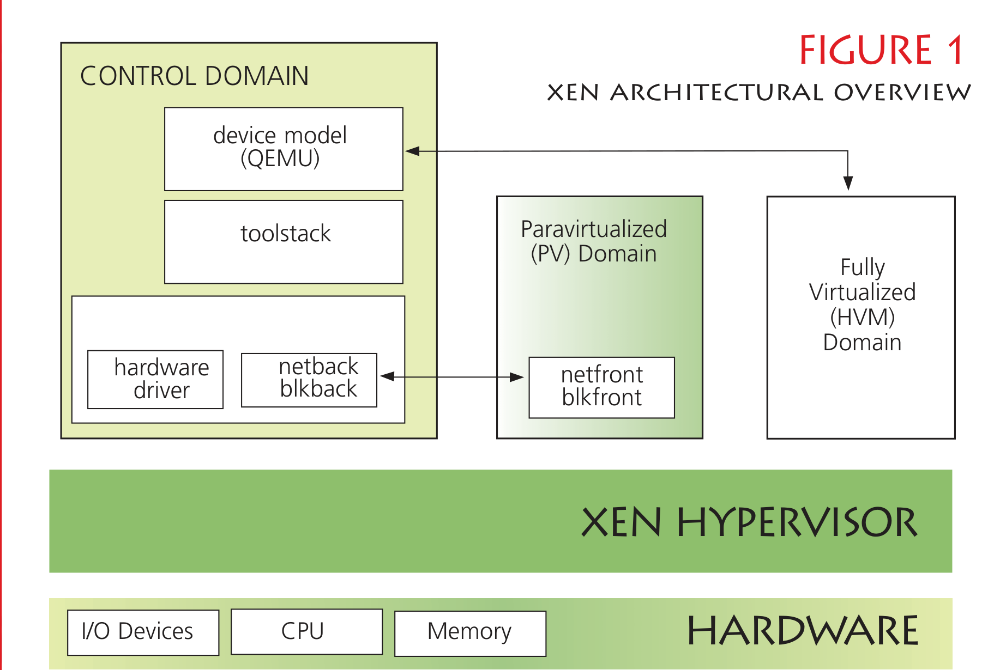
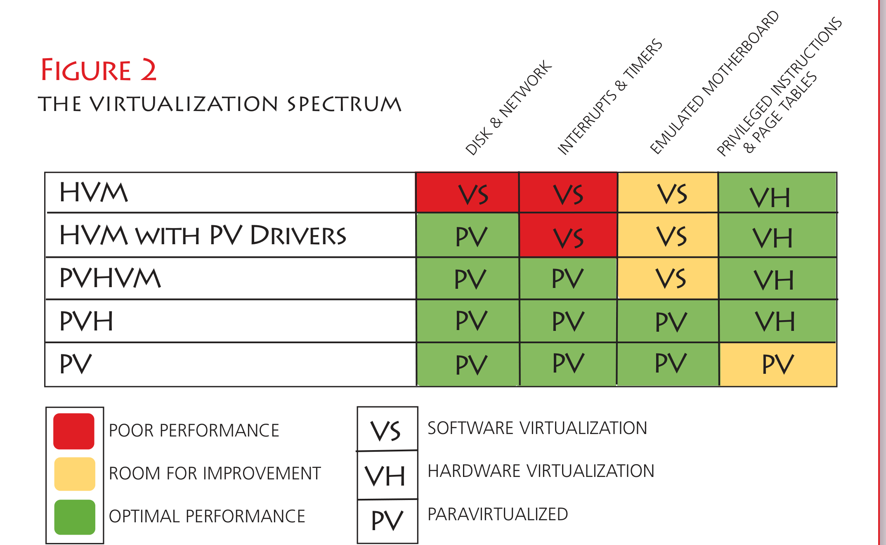
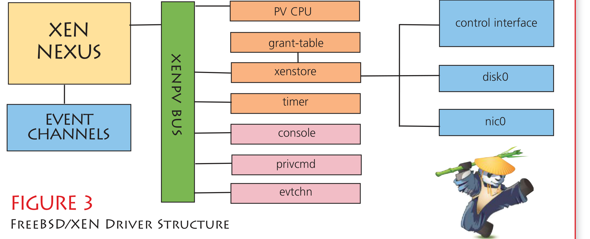

# Xen

- 原文：[Xen](https://freebsdfoundation.org/our-work/journal/browser-based-edition/virtualization/xen/)
- 作者：**Roger Pau Monné**

Xen 虚拟机监控器于 20 世纪 90 年代末在剑桥大学计算机实验室启动，当时项目名为 Xenoservers。当时 Xenoservers 旨在提供“一种新的分布式计算范式，称为‘全球公共计算’，允许任何用户在任何地方运行任何代码。这类平台为计算资源定价，最终按用户消耗的资源收费”。鉴于这一目标，Xen 在云出现之前就已为云而设计，这一点显而易见。今天，Xen 技术驱动着生产环境中最大的企业云，包括 Amazon EC2、RackSpace 和 Verizon Terramark。

使用虚拟机监控器可以安全地在多个操作系统之间共享一台物理机的硬件资源。虚拟机监控器是管理所有这些操作系统（通常称为客户机）的软件，并在它们之间提供分离和隔离。

2003 年首次作为开源虚拟机监控器以 GPLv2 发布以来，Xen 的设计与操作系统无关，这让向新操作系统添加 Xen 支持变得容易。自 10 多年前首次发布以来，Xen 得到了大量个人开发者和企业贡献者的广泛支持。

## 架构

虚拟机监控器可分为两类：Type1——直接在裸机上运行并直接控制硬件的虚拟机监控器；Type2——作为操作系统一部分的虚拟机监控器。常见的 Type1 虚拟机监控器有 VMware ESX/ESXi 和 Microsoft Hyper-V，而 VMware Workstation 和 VirtualBox 是 Type2 虚拟机监控器的典型例子。

Xen 是一个 Type1 虚拟机监控器，但有一个变体——其设计在许多方面类似微内核。Xen 本身只接管 CPU、本地和 IO APIC、MMU、IOMMU 以及一个定时器（HPET 或 PIT）。其余部分由控制域（Dom0）——一个被虚拟机监控器授予提升权限的专门客户机——处理。这使得 Dom0 可以管理系统中的所有其他硬件以及运行在虚拟机监控器上的所有其他客户机。同样重要的是，Xen 几乎不包含硬件驱动程序，避免与操作系统中已有的驱动程序代码重复（见图 1）。

## 客户机

由于 Xen 是在 x86 还没有现在这些硬件特性时设计的，它能提供几种不同的虚拟化模式。20 世纪 90 年代末，在 x86 上使用虚拟化只有两种选择，且开销都很高——完全软件模拟或二进制翻译。为克服这一点，Xen 采用了新方法：让客户机知道它在虚拟化环境中运行，并提供一套全新接口来消除额外开销。这就是今天所谓的半虚拟化（PV），并用感知 PV 的实现替换了以下接口：

- 磁盘和网络
- 中断和定时器
- 引导过程——客户机直接以它希望运行的模式（32 位或 64 位）启动
- 页表
- 特权指令

上述接口中有些易于实现且对客户机操作系统不具侵入性，例如 PV 磁盘和网卡。另一方面，有些确实侵入性很强，例如原生页表的替换实现。

其中有几个接口值得详细解释，比如中断的半虚拟化。PV 客户机不允许使用原生中断，因此引入了一种称为事件通道（event channels）的新技术来替代。事件通道使用进入客户机内核的单个入口点注入中断，在 Xen 和客户机之间有一个共享内存区域用于通知哪个事件已触发。作为 Xen PV 客户机运行时，所有中断都通过此接口路由。

Xen 客户机使用的另一项重要技术是 hypercall 页。这是客户机操作系统中的一页内存，由 Xen 填充，包含硬件特定的 hypercall 实现。Hypercall 类似于操作系统中用户空间和内核空间之间的系统调用，但在这里 hypercall 位于客户机内核和虚拟机监控器本身之间。Hypercall 是客户机操作系统与 Xen 虚拟机监控器通信的唯一方式。PV 客户机无法通过其他方式与 Xen 通信。

随着 2005 年 x86 引入硬件虚拟化扩展，Xen 获得了以硬件虚拟机（HVM）模式运行未修改客户机的能力。这是非常重要的一步，因为它允许 Xen 运行不带任何感知 PV 接口的客户机。为此，需要一个设备模型（通常在 Dom0 中运行）来模拟提供给客户机的设备。所有这些模拟都由 Qemu 处理，Qemu 经过适配后可与 Xen 协作。

使用设备模型对 Dom0 和客户机而言开销都很大。由于每个客户机都需要自己的 Qemu 实例（如果它们都在 Dom0 上运行），它很容易在 CPU 和内存使用方面成为瓶颈。从客户机角度看，与仅使用 PV 接口相比，它还增加了更多开销，因为对这些模拟设备的访问会在 Qemu 中触发陷阱。

## HVM 与 PV 的演进

虽然 PV 与 HVM 客户机之间界限分明，但已有若干 PV 特定的改进提供给 HVM 客户机以获得更好性能。HVM 客户机可使用 PV 磁盘和网卡以提升 IO 吞吐量。当客户机在 HVM 容器内使用这些接口时，在 Xen 术语中称为带 PV 驱动程序的 HVM。但这还不止——自 Xen 4.1 起，HVM 客户机还可使用 PV 定时器和 IPI 以进一步减少模拟开销。客户机以这种模式运行时，称为 PVHVM。

通常，HVM 客户机有更好的性能，尤其是在页表操作方面。PV 客户机使用的软件页表操作是纯 PV 客户机的主要性能问题之一。为改善这一点，最近引入了一种新模式，允许 PV 客户机在 HVM 容器内运行。这种新模式称为 PVH，使用 CPU 和 MMU 的硬件虚拟化扩展，同时对其他部分使用 PV 接口。**图 2** 中的表格展示了 Xen 支持的几种客户机模式之间的差异。

| 模式 | 磁盘和网络 | 中断和定时器 | 模拟设备 | 页表 | 引导过程 |
| :--- | :--------- | :----------- | :------- | :--- | :------- |
| HVM | VS | VS | VH | VH | VH |
| 带 PV 驱动程序的 HVM | PV | VS | VH | VH | VH |
| PVHVM | PV | PV | VS | VH | VH |
| PVH | PV | PV | PV | VH | VH |
| PV | PV | PV | PV | PV | PV |

> VS = 软件虚拟化（性能差，有改进空间）；VH = 硬件虚拟化；PV = 半虚拟化（性能最佳）

## Xen 4.4 中的新特性

除了常规的 bug 修复和全面改进外，最新的 Xen 版本包含几项值得一提的改进。在工具方面，默认 Xen 工具栈（libxl）提供了改进的 libvirt 支持。这为各种能使用 libvirt 的工具（从 GUI 虚拟机管理器到 CloudStack 或 OpenStack 等云编排层）的扎实集成奠定了基础。

Xen on ARM 移植也有许多改进，现在 Xen 既能运行在 ARM 64 位硬件上，也能支持 ARM 64 位客户机。ARM ABI（客户机和虚拟机监控器之间的接口）也被宣布稳定，这意味着所有变更都将以向后兼容的方式进行，使用 Xen 4.4 接口的 ARM 客户机可以放心它在更高版本上仍能工作。此版本还添加了对许多新板子的支持，包括 Arndale、Calxeda ECX-2000、Applied Micro X-Gene Storm、TI QMAP5 和 Allwinner A20/A30。已有相关工作在进行，将 FreeBSD 移植为 Xen on ARM 的客户机和 Dom0。

与 FreeBSD 相关的 4.4 最有趣的特性之一是名为 PVH 的新虚拟化模式。Xen 4.4 实验性地支持以 PVH 模式运行非特权客户机，Dom0 的 PVH 支持将在 Xen 4.5 中加入。这种新的虚拟化模式与 PVHVM 非常相似——FreeBSD 自 10 起可以 PVHVM 模式运行——但完全不需要任何软件模拟。这意味着运行 PVH 客户机不需要运行设备模型（PVHVM 客户机需要）。由于 PVH 不需要设备模型即可运行，它也可以用作 Dom0——此前只有纯 PV 客户机才能做到。

PVH 客户机大量使用当前处理器中的硬件虚拟化扩展，因为它在 HVM 容器内运行，并访问硬件虚拟化的 CPU 和 MMU，这意味着没有用于页表操作或特权指令执行的 PV 接口。如前所述，向操作系统添加 PV 支持最困难的事情之一是虚拟内存子系统必须重写或完全用钩子填充来适配 Xen，这既难以设计又难以维护。除了简化 PV 接口外，PVH 在页表操作方面也快得多，因为使用硬件虚拟化的 MMU 肯定比使用 PV MMU 更快。虽然最初设计时考虑的是性能，但事实证明 PVH 对 FreeBSD 是一个非常重要的特性，大大简化了从 PVHVM 到能作为 Dom0 运行的路径。这意味着 FreeBSD 可以绕过实现 PV MMU 支持的所有麻烦而没有任何缺点。PVH 的性能优于纯 PV。鉴于这些优势，早期的 i386 PV 移植很可能被移除，转而采用 PVH。

## FreeBSD 10 中的 Xen 支持

FreeBSD 10 发布周期在 Xen 新特性方面相当有趣。FreeBSD 9 中 FreeBSD/Xen 移植的状态包括作为单处理器 32 位 PV 客户机运行，以及作为带磁盘和网卡 PV 驱动程序的 HVM 客户机运行。在上一个发布周期中，大部分工作集中在让 FreeBSD 作为 PVHVM 客户机运行，并改进 PV 驱动程序的性能和特性。要作为 PVHVM 客户机运行，进行了几项底层改进，虽然从用户角度并不容易看到这些改进，但对我们走到今天至关重要。

### 事件通道中断处理改进

第一项也是最重要的改进之一是事件通道中断在 FreeBSD 中的注入和处理方式的变更。在以前的版本中，所有事件通道的事件都通过一个单一的全局 PCI 中断通知客户机。这很简单，如果客户机只对少数 PV 磁盘和网卡设备使用事件通道也能正常工作。但它的扩展性不好，因为所有事件通道处理都绑定到运行在单个 CPU 上的单个中断。为解决此限制，FreeBSD 加入了对 Xen 较新事件传递方案的支持。该方案称为“vector callback”（向量回调），Xen 允许客户机为每个事件通道分配一个 IDT 向量。由于 Xen 可将 IDT 事件注入到特定 CPU，这允许在所有 CPU 之间充分分布中断负载。它还让高效实现新的、每 CPU 的半虚拟化设备类型成为可能。

### PV 定时器

得益于 vector callback 的引入，可以使用 PV 定时器。该定时器实现为单次触发型每 CPU 事件定时器，通过 hypercall 设置，并通过事件通道中断传递给客户机。这消除了使用模拟定时器的开销，后者源于必须对模拟设备寄存器进行读写，而这些读写会在 Xen 中触发 VMEXIT。VMEXIT 是一种进入虚拟机监控器的非自愿陷阱，涉及上下文切换。与任何上下文切换一样，保存和恢复执行状态代价高昂，应尽可能避免。客户机尝试执行特权操作时会发生 VMEXIT：访问某些寄存器、执行某些指令，或访问由虚拟机监控器管理的内存位置（如 Xen 模拟的设备内存）。

通过使用 PV 定时器，发出设置定时器的 hypercall 时只需一次 VMEXIT。Xen 还提供一个共享内存区域，包含大量时间相关信息。除了设置 PV 定时器外，此信息还用于创建时间计数器并为 FreeBSD 提供时钟实现。可见，我们能仅使用 PV 接口解决所有操作系统时间相关的需求。

### IPI 优化

为减少模拟开销所做的另一项改进是通过事件通道路由处理器间中断（IPI）。在原生 x86 硬件上，IPI 使用本地 APIC 投递，但同样在虚拟化环境中运行时，对本地 APIC 的访问会在 Xen 中触发 VMEXIT，而我们希望能避免这种情况。解决方案是使用事件通道中断在处理器之间投递这些信号，大大降低了 IPI 的延迟。在这里，我们再次将多次 VMEXIT 转换为单次 hypercall，减少模拟开销。

## HEAD 中的 PVH 支持

由于 PVH 在使用的 PV 接口方面与 PVHVM 非常相似，将 PVH 支持引入 FreeBSD 并不困难。PVHVM 和 PVH 之间的主要区别在于 PVH 使用 PV 启动序列。这意味着没有模拟的 BIOS，客户机通过直接跳转到内核入口点启动，并已设置好一些基本页表。客户机还需要设置其物理中断，由于没有本地 APIC，必须通过 hypercall 完成。这听起来非常复杂，但其实没那么难。Xen 提供 hypercall 让 Dom0 能轻松设置 IO APIC、MSI 和 MSI-X 中断，无需处理底层硬件。同样，所有这些都通过钩子实现到现有代码中，使用 newbus 提供的基础设施，这让用 Xen 对应实现替换某些方法轻而易举。得益于此接口，驱动程序完全不需要更改。

关于 Xen 特定代码，要在 Dom0 下运行需要对 xenstore 进行一些修改。Xenstore 是在域之间共享的信息存储空间，由 `xenstored` 应用维护。作为客户机运行时，xenstore 包含该域的硬件描述并始终可访问，但对 Dom0 而言情况并非如此，因为 xenstore 尚未启动。

因此，在 Dom0 中，我们必须允许启动过程跳过 xenstore 初始化，直到该守护进程实际启动；同时必须防止任何 Xen 内核驱动程序在 xenstore 实际运行前尝试使用它。解决方案是在进程启动前不挂载 xenstore 总线，并且得益于 FreeBSD 中 Xen 组件的分层结构，很容易实现：只需在 xenstore 实际初始化前不挂载任何挂接在 xenstore 上的驱动程序。

由于 PVH 上没有 ACPI，FreeBSD 会回退到传统的 Nexus 实现。这不太理想，因为它会挂载一堆 PVH 上不存在的总线。因此在 PVH 情况下提供了一个非常简单的 Xen 专用 Nexus 来承担这一职责。最后，添加了两个设备驱动程序：evtchn 设备，允许用户态应用程序绑定事件通道；以及 privcmd 设备，仅在作为 Dom0 运行时存在，用于从用户空间向虚拟机监控器发送管理命令。

## 未来

随着 PVH 支持合并入 HEAD，工作转向 PVH Dom0 支持。作为 Dom0 运行与作为客户机运行大不相同。一个主要差异是 Dom0 可以访问物理硬件，因此必须管理它。但这与裸机运行并不相同。众多差异中的两个例子是：物理硬件中断通过 Xen 事件通道投递，以及客户机的硬件描述不是来自 ACPI 而是来自 Xenstore。

FreeBSD 已经具备为客户机提供网络和磁盘服务所需的驱动程序。因此没太多工作要做。其中一些后端没怎么用过，所以可能需要一些微调，但比从零开始写要少得多。

Dom0 支持仍处于早期阶段，但总体上看起来非常有前景。FreeBSD 高度专注于性能，尤其是 IO 性能，而这正是 Dom0 所需的，因为它通常运行一堆 PV 后端来服务来自客户机的请求。在内核中拥有 ZFS 和 Netmap 等前沿特性，必将使 FreeBSD 在 Xen 项目生态中成为一个非常有趣的操作系统。

---

**Roger Pau Monné** 是 Citrix 的软件工程师、FreeBSD 开发者。他经常向 Xen 项目和 FreeBSD/Xen 移植贡献代码，目前主要专注于在两个项目中实现稳定的 PVH 支持。
