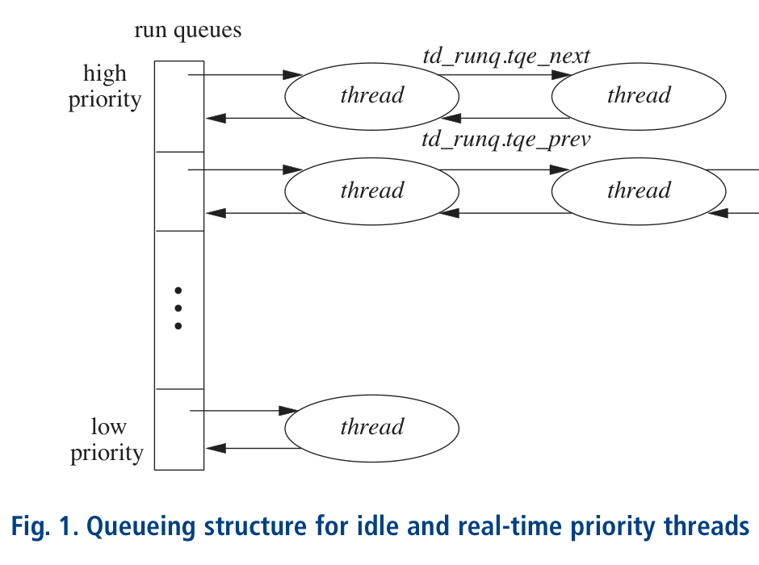
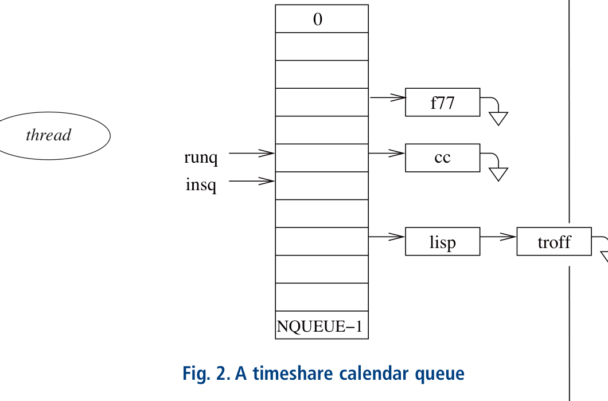

# ULE

- 原文标题：The FreeBSD ULE Scheduler
- 作者：**Marshall Kirk McKusick**、**Jeff Roberson**

## 目标

多处理系统的目标，是将多个 CPU 的算力应用于一个问题或一组问题，以比单处理器系统更短的时间获得结果。如果系统的可运行线程数与 CPU 数相同，那么实现这个目标很容易。每个可运行线程独占一个 CPU 并运行至完成。通常，许多可运行线程竞争少量处理器。调度器的一项工作是确保 CPU 始终忙碌，不浪费周期。线程完成工作或因等待资源而阻塞时，会从其运行的处理器上移除。线程在处理器上运行时，会将其工作集——正在执行的指令和正在处理的数据——带入 CPU 的内存缓存。迁移线程是有代价的。线程从一个 CPU 移到另一个 CPU 时，其 CPU 缓存工作集会丢失，必须从原先运行的 CPU 中移除，然后加载到迁移到的新 CPU 中。如果多处理系统的调度器过于简单，不考虑这一代价，其性能可能低于单处理器系统。术语处理器亲和性（processor affinity）描述的是一种调度器，它仅在必要时迁移线程，为空闲处理器提供任务。

多处理系统可能由多个处理器芯片构建。每个处理器芯片可能有多个 CPU 核心，每个核心可以执行一个线程。单个处理器芯片上的 CPU 核心共享处理器的许多资源，如内存缓存和访问主存的通道，因此它们比其他处理器芯片上的 CPU 同步更紧密。处理具有多 CPU 的处理器芯片，是在不同芯片的 CPU 之间进行负载均衡的一种衍生形式。它通过维护 CPU 层次结构来处理。同一芯片上的 CPU 之间迁移线程代价最低。层次结构中下一级是同一主板上的处理器芯片。再下一级是通过同一背板连接的芯片。调度器支持由硬件决定的任意深度层次结构。调度器决定将线程迁移到哪个处理器时，会尝试在层次结构中挑选更高层级的处理器，因为那是最低代价的迁移路径。

从线程的角度看，它不知道同一处理器上还有其他线程在运行，因为处理器独立处理它们。系统中唯一需要感知多 CPU 的代码就是调度算法。具体而言，调度器把同一芯片上的 CPU 视为迁移线程代价更低的目标，优于迁移到另一芯片上的 CPU。在同一处理器芯片上的 CPU 之间获得更紧密亲和性、而非跨芯片 CPU 之间亲和性的机制，将在本文后面描述。

传统 FreeBSD 调度器维护一个全局可运行线程列表，每秒遍历一次以重新计算其优先级。对所有可运行线程使用单一列表，意味着调度器性能取决于系统中的任务数量，随着任务数量增长，调度器维护列表需要消耗更多 CPU 时间。

ULE 调度器在 FreeBSD 5.0 期间开发，主要工作持续到 FreeBSD 9.0，跨越了 10 年的开发。该调度器是为解决传统 BSD 调度器在多处理器系统上的不足而开发的。启动新调度器有以下几个原因：

- 解决多处理器系统中的处理器亲和性需求
- 在多处理器系统的 CPU 之间提供公平的负载分配
- 为单芯片上具有多 CPU 核心的处理器提供更好的支持
- 改进调度算法性能，使其不再依赖于系统中的线程数量
- 提供与传统 BSD 调度器相当的交互性和分时性能

传统 BSD 调度器在大型分时系统和单用户桌面、笔记本电脑上有良好的交互性。然而，它只有一个全局运行队列，因此也只有一个全局调度器锁。单一全局运行队列因全局锁的争用和实现 CPU 亲和性的困难而变慢。

优先级计算依赖一个全局定时器，它在持有多个高争用锁的同时遍历系统中的每个可运行线程并评估其优先级。随着可运行线程数量增加，这种方法变得越来越慢。计算优先级期间，进程无法 fork() 或 exit()，CPU 也无法上下文切换。

## ULE 调度器

从逻辑上讲，ULE 调度器可视为两组基本正交的算法：管理线程在 CPU 之间亲和性和分布的算法，以及负责线程运行顺序和持续时间的算法。这两组算法协同工作，在低延迟、高吞吐和良好资源利用之间取得平衡。调度器的其余部分是事件驱动的，使用这些算法根据系统状态变化实现各种决策。

在多处理器友好且常数时间的实现中，达到传统 BSD 调度器出色的交互行为和吞吐量，是 ULE 开发中最具挑战性、最耗时的部分。交互性、CPU 利用率估算、优先级和时间片算法共同实现了分时调度策略。

ULE 以事件驱动方式评估线程行为，区分交互式线程和批处理线程。交互式线程被认为是等待并响应用户输入的线程。它们需要低延迟才能获得良好的用户体验。批处理线程则倾向于尽可能多地消耗 CPU，可能是后台作业。前者很好的例子是文本编辑器，后者则是编译器。调度器必须使用不完美的启发式方法，根据对线程所属类别的最佳猜测，提供行为梯度。这种分类在线程生命周期内可能频繁变化，且必须在与使用系统的人相关的时间尺度上保持响应。评估交互性的算法称为交互性得分（interactivity score）。交互性得分是自愿睡眠时间与运行时间的比率，归一化到 0 到 100 之间的数值。该得分不包括线程在运行队列中等待的时间，此时它还不是队列中优先级最高的线程。通过要求显式的自愿睡眠，我们可以区分因优先级较低而未运行的线程与周期性等待用户输入的线程。这一要求也使线程在系统负载增加时更难被标记为交互式，这是理想的，因为它防止系统被交互式线程淹没，同时让 shell 和简单的文本编辑器对管理员保持可用。绘制后，从可能的睡眠和运行时间矩阵得出的交互性得分形成一个三维 sigmoid 函数。使用这种方法意味着交互式任务倾向于保持交互式，批处理任务倾向于保持批处理。

一个特别的挑战是复杂的 X Window 应用，如 Web 浏览器和办公软件包。这些应用可能在短时间内消耗大量资源，但用户期望它们保持交互性。为解决这个问题，保留了数秒的睡眠和运行行为历史，并逐渐衰减。因此，调度器保留了一个移动平均，能容忍行为突发，但会迅速惩罚滥用其提升状态的分时线程。较长的历史允许更长的突发，但学习速度更慢。

交互性得分与交互性阈值比较，后者是判定线程是否为交互式的分界点。交互性阈值由进程的 nice 值修改。正的 nice 值使线程更难被视为交互式，负值则使其更容易。因此，nice 值为用户提供了对降低线程调度延迟这一主要机制的一些控制。

如果线程的自愿睡眠时间与运行时间之比低于某个阈值，则被视为交互式。交互性阈值在 ULE 代码中定义，不可配置。ULE 使用两个等式计算线程的交互性得分。对于睡眠时间超过运行时间的线程，使用等式 1：

等式 1

交互性得分 = 缩放因子 /（睡眠 / 运行）

当线程的运行时间超过睡眠时间时，改用等式 2：

等式 2

交互性得分 =（缩放因子 /（运行 / 睡眠））+ 缩放因子

缩放因子是最大交互性得分除以二。得分低于交互性阈值的线程被视为交互式；其余为非交互式。`sched_interact_update()` 例程在线程存在的多个时间点被调用——例如，线程被 `wakeup()` 调用唤醒时——以更新线程的运行时间和睡眠时间。睡眠和运行时间值只允许增长到某个上限。当运行时间和睡眠时间之和超过限制时，会将其缩减回范围内。完全不记住交互式线程的睡眠历史，它就不会保持交互式，导致糟糕的用户体验。记住交互式线程的睡眠时间过长，则会让该线程获得超过其应得的 CPU 份额。保留的历史量和交互性阈值是影响用户在系统上交互体验最强烈的两个值。

优先级根据线程的交互状态分配。交互式线程的优先级由交互性得分派生，并放在批处理线程之上的优先级带中。它们像实时轮转线程一样调度。批处理线程的优先级由估算的 CPU 利用率决定，并根据其进程的 nice 值修改。在两种情况下，可用优先级范围在可能的交互性得分或 percent-cpu 计算值之间均分，两者都是 0 到 100 之间的值。由于每个类别可用的优先级少于 100 个，某些值共享优先级。两种计算大致根据 CPU 利用率历史分配优先级，但具有不同的寿命和缩放因子。

## ULE 实现

CPU 利用率估算器在线程运行时累积运行时间，在线程睡眠时衰减。利用率估算器提供 top 和 ps 中显示的 percent-cpu 值。ULE 将衰减延迟到线程唤醒时，避免周期性扫描系统中的每个线程。由于这种延迟使值在睡眠期间保持不变，因此也必须在任何用户进程检查它们之前衰减。这种方法保持了调度器的常数时间和事件驱动特性。

CPU 利用率记录在线程中，表示为线程已运行的滴答数，以及由第一个和最后一个滴答定义的时间窗口（每个滴答通常为 1 毫秒）。调度器尝试保留大约 10 秒的历史。为完成衰减，它等到有 11 秒的历史后，减去滴答值的十分之一，同时将第一个滴答前移 1 秒。这种低成本的估算移动平均算法具有允许任意更新间隔的特性。如果利用率信息在超过更新间隔后才被检查，滴答值将被清零。否则，减去经过的秒数除以更新间隔。

调度器通过分配时间片实现轮转。时间片是调度器选择另一个同等优先级线程运行之前允许的固定运行时间间隔。时间片防止同等优先级线程之间出现饥饿。时间片乘以给定优先级中可运行线程的数量，定义了该优先级的线程在运行前将经历的最大延迟。为限制此延迟，ULE 根据系统负载动态调整分配的时间片大小。时间片有最小值，以防止抖动并平衡吞吐量与延迟。中断处理程序在每个 statclock 滴答期间调用调度器评估时间片。使用 statclock 评估时间片是一种用于切片记账的随机方法，高效但只能粗略准确。

调度器还必须努力防止高优先级批处理作业饿死低优先级批处理作业。传统 BSD 调度器通过周期性遍历运行队列中等待的所有线程来避免饥饿，提升低优先级线程并降低长期独占 CPU 的高优先级线程的优先级。该算法违反了独立于系统线程数量在常数时间内运行的愿望。因此，批处理策略分时线程的运行队列以类似于系统调用轮（system callwheel）的方式维护，也称为日历队列（calendar queue）。日历队列是一种队列头尾根据时钟或周期旋转的队列。元素可以插入到日历队列中距离头部很远的多个位置，然后逐渐向头部迁移。由于此运行队列是专用目的的，它与实时和空闲队列分开维护，而交互式线程则与实时线程一起保留，直到它们不再被视为交互式。

ULE 调度器为系统中的每个 CPU 创建一组三个队列数组。每个 CPU 有自己的队列使得在多处理器系统中实现处理器亲和性成为可能。

一个队列数组是空闲队列，存储所有空闲线程。该数组按优先级从高到低排列。第二个队列数组被指定为实时队列。与空闲队列一样，它按优先级从高到低排列。

图 1 显示了空闲和实时线程队列如何组织为线程结构的双向链表。每个运行队列的头保存在一个数组中。与此数组关联的是一个位向量 `rq_status`，用于识别非空运行队列。

第三个队列数组被指定为分时队列。分时队列不按优先级顺序排列，而是作为日历队列管理，如图 2 所示。`runq` 指针引用当前条目。`runq` 指针每个系统滴答前移一次，但在当前选择的队列为空之前，它可能不会在滴答时前移。当 `runq` 递增超过最后一个队列时，它会重置指向第一个队列。由于每个线程被给予最大时间片，且没有线程可以添加到当前位置，队列将在有限时间内排空。这一在进入下一队列前排空当前队列的要求意味着，线程经历的等待时间不仅取决于其优先级，还取决于系统负载。`insq` 指针引用插入的基准点。插入分时队列由线程优先级与最佳可能分时优先级之间的相对差值定义。当线程变为可运行或当前运行的线程用完其时间片时，其在日历队列中的位置使用等式 3 计算：

等式 3

队列索引 =（insq_index + 优先级 - minimum_batch_priority）% NQUEUE

其中优先级是线程的优先级（根据其 nice 值调整），小值代表高优先级，大值代表低优先级。`insq` 指针每 10 毫秒或在 `runq` 递增后 `runq` 和 `insq` 具有相同值的任何时候递增。高优先级线程将被放在当前位置之后不久。低优先级线程将被放在远离当前位置的地方。该算法确保即使是最低优先级的分时线程最终也能到达选定队列并执行，即使其他队列中有更高优先级的分时线程可用。两个线程优先级的差异将决定其运行时间比率。在队列位置追上之前，高优先级线程可能多次插入到低优先级线程之前。这种运行时间比率就是赋予具有不同 nice 值的分时 CPU 占用者不同比例 CPU 份额的机制。

这些算法共同决定分时线程的优先级和运行时间。它们根据系统负载、线程行为以及使用 `nice` 做出的用户调度决策产生的一系列影响，实现延迟和吞吐量之间的动态权衡。这些算法限制的许多参数可以通过 `sysctl()` 的 `kern.sched` 树实时探索。其余的是编译时常量，记录在调度器源文件顶部（**/sys/kern/sched_ule.c**）。

线程按优先级顺序从实时队列中挑选运行，直到实时队列为空，然后运行当前选定的分时队列中的线程。仅当其他两个队列数组都为空时，才运行空闲队列中的线程。实时和中断线程始终插入实时队列，使其具有最小的调度延迟。交互式线程也插入实时队列，以保持系统可接受的交互响应。

非交互式线程放入分时队列，在队列切换时调度运行。切换队列保证线程在分时队列数组每轮中至少运行一次，无论优先级如何，从而确保公平共享处理器。

## 多处理器调度

ULE 开发背后的主要目标之一是提升多处理器系统上的性能。良好的多处理性能涉及在亲和性与利用率之间取得平衡，并在具有本地调度队列的系统中保持全局调度的幻觉。这些决策使用由机器相关代码提供的 CPU 拓扑结构实现，该拓扑描述了系统中 CPU 之间的关系。每当线程变为可运行、CPU 空闲或运行周期性任务重新平衡负载时，都会评估状态。这些事件构成了多处理器感知调度决策的全部。

拓扑系统最初是为了识别哪些 CPU 是同步多线程对等体而设计的，后来通用化以支持其他关系。一些例子包括同一封装内的 CPU、共享一层缓存的 CPU、特定内存本地的 CPU，或共享执行单元（如同步多线程中）的 CPU。该拓扑实现为任意深度的树，其中每一级描述某个共享资源及其代价和共享该资源的 CPU 位掩码。树的根持有系统中的 CPU，分支延伸到每个插槽，然后是共享缓存、共享功能单元等。由于系统是通用的，它应该可扩展以描述任何未来的处理器排列。对树的深度或所有级别都必须实现没有限制。解析此拓扑是一个名为 `cpu_search()` 的单一递归函数。它是一个路径感知、基于目标的树遍历函数，可从任意子树开始。它可以被要求找到满足给定条件（如优先级或负载阈值）的最少或最多负载的 CPU。考虑负载时，它会考虑整个路径的负载，从而有可能平衡插槽、缓存、芯片等。此函数用作所有多处理相关调度决策的基础。通常，内核编程中避免递归函数，因为存在栈耗尽的潜在风险。然而，深度由处理器拓扑的深度固定，通常不超过三层。

当线程由于唤醒、解锁、线程创建或其他事件而变为可运行时，会调用 `sched_pickcpu()` 函数决定它将在哪里运行。ULE 根据以下条件确定最佳 CPU：

- 具有对单个 CPU 的硬亲和性或短期绑定的线程选择唯一允许的 CPU。
- 由硬件中断处理程序调度的中断线程，如果其优先级足够高可立即运行，则在当前 CPU 上调度。
- 通过从线程上次调度的 CPU 开始向上回溯树来评估线程亲和性，直到找到具有有效亲和性且可立即运行该线程的封装或 CPU。
- 在整个系统中搜索运行优先级低于待调度线程的最低负载 CPU。
- 在整个系统中搜索最低负载 CPU。
- 将这些搜索的结果与当前 CPU 比较，看看是否能提供更优的决策，以改善睡眠和唤醒线程之间的局部性，因为它们可能共享某些状态。

这种方法按从最优到次优排序。如果线程的睡眠时间短于一个时间常数与拓扑中最大缓存共享级别的乘积，则亲和性有效。这种计算粗略地模拟了将状态推出缓存所需的时间。每个线程都有一个允许 CPU 的位图，由 `cpuset` 操作，并在每次决策时传递给 `cpu_search()`。睡眠者和唤醒者之间的局部性可以在它们共享缓存状态时改善生产者/消费者类型的线程场景，但当每个线程在拥有自己的 CPU 时运行更快时，它也可能导致利用率不足。这些例子体现了必须用不完美信息做出的决策类型。

下一个主要多处理算法在 CPU 空闲时运行。CPU 在所有处理器共享的位掩码中设置一个位，表示它处于空闲状态。空闲 CPU 调用 `tdq_idled()` 搜索其他 CPU 中可以迁移（在 ULE 术语中称为“窃取”）的工作，以保持 CPU 繁忙。为避免抖动和过度迁移，内核设置了负载阈值，必须超过另一 CPU 上的负载才会被取走。如果任何 CPU 超过此阈值，空闲 CPU 将搜索其运行队列以寻找可迁移的工作。然后取走可在空闲 CPU 上调度的最高优先级工作。这种迁移可能对亲和性不利，但能改善许多延迟敏感的工作负载。

工作也可以推送到空闲 CPU。每当活动 CPU 准备向自己的运行队列添加工作时，它会先检查是否有过多工作以及系统中是否有其他 CPU 空闲。如果找到空闲 CPU，则使用处理器间中断（IPI）将线程迁移到空闲 CPU。通过检查共享位掩码做出迁移决策，比扫描所有其他处理器的运行队列要快得多。在添加新任务时寻找空闲处理器效果很好，因为它在任务呈现给系统时分散了负载。

最后一个主要多处理算法是长期负载均衡器。这种迁移形式称为推送迁移（push migration），由系统定期执行，更积极地将工作卸载到其他处理器。由于分发负载的两个调度事件仅在添加线程和 CPU 空闲时运行，因此可能出现一个 CPU 上运行的线程比另一个 CPU 多的长期不平衡。推送迁移确保可运行线程之间的公平性。例如，在双处理器系统上有三个可运行线程，如果一个线程独占一个处理器而另外两个必须共享第二个处理器，那就不公平。为实现模拟公平全局运行队列的目标，ULE 必须周期性洗牌线程以保持系统平衡。通过将线程从有两个线程的处理器推送到只有一个线程的处理器，没有任何线程能无限期地独自运行。理想的实现会给每个线程平均 66% 的单个 CPU 可用算力。

长期负载均衡器平衡层次结构中最差的路径对，以避免插槽、缓存和芯片级别的不平衡。它在中断处理程序中运行，间隔大约 1 秒的随机周期。间隔随机化是为了防止周期性线程和周期性负载均衡器之间的谐波关系。与随机采样分析器的工作方式类似，均衡器从当前树位置选取最多和最少负载的路径，然后通过迁移线程递归平衡这些路径。

调度器必须决定在向远程 CPU 添加线程时是否需要发送 IPI，就像它必须决定向当前 CPU 添加线程是否应抢占当前线程一样。决策基于目标 CPU 上当前运行线程的优先级和待调度线程的优先级。每当被推送线程优先级高于当前运行线程就抢占，会导致过多的中断和抢占。因此，线程必须超过分时优先级才会生成 IPI。这一要求以批处理作业的一些延迟换取改进的性能。

负载均衡事件中一个值得注意的缺失是线程抢占。被抢占的线程只是添加回当前 CPU 的运行队列。可以在此做出额外的负载均衡决策。然而，抢占线程的运行时间未知，被抢占的线程可能保持亲和性。调度器乐观地选择等待，并假设亲和性比延迟更有价值。

系统中的每个 CPU 都有自己的一组运行队列、统计信息和一个锁，用于保护线程队列结构中的这些字段。在迁移或远程唤醒期间，锁可能被拥有该队列的 CPU 之外的 CPU 获取。实际上，除非工作负载表现出过度活跃的上下文切换和线程迁移（通常暗示更高级别的问题），这些锁的争用很少见。每当需要一对锁（例如用于负载均衡）时，一个特殊函数以定义的锁顺序锁定这对锁。锁顺序是具有最低指针值的锁先获取。这些每 CPU 锁和队列使得在性能良好的工作负载下实现近乎线性的扩展，而在以前，增加新 CPU 并不能改善性能，有时甚至因新 CPU 引入更多争用而降低性能。该设计从单 CPU 到 512 线程的网络处理器都扩展良好。

## 自适应空闲

许多工作负载具有频繁的中断，这些中断工作很少但需要低延迟。这些工作负载在低吞吐量、高包速率的网络中很常见。对于这些工作负载，从低功耗状态唤醒 CPU 的代价（可能还需要来自其他 CPU 的 IPI）是过高的。为提升性能，ULE 包含一个功能：当 CPU 上下文切换速率超过设定频率时，乐观地自旋等待负载。当频率降低或超过自适应自旋计数时，CPU 进入更深的睡眠。
