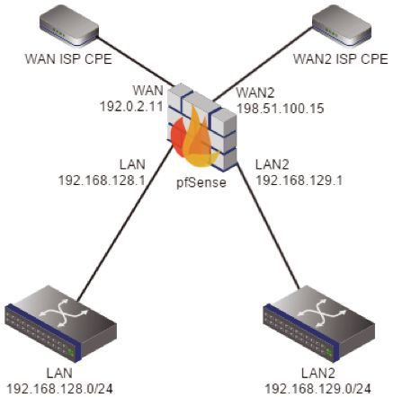
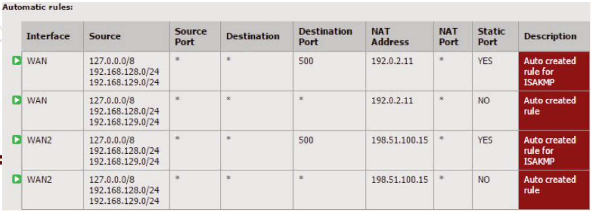
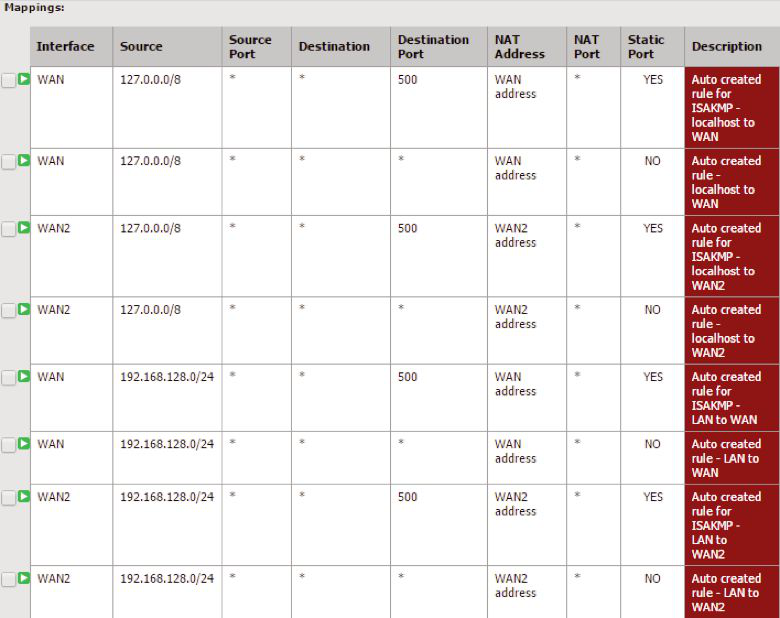
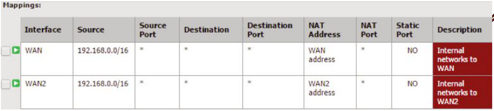
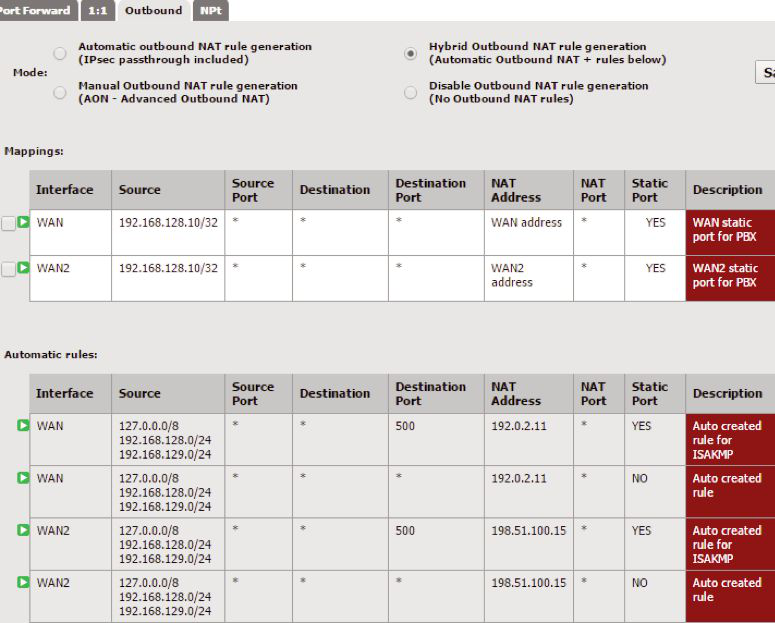
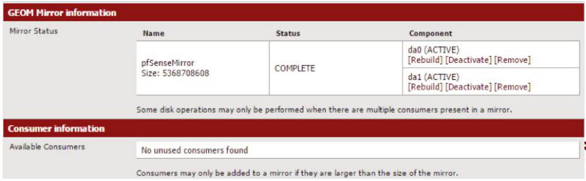
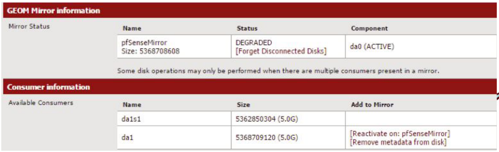
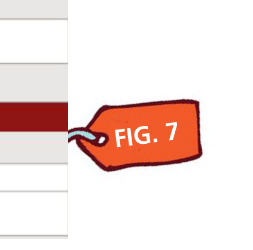

# pfSense：三小时之旅

- 原文标题：pfSense: A 3-Hour Tour
- 作者：**Chris Buechler 和 Jim Thompson**

FreeBSD 结合其各类 Ports，能打造出与商用产品相当、有时甚至更胜一筹的防火墙方案。但自行搭建的潜在缺点在于，手动配置底层各种组件需要跨越学习曲线。所需的知识基础让大多数人难以构建和维护这样的方案。还需要大量“胶水代码”把各组件粘合起来协同工作。十多年来 pfSense® 软件一直在填补这一空白。pfSense 软件让每位能管理典型商用级防火墙的 IT 专业人士都能用上 FreeBSD 防火墙。pfSense 软件一切通过易用的 Web 界面管理，类似 Cisco ASA、Watchguard、Sonicwall 等产品的 GUI。pfSense 项目之于网络安全和 FreeBSD，就像 FreeNAS 之于网络附属存储和 FreeBSD。十年来我们已增长至 30 万已知在线安装。

我们的用户群起初主要由对底层组件一无所知或所知甚少的用户构成，但近几年情况大变。项目起步时，我们常要向新用户解释 FreeBSD 不是 Linux——其实它更好。随着我们壮大，一些高水平的 BSD 系统管理员对用 GUI 管理防火墙嗤之以鼻。如今许多专家已认识到 pfSense 软件的价值和节省的时间。

要知道把各组件粘合在一起的胶水对新用户来说难以驾驭，即便对最资深的专家也可能令人望而生畏。举个常见例子：动态 IP 互联网连接。根据所配置的子系统，IP 变化时可能要做几件事：动态 DNS 更新；清除前一 IP 的防火墙和 NAT 状态缓存；更新部分服务的配置文件以反映新 IP；随后重启受影响的服务。原生 BSD 系统没有简便机制处理这类情况，更不用说全自动完成。即便是资深系统管理员也欣赏能让初级员工轻松管理的防火墙。没了凌晨三点的故障电话，系统管理员也能少些怨气。

pfSense 软件 2.2 版本是 15 个月开发努力的结晶，覆盖诸多领域。本文介绍 2.2 版本中最重要的变化。

## 基础操作系统升级

开源模式下，发行版（下游）通常滞后于单个软件组件（上游）。pfSense 历来也如此。pfSense 软件 2.1 版于 2013 年 9 月 15 日发布。2.1 及其后续版本基于 FreeBSD 8.3（2012 年 4 月发布）。我们虽然回移了一些较新的驱动，硬件支持优于原版 FreeBSD 8.3，但 FreeBSD 8.3 已于 2014 年 4 月 30 日停止官方支持，远早于 pfSense 2.2 发布。

为改善这一状况，本次开发期间我们跟踪 FreeBSD 10-STABLE，再到 10.1 的 BETA、RC 直至 RELEASE。pfSense 2.2 发布时已赶上最新 FreeBSD 版本，我们也在努力简化未来版本中更换基础操作系统版本的流程。未来你会看到我们与 FreeBSD 最新版本保持更紧密同步。

FreeBSD 10.1 带来若干技术改进。我们社区最感兴趣的是 pf 的改进。FreeBSD 开发者 Gleb Smirnoff 让 FreeBSD 10 中的 pf 支持 SMP。pf 现在支持细粒度锁，能更好地利用多核机器上的 CPU。我们乐于利用开源带来的好处，也乐于贡献，所以我们让 pf 更快。我们与 FreeBSD 开发者 George Neville-Neil 一起开始调查如何进一步提升 pf 性能。第一个成果是：我们注意到 Jenkins 哈希（FreeBSD 10 中新增）占用了处理每个数据包相当可观的时间。把 Jenkins 哈希换成 xxhash（<https://code.google.com/p/xxhash/>）后，在 Intel `ixgbe(4)` 网卡上跑 null pf 测试用例（最坏情况）性能提升 3%。我们怀疑其他硬件会有更高的性能提升，因为测试所用硬件上 `ixgbe(4)` 的原始转发性能约为每秒 55 万个 64 字节包。

FreeBSD 10.1 改进了作为客户机的虚拟化支持，这也是我们的用户在 2.2 beta 和发布候选版中已享受数月的特性。虽然多年来它在大多数 hypervisor 上大多数场景下已工作得很好，但 10.1 首次为 Microsoft 的 Hyper-V 带来真正可靠的方案，少数用户也报告了 virtio 的改进。

10.1 中改进的 10Gb 网络驱动对我们的用户也是一大福音。

## IPsec 增强

互联网协议安全（IPsec）套件用于在 FreeBSD 和 pfSense 软件上实现虚拟专用网络。过去，系统和网络管理员不得不在所需安全级别和网络性能需求之间做选择。随着网络世界从 1Gb/s 向 10Gb/s、40Gb/s 及更快速度过渡，IPsec 加密构建模块也必须跟上步伐。

FreeBSD 基金会 与 Netgate 合作，由 FreeBSD 开发者 John-Mark Gurney 为 FreeBSD 加密框架添加 AES-CTR 和 AES-GCM 模式，包括利用 Intel AES-NI 指令的加速。AES-GCM 是一种认证加密算法，非常适合保护分片数据，因为它延迟最低、操作开销最小。

与此同期，FreeBSD 开发者兼 pfSense 软件开发者 Ermal Luci 更新了 FreeBSD IPsec 协议栈，支持 RFC 4106 和 RFC 4543，标准化了 GCM 在 IPsec 封装安全载荷（ESP）中的使用，以及在 IPsec ESP 和 AH 中的 Galois 消息认证码。

IPsec 的后端密钥守护进程从 `ipsec-tools`（racoon）换为 `strongSwan`。这样做的首要原因是纳入 IKEv2 支持，同时保留 IKEv1。我们考虑过 OpenBSD 的 OpenIKED，但没有简便方式同时为需要的人保留 IKEv1。`strongSwan` 支持 IKEv1 并完整实现 IKEv2。`strongSwan` 的 IKEv2 守护进程是多线程的（默认 16 线程）。使用 `strongSwan` 时，在合适的硬件上作为 VPN 网关最多可处理 2 万条并发 IPsec 隧道。`strongSwan` 在 IKEv1 和 IKEv2 上都支持椭圆曲线加密（ECDH 组和 ECDSA 证书与签名），可与 Microsoft 在 Windows Vista、7、8、Server 2008、2012 及更新版本上的 Suite B 实现互操作。

换用 `strongSwan` 的另一个好处是更灵活的调试日志配置。用 `ipsec-tools` 时我们只有两个选项——正常日志或调试日志。用 `strongSwan` 时有 16 个不同方面可单独配置日志级别。这有助于在排障时生成更有用的日志，而不会因为到处开调试日志而被噪音淹没。

二层隧道协议（L2TP）是行业标准隧道协议，用于在面向分组的介质上封装发送点对点协议（PPP）帧。由于 L2TP 不提供加密或认证，通常与 IPsec 组合使用。pfSense 软件 2.2 现已支持 L2TP/IPsec，可在安全 VPN 中便捷地传输非 IP 协议。

通过 IKEv2 和 L2TP/IPsec，我们新增了两种 VPN 选项，客户端已内置于 Windows Vista 及更新版本，和许多其他操作系统。希望这能彻底终结 PPTP——过去几个版本我们一直标着大大的红色安全警告，强烈建议用户改用真正安全的 VPN。“因为它内置于 Windows 所以好用”的最后一个理由也不复存在。

## DNS 解析器变更

防火墙上运行本地 DNS 解析器，在没有本地 DNS 服务器的网络中很有用：它提供本地 DNS 缓存，也能配置本地主机和域名覆盖以用于名称解析。pfSense 软件还能自动把 DHCP 租约及其关联主机名注册到 DNS 转发器中，对于最基础的网络，它能满足所有本地 DNS 需求，包括内部名称解析。我们 2.1.x 及更早版本使用 Dnsmasq 作为缓存 DNS 转发器，在“服务 > DNS 转发器”下配置。Dnsmasq 默认启用，使用系统配置的 DNS 服务器进行查询。Dnsmasq 严格来说是转发器，依赖递归 DNS 服务器进行查询。没有内部 DNS 服务器时，需要使用互联网上的 DNS 服务器（如 谷歌 public DNS 或 OpenDNS），或使用 ISP 的 DNS 服务器。

Unbound 能进行递归且默认启用，因此不依赖特定的 DNS 服务器列表。跟随 FreeBSD 10 的脚步，pfSense 2.2 把新安装的默认 DNS 解析器改为 Unbound。从旧版本升级或把早期版本配置恢复到 2.2 的系统会保留旧行为，继续使用 Dnsmasq 作为 DNS 转发器。Unbound 作为 DNS 解析器的好处包括：可扩展性更好、大缓存下性能更好、支持 DNSSEC，和能在 pfSense 平台上直接执行递归查询，而不必依赖其他外部 DNS 服务器。Unbound 在“服务 > DNS 解析器”下配置。

## 高可用

CARP、pfsync 和我们基于 XML-RPC 的配置同步组合起来，为 pfSense 软件提供高可用功能。这确保硬件故障或主备之间因任何原因网络中断时无缝切换。高可用也意味着更轻松、不中断的维护。借助高可用组件，防火墙集群可以逐节点升级而不中断服务。为协助这一过程，pfSense 软件 2.2 新增了维护模式。维护模式通过抬高 CARP 中的通告偏移值，防止系统进入主状态——除非备份系统不可达。这在需要让主系统保持备份状态时很有用，通常是因为主系统存在硬件问题或其他维护事项，需要先确认问题修复再让系统恢复服务。

## 出站 NAT 增强

出站 NAT 在流量离开特定接口时转换源 IP 和端口。最常见的是把内部 RFC 1918 私有 IP 段转换为公网 IP。pfSense 软件早期版本为出站 NAT 提供两种选项——自动和手动。

例如，考虑如下网络：两条互联网连接（WAN 和 WAN2）和两个内部网络（LAN 和 LAN2）（图 1）。

对该网络，默认自动出站 NAT 工作方式如下。从 LAN 或 LAN2 发出、经 WAN 离开的流量，源 IP 会被转换为 WAN 接口 IP。从 LAN 或 LAN2 发出、经 WAN2 离开的流量，源 IP 会被转换为 WAN2 的 IP。默认情况下，pfSense 会改写出站 NAT 流量的源端口，ISAKMP（UDP 端口 500）除外。在每个 WAN 只有单个公网 IP 的大多数环境中，这是期望行为。内部网络之间的流量不做 NAT。

对于使用自动出站 NAT 规则的模式，出站 NAT 配置屏幕上现在会在用户自定义的出站 NAT 规则下方列出自动规则（图 2）。

在每个 WAN 有多个公网 IP，或某些流量不能改写源端口的情况下，事情更复杂。此时可切换为手动模式，手动配置所有出站 NAT 规则。从自动切到手动出站 NAT 时，原本自动生成的完整规则集会被加入。但这份列表是静态的，此后需要手动维护。

图 3 底部被截断的是 LAN2 192.168.129.0/24 子网的条目，除源网络外与 LAN 的条目完全相同。

考虑新增第三个 LAN 网络（LAN3，网段 192.168.130.0/24），且规则允许该网络访问互联网。由于 LAN3 子网没有匹配的出站 NAT 规则，流量会以 RFC1918 源地址从 WAN 接口发出，连接会失败。

一种解决办法是为每个 WAN 复制现有的 LAN 或 LAN2 出站 NAT 规则，但更好的办法是放宽现有出站 NAT 规则的掩码，覆盖所有现有的内部 RFC1918 网络。

由于内部客户端不太可能在不使用 NAT-T 的情况下使用 IPsec，多数情况下 ISAKMP 的静态端口规则也可安全移除。多数系统也不需要 127.0.0.0/8 作为源。它存在是为了需要把服务绑定到 localhost 的场景。于是原来的 12 条出站 NAT 规则可缩减为仅 2 条，如图 4 所示。

这些仍是手动维护的规则。如果新增 192.168.0.0/16 之外的内部网络或新增互联网连接，仍需手动更新出站 NAT 规则。

pfSense 2.2 新增两种出站 NAT 模式——混合和禁用。“禁用出站 NAT”选项提供了一种快捷明了的方式禁用所有源 NAT。旧版本中要禁用 NAT 需开启手动出站 NAT 再删除所有自动生成的规则，这常常让用户困惑。pfSense 软件仅作为路由器用于严格私有地址空间或公网 IP 时，新选项提供了禁用 NAT 的直接手段。

混合出站 NAT 模式保留自动出站 NAT 的行为，但允许配置特定的出站 NAT 规则，这些规则在自动生成的规则之前求值。常见的有用场景是 VoIP PBX 需要使用静态端口。静态端口禁用出站 NAT 中的源端口改写。多数情况下 VoIP 用默认值即可；但与某些供应商或配置组合时，改写源端口会导致通话无声或单侧无声。旧版本中，这一需求让用户从此不得不手动维护整个出站 NAT 配置。在 2.2 中，只需使用混合出站 NAT，为 PBX 在每个 WAN 上加一条出站 NAT 规则，其余留给自动管理的默认值即可。举个例子，假设 PBX 位于 LAN 的 192.168.128.10，需要在其所有流量离开 WAN 和 WAN2 时启用静态端口。

如图 5 所示，“WAN PBX 静态端口”规则应用于所有源自 192.168.128.10（IPv4 中 /32 掩码表示单个 IP）、经 WAN 出去的流量。WAN2 上的“WAN2 PBX 静态端口”规则同理。其余流量仍回落到自动规则，由其继续自动管理。

## 软件包系统

安全领域公认软件包签名至关重要。没有签名，单个镜像服务器被攻破后，其上的数据可被篡改——也许会被植入恶意编译的程序版本。使用该镜像更新的所有系统都会下载并安装被篡改的程序，且无法检测到修改。

我们从项目早期就采取了一些措施缓解此问题，包括只在完全受控的系统上托管软件包文件，不使用镜像。最近我们又改为通过 HTTPS 获取软件包文件。pfSense 2.2 中，软件包只从我们完全受控的服务器拉取，仅使用 HTTPS，且必须有有效签名。我们的基本系统稳定版更新一向有签名，系统默认拒绝没有正确签名的更新。

## 翻译

我们 2.1 版为翻译到其他语言加入了 gettext 支持。2.1x 版本中唯一完成的翻译是葡萄牙语。多亏社区贡献者，pfSense 2.2 新增了日语和土耳其语翻译。我们最近还上线了一台翻译服务器 <https://translate.pfsense.org>，欢迎多语言社区成员为其他语言的翻译贡献力量。

## GEOM 镜像

在我们的安装器中使用 GEOM 镜像做软件 RAID 已有一段时间，2.2 在这方面带来了管理增强。Web 界面中“诊断 > GEOM 镜像”下新增了 GEOM 镜像诊断界面（图 6），可以管理软件 RAID 镜像而无需通过 SSH 手动运行命令。

我们收到的一项用户请求是断开镜像。该请求通常来自那些在升级系统前需要额外保险步骤的用户。点击“停用”链接即可断开镜像，升级只影响其中一块盘。

“重新激活”链接（图 7）随后会把磁盘重新加入镜像并同步，完全恢复镜像。

这一变化还带来额外好处：磁盘故障后恢复时，换下故障盘并重启系统。系统启动后，进入“诊断 > GEOM 镜像”点击“忘记已断开连接的磁盘”（图 8）。（故障盘不会回到镜像中。）注意此后状态不再显示降级，因为镜像只剩单个成员。在新盘上点击“加入镜像”下的链接（图 9）即可让新盘成为镜像成员。

点击“确认”以确认新盘加入镜像。新盘同步完成前，镜像状态会回到降级。同步完成后，GUI 会显示正常状态。

镜像状态监控也已加入。检测到镜像降级时会发出通知。与所有系统通知一样，可通过“系统 > 高级”的“通知”标签下的配置参数，通过电子邮件或 Growl 通知发送。

## WiFi 改进

FreeBSD 10 还带来了改进的 802.11n WiFi/WLAN 无线网络栈，支持新特性和新驱动（如 Qualcomm 的 Atheros PCI/PCIe 802.11n WiFi 适配器、SMP/并发竞态、802.11n 发送聚合）。

## 更多变化

系统中许多部分还有数百处较小的改动。完整列表见：<https://doc.pfsense.org/index.php/2.2_New_Features_and_Changes>

## 开源可持续性

开源项目可持续性有两种观点。一种认为项目要可持续必须有贡献者，代码库需要不断演进。用户（作为志愿者）对开源项目也至关重要——他们提出需求和参与测试。另一种观点认为可持续的开源项目是能自给自足的项目，简而言之，能承担自身持续开销。这些开销包括基础设施成本（如托管和服务支持），也包括开发、更新和维护代码库的成本，还可能包括项目治理、营销和沟通的成本。

多年来 pfSense 项目靠捐赠和出售支持服务维持。过去一年中，我们采取了大幅提升 pfSense 项目可持续性的措施。这些措施包括推出“pfSense Gold”高级会员订阅，包含 PDF、mobi、epub 格式的电子书、AutoConfigBackup 安全云备份服务、与 pfSense 开发者月度聚会等。我们还通过 store.pfsense.org 增加了硬件销售。最后，Netgate 现在直接支持项目，提供几乎所有基础设施资源，直接雇佣所有支持和开发人员，并为这个仍在成长的大型开源项目提供所需的管理和法律资源。

---

**Jim Thompson** 在 UNIX 世界里晃荡得太久了。他知道自己始于 1980 年在 Vax 11/780 上的 BSD Unix Release 4.0。他仍然觉得 `echo 'This is not a pipe.' | cat - > /dev/tty` 很有趣。1985 年他向自由软件项目提交了第一个补丁，那是 GNU Emacs 移植到 Convex 向量超算的工作。Jim 拒绝透露他的资历，事实上他可能根本没有任何资历。他与妻子 Jamie 和儿子 Hunter S. Thompson 住在德州奥斯汀附近一座设防的庄园里。他的邮箱是 jim at netgate.com。

**Chris Buechler** 是 pfSense 及其公司主体 Electric Sheep Fencing, LP 的联合创始人。他大约在 Thompson 开始用 BSD 时出生，如今已专业从事 UNIX 系统工作第三个十年，是近 15 年来坚定的 BSD 拥护者。他是《pfSense: The Definitive Guide》（pfSense 最权威、最受欢迎的文档来源）的作者之一，曾在美国、加拿大和欧洲的 20 多场会议上就安全与网络主题演讲。他住在德州奥斯汀一座显然没有设防的房子里，与妻子 Sarah 和两只猫为伴。可通过 cmb at pfsense.org 联系他。
