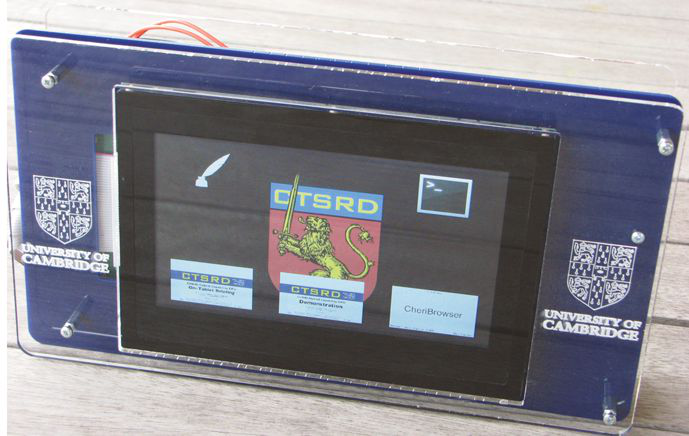
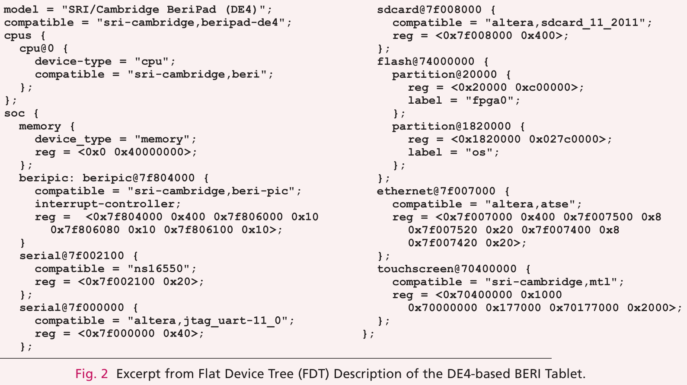
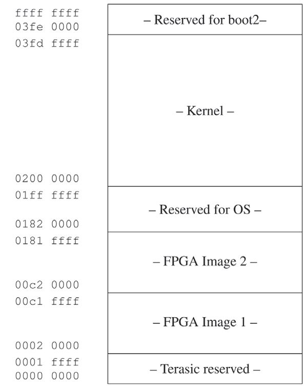
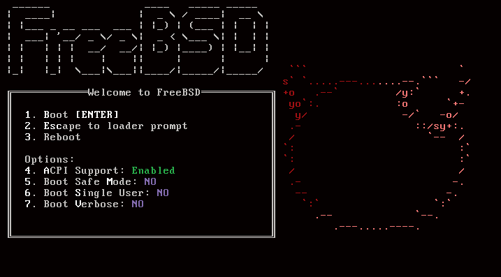
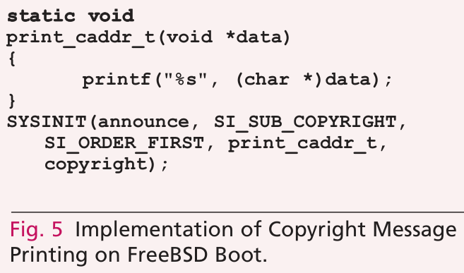
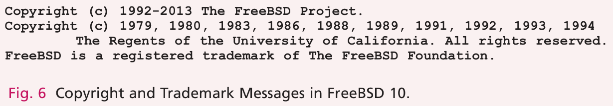
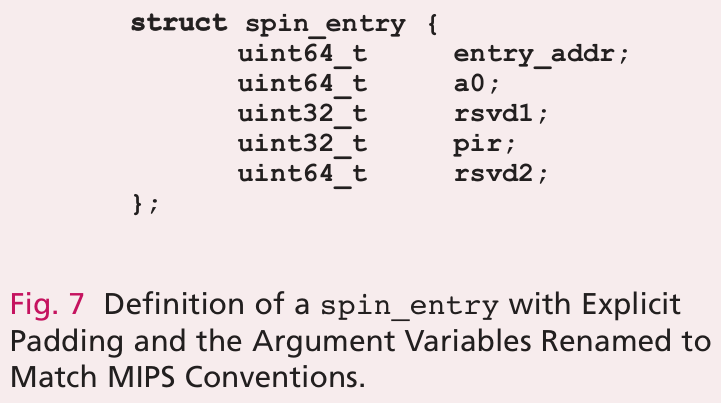

# 点亮 MIPS

- 原文：[Bringing Up MIPS](https://freebsdfoundation.org/our-work/journal/browser-based-edition/mips-and-arm64/)
- 作者：**Brooks Davis、Robert Norton、Jonathan Woodruff、Robert N. M. Watson**

将 FreeBSD 移植到新 CPU，即便是在此前已支持的家族内，也是一项重要工程。

希望本文能帮助有意移植的开发者在动手前找到方向。本文聚焦 MIPS 移植，但其他平台——尤其是 ARM——的代码结构与之相当类似。FreeBSD 最初是面向 Intel i386 类 CPU 的 386BSD 的分支，如今已被移植到多种架构，包括 AArch64、AMD x86_64（又称 amd64）、ARM、MIPS 和 PowerPC。x86 系统是相当同质的目标，具备检测并适配特定主板和外设配置的机制；而 ARM、MIPS 和 PowerPC 等嵌入式系统平台则丰富得多。移植到新的 MIPS 板通常需要为新的片上系统（SoC）或 CPU 类型添加支持，它们有着不同的中断控制器、总线和外设。即使 CPU 已获支持，启动加载器和相关的内核调用约定在不同板之间通常也差异显著。

我们已将 FreeBSD/MIPS 移植到 BERI——这是我们开发的、开源的、基于 FPGA 的 MIPS R4000 风格 [1] 软核处理器。这需要一系列工作，包括启动加载器支持、平台启动代码、一组设备驱动（含 PIC），以及将 FreeBSD 既有的 FDT 支持适配到 FreeBSD/MIPS。我们目前在仿真环境下、Terasic DE4 FPGA 板上的 Altera Stratix IV FPGA 上、Terasic SoCKit 板上的 Altera Cyclone V 上，以及 NetFPGA-10G 平台上的 Xilinx Virtex-5 FPGA 上运行 FreeBSD/BERI。我们的外设工作大部分在仿真和 DE4 平台上完成。FreeBSD BERI CPU 支持派生自 MALTA 移植，并借鉴了 SiByte 移植的部分思路。

基于在 BERI 上点亮 FreeBSD 的经验，我们记录了从 CPU 内嵌固件到用户空间的启动过程，为启动流程提供新视角，并帮助移植者对启动流程建立高层理解。

本文余下部分叙述启动过程，重点关注 BERI 需要定制的环节。为简洁起见，省略了启动的许多方面；其他不具平台或架构特性的方面也一并略去。某些平台特定的组件（如 MIPS pmap）不在本文讨论范围。目标是提供一份指南，帮助移植者在移植到一款新的、但相对常规的 MIPS CPU 时了解所需掌握的内容。对非常规 CPU 感兴趣的移植者，可参考 **mips/nlm** 和 **mips/rmi** 下的 NLM 和 RMI 移植，了解完整多核平台所需的更广泛修改实例。

关于启动流程的更多高层信息，参见《The Design and Implementation of the FreeBSD Operating System, Second Edition》第 15 章 [7]。

## BERIpad 平台

我们将 BERI 开发为可在硬件-软件接口上进行实验的平台，例如我们在 CHERI CPU 上围绕硬件支持的能力（capability）所开展的持续工作 [6]。我们的主要硬件目标是基于 Terasic DE4 FPGA 板、配 Terasic MTL 触摸屏和内置电池的平板。CPU 源码和平板设计已在 <http://beri-cpu.org> 开源。对 FreeBSD 支持的修改已合并入 FreeBSD。单处理器支持出现在 10.0 版本，多处理器支持将在未来版本中出现。该平板（图 1）和 BERI 的内部架构在《The BERIpad Tablet》[2] 中有详细描述。



我们为三个 Altera IP 核开发了设备驱动：JTAG UART（altera_jtag_uart）、三速 MAC（atse）和 SD 卡（altera_sdcard），分别实现底层 console/tty、以太网接口和块存储类。此外，我们为 Avalon 挂接的设备实现了通用驱动（avgen），允许对不带中断源的任意总线挂接设备进行内存映射——例如 DE4 LED 块、BERI 配置 ROM 和 DE4 风扇与温度控制块。

## 扁平设备树

BERI 主板配置的多数方面用扁平设备树（Flat Device Tree，FDT）描述，这在 PowerPC 和基于 ARM 的系统上很常见 [3]。目前，每个 FreeBSD 内核内嵌一个设备树二进制（DTB），描述特定的硬件配置。每个 DTB 由设备树编译器 `dtc.1` 从设备树语法（DTS）文件构建，再嵌入内核。图 2 节选自 **boot/fdt/dts/mips/beripad-de4.dts**——该 DTS 文件——包含 BERI CPU、1GB DRAM、可编程中断控制器（PIC）、硬件串口、JTAG UART、SD 卡读卡器、闪存分区表、千兆以太网和触摸屏。

```dts
model  =  "SRI/Cambridge  BeriPad  (DE4)";
compatible  =  "sri-cambridge,beripad-de4";
cpus  {
  cpu@0  {
    device-type  =  "cpu";
    compatible  =  "sri-cambridge,beri";
  };
};
soc  {
  memory  {
    device_type  =  "memory";
    reg  =  <0x0  0x40000000>;
  };
  beripic:  beripic@7f804000  {
    compatible  =  "sri-cambridge,beri-pic";
    interrupt-controller;
    reg  =  <0x7f804000  0x400  0x7f806000  0x10
             0x7f806080  0x10  0x7f806100  0x10>;
  };
  serial@7f002100  {
    compatible  =  "ns16550";
    reg  =  <0x7f002100  0x20>;
  };
  serial@7f000000  {
    sdcard@7f008000  {
      compatible  =  "altera,sdcard_11_2011";
      reg  =  <0x7f008000  0x400>;
    };
    flash@74000000  {
      partition@20000  {
        reg  =  <0x20000  0xc00000>;
        label  =  "fpga0";
      };
      partition@1820000  {
        reg  =  <0x1820000  0x027c0000>;
        label  =  "os";
      };
    };
    ethernet@7f007000  {
      compatible  =  "altera,atse";
      reg  =  <0x7f007000  0x400  0x7f007500  0x8
               0x7f007520  0x20  0x7f007400  0x8
               0x7f007420  0x20>;
    };
    touchscreen@70400000  {
      compatible  =  "sri-cambridge,mtl";
      reg  =  <0x70400000  0x1000
               0x70000000  0x177000  0x70177000  0x2000>;
      compatible  =  "altera,jtag_uart-11_0";
      reg  =  <0x7f000000  0x40>;
    };
  };
};
```

图 2：基于 DE4 的 BERI 平板 FDT（扁平设备树）描述节选。



## 早期启动序列

FreeBSD 通用启动序列始于 CPU 固件安排运行 FreeBSD 的 boot2 第二阶段启动加载器，后者再加载 **/boot/loader**，加载器再加载内核和内核模块。这引出内核启动，详见本文后续“通往用户态之路”一节。

### Miniboot

上电或复位后，CPU 将至少一个硬件线程的程序计数器设为有效程序的地址。从程序员角度看，这一过程如何发生本质上是魔法，并无特别重要性。通常，起始地址是某种只读或可闪存升级的固件，用于早期 CPU 设置，可能还处理重置缓存状态、暂停主线程以外的线程直到操作系统准备好处理它们等细节。在许多系统中，该固件还负责规避 CPU 的 bug。

在 BERI 上，此代码在物理硬件上称为 miniboot，在仿真中称为 simboot。Miniboot 编译进 FPGA 位流文件，作为只读 BRAM。它负责将寄存器设为初始值、建立初始栈、通过使内容失效来初始化缓存、为多处理器（MP）启动建立自旋表，以及从闪存加载下一阶段加载器或内核，或等待其通过调试单元加载并执行。在 BERI 上，我们幸运地无需在固件中规避 CPU bug，因为可以直接修复硬件。

Miniboot 的内核加载和启动行为由 DE4 上的两个 DIP 开关控制。若 DIP0 关闭，或 miniboot 以 `-DALWAYS_WAIT` 编译，则在循环中自旋，等待通过 JTAG 将 MIPS-ISA 通用寄存器 t1 设为 0。这让用户可以控制处理器何时开始执行，给用户机会在启动继续前直接将内核加载到 DRAM。DIP1 控制从闪存重定位内核。若 DIP 开关设为开启，内核从闪存 0x2000000 偏移加载到 DRAM 的 0x100000。否则，用户必须按《BERI Software Reference》[5] 所述通过调试单元加载内核。

内核只加载到硬件线程 0。在其他硬件线程上，miniboot 进入循环，等待操作系统通过自旋表提供内核入口点。多线程和多核配置下的启动在本文后续“多处理器支持”一节讨论。

miniboot 进入内核前，会清零大多数寄存器，将 a0 设为 argc，a1 设为 argv，a2 设为 env，a3 设为系统内存大小。实际上 argc 为 0，argv 和 env 为 NULL。然后它假设 0x100000 处有一个 ELF64 对象，从 ELF 头加载入口点并跳转。

我们希望 miniboot 保持精简，但也要足够灵活，以支持调试各种启动布局，以及加载自包含二进制等替代代码。这为可能不具备生成新硬件镜像条件的软件开发者提供了最大灵活性。

### boot2

在大多数 FreeBSD 系统上，架构相关启动代码与内核之间还插入了两个启动阶段。第一个是 boot2，即第二阶段引导（`boot.8`）；boot2 具备访问本地存储的机制，并具备对有限文件系统集合（目前为 UFS 或 ZFS）的只读访问代码。它的主要职责是加载加载器并向其传递参数。默认加载 **/boot/loader**，但用户可指定替代的磁盘、分区和路径。boot2 也可直接启动内核。

我们将 boot2 移植到 BERI，创建了三个微驱动——支持 JTAG UART 控制台访问，以及使用 CFI 或 SD 卡加载 **/boot/loader** 或内核。这些微驱动替代了 x86 上由 BIOS 或 SPARC 上由 OpenFirmware 提供的启动设备驱动。它还支持跳转到通过 JTAG 加载的 **/boot/loader** 实例。在当前实现中，boot2 链接到与内核相同的地址，从 CFI 闪存加载，从而可与未修改的 miniboot 配合使用。未来，我们计划将类似的 boot2 版本放在 0x03fe0000，这是为其保留的 128K 区域。这将允许从 0x1820000 起在 CFI 闪存中放置正常文件系统，其中可能包含完整启动加载器、内核等。目前，我们用 boot2 重定位嵌入 CPU 镜像的 FDT，并从 SD 卡加载 **/boot/loader**，这提供了一种更接近传统桌面/服务器平台而非传统嵌入式目标的体验。



存在多个针对不同架构的 boot2 版本。BERI 中的 boot2 派生自 x86 boot2，并（略微）比针对空间更受限的嵌入式架构的版本功能更丰富。目前 boot2 实现的多样性超过了必要程度，主要是移植早期过度复制和修改代码所致。

### loader

第三个常见启动阶段是 `loader.8`。加载器实际上是一个小型内核，其主要职责是为内核准备环境，然后从磁盘或网络加载内核和任何已配置的模块。加载器包含基于 FICL（<http://ficl.sourceforge.net>）的 Forth 解释器。该解释器用于提供图 4 所示的启动菜单；它解析 **/boot/loader.conf** 等配置文件，并实现 `nextboot.8` 等功能。为此，加载器还包含访问平台特定设备的微驱动，以及具备只读和有限写支持的 UFS 和 ZFS 实现。在 x86 系统上意味着 BIOS 或 UEFI 磁盘访问，配合 pxeloader 通过 PXE 进行网络访问。在 BERI 上，目前包含一个用于访问 DE4 上 CFI 闪存的基础微驱动。



我们已将加载器移植到 FreeBSD/MIPS，并与 boot2 共享 SD 卡和 CFI 微驱动，以允许从 CFI 闪存或 SD 卡加载内核。目前我们从 SD 卡加载内核。希望最终为板载以太网设备添加驱动，以便从网络加载内核。

加载器到内核的转换与 miniboot 大致相同。内核被加载到内存中的预期位置，解析 ELF 头，参数装入寄存器，加载器跳入内核。

## bootinfo 结构

为便于在 boot2、**/boot/loader** 和内核之间传递信息，指向 bootinfo 结构的指针允许共享内存大小、启动介质类型和预加载模块位置等信息。当 boot2 检测到时，重定位的嵌入式 FDT 副本在内存中的位置也会出现在 bootinfo 中。

## 通往用户态之路

本节从 MIPS 移植者的视角，叙述 FreeBSD 启动过程中值得关注的环节。

### 早期内核启动

FreeBSD MIPS 内核从 **mips/mips/locore.S** 中定义的 `_locore` 函数的 `_start` 进入；`_locore` 执行 MIPS CP0 寄存器的部分早期初始化，建立初始栈，并调用 `platform_start` 中平台特定的启动代码。在 BERI 上，`platform_start` 保存加载器传入的参数列表、环境和指向 `struct bootinfo` 的指针。BERI 内核还支持一种较旧的启动接口，其中内存大小作为第四个参数（直接来自 miniboot）传入。然后它调用通用 MIPS 函数 `mips_postboot_fixup`，为手动加载的内核提供内核模块信息，并在需要时修正 `kernel_kseg0_end`（内核空间中首个可用地址）。接着通过 `mips_pcpu0_init` 为启动 CPU 初始化每 CPU 存储。由于 BERI 使用扁平设备树来配置其他不可发现的设备，`platform_start` 随后定位 DTB 并初始化 FDT。这是 ARM 和 PowerPC 移植的常态，但目前 MIPS 移植上还不常见。我们预计它会随时间推移变得更普遍。`platform_start` 函数随后调用 `mips_timer_early_init` 设置系统定时器常量，目前硬编码为 100MHz——尽管最终会来自 FDT。控制台通过 `cninit` 设置，并打印一些调试信息。实际内存的页数存入全局变量 `realmem`。然后调用 BERI 特定的 `mips_init` 函数，执行剩余的大部分早期设置。

BERI 的 `mips_init` 相当典型。首先，配置与内存相关的参数，包括规划物理内存范围，并在通用函数 `init_param1` 和 `init_param2` 中设置若干自动调整的参数。MIPS 函数 `mips_cpu_init` 执行一些可选的每平台设置（BERI 上无操作），识别 CPU，配置缓存，清空 TLB。调用 MIPS 版本的 `pmap_bootstrap` 初始化 pmap。线程 0 由 `mips_proc0_init` 实例化，它还为动态每 CPU 变量分配空间。早期互斥锁（包括遗留的 Giant 锁）在 `mutex_init` 中初始化，调试器在 `kdb_init` 中初始化。若如此配置，内核现在可能进入调试器，或更常见地返回并继续启动。

最后调用 `mips_timer_init_params` 完成定时器基础设施的设置，随后 `platform_start` 返回 `_locore`，后者切换到现已配置好的 thread0 栈，调用 `mi_startup`，永不返回。

### 调用所有 SYSINITS

`mi_startup` 的职责是按正确顺序初始化所有内核子系统。历史上，`mi_startup` 被称为 `main`，初始化顺序硬编码。这显然不可扩展，因此创建了更动态的注册机制 `SYSINIT.9`。任何需要在启动时运行的代码都可以使用 `SYSINIT` 宏，让函数在排序后的顺序中被调用以启动或加载模块。sysinit 实现依赖链接器集合特性，内核子系统和模块的构造/析构函数在 ELF 二进制中被标记，以便内核链接器能在启动、模块加载、模块卸载和内核关机时找到它们。

`mi_startup` 的实现很简单。它对 sysinit 集合排序，然后依次运行每个，完成时标记为已完成。若任何 sysinit 加载了模块，则重新排序整个集合并从头开始，跳过已运行的条目。`mi_startup` 末尾包含调用 `swapper` 的代码，但永远不会到达——因为最后一个 sysinit 永不返回。`mi_startup` 中一个值得注意的实现细节是使用冒泡排序对 sysinit 排序，因为分配器是通过 sysinit 初始化的，此时还不可用。

图 5 展示了一个简单的 sysinit 示例。此示例中，`announce` 是单个 sysinit 的名称，`SI_SUB_COPYRIGHT` 是子系统，`SI_ORDER_FIRST` 是子系统内的顺序，`print_caddr_t` 是要调用的函数，`copyright` 是传给函数的参数。完整的子系统和子系统内顺序列表见 **sys/kernel.h**。截至本文撰写时已有 80 多个。大多数没有或几乎没有架构特定功能，因此不在本文范围内。我们重点介绍有显著移植特定内容的 sysinit。



第一个值得关注的 sysinit 是 `SI_SUB_COPYRIGHT`。它本身不需要移植，但到达它并看到输出意味着架构移植接近完成，因为这意味着底层控制台工作，且上述初始启动完成。MIPS 移植在启动早期有一些调试输出，但在成熟平台上版权信息是内核的首条输出。图 6 展示了在 `SI_SUB_COPYRIGHT` 打印的三条消息。



移植者下一个关注的 sysinit 是 `SI_SUB_VM`。MIPS `bus_dma.9` 实现以一组静态分配的映射起始，以允许在启动早期使用。函数 `mips_dmamap_freelist_init` 在 `SI_SUB_VM` 将静态映射加入空闲列表。ARM 平台做类似工作，但确实需要 malloc，因此在 `SI_SUB_KMEM` 运行 `busdma_init`。

进一步的 `bus_dma.9` 初始化在 `SI_SUB_LOCK` 阶段的平台特定但通常相同的 `init_bounce_pages` 函数中进行。它初始化一些计数器、列表和 bounce-page 锁。

所有移植在 `SI_SUB_CPU` 调用平台特定的 `cpu_startup` 函数，设置内核地址空间，并执行一些初始缓冲区设置。许多移植还执行主板、SoC 或 CPU 特定的设置，如初始化集成 USB 控制器。移植通常打印物理和虚拟内存详情，用 `vm_ksubmap_init` 初始化内核虚拟地址空间，用 `bufinit` 初始化 VFS 缓冲系统，用 `vm_pager_bufferinit` 初始化交换缓冲列表。在 MIPS 上，还会调用平台特定的 `cpu_init_interrupts` 初始化中断计数器。大多数平台有自己的 `sf_buf_init` 例程，用于分配 `sendfile.2` 缓冲并初始化相关锁。这些实现大多相同。

总线层级建立和设备探测在 `SI_SUB_CONFIGURE` 阶段（又称自动配置）进行。此阶段的平台特定部分包括：在 `SI_ORDER_FIRST` 调用的 `configure_first` 函数，将 nexus 总线附接到设备树根；在 `SI_ORDER_THIRD` 运行的 `configure`，调用 `root_bus_configure` 探测并附接所有设备；以及在 `SI_ORDER_ANY` 运行的 `configure_final`，用 `cninit_finish` 完成控制台设置并清除 `cold` 标志。在 MIPS 和其他一些平台上，`configure` 还调用 `intr_enable` 启用中断。许多控制台驱动在 `SI_SUB_CONFIGURE` 通过显式 sysinit 完成设置，许多子系统（如 CAM 和 `acpi.4`）在此进行初始化。

每个平台在 `SI_SUB_EXEC` 注册其支持的二进制类型。这主要包括注册预期的 ELF 头值。在单处理器 MIPS 上，这是最后一个平台特定的 sysinit。

最后一个 sysinit 是在 `SI_SUB_RUN_SCHEDULER` 调用调度器函数，尝试换入进程。由于 `init.8` 此前由 `SI_SUB_CREATE_INIT` 的 `create_init` 创建，并由 `SI_SUB_KTHREAD_INIT` 的 `kick_init` 设为可运行，启动调度器后即进入用户态。

## 多处理器支持

多处理器系统遵循与单处理器系统相同的启动流程，只是增加了若干 sysinit 以启用并开始调度其他硬件线程。这些线程称为应用处理器（AP）。

第一个 MP 特定 sysinit 是在 `SI_SUB_TUNABLES` 调用 `mp_setmaxid`，初始化 `mp_ncpus` 和 `mp_maxid` 变量。通用 `mp_setmaxid` 函数调用平台特定的 `cpu_mp_setmaxid`。在 MIPS 上，`cpu_mp_setmaxid` 调用架构特定的 `platform_cpu_mask`，用所有可用核心或线程的掩码填充 `cpuset_t`。BERI 的实现从 DTB 提取核心列表，并验证它们支持自旋表启用方法。它还进一步验证自旋表条目已正确初始化，或该线程被忽略。

AP 的初始化由 `SI_SUB_CPU` 阶段 `cpu_startup` 之后调用的 `mp_start` 函数完成。若有多个 CPU，它调用平台特定的 `cpu_mp_start`，返回后打印一些 CPU 信息。MIPS 的 `cpu_mp_start` 实现遍历 `platform_cpu_mask` 报告的有效 CPU ID 列表，尝试启动除自己（由 `platform_processor_id` 确定）以外的每一个，使用平台特定的 `start_ap`。移植特定的 `platform_start_ap` 的职责是让 AP 运行平台特定的 `mpentry`。成功运行时，它递增 `mp_naps` 变量，`start_ap` 在放弃前为每个 AP 最多等待五秒。

实现了多种机制指示 CPU 开始运行特定代码。在 BERI 上，我们选择实现 ePAPR 1.0 规范 [3] 中描述的自旋表方法，因为它极其简单。自旋表方法要求每个 AP 在地址空间某处有关联的 `spin_entry` 结构，且该地址记录在 DTB 中。BERI 特定的 `struct spin_entry` 定义见图 7。启动时，每个 AP 的 `entry_addr` 成员初始化为 1，AP 等待 LSB 被设为 0——届时跳转到 `entry_addr` 中加载的地址，并在寄存器 a0 中传入 a0。我们用 miniboot 中的循环实现等待 `entry_addr` 变化。在 BERI 的 `platform_cpu_mask` 中，我们查找与请求 AP 关联的 `spin_entry`，将 `pir` 成员设为 CPU ID，然后将 `mpentry` 的地址赋给 `entry_addr` 成员。



MIPS 的 `mpentry` 实现是 **mips/mips/mpboot.S** 中的汇编。它禁用中断，建立栈，调用移植特定的 `platform_init_ap` 设置 AP，然后进入 MIPS 特定的 `smp_init_secondary` 完成每 CPU 设置并等待启动过程结束。典型的 MIPS `platform_init_ap` 实现设置 AP 上的中断，启用时钟和 IPI 中断。在 BERI 上，我们将 IPI 设置推迟到设备探测之后，因为我们的可编程中断控制器（PIC）作为普通设备配置，因此要到 `SI_SUB_CONFIGURE` 之后才能配置。

MIPS 特定的 `smp_init_secondary` 函数初始化 TLB，设置缓存，初始化每 CPU 区域，然后递增 `mp_naps` 让 `start_ap` 知道它已完成初始化。然后它自旋等待 `aps_ready` 标志递增，表示引导 CPU 已到达下文所述的 `SI_SUB_SMP`。在 BERI 上，它随后调用 `platform_init_secondary` 将 IPI 路由到 AP 并设置 IPI 处理程序。AP 然后将其线程设为每 CPU 空闲线程，递增 `smp_cpus`，在控制台宣布自身，若是最后一个启动的 AP，则设置 `smp_started` 通知 `release_aps` 所有 AP 已启动，并设置 `smp_active` 标志通知几个子系统正在多 CPU 上运行。除非它是最后一个启动的 AP，否则它会自旋等待 `smp_started`，然后启动每 CPU 事件定时器并进入调度器。

最后一个平台特定的 sysinit 子系统是 `SI_SUB_SMP`，平台特定的 `release_aps` 函数被调用，以在引导 CPU 上启用 IPI，通知此前已初始化的 AP 可以开始运行，并如上所述自旋直到它们开始运行。在 MIPS 情况下，这意味着原子地将 `aps_ready` 标志设为 1，并自旋直到 `smp_started` 非零。

## 关于 IPI 的话

在多处理器（MP）系统中，CPU 通过处理器间中断（IPI）相互发信号。存在多种 IPI 机制，FreeBSD MIPS 使用最简单的模型——每 CPU 的待处理 IPI 整数位掩码，以及移植特定的发送中断机制（几乎总是发到硬件中断 4）。这由 `ipi_send` 实现，公共函数 `ips_all_but_self`、`ipi_selected` 和 `ipi_cpu` 使用它。MIPS IPI 由 `mips_ipi_handler` 处理，它调用 `platform_ipi_clear` 清除中断，读取待处理 IPI 集合，并逐个处理。

在 BERI 上，IPI 使用 BERI PIC 的软中断源实现。IPI 由 `beripic_setup_ipi` 路由，由 `beripic_send_ipi` 发送，由 `beripic_clear_ipi` 清除。这些函数通过 `kobj.9` 经 **dev/fdt/fdt_ic_if.m** 中定义的 FDT_IC 接口访问。BERI PIC 的内部细节见《BERI Hardware Reference》[4]。

## 致谢

我们感谢同事——特别是 Jonathan Anderson、Ruslan Bukin、David Chisnall、Nirav Dave、Alexandre Joannou、Wojciech Koszek、Ben Laurie、A. Theodore Markettos、Ed Maste、Simon W. Moore、Alan Mujumdar、Steven J. Murdoch、Peter G. Neumann、Philip Paeps、Michael Roe、Colin Rothwell、Hans Petter Selasky、Stacey Son 和 Bjoern A. Zeeb。

本文批准公开发布；分发不受限制。本文开发由美国国防高级研究计划局（DARPA）在合同 FA8750-10-C-0237 下资助。本文中包含的观点、意见和/或发现仅代表作者，不应解释为国防部或美国政府的官方观点或政策。

## 参考资料

[1] Heinrich, J. MIPS R4000 Microprocessor User’s Manual, Second Edition. (1994)

[2] Markettos, A. T.; Woodruff, J.; Watson, R. N. M.; Zeeb, B. A.; Davis, B.; and Moore, S. W. The BERIpad tablet: open-source construction, CPU, OS and applications (<http://www.cl.cam.ac.uk/research/security/ctsrd/pdfs/2013terasic-beri-submitted.pdf>), Proceedings of 2013 FPGA Workshop and Design Contest, Southeast University, Nanjing, China. (November 1–3, 2013)

[3] Power.org, Power.org Standard for Embedded Power Architecture Platform Requirements (ePAPR). (2008)

[4] Watson, R. N. M.; Woodruff, J.; Chisnall, D.; Davis, B.; Koszek, W.; Markettos, A. T.; Moore, S. W.; Murdoch, S. J.; Neumann, P. G.; Norton, R.; and Roe, M. Bluespec Extensible RISC Implementation: BERI Hardware Reference (<http://www.cl.cam.ac.uk/techreports/UCAM-CL-TR-852.pdf>), Technical Report UCAM-CL-TR-852, University of Cambridge, Computer Laboratory. (April 2014)

[5] Watson, R. N. M.; Chisnall, D.; Davis, B.; Koszek, W.; Moore, S. W.; Murdoch, S. J.; Neumann, P. G.; and Woodruff, J. Bluespec Extensible RISC Implementation: BERI Software Reference (<http://www.cl.cam.ac.uk/techreports/UCAM-CL-TR-853.pdf>), Technical Report UCAM-CL-TR-853, University of Cambridge, Computer Laboratory. (April 2014)

[6] Woodruff, J.; Watson, R. N. M.; Chisnall, D.; Moore, S. W.; Anderson, J.; Davis, B.; Laurie, B.; Neumann, P. G.; Norton, R.; and Roe, M. “The CHERI Capability Model: Revisiting RISC in an Age of Risk,” in Proceedings of the 41st International Symposium on Computer Architecture (ISCA 2014). (June 2014)

[7] McKusick, M. K.; Neville-Neil, G. V.; Watson, R. N. M. The Design and Implementation of the FreeBSD Operating System, Second Edition, Boston, Massachusetts: Pearson Education. (September 2014)

---

**BROOKS DAVIS** 是 SRI International 计算机科学实验室的高级软件工程师，剑桥大学计算机实验室客座研究员。他自 1994 年起使用 FreeBSD，2001 年起成为 FreeBSD 提交者，2006 至 2012 年间是核心团队成员。他的计算兴趣涵盖安全、操作系统、网络、高性能计算，当然还包括寻找在所有这些领域使用 FreeBSD 的方式。

**ROBERT NORTON** 是剑桥大学博士生。他从事 CHERI CPU 项目，旨在通过硬件支持细粒度内存保护和隔离来提升应用安全性。他特别关注沙箱和安全域之间转换的方面。

**JONATHAN WOODRUFF** 是剑桥大学研究员。他是 BERI/CHERI 开源 CPU 的核心开发者，协助开发了用于内存安全和隔离的 CHERI ISA，以便实际硬件实现。他还从事 FPGA 上的大型处理器架构仿真。他支持 FPGA 支持的开源处理器研究，以实现可重现、全系统且延伸至定制硬件的研究。

**ROBERT N. M. WATSON** 博士是剑桥大学计算机实验室系统、安全与架构方向的大学讲师；FreeBSD 开发者和核心团队成员；FreeBSD 基金会理事会成员。他领导多个跨层研究项目，跨越计算机架构、编译器、程序分析、程序转换、操作系统、网络和安全。近期工作包括 Capsicum 安全模型、用于 Junos 和 Apple iOS 等系统沙箱的 MAC Framework，以及 FreeBSD 网络栈中的多线程。他是《FreeBSD 操作系统设计与实现》（第二版）的合著者。