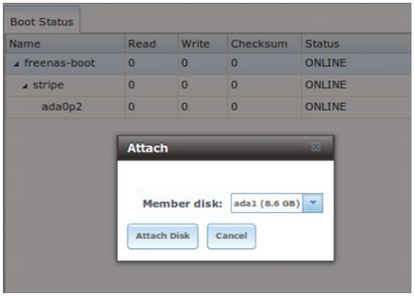
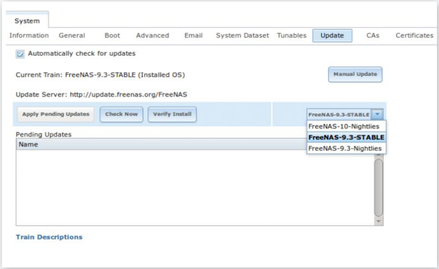
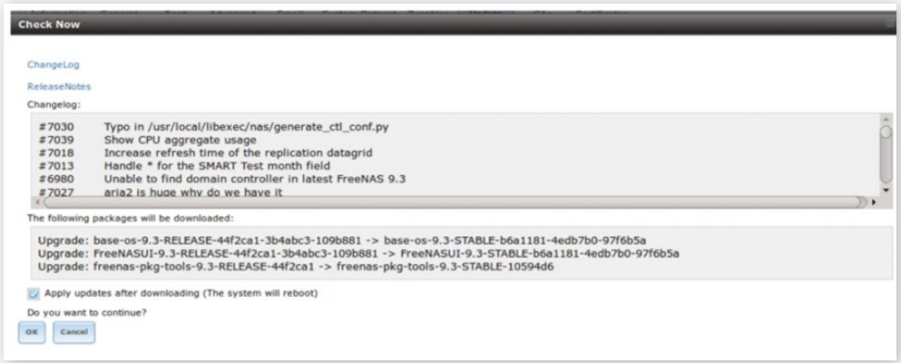
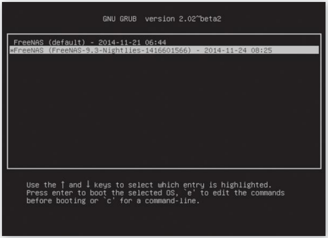
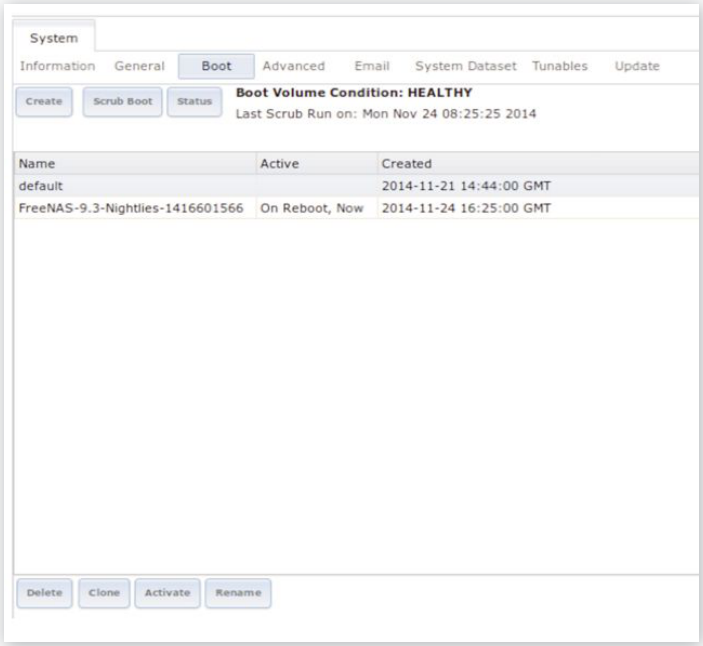
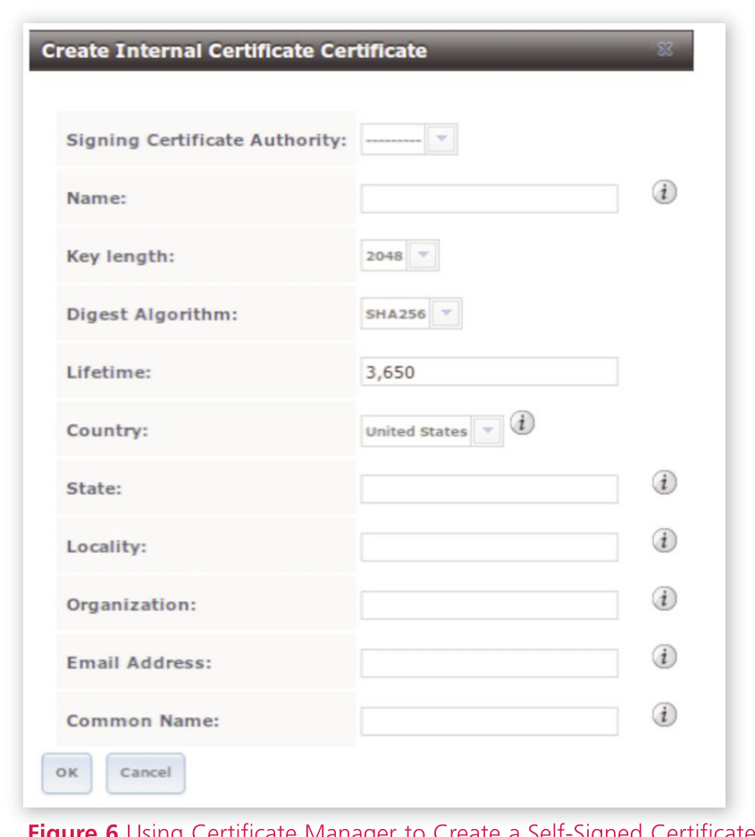
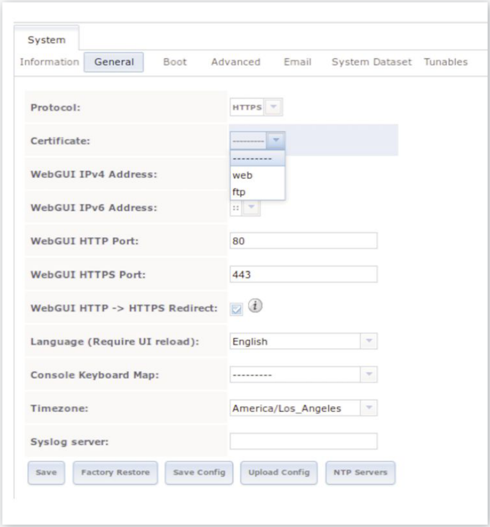
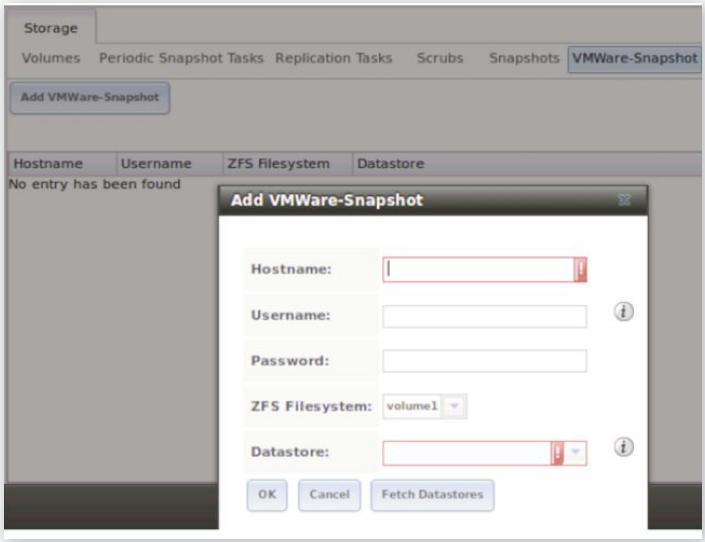

# FreeNAS 9.3 新功能

- 原文：[What’s New in FreeNAS 9.3](https://freebsdfoundation.org/our-work/journal/browser-based-edition/zfs-best-practices/)
- 作者：**Dru Lavigne**

FreeNAS 是开源、BSD 许可的网络附加存储（NAS）操作系统，基于 FreeBSD 构建。它使用 OpenZFS——ZFS 的开源版本——一种自我修复的文件系统，特别适合存储和保持所存数据的完整性。

FreeNAS 9.3 于 2014 年 12 月发布，新增若干特性，其中许多利用了 OpenZFS 和近期的 FreeBSD 优化。本文概述其中部分特性。FreeNAS、其特性、可用配置选项的更多信息请参阅 FreeNAS 9.3 用户指南（<http://doc.freenas.org/9.3>）。

## 启动设备上的 ZFS

FreeNAS 将启动设备（操作系统安装其上）与用于存储的磁盘分开。这意味着启动设备或操作系统本身出现问题不会影响存储磁盘上的数据，一旦启动设备或操作系统的问题解决，数据即可重新可用。传统上，FreeNAS 用 UFS 格式化启动设备，且不支持启动设备的镜像。虽然从故障的启动设备恢复很容易，但该操作确实会造成一些停机时间，用于发现故障、准备新启动设备并从中引导。

从 9.3 版本开始，FreeNAS 用 ZFS 格式化启动设备并支持镜像启动设备，使系统能在镜像中某个启动设备故障时继续运行。当前状态和启动设备数量可在 System -> Boot -> Status 中查看。随时可以点击同一屏幕中的“Attach”按钮并选择要添加的设备，将另一台启动设备作为镜像加入，如图 1 示例所示。

ZFS 的使用还提供了另一项特性：启动环境（boot environments），即对操作系统本身做快照、并引导进入先前版本操作系统的能力。此特性已集成到新的更新机制中，下一节介绍。

## 管理更新

从 9.3 版本开始，FreeNAS 不再通过点发布提供安全补丁、bug 修复、新驱动或其他类型的更新。取而代之的是，数字签名后的更新一俟可用即提供，管理员可灵活决定何时应用可用的更新。此外，更新机制允许管理员跟踪不同的“train”（发布/开发分支）。这让管理员可以“试驾”即将发布的版本，或应用当前 STABLE 分支中尚未提供的所需特性，同时仍可按需回滚到先前版本的操作系统。

图 2 给出了 System -> Update 屏幕的示例。在此示例中，系统当前运行 9.3 的 STABLE 版本，可用 train 如下：FreeNAS-10-Nightlies（跟踪即将推出、尚未发布的 10 alpha 版本）、FreeNAS-9.3-Nightlies（跟踪每日、可能未测试的变更）和 FreeNAS-9.3-STABLE（跟踪已测试的更新）。

选中 train 后，管理员可点击“Check Now”按钮查看该 train 是否有可用更新。图 3 展示了一次更新检查的结果示例，其中有若干可用更新。

在此示例中，Changelog 中以 # 开头的编号代表 bugs.freenas.org 上的 bug 报告编号。点击“ChangeLog”超链接可在网页浏览器中打开变更日志。点击“ReleaseNotes”超链接可在网页浏览器中打开 9.3 发行说明。

要下载并应用更新，点击“OK”按钮。另外，大多数更新在应用后需要重启。取消勾选“Apply updates after downloading.”框。这会指示系统仅下载更新。然后可以在对用户影响最小的时段，点击图 2 中所示的“Apply Pending Updates”按钮应用更新。

每次应用更新时，系统会自动为新更新的操作系统创建启动环境，并将其作为默认条目添加到启动菜单。在图 4 所示的示例中，默认版本的操作系统于 11 月 21 日安装，11 月 24 日应用了使用 9.3-Nightlies train 的更新。如果更新失败，或管理员希望返回先前版本的操作系统，只需重启并选择所需的启动环境引导进入即可。

## 启动管理器

除了系统更新器自动创建的启动环境，FreeNAS 9.3 还包含启动管理器，用于创建手动启动环境和清理旧的启动环境。此配置屏幕如图 5 所示，可从 System -> Boot 访问。

此屏幕显示启动卷的状态和上一次启动卷 ZFS scrub 的时间和结果。默认情况下，启动设备每 35 天 scrub 一次。点击“Scrub Boot”按钮立即 scrub 启动卷。要查看启动卷中设备的数量和各设备的状态，点击“Status”按钮。

如果高亮某个启动环境，你可以删除、克隆、激活（若当前未设为启动默认）或重命名它。如果启动卷空间紧张或已应用多次更新，可以删除多个未来不打算引导进入的旧启动环境。若要创建新环境，点击“Create”按钮并输入将出现在启动菜单中的名称。

## 配置向导

从 9.3 起，FreeNAS 提供了配置向导，在初次升级到或安装 9.3 版本后自动运行。该向导提供了一种高效的机制，可快速配置系统，以缩短从初次引导到通过网络提供数据的时间。它允许管理员：

- 配置系统的本地化、键盘映射和时区。
- 导入现有的 ZFS 存储池或创建新的 ZFS 存储池。
- 选择要附加的目录服务（Active Directory、LDAP 或 NIS）并提供所需凭证。
- 配置 CIFS（含访客访问）、AFP（含 Time Machine）、NFS 和 iSCSI 共享。每项共享配置应“开箱即用”，并可使用 FreeNAS 图形管理界面针对更复杂的场景进一步细调。
- 设置接收安全运行输出和管理告警的管理员电子邮件地址。
- 配置系统，可选地在屏幕底部显示控制台消息以便排查故障。

该向导可随时重新运行，使添加额外共享或目录服务变得轻而易举。向导执行的任何配置仍可使用 FreeNAS GUI 提供的配置屏幕查看和编辑。

## 证书管理器

FreeNAS 的许多服务支持使用证书加密。FreeNAS 9.3 提供了图形证书管理器，用于创建证书颁发机构、导入和创建证书、自签名证书、创建证书签名请求。该证书管理器集成到系统中，意味着所有添加的证书都可在支持加密的服务的配置屏幕中使用。

创建自签名证书就像填写图 6 所示屏幕中的信息一样简单。

图 7 展示了将图形管理界面配置为使用 HTTPS 的示例。在此示例中，已创建两个证书，分别用于 web 服务和 ftp 服务。见图 7。

## 改进的 iSCSI/虚拟化集成

迁移到内核 iSCSI 带来诸多性能改进，再加上对全部 VAAI（vStorage APIs for Array Integration）存储原语的支持，极大增强了 FreeNAS 与虚拟数据存储的集成。VAAI 是一种 API 框架，使某些存储任务（如精简配置）可以从虚拟化硬件卸载到存储阵列。9.3 支持以下 VAAI 原语：

- unmap：告知 ZFS 已删除文件所占用的空间应释放。没有 unmap，ZFS 无法感知通过 VMware 或 Hyper-V 等虚拟化技术释放的空间。

- atomic test and set：允许虚拟机仅锁定它正在使用的那部分 LUN，而非锁定整个 LUN，后者会阻止其他主机同时访问同一 LUN。

- write same：使用厚配置分配虚拟机时，所需的零写入在本地完成，而非通过网络，因此虚拟机创建速度快得多。

- xcopy：类似 Microsoft ODX，复制在本地完成而非通过网络。
- stun：若卷空间耗尽，此特性暂停所有运行中的虚拟机，以便在出现任何损坏之前修复空间问题。

- threshold warning：达到可配置容量时系统报告错误。在 FreeNAS 中，此阈值既可在 pool 级别也可在 zvol（device extent）级别配置。

- LUN reporting：LUN 报告其为精简配置。

此外，当 VMware 配置为数据存储时，ZFS 快照也能正确工作。FreeNAS 会在对支撑该 VMware 数据存储的 dataset 或 zvol 做 ZFS 快照之前，自动对所有运行中的 VMware 虚拟机做快照。这意味着生成的 ZFS 快照将包含一致的 VMware 快照。新的配置屏幕（位于 Storage -> VMWare-Snapshot，如图 8 所示）可用于配置数据存储。

## 其他特性

9.3 还加入了若干其他特性，包括：

- 一种新的共享类型 WebDAV，从网页浏览器或 webdav 客户端为指定卷或 dataset 提供经过认证的访问。这些共享上可选择配置加密或强制加密。
- 现已支持 Kerberized NFSv4。
- 加入 LLDP 服务，使用 IEEE 802.1AB 提供以太网设备发现。
- SSSD 服务的加入意味着支持多种目录服务。
- SNMP 现由 Net-SNMP 提供。
- 系统日志器已替换为 syslog-ng。
- 管理 sysctl、loader.conf 值和 rc.conf 值的能力已集成到同一配置屏幕（System -> Tunables）。
- 现在可通过图形界面完成 ZFS 存储池升级。告警系统会提示有较新的 OpenZFS feature flag 可用。
- Zvol 可通过图形界面扩容。LUN 现在可扩容而无需先断开 initiator 或停止 iSCSI 服务。
- Kerberos realm 和 Kerberos keytab 现可从图形界面配置，添加后即可在支持 realm 和 keytab 的目录服务配置屏幕中使用。

## 总结

FreeNAS 持续加入创新特性，使配置这款开源操作系统、并将其作为存储解决方案集成到任何规模的网络中比以往任何时候都更轻松。启动环境降低了更新操作系统的风险，更新机制则让应用更新的时机更加灵活。配置向导缩短了部署 FreeNAS 所需的时间，证书管理器让创建和管理证书变得容易。

本文未涵盖 FreeNAS 9.3 添加的全部特性和改进。新特性的更完整列表请参阅 9.3 发行说明和 FreeNAS 9.3 用户指南中的“What’s New in 9.3”章节。

**Dru Lavigne** 自 1997 年起将 FreeBSD 作为主要平台，是基于 FreeBSD 派生的 PC-BSD 和 FreeNAS 项目的首席文档撰写者。她是《BSD Hacks》《The Best of FreeBSD Basics》和《The Definitive Guide to PC-BSD》的作者。她是 BSD Certification Group Inc.（一家以制定 BSD 系统管理员认证标准为使命的非营利组织）的创始人兼现任主席，并担任 FreeBSD 基金会董事会成员。
