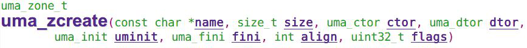
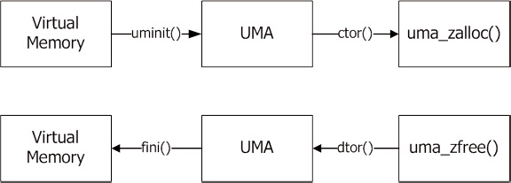
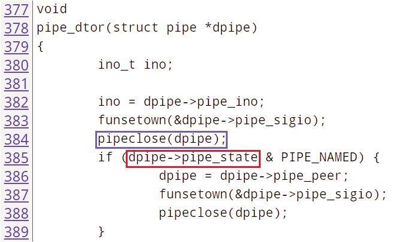
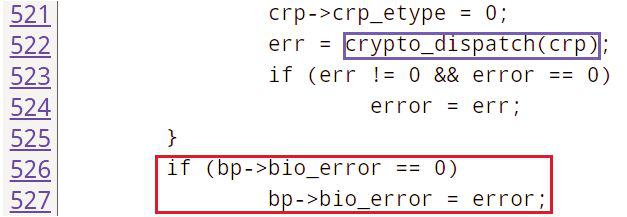
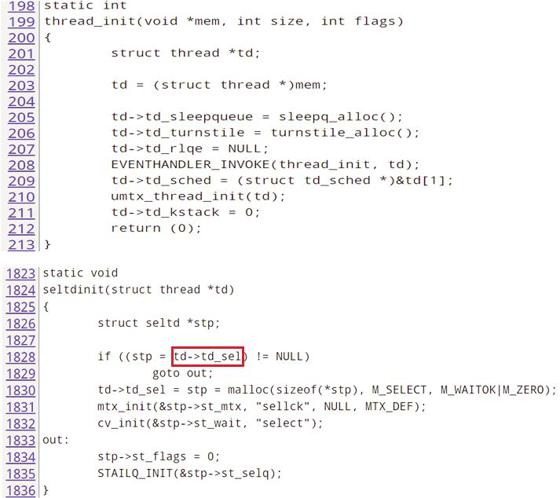
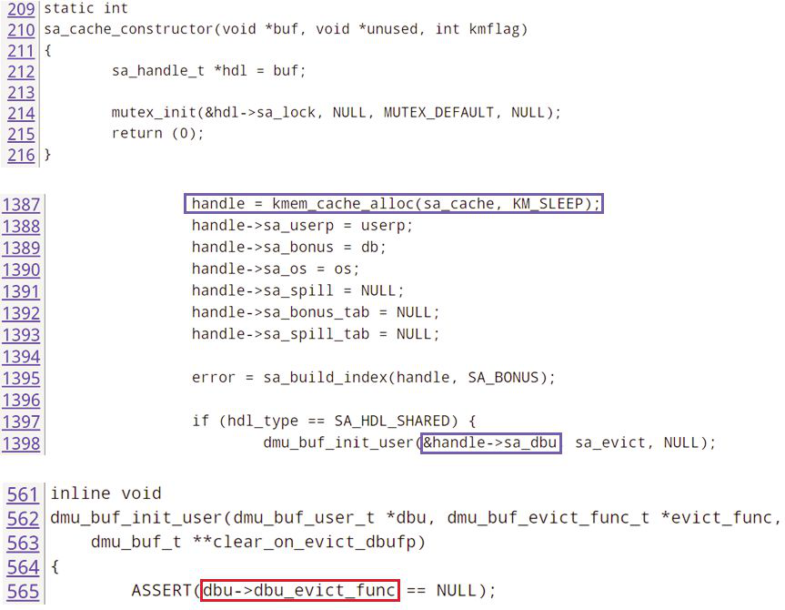

# 改进 FreeBSD 上 MemGuard 对 UMA 的支持

- 原文：[Improving MemGuard Support for UMA on FreeBSD](https://freebsdfoundation.org/our-work/journal/browser-based-edition/cloudabi/)
- 作者：**Luke Chang-Hsien Tsai**

## 1. 背景

FreeBSD 内核中有两种主要的动态内存分配方式：malloc type 与 UMA zone。malloc type 使用 `malloc()`、`realloc()` 与 `free()` 函数分配与释放内存，这些函数与用户态中的对应函数类似。UMA zone 比 malloc type 更灵活。实际上，任何 malloc type 都实现于某一 UMA zone 之中。

然而，在内核中使用动态内存分配时常出现三类 bug，这些 bug 在测试期间通常难以发现，到发布代码中却成为安全 bug [1,2,3]：

- **读前未初始化**（read-before-initialization）：缓冲区中某些字段在分配后未经初始化为正确值便直接使用。若用户请求零填充内存（`malloc()`/`uma_zalloc()` 带 M_ZERO 标志），使用缓冲区中的指针会导致空指针解引用。反之，用户未指定 M_ZERO 标志却假设缓冲区已被零填充，也会引发逻辑错误与后续 bug。
- **释放后使用**（use-after-free）：读取或写入已释放的内存。这类 bug 属于竞态条件。例如，用户 A 释放了内存缓冲区，随后该内存被另一用户 B 分配并写入。若用户 A 再次读取该内存缓冲区，可能引发 bug。若用户 A 还写入该缓冲区，用户 B 将使用缓冲区中的损坏值。
- **内存越界**（memory-overrun）：读取或写入超出当前内存缓冲区边界的内存。最常见的是内存溢出，访问缓冲区之后的内存；较罕见的是内存下溢，访问缓冲区之前的内存。

这些 bug 通常导致异常行为或内核 panic。FreeBSD 内核中有三种调试选项可检测这些错误：

### 1.1 Invariants

INVARIANTS 是开发者添加的一组检测，用于发现错误条件。2002 年，jeff 在 `malloc()` 与 `free()` 函数中加入了一些检查。当 malloc-type 内存缓冲区首次从虚拟内存分配时，内存以 0xdeadc0de 初始化。调用 `malloc()` 后，若用户忘记初始化所分配的内存或假设内存全为零，可能引发异常行为或 panic。例如，某些变量取值为 0xdeadc0de 或其一部分。更糟的是访问地址 0xdeadc0de 时引发内核 panic。通过这种方式，用户可知在该变量的使用中存在使用前未初始化 bug。

当内存缓冲区被释放时，`free()` 在内存末尾保存 malloc type 指针，并以 0xdeadc0de 覆盖其余内存。当内存再次被分配时，`malloc()` 检查内存是否仍为 0xdeadc0de。若否，则报告上一个 malloc type 以追踪 bug。这样便能检测释放后写入 bug。

### 1.2 RedZone

2006 年，pjd 增加了检测内存越界的机制。在 `malloc()` 中，栈回溯保存在缓冲区中。还在缓冲区前后各分配了 16 字节、值为 0x42 的额外缓冲区。在 `free()` 中，检查这两段 16 字节。若值不再是 0x42，则存在缓冲区溢出或下溢。保存的栈回溯与当前回溯将被打印以供调试。

RedZone 的内存越界检测率优于 MemGuard，但 RedZone 只能保护 malloc-type 内存。RedZone 与 MemGuard 不兼容。若内存由 MemGuard 分配，RedZone 无法保护该内存。

### 1.3 MemGuard

2005 年，bmilekic 添加了 MemGuard 用于检测释放后写入 bug。一组内核内存被预留供 MemGuard 使用。当内存被释放时，`free()` 通过 `vm_map_protect()` 将内存页设为只读。被释放的内存归还到 MemGuard 的预留内存集中。对此已释放内存的进一步写入将导致 panic。当被释放的内存再次被分配时，`malloc()` 将内存页设为可读写。

2010 年，mdf 增强了 MemGuard，使其能检测释放后读取 bug。当内存被分配时，`malloc()` 使用 `vm_map_findspace()` 在 MemGuard 的 vm map 中查找内核虚拟地址，并使用 `kmem_back()` 分配物理地址。当内存被释放时，`free()` 使用 `vm_map_delete()` 释放物理地址。该机制相比前一版本大幅减少了物理内存使用。该机制不仅能检测释放后写入 bug，还能检测释放后读取 bug。若对已释放内存有进一步访问，将引发页错误违规。

MemGuard 还可在使用 MG_GUARD_AROUND 选项时检测内存越界。开启该选项后，MemGuard 为每次内存分配添加两个保护页。一个保护页置于分配内存之前，另一个置于之后。保护页分配内核虚拟内存但不分配物理内存。若发生内存越界并访问到保护页，将引发页错误违规。由于当分配大小小于一页时内存溢出比下溢更常见，MemGuard 将缓冲区置于页末尾附近，增加检测内存溢出的机会。虽然 RedZone 的内存越界检测率更佳，但它只能检测内存越界写入（MemGuard 能检测内存越界读取）。

| 工具 | 分配类型 | 读前未初始化 | 释放后使用 | 内存越界 |
| :--- | :------: | :----------: | :--------: | :------: |
| INVARIANTS | Malloc/UMA | 可能 | 写入 | 可能 |
| RedZone | Malloc | | 写入 | 读/写 |
| MemGuard | Malloc/UMA | | 读/写 | 写入 |

表 1：三种内核调试选项及其保护类型。2011 年，glebius 添加了对 UMA（通用内存分配器）的支持，使 MemGuard 的覆盖范围大于 RedZone（后者只保护 malloc type）。表 1 比较了这些内核调试选项及其保护类型。

## 2. UMA

UMA 在其他操作系统中也称为 zone 或 slab 分配器。可为某个 struct/object 创建 zone 以高效复用。如图 1 所示，`uma_zcreate()` API 可创建新 zone。创建 API 可指定 zone 名称、大小、四个函数指针、对齐与标志。四个函数指针用于自定义回调。malloc type 也从 UMA 中的 malloc-type zone 分配，但不使用这些函数指针（除非定义了 INVARIANTS）。图 2 展示了这四个函数指针及其回调时机。

- **initializer**：当 UMA 从 VM（虚拟内存）分配对象时，调用 init()。通常用于初始化锁。
- **constructor**：当 `uma_zalloc()` 从 UMA 分配对象时，调用 ctor()。通常用于初始化对象中的其他值。正常情况下，UMA 中每块内存的 init() 只调用一次，但每次内存复用时都会调用 ctor()。
- **destructor**：当 `uma_zfree()` 释放对象并归还 UMA 时，调用 dtor()。随后内存归还 UMA，不会立即归还 VM。UMA 中的空闲内存可高效复用。
- **finalizer**：当 VM 内存不足时，会排空 UMA 以归还空闲内存，此时调用 fini()。

正常内存负载下，每块内存的生命周期包括一次 init() 调用与多次 ctor()/dtor() 调用。当存在内存压力时，fini() 被调用，内存生命周期需要重新开始。

## 3. MemGuard 对 UMA 的增强

当前 MemGuard 实现可保护大多数 UMA zone，但仍有一些问题待解决。

### 3.1 带 init() 与 fini() 的 zone

当 MemGuard 开始支持 UMA 时，需要调用 zone 中的四个函数指针，以模拟 UMA 行为，但存在差异。每次内存分配都调用 init() 与 ctor()；每次内存释放都调用 dtor() 与 fini()。此举用于检测更多错误，而非为了内存效率。当前 MemGuard 中，`uma_zalloc()` 在分配内存后调用 `zone->uz_init()` 与 `zone->uz_ctor()`；`uma_zfree()` 在释放内存时调用 `zone->uz_dtor()` 与 `zone->uz_fini()`。然而 `zone->init()` 与 `zone->fini()` 并非 zone 的真正 initializer 与 finalizer。对使用 init() 与 fini() 的 zone，在 MemGuard 保护下可能引发 bug。FreeBSD zone 由 keg 系统支撑，应改用 `keg->uk_init()` 与 `keg->uk_fini()`。

### 3.2 带 UMA_ZONE_PCPU 标志的 zone

这些 zone 分配给每 CPU 计数器使用。例如，zone“64 pcpu”创建时大小为 8 字节。除计数器外，每个 CPU 还有一个 struct pcpu。当该 zone 受 MemGuard 保护时，仅分配计数器本身，因而会误报内存溢出。应将大小加上 `sizeof(pcpu) * mp_ncpu`。

### 3.3 带 M_WAIT_OK 的 realloc()

当前 MemGuard 中，当 `realloc()` 调用由 MemGuard 分配的内存缓冲区时，会调用 `memguard_alloc()` 分配另一块内存。但若 `memguard_alloc()` 失败，即便带 M_WAIT_OK 标志，`realloc()` 仍返回 NULL。这可能导致 `realloc()` 调用者 panic。

我们更改了行为。若带 M_WAIT_OK 标志的 `realloc()` 调用 `memguard_alloc()` 失败，则改为调用普通 `malloc()`。

### 3.4 锁已初始化

UMA 的 init() 函数通常初始化所分配对象中的锁。但当内存看起来像已初始化的锁时，`lock_init()` 会断言失败并报“lock already initialized”。MemGuard 启用后此断言容易失败。

此问题有两种解决方案：

- 在 `lock_init()` 之前 `bzero()` 所分配的内存
- 在 `lock_init()` 中使用 LO_NEW 标志。锁初始化时可用标志 `_NEW` 实现。`mtx_init()` 使用 MTX_NEW 标志。`rm_init()` 使用 RM_NEW 标志。`rw_init()` 使用 RW_NEW 标志。`sx_init()` 使用 SX_NEW 标志。

### 3.5 不支持的 zone

即便有上述修改，仍有一些 zone 无法受 MemGuard 保护。

**UMA_ZONE_REFCONT**：这些 zone 使用 struct vm_page 的 union plinks 中某字段存储引用计数。MemGuard 使用同一字段存储请求大小与分配大小。这些 zone 的功能与 MemGuard 冲突。

**UMA_ZFLAG_BUCKET 与 UMA_ZONE_VM**：这些 zone 与 bucket 及 VM 一起使用。当这些 zone 受 MemGuard 保护时，会导致递归锁问题。

## 4. 发现的 Bug

MemGuard 是动态检测工具，需要测试用例触发 bug。内核编译是 MemGuard 的良好测试。**tools/regression/** 中的测试用例也很好。借助这些测试用例，在 FreeBSD 内核中发现了四个新 bug。

### 4.1 pipe_dtor() 中的释放后使用

如图 3 所示，`pipe_dtor()` 调用 `pipeclose(dpipe)` 释放 dpipe。但下一行又使用了 `dpipe->pipe_state`，导致释放后使用 bug [4]。该 bug 存在三年才被 MemGuard 发现，证明此类 bug 难以发现，而 MemGuard 能胜任。

### 4.2 g_eli_auth_run() 与 g_eli_crypto_run() 中的释放后使用

geli 模块中的两个函数 `g_eli_auth_run()` 与 `g_eli_crypto_run()` 存在释放后使用 bug [5]。这些函数调用 `crypto_dispatch()` 发送加密请求。此处存在竞态条件。最后一个子 bio 被服务后，bp 在 `g_vfs_done()` 中被释放。

如图 4 所示，函数 `g_eli_auth_run()` 与 `g_eli_crypto_run()` 使用了已释放的 bp。向已释放的 bp 设置错误值可能导致内存损坏。

### 4.3 seltdinit() 中的使用前未初始化

如图 5 所示，`thread_init()` 是 THREAD zone 的 init 函数。当 `thread_alloc()` 从 zone 分配 struct thread 时，字段 td_sel 未初始化。随后在 `seltdinit()` 中，若 td_sel 不为 NULL，则不会分配内存，后续导致 panic。`thread->td_sel` 字段未初始化却被 `seltdinit()` 使用，这是使用前未初始化 bug [6]。

### 4.4 dmu_buf_init_user() 中的使用前未初始化

当 sa_cache zone 首次从 VM 分配内存时，`sa_cache_constructor()` 未初始化 dbu_evict_func，其中含有垃圾值。这将触发断言。`handle->db_buf->dbuf_evict_func` 未初始化却被 `dmu_buf_init_user()` 使用，导致使用前未初始化 bug [7]。只有当内存被释放后，`sa_cache_destructor()` 才将 dbu_evict_func 设为 NULL 并归还 zone 以备下次使用。

## 5. 结论

MemGuard 在动态检测内存错误方面十分有效。本工作解决了当前 MemGuard 实现中的若干问题。在编译内核与运行回归测试用例时发现了四个新 bug，使 MemGuard 成为开发与测试时非常好用的工具。

我们需要更多测试用例以扩大覆盖范围。目前尚未通过 MemGuard 发现内存越界 bug。我们将使用 fuzzer 工具注入垃圾数据进行更多测试。

## 参考文献

[1] FreeBSD Project, syncache/syncookies denial of service, <https://www.freebsd.org/security/advisories/FreeBSD-SA-02:20.syncache.asc>, 2002 年 4 月

[2] FreeBSD Project, kqueue pipe race conditions, <https://www.freebsd.org/security/advisories/FreeBSD-SA-09:13.pipe.asc>, 2009 年 10 月

[3] FreeBSD Project, Buffer overflow in handling of UNIX socket addresses, <https://www.freebsd.org/security/advisories/FreeBSD-SA-11:05.unix.asc>, 2011 年 9 月

[4] FreeBSD Bugzilla, [patch] use-after-free bug in pipe_dtor(), <https://bugs.freebsd.org/bugzilla/show_bug.cgi?id=197246>, 2015 年 2 月

[5] FreeBSD Bugzilla, Bug 199705 - [patch] [geom] use-after-free bug in geli, <https://bugs.freebsd.org/bugzilla/show_bug.cgi?id=199705>, 2015 年 4 月

[6] FreeBSD Bugzilla, Bug 199518 - [patch] use uninitialized field td_sel of struct thread, <https://bugs.freebsd.org/bugzilla/show_bug.cgi?id=199518>, 2015 年 4 月

[7] FreeBSD Bugzilla, Bug 202358 - [patch] [zfs] fix possible assert fail in sa_handle_get_from_db(), <https://bugs.freebsd.org/bugzilla/show_bug.cgi?id=202358>, 2015 年 8 月

**作者简介**

Luke Chang-Hsien Tsai（蔡易修）毕业于台湾交通大学，获计算机科学硕士学位。他自 2012 年起成为 FreeBSD 开发者。工作中他开发新功能并改进 ZFS 性能。业余时间他向 FreeBSD 项目提交补丁，主要在 DTrace 与安全领域。
