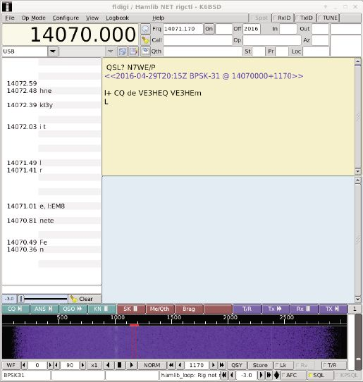
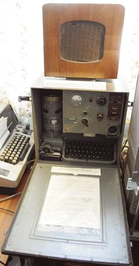

# 业余无线电与 FreeBSD

- 原文：[Amateur Radio and FreeBSD](https://freebsdfoundation.org/wp-content/uploads/2016/08/Amateur-Radio-and-FreeBSD.pdf)
- 作者：**Diane Bruce，VA3DB**

在移动电话、互联网和即时通信大行其道的今天，人们很容易忘记无线通信和全球互联网仍然依赖无线电通信。业余无线电操作员，又称 ham，是让无线电通信走向商业实用的先驱。在无线电发展的早期，爱好者搭建和摆弄电子设备，就像现代黑客使用电子设备、机器人和计算机一样。他们过去是、现在仍然是现代”创客”精神的一部分。业余无线电操作员接着创建了早期的广播电台和电视台。如今，业余无线电依然充满活力，吸引着那些想学习无线电技术、想构建融合计算机与无线电的新系统的人。

业余无线电是获得联邦许可的爱好。无线电频谱由多种业务共享，ham 又热衷于实验，具备基本的无线电技术和法规知识对于避免干扰其他业务至关重要。业余无线电是少数允许自制无线电设备、设计新协议和系统的无线电业务之一。

只要具备技术背景，许可证要求都很容易满足，而且不需要掌握摩尔斯电码。

业余无线电爱好者参与过移动电话和卫星系统的开发，也协助构建了现代互联网。科学家、程序员和电子工程师都对业余无线电抱有浓厚兴趣。

既然如此，为什么要把计算机和业余无线电结合在一起？计算机和无线电技术在过去几年发生了翻天覆地的变化。现代 ham 用计算机处理卫星预测、数字编码语音、日志记录、数字模式、软件定义无线电和各种各样的任务。

这催生了大量面向业余无线电的应用，其中许多是为 Linux 操作系统编写的。我们这些（<https://wiki.freebsd.org/Hamradio> On FreeBSD）从事 FreeBSD 业余无线电 Ports 工作的人，很想改变这种局面，把 BSD 也带进这一领域。幸运的是，许多通用或专门为 Linux 编写的应用很容易移植到 FreeBSD 上。

业余无线电操作员最早把个人计算机用于收发无线电传打字信号。早期 ham 的无线电传打字（RTTY）使用过剩的、淘汰的打字机（如 model 15）外接调制解调器。可以想象，这些笨重的机器让 RTTY 对许多 ham 来说并不实用。这些机器使用现代 8 位 ASCII 码的前身——通常称为 Baudot（学究一点叫 Murray 码），是一种 5 位（5 电平）加起止位的编码。这些机器再接上一台为无线电用途设计的调制解调器，对音频信号进行大量滤波以减少其他信号的干扰。RTTY 天生适合早期的家用个人计算机，是最早的数字模式之一。用 Apple II 这样的早期 8 位计算机生成和解码 5 电平码非常容易，但仍然要外接调制解调器。如今计算机性能足以用信号处理代替外接调制解调器，直接解码空中的无线电传打字并显示文本。FreeBSD 上常用的程序是 fldigi。fldigi 本身是解码 RTTY、Hellschreiber 等许多短波信号和 PSK31 等现代协议的现代瑞士军刀。

它用音调在旋转的滚筒上绘出字符。更多信息见维基百科 <https://en.wikipedia.org/wiki/Hellschreiber>。

随着现代计算机性能的提升，利用现代数字信号处理进行的弱信号检测能力大幅提高。Joe Taylor 是一位获诺贝尔奖的物理学家，业余无线电呼号为 K1JT，他希望找到一种把信号发送到月球再反射回来的方法（地月地通信，简称 EME，即月面反射），借助月球把信号传遍全球。他运用射电天文学专长，采用现代高级信号处理开发了 Weak Signal JT（WSJT），引入了新的 JT65 模式。早期 ham 的 EME 通信需要非常昂贵、庞大的天线阵列和大功率放大器。WSJT 让 ham 用更普通、便宜得多的电台就能进行 EME 通信。

全球各地的 ham 现日常使用 WSJT、WSJTX 及其衍生项目 WSPR，以极低功率与世界各地通信，不仅通过月球，还通过传统的电离层短波通信。（参见 <http://physics.princeton.edu/pulsar/K1JT/>）

最近一次跨大西洋 2m 波段的通信尝试之所以成功，仅仅是因为信号从国际空间站反射回来——当时它恰好在正确的时间位于正确的位置！（2014 年 7 月 14 日，见 <http://www.brendanquest.org/>）

PSK31 是一种低带宽模式，在现代 ham 中也很流行。它能在噪底以下被听到，深受低功率操作者喜爱。这里大多数 ham 同样选用 fldigi。

业余无线电操作员在早期分组无线电网中发挥了重要作用，这种技术后来进入警察和其他应急服务的加密数字系统。使用改进的 X.25 协议（AX.25）的存储转发网络至今仍在世界各地使用，构成了业余无线电定位系统（Amateur Positioning Radio System，APRS）的骨干。FreeBSD 通过 Xastir 和 YAAC 对该系统提供了良好的支持。

各电台用 GPS 接收机通过 AX.25 上的 APRS 广播自己的当前位置。对于协助专业搜索救援人员做搜救工作的业余无线电志愿者（例如民航巡逻队 CAP）来说，这套系统价值非凡。这些信号还会转发到互联网，支持全球追踪电台；例如访问 <http://aprs.fi/#!addr=FN25> 可以看到我所在的渥太华附近一带。

软件定义无线电是业余无线电爱好者正在试验的最热门新技术之一。借助高速 A/D 转换器，可以直接从空中采样无线电信号，转换为正交（两路相位差 90 度的信号）数字样本（通常称为 I/Q 信号），用计算机解码。对无线电而言，业余信号也可以用 D/A 转换器生成并发射出去。

Adrian Chadd（业余无线电呼号 KK6VQK，<adrian@FreeBSD.org>）想观察 WiFi 传输所用的频率分布时，需要一套支持良好的软件定义无线电（SDR）软件包。这意味着 Adrian 必须协助把支持 Ettus 公司 USRP 的软件移植到 FreeBSD，才能在他的 BSD 系统上配合 gnuradio 使用。gnuradio 是一个软件框架，包含可借助图形界面连接组装成 SDR 无线电系统的各种组件。

高端射频 A/D、D/A 系统能够同时处理数兆赫兹的频率，这正是射电天文或 WiFi 信号分析所必需的。然而，许多 SDR 工作只需任何现代计算机自带的声卡，或基于 RTL2832U 芯片组的 DVB-T 电视调谐器 USB 加密狗即可完成。声卡只能采样基带音频信号，因此任何射频信号都必须先下变频到基带才能解码。所谓的”SoftRock”是一种低成本的射频转换器，可配合 QUISK 等程序解码传统的短波模式，包括单边带（SSB）、FM 和 AM。

电视调谐器 USB 加密狗可以直接对射频信号采样，覆盖范围一直延伸到 UHF 频段，可用于监听该频段的业余无线电频率，甚至直接收听广播 FM 电台；例如 rtl-sdr 这个 Port 可以与 gnuradio 配合使用。许多业余无线电爱好者制作了上变频器，把接收到的短波低频信号转换到电视调谐器加密狗可以接收的频段，再交给 gnuradio.org 的 GNU Radio 处理。

业余无线电操作员设计并建造了自己的卫星。1974 年首次发射的 AO-7 至今仍在运行，尽管由于电池耗尽，工作模式严重退化。

建造卫星需要电力工程、电池技术、无线电和嵌入式计算机系统等多领域的知识。这些人才也是为 NASA 工作的人。对普通业余无线电操作员来说，知道每颗卫星何时把天线指向何方，需要跟踪软件。predict 和 gpredict 是这里常用的程序。

国际空间站上有持证的业余无线电操作员，运行在低地轨道上。它在自动模式下很容易被收听到，宇航员活动时也可以与之通话。可以想见，空间站上的宇航员没有多少时间直接与地面上的 ham 通话，但常常会做出特别安排，与地面的学校通话。你可以在 gpredict 的截图中看到这颗卫星。

业余无线电电视是部分 ham 使用的一种模式，不过大多数活动集中在一种称为慢扫描电视（SSTV）的低带宽电视形式上。早期的 SSTV 需要余辉很长（P7）的雷达管荧光屏，这种荧光屏对眼睛刺激很大，但能让图像在消退前被描绘出来。如今这一切都由计算机解码完成，可以获得全彩图像。国际空间站有时也会向地面广播 SSTV 信号供地面电台接收。

中继台用于扩大移动电台的通信距离，方法是把接收机架在山头或高楼之上，配上发射机转发移动电台的信号。通过互联网把世界各地城市的中继台连接起来是轻而易举的事，可以用 thebridge 或 svxlink 实现。

业余无线电可以像你想的那样技术性强，也可以只是一种放松的爱好。这个爱好领域广阔，门类繁多，我只能介绍其中一小部分。廉价计算的时代让业余无线电变得更有趣。也许你现在产生了兴趣。如需进一步阅读，建议从美国的 <http://www.arrl.org> 和加拿大的 <http://www.rac.ca> 开始。

---

**DIANE BRUCE** 从事计算机编程工作逾 40 年，在嵌入式/实时领域有 35 年以上的经验。Diane 目前为 FreeBSD 项目做贡献，主要在 Ports 方面。她的爱好包括业余无线电、写作和音乐（业余乐手）。她于 1968 年首次获得业余无线电执照。<db@Freebsd.org>
