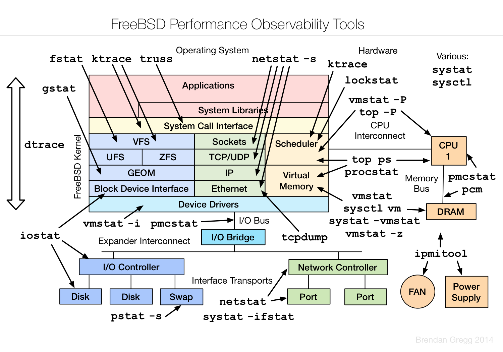

# ScaleEngine 与 FreeBSD

- 原文：[ScaleEngine and FreeBSD](https://freebsdfoundation.org/wp-content/uploads/2016/08/ScaleEngine-and-FreeBSD.pdf)
- 作者：**ScaleEngine**

ScaleEngine 创立之初就基于 FreeBSD，因为这是创始人最熟悉的系统。过去八年里，选择使用 FreeBSD 让我们受益良多，并为我们带来了显著的竞争优势。

## ScaleEngine 的起步

ScaleEngine 进入 CDN（内容分发网络）领域完全出于偶然。最初，ScaleEngine 是一个自动伸缩的应用环境，用于托管论坛、大型 Web 应用和其他高复杂度高流量的站点。不久后，我们开始从主托管机房推送过多带宽。为解决这一问题，我们迅速成长为 CDN，并最终将业务转向聚焦这一市场。

大多数托管机房的带宽，乃至整个互联网传输，都按“第 95 百分位”计量。基本概念是：每月每 5 分钟测量一次推送到互联网的流量。月底对测量值排序，丢弃最高的 5%。剩余的峰值用量决定账单。通常涉及两个价格。客户有一个承诺量——每月购买的最低带宽——按固定价格计费。

此外还有一个突发或超额价格。客户可以使用超过承诺量的带宽，但如果其第 95 百分位超过承诺量，必须按更高的突发价格为额外用量付费。这对双方都有利。对传输提供商而言，它确保客户为高峰时段持续使用的带宽付费，这保证了传输提供商能保留相应容量，并鼓励客户承诺更大带宽以避免更高的超额费率。对客户而言，它提供了按需使用更多带宽的灵活性，同时只需按承诺费率付费。客户还能在一个月中最多 5% 的时间（约 36 小时）内使用连接的全部容量，而无任何额外费用。每天最忙的小时或每个工作日最忙的 90 分钟不计入最终带宽账单。ScaleEngine 当时的处境是：既不愿提高带宽承诺，又需避免每月支付昂贵的超额费。占用带宽的流量大多是各种站点托管的大型图片文件，包括一个截图分享应用。为缓解这一情况，我们在美国东海岸和西海岸各租了一台服务器。这些服务器的带宽定价不同，按每月总量而非峰值用量计费。我们把静态内容——主要是较大的图片——的流量导向这些服务器，它们通过 `rsync` 从主站点接收内容。这让主托管机房的带宽消耗降至承诺量以内，因为大部分流量变成了我们所托管站点的纯文本内容。对更快加载图片的需求促使我们在欧洲也添加了类似服务器。

## Dummynet：智能流量整形

从客户角度看，第 95 百分位计费的缺点是：如果一个月内的峰值时间超过那免费的 5%，就要按峰值用量付费，相当于整月都以该速率使用。这意味着，平滑使用中的尖峰往往有好处。这就是 Dummynet 派上用场的地方。Dummynet 是 FreeBSD 原生防火墙 IPFW 的流量整形功能。使用一对管道和一些队列，我们能够对服务器间的复制流量进行速率限制，使得大量新文件不再造成流量尖峰。复制不再以全速进行、占满我们的连接并造成大尖峰，而是由管道限速，并在队列中让位于更高优先级的客户流量。这种尖峰的削平为我们节省了数千美元，仅造成轻微的复制延迟。

关于 IPFW 和 Dummynet 的更多信息，请参阅 FreeBSD 期刊 2014 年 5/6 月刊。

## 可靠性与灵活性

要管理 100 多台服务器，拥有一个稳定可靠的操作系统大有帮助。我们的服务器生命周期中混合使用多个 FreeBSD 版本：9.3、10.3 和 -CURRENT。在稳定分支内（10.2 到 10.3）无痛升级是巨大优势，我们可以快速升级到最新版本，无需担心应用栈出问题。

FreeBSD 对第三方库和应用程序的处理方式，对我们部署新功能至关重要。FreeBSD Ports 系统是滚动发布的，意味着每天都会添加新的应用程序和这些应用程序的更新版本。Ports 系统还让我们不必受制于厂商提供的编译时选项。我们使用 **poudriere(8)** 编译自己使用的包集合，选项按需定制。但如果需要别的，尤其是临时需要，可以退而使用 FreeBSD 提供的预编译包。同一棵 Ports 树能在 FreeBSD 三个支持的分支上工作，意味着我们可以在每台服务器上——无论是 9.3 还是最新的 -CURRENT——运行最新版本的 nginx。能够使用最新版 nginx 而非 FreeBSD 9.0 发布时的最新版，意味着我们可以快速采用上游新功能。FreeBSD Ports 系统还提供了另一个重要特性：同一应用程序的多个版本。我们可以在 PHP 5.6 和 PHP 7.0 之间选择，或在 nginx 和 nginx-devel 之间选择。希望避免日常变动的用户可使用 Ports 树的季度稳定分支。

## FreeBSD 与 ZFS 如何发挥作用

当我们开始直接销售 CDN 服务而非作为托管服务的一部分时，架构需要彻底改造。我们有若干需要解决的问题，而 FreeBSD 为每一个都提供了解决方案。

我们放弃了 `rsync`——文件数量超过几万之后它太慢——并且需要更智能地管理在每个边缘服务器上缓存哪些内容，以避免浪费宝贵的存储空间。我们还需要避免浪费带宽去复制几周后鲜有请求的数据。目标同样是减轻主存储服务器的带宽压力，避免购买昂贵的互联网传输。我们改用 nginx 缓存模块，它会在文件首次被请求时保存到边缘服务器。一开始用基于哈希的目录和文件名将大量文件拆分成可管理的目录，效果不错。最终我们遇到了 UFS（FreeBSD 默认文件系统）的性能问题。“dirhash”——目录元数据缓存——默认仅限几兆内存。即使扩大缓存大小并延长生存时间，遍历目录仍然慢得令人痛苦，对冷启动时间产生不利影响。切换到 ZFS 改变了一切。

ZFS 拥有更智能的缓存系统。大多数文件系统使用标准的 LRU（最近最少使用）缓存，缓存满时移除最久未使用的项以腾出空间。ZFS 则使用 ARC（自适应替换缓存），由四个列表组成。第一个是 MRU（最近最多使用），与 LRU 非常相似。还有一个独立的 MFU（最频繁使用）缓存，用于最常使用的文件。这提供了一项重要优化：遍历缓存对象的整个目录结构（这会导致整个 LRU/MRU 被循环一遍）时，缓存中的所有项都被移除并替换为正在遍历的条目。现在缓存里装满我们可能再也不会用的项，只能等缓存恢复才能再次提供合理的性能提升。有了 MFU，最频繁使用的文件不会被目录遍历清除出缓存。我们还控制了文件系统缓存中可用于元数据的比例。与 UFS 不同，ZFS 只在元数据缓存满或内存别处需要时才清除元数据缓存中的项。ZFS 默认将元数据限制为总缓存大小的 25%，但如有需要可调整。在我们的一个用例中——为一个流行的相关内容插件托管缩略图——我们存储了超过 3000 万个小文件。文件存放在 SSD 阵列上，吞吐量不是问题。ZFS 允许我们只把元数据缓存在 RAM 中，让整个目录结构驻留在 RAM，只有读取实际数据块时才会向 SSD 发起读操作。与为热文件缓存数据和元数据混合、为冷文件什么都不缓存相比，这大幅降低了冷文件的延迟。ZFS 还带来了许多其他可用的选项和功能，可提供给客户。我们很快学到的第一课是：为每个客户创建一个 dataset。当我们只有一个 dataset、每个客户的视频文件放在各自目录、并且采用全套快照时，如果客户取消账户，我们无法在不删除快照的情况下回收空间。这会让我们在此过程中丢失所有其他客户的历史。一旦改为每个客户一个 dataset，我们就可以为某个客户删除快照或整个文件系统，并立即回收空间。这还让我们能为客户创建预留和配额，确保他们始终有足够空间，或限制他们使用的空间。

ZFS 还带来了 `rsync` 的最后一根钉子——块级复制。现在我们可以把整个文件系统作为原子操作复制到边缘服务器。增量更新只需传输实际新增或更新的块所需的时间，没有“扫描”时间，也没有目录遍历。处理 3000 万个小文件时，相比 `rsync` 节省的时间是惊人的。

ScaleEngine 使用 ZFS 复制为 PC-BSD 托管包仓库。我们在一台存储服务器上创建了一个 dataset，PC-BSD 团队把最新包上传到一个新目录。上传过程中，我们的服务器每 15 分钟拍摄一次快照并复制到一组边缘服务器。上传完成后，该目录被移到旧仓库的位置，边缘服务器原子地更新。结合我们的全局服务器负载均衡器（GSLB）——如果某台边缘服务器的复制延迟就停止向其路由流量——这一策略效果极佳。既然 ZFS 已支持恢复中断的复制，且 PC-BSD 项目已升级构建服务器的连接，我们将开始尝试让 PC-BSD 直接把 ZFS dataset 推送给我们，而不是逐个传输文件。

## 可观测性

任何优秀的系统管理员都应该像个执着于“为什么”的 5 岁小孩，递归地问下去。FreeBSD 提供回答这类问题所需的工具，这对解决问题大有帮助。FreeBSD 的 **top(1)** 命令功能强大，同时自身不消耗大量资源——这一点很重要，否则会限制其测量系统负载的实用性。它还有 I/O 模式，可以回答：哪些进程造成了所有这些 I/O？然后 **fstat(1)** 可以显示该进程打开了哪些文件。从更宏观的视角，**gstat(8)** 按 GEOM（对应磁盘和分区）显示 I/O 分解。如果吞吐量低于预期，看看消耗的 IOPS 数。设备是否还有剩余 IOPS 来服务你的请求？平均延迟指标可以告诉你磁盘是否难以跟上负载。在中等负载下延迟高于预期，可能暗示磁盘出现故障。

Brendan Gregg 优秀的下图展示了 FreeBSD 系统的各个部分，以及可用于观测它们的工具。

DTrace 在帮助我们追踪应用栈中的问题、并跟进到内核方面不可或缺。无论是观察特定 TCP 连接的拥塞窗口，还是生成磁盘阵列平均写延迟的图表，都只需几行 D 代码。我们用一系列 DTrace 探针监控一台服务器在本地 ZFS 复制——把 10 TB 客户数据复制到第二个 dataset——期间的表现。通过查看把所有脏数据刷入池子所需的时间（即“同步延迟”），我们优化了设置并获得了 25% 的性能提升。通过调整最大脏数据量、脏数据阈值（缓冲接近满，因此启动同步）和事务超时，我们把同步周期（这会暂停读以降低写延迟）推迟到 24 GB 数据等待写入时才发生，而写入这些数据大约需要 5 秒。默认调优意味着每 4 GB 脏数据就发生一次写入，导致池子频繁在读和写之间切换。

## 网络

FreeBSD 网络栈的进步对我们帮助极大。可插拔的 TCP 拥塞控制算法系统让我们得以实验不同算法，并确定 HTCP 为跨大西洋 ZFS 复制提供了最佳性能。在我们这种常被称为长粗网络的情况下，延迟波动不是拥塞的指标，少量丢包也不意外。HTCP 比默认的 New Reno 算法更激进，加速更快，丢包恢复也更迅速。

修改默认初始拥塞窗口（RFC6928）的支持让我们在与大型竞争 CDN 的小文件性能较量中保持竞争力。这一设置限制了在收到对方确认前可发送的数据段数。实验性 RFC 之前的初始值在 2 到 4 段之间，后被改为 10。这大幅降低了小型 HTTP 对象的加载时间，因为总往返次数减少了 4。增大初始拥塞窗口还让连接早期发生丢包时恢复更快。当丢包原因不是拥塞时——尤其在无线连接的情况下——这能显著改善性能。

FreeBSD 11 中，整个网络栈变得可插拔，不同的应用可使用不同的网络栈。理论上，这允许我们为从边缘到终端用户的流量使用一套优化，并为回程网络上的流量使用另一套优化。这一点可能尤为重要，因为我们服务不同类型的流量。Flash 视频流是恒定适中比特率的单条长连接。为提供最佳体验，应专注于一致性和避免延迟与丢包。HLS 视频流是一系列中等大小（约 1MB）的 HTTP 请求。最大突发性能是最理想的结果；但如果设备通过 4G 或 WiFi 移动连接，丢包可以预料，但不一定表示拥塞。HTTP 渐进式流类似于常规下载，但以一系列 HTTP Range 请求完成。此方法通常用于移动设备、桌面浏览器、HTML5 播放器和机顶盒。在这种情况下，最优策略是在尽快发送数据的同时避免拥塞。最后一种情况是 HTTP 下载，如 BSDNow.tv 播客的每周剧集或 PC-BSD 软件包，目标是在提供最佳速度的同时，避免与来自同一服务器的对延迟和拥塞更敏感的流量争用。

## 总结

总结我们选择 FreeBSD 为业务提供动力的原因：世界上最受尊重的网络栈与有史以来最可靠的文件系统，在一个积极开发但极其稳定的操作系统中融为一体，所有这些都采用宽松的、可自由复制的许可证。难怪 FreeBSD 推送的数据比任何其他系统都多。

---

**Allan Jude** 是 ScaleEngine Inc.（全球 HTTP 和视频流 CDN）的运营副总裁，在 FreeBSD 上大量使用 ZFS。他也是视频播客 BSDNow.tv（与 Kris Moore 共同主持）和 TechSNAP.tv 的主持人。他是 FreeBSD src 和 doc 提交者，于 2016 年夏天当选 FreeBSD 核心团队成员。Allan 与 Michael W. Lucas 合著了《FreeBSD Mastery: ZFS》和《FreeBSD Mastery: Advanced ZFS》。
