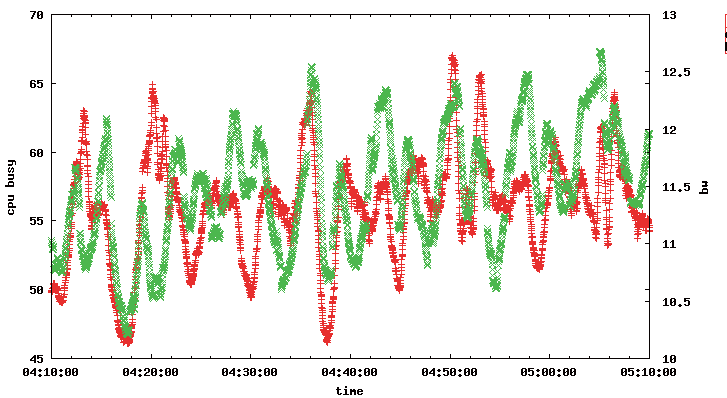
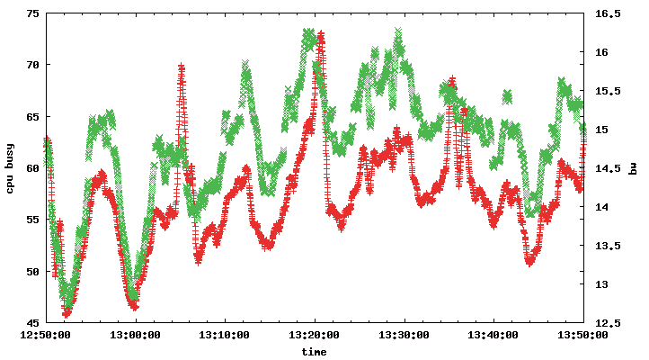
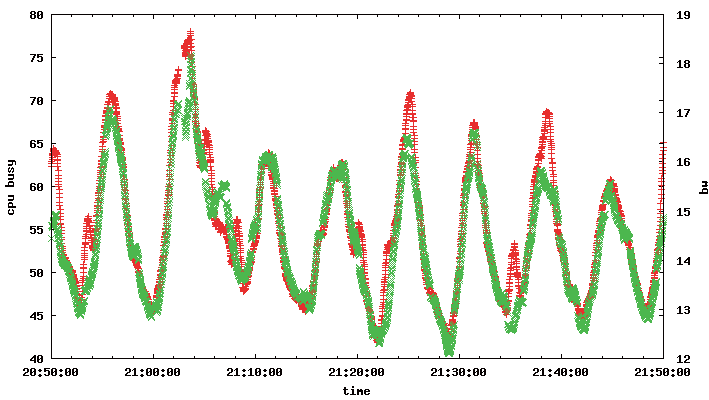
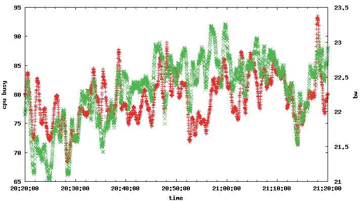
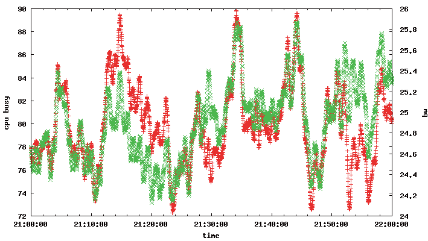
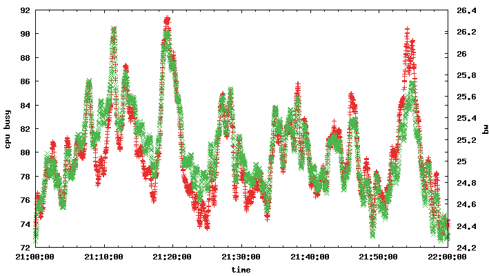
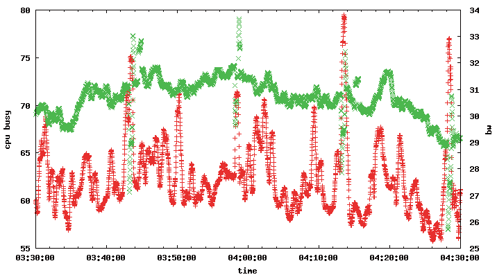
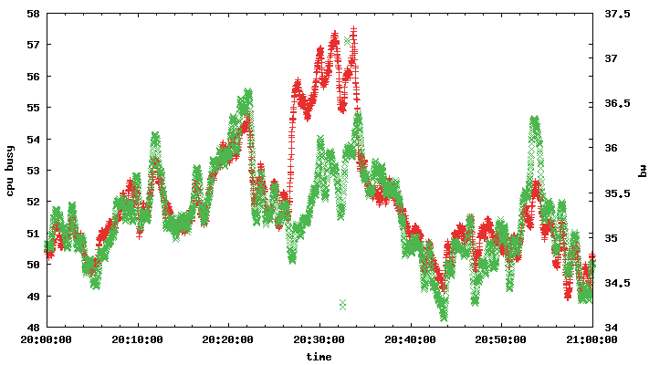
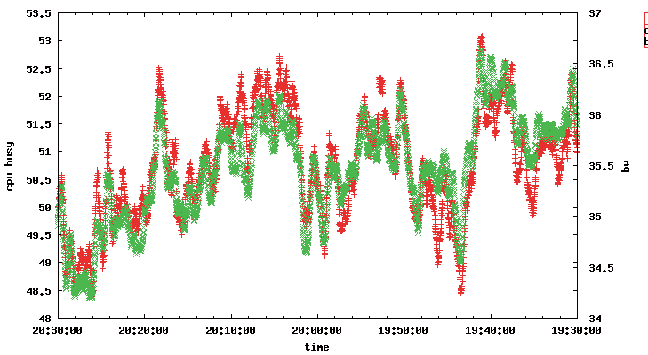

# 提升 FreeBSD 内核中的高带宽 TLS

- 原文：[Improving High-Bandwidth TLS in the FreeBSD Kernel](https://freebsdfoundation.org/wp-content/uploads/2016/10/Improving-High-Bandwidth-TLS-in-the-FreeBSd-Kernel.pdf)
- 作者：**Randall Stewart** 和 **Scott Long**

在 2015 年的论文《Optimizing TLS for High-Bandwidth Applications in FreeBSD》中，我们展示了 TLS 加密对 Netflix OpenConnect 设备（OCA）[1] 上高带宽视频服务的开销，并探索了通过内核内加密降低该开销的方法。结果表明这一概念可行，但只获得了较小的性能提升。本文描述了此后为降低加密开销所做的改进，并比较了几种不同批量加密实现的性能。

## 引言

随着企业和客户日益认识到通信隐私的价值，传输层安全（TLS）[2] 的重要性持续增长。Netflix 在 2015 年宣布，将开始对其流媒体服务的视频和音频播放会话加密，以帮助用户保护观看隐私 [3]。启用加密会给 OpenConnect 服务平台带来显著的计算开销，因此我们持续探索并实现优化 TLS 批量加密的新方法，以降低资本和运营成本。

OCA 是基于 FreeBSD 的设备，向 Netflix 订阅者提供电影和电视节目。类似支付信息这样的机密客户数据、账户认证和搜索查询，通过客户端与构成 Netflix 基础设施的各应用服务器之间的加密 TLS 会话交换。音频和视频对象由数字版权管理（DRM）静态加密，DRM 在对象分发到 OCA 网络提供服务之前预先编码到对象中。

Netflix OpenConnect 设备是基于 Intel 64 位 Xeon CPU 的服务器级计算机，运行 FreeBSD 和 Nginx 1.9。随着商品组件能力提升、价格下降，该平台逐年演进；最新一代平台可容纳 10TB 到 200TB 的多媒体对象，并能支撑 10,000 到 40,000 个与客户客户端系统同时存在的长生命周期 TCP 会话。这些服务器还设计为提供 10Gbps 到 40Gbps 的持续带宽利用率。

与客户端的通信基于 HTTP 协议，使系统本质上成为大型静态内容 web 服务器。

直到 2015 年，这些音频和视频对象未按会话加密。Netflix 现正修订并发布其客户端播放软件以支持 TLS 播放加密，目标是更新所有既能升级、又具备支持 TLS 解密计算能力的播放设备。到 2016 年底，我们预计大多数流媒体会话将使用 TLS 加密。

随着 OpenConnect 网络上执行 TLS 的客户端会话数量增长，服务端为容纳这些会话的压力也随之增加。基于 2015 年的工作成果 [4]，我们寻找降低已部署硬件上加密开销的方法，同时减少为应对未来增长所需的服务器数量。这项调查涵盖三个方面：批量加密的理想密码是什么、所选密码的最佳实现是什么、是否有办法改进该密码实现的数据路径？

## 批量密码选择

密码块链接（CBC）常用于实现 TLS 会话的批量数据加密，因为它研究充分且相对容易实现。但它计算开销高，因为明文数据必须处理两次：一次生成加密输出，一次生成验证加密数据完整性的 SHA 哈希。基于 Galois/Counter Mode（GCM）[5] 的 AES-GCM 密码提供足够的数据保护，且不需要明文处理两次。它包含在 TLS 1.2 及更高版本中，在所有现代版本的 OpenSSL 及其衍生版本中可用。解密的计算开销也很低，加上无处不在的可用性，使其对客户端和服务器平台都有吸引力。

我们决定将 TLS 平台过渡为优先使用 GCM，只对无法升级以支持 GCM 的原始客户端回退到 CBC。我们估计，一旦 TLS 推广到整个网络，只有小部分播放会话会使用 CBC。

## 密码实现

对 OpenCrypto 框架 AES-CBC 密码的合成性能测试表明，其性能低于 OpenSSL 的等效实现。我们还需要调查 AES-GCM 性能，但发现截至 2015 年初，OpenSSL 1.0.1 没有 AES-NI 优化的实现。对替代方案的寻找使我们发现了 BoringSSL [6]，它有一个性能良好的 AES-NI 实现，用于 AES-GCM。

2015 年中，我们接触到了 Intel Intelligent Storage Acceleration Library（ISA-L）[7]。它提供的 AES-GCM 实现是针对特定 Intel 型号家族及其指令集手工调优的。测试表明它优于 BoringSSL 密码。结果如下。

ISA-L 的一个缺点是它用 YASM 方言编写，与 FreeBSD 中的 GCC 和 LLVM 工具链汇编器不直接兼容。这要求我们以基本方式修改内核 makefile 基础设施，允许在所需源文件上以外部汇编器调用 YASM，如下：

```sh
compile-with "/usr/local/bin/yasm -g dwarf2 -f elf64 ${INTELISAINCLUDES} -o ${.TARGET} $S/contrib/intel_isa/aes/${.PREFIX}.asm"
```

## 数据路径改进

我们在 2015 年的初始工作 [4] 使用 FreeBSD 内置的 AES-NI 实现和 Open Crypto Framework（OCF）执行批量加密。我们上一篇论文中的结果显示了较小的性能提升，但远未达到我们希望获得的成果。我们知道有几个方面可以改进结果，包括：

- 我们的 AES-NI 实现要求就地加密，内核数据处理时产生了额外的数据复制。
- nginx 调用 TLS 代码时没有在 `sendfile(2)` 调用中传入正确的标志。这意味着热点内容未正确缓存。
- 处理时常常遍历 mbuf 链以获取加密地址；这种对 mbuf 链表的持续遍历增加了开销并进一步污染了 CPU 缓存。

我们决定向新密码传入指针数组，指定加密的源和目标，即 iovec。这个 iovec 数组在 `sendfile` 调用的初始设置阶段填充，每个页面为 I/O 设置时填充，从而消除了遍历 mbuf 链表的需要。我们还重新设计了 mbuf 分配例程，使其能在分配时包含这个新的”mbuf map”。

我们的大部分数据都在加密，我们还设计了新的特殊 mbuf zone，分配时开销更小。典型的单页 mbuf 需要三次独立分配（一次给 mbuf，一次给引用计数，一次给页面）。我们重新设计，使页面和 mbuf 成为不可分割的单元，FreeBSD 的 UMA 在其初始化例程中一起分配页面和 mbuf，UMA 构造函数仅用于重置该绑定实体内的指针。我们还将引用计数嵌入 mbuf。这需要在复制时做一些小技巧（直到所有副本释放后才真正释放原始 mbuf），但证明在减少 mbuf 开销方面相当有效。

切换到 iovec 数组迫使我们放弃 OpenCrypto Framework API，直接访问密码例程。我们仍希望为测试目的能回退到 OpenCrypto，因此创建了一个层，抽象内存分配和 iovec 处理用于低级密码访问，同时仍允许与 OpenCrypto 互操作。这种转换对上层透明，并可在运行时选择。这项工作还使我们有机会找到并修复产生不必要数据复制的代码路径。我们还修复了不正确的 `sendfile` 标志用法。

## 结果

添加所有改进后，我们在三台不同的机器上部署了新固件。这些机器在繁忙时段接收实时流量，同时收集 CPU 和带宽测量数据。所有测量使用相同的软件，唯一区别是配置变更，使软件：

- 禁用所有 `sendfile` 增强并只使用 OpenSSL，从文件读取并将加密数据写入 TCP 连接。
- 使用 `sendfile` 增强，加密设置为使用 BoringSSL。
- 使用 `sendfile` 增强，加密设置为使用 Intel 的 ISA 库。

因此每台机器为我们提供三组结果。机器类型如下：

- Rev H 存储（HDD）平台，CPU E5-2650Lv2，1.7GHz，20 核（超线程），CPU 类型为 Ivy Bridge Xeon。
- Rev F Flash（SSD）缓存平台，CPU E5-2697v2，2.7GHz，24 核（超线程），CPU 类型为 Ivy Bridge Xeon。
- Rev N Flash（SSD）缓存平台，CPU E5-2697v3，2.6GHz，28 核（超线程），CPU 类型为 Haswell Xeon。

每组结果将标记为 Rev H、Rev F 或 Rev N 和所进行的测试。我们展示繁忙时段大约一小时的流量。为视觉清晰，图中图例已移除；绿色 x 图为带宽（Gbps），红色 + 图为 CPU 系统使用率（百分比）。

在图 1 中我们看到只使用 OpenSSL 时的情况。我们设置的 CPU 限制是标准的 80%；然而存储缓存受磁盘限制，CPU 命中 60% 到 65%，性能上限约为 12–12.5Gbps 的服务流量。`sendfile` 特性带来了相当大的改进，如接下来两图所示。BoringSSL 在内核中使用 `sendfile` 的结果见图 2。CPU 使用稍多（55%–70% CPU 利用率），总体输出性能提升至 15–16Gbps。这正是我们使用 `sendfile` 调用简化 I/O 所期望的。





作为最终比较，我们部署了 ISA 库，同样在内核中使用 `sendfile`。结果见图 3，显示了又一次改进，使我们达到 18Gbps，但通常维持在 16–16.5Gbps 左右。



图 4 是 OpenSSL，这次 CPU 达到最大值。这是因为 SSD 的 I/O 能力显著更高，我们不再遇到 Rev H 中看到的磁盘限制。我们看到平均 80% CPU 运行时，维持在 22 到 23Gbps 之间。这为我们提供了比较任何改进的基线。



图 5 是使用内核加密配合 `sendfile` 和 BoringSSL 的结果。这里我们能在维持 80% CPU 利用率目标的同时保持 25 到 25.5Gbps。



图 6 中的 ISA 库使我们在之前结果的基础上略有改进，同样达到约 25–25.5Gbps，但倾向于停留在范围的高端。



Rev F 和 Rev H 都是 Ivy Bridge 机器（v2 CPU）。我们预期 Haswell 机器（v3 CPU）性能更好。Rev N 在下一组图中显示了有希望的结果。有趣的是，图 7 中的 OpenSSL 结果未达到 80% 的 CPU 目标。检查机器健康统计后发现，SSD 在约 29–30Gbps 达到最大值，这正是我们在图中看到维持的水平。



图 8 中我们达到了接口的最大容量 35.5–36Gbps，CPU 倾向于维持在 53% 左右，有一次突发至 57%。



ISA 库结果见图 9，与 BoringSSL 情况类似，区别在于 CPU 使用倾向于维持在 50.5% 左右。结果汇总在表 I 中。



| RevF | RevH | RevN |
| :--: | :--: | :--: |
| cpu% | BW | cpu% |
| Baseline | 60–65 | 12–12.5 |
| BoringSSL | 55–70 | 15–16 |
| ISA-L | 55–70 | 15–16.5 |

表 I. 密码比较图

## 总结与未来方向

借助最新工作，总体性能提升了多达 30%，比我们最初的结果有巨大改进。尚未探索的是使用卸载卡来协助加密所有数据。我们面临的问题是，是否能在我们的硬件设计中使用卸载卡，使其消耗的 CPU 和 PCIe 带宽少于直接运行 AES-NI 指令本身。随着新一代 Intel CPU 的推出，向辅助卡输入数据并收集加密结果的开销可能会超过 AES-NI 指令本身的开销。
