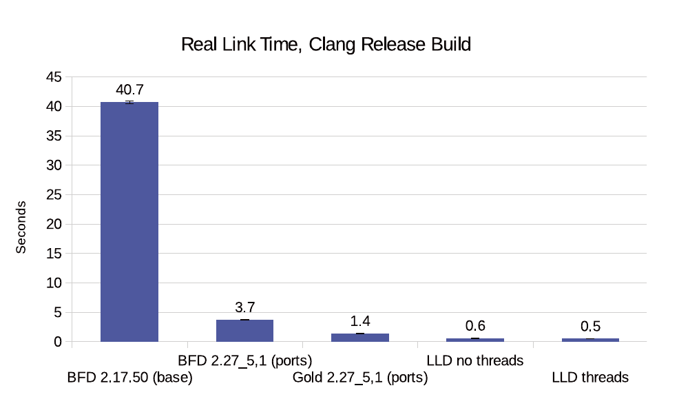
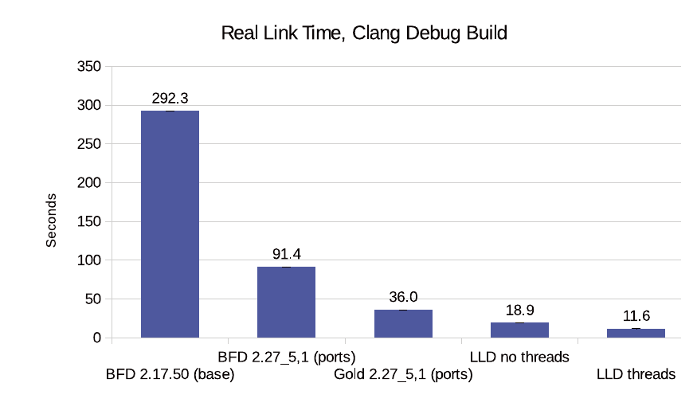
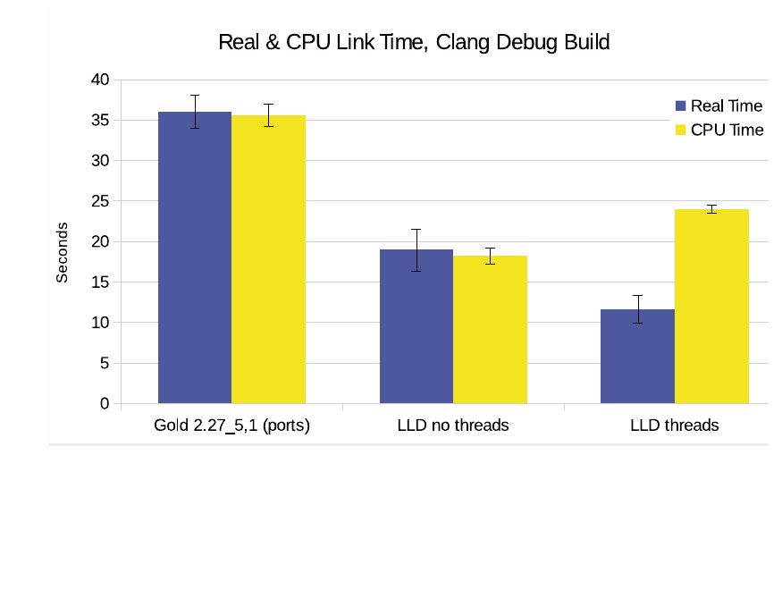

# LLD 链接器

**作者：Ed Maste**

从一开始 FreeBSD 就使用 GNU binutils 链接器。它也称为“BFD”链接器，得名于其构建所依赖的 Binary File Descriptor 库。FreeBSD 开发者持续更新 FreeBSD 树中链接器副本，随 GNU 项目发布新版而导入。

链接器是接收编译器或汇编器生成的一个或多个目标文件、并将其合并为一个可执行程序或库的程序。它是操作系统工具链的一部分——用于构建、调试、测试软件的一组程序。

到了 2000 年代中期，自由软件基金会（FSF）将许可证改为 GNU 通用公共许可证第 3 版（GPLv3）。它新增了一些 FreeBSD 开发者与用户难以接受的限制。此后，FreeBSD 项目的开发者继续应用小幅更新与 bug 修复，但链接器再未升级到 2.17.50 之上。

FreeBSD 需要一款新链接器的问题由来已久，最近出现了可行候选：LLVM 系列项目中的链接器 LLD。LLD 旨在成为支持多种目标文件格式的高速链接器。它支持类 UNIX 操作系统使用的 ELF 格式、Windows 的 COFF 格式、Darwin/OS X 的 Mach-O。

在可能处，LLD 保持与既有链接器（如 GNU ld）的命令行与功能兼容性，但 LLD 的作者在性能或所需功能受影响时不受严格兼容性约束。与 LLVM 其他项目一样，LLD 以宽松的自由软件许可证发布。

LLD 可为 FreeBSD 提供一款现代、可维护、高性能的基本系统链接器。它将使 FreeBSD 用树内工具链支持新 CPU 架构，并启用链接时优化（LTO）等新性能优化。

## 历史

LLD 于 2011 年底加入 LLVM 上游源码仓库，设计主要基于 Apple 所用 Mach-O 格式的链接需求及其隐含的 atom 模型。atom 是最小不可分的代码或数据块，是目标文件的相当通用的表示。除 Mach-O 支持外，LLD 最初还包含基于 atom 的 ELF 与 COFF 链接实现。

链接 Mach-O 格式需要 atom 模型提供的灵活性，但对 ELF 与 COFF 格式而言是不必要的复杂化。这些格式中，节（section）是最小可用单位。

2015 年 5 月，谷歌的 Rui Ueyama 开始编写新的基于节的 COFF 链接器。两个月后的 7 月，Michael J. Spencer 提交了基于节 COFF 支持的新的 ELF 链接器实现。新的 COFF 实现于 8 月默认启用，ELF 在 11 月同样默认启用。

到 2015 年底，LLD 已可成为自举 FreeBSD amd64 工具链的一部分：即可用 Clang/LLVM 与 LLD 构建 Clang/LLVM 与 LLD。2016 年间多位开发者改进了 LLD，其中与 FreeBSD 相关的值得提及的贡献来自 Rui Ueyama、Rafael Espindola、George Rimar、Davide Italiano。

过去一年，我一直在用 LLD 构建 FreeBSD 基本系统做实验。尽管 LLD 在 2015 年底可自举，但它缺乏 FreeBSD 所需的许多特性支持。我在 LLVM bug 跟踪器中创建了一份 bug 报告作为“元 bug”，追踪所有阻碍 LLD 用作 FreeBSD 系统链接器的问题。它最终增至 63 个子问题，其中 7 个仍未关闭。

问题包括缺乏可重定位输出、对库搜索路径的细粒度控制、链接脚本中的算术表达式、完整的带版本号符号支持，以及各种命令行选项。我不得不禁用 FreeBSD 的引导加载程序、32 位兼容库、测试、rescue 二进制、GDB 调试器的构建，以便链接一部分用户态二进制，但许多二进制并不能运行。内核也无法链接，因为它大量依赖链接脚本。

到 2016 年 3 月，借助 FreeBSD 与 LLD 中的若干临时变通，我能构建出 FreeBSD 用户态的可用子集。符号版本化与链接脚本表达式仍不支持，内核也仍无法构建。但 LLD 开发的快速进展让我相信它正走在成为可行系统链接器的轨道上。

符号版本化与链接脚本表达式求值在几个月后实现。到 8 月，可重定位输出与一个略为冷僻的用于构建引导加载程序组件的命令行选项是剩下的大特性。如今 LLD 几乎可用于 amd64 FreeBSD 基本系统用户态与内核构建的全部环节；引导加载程序是唯一仍不能用 LLD 构建的 FreeBSD 组件。

## 设计

LLD 的设计目标包括速度、简洁与可扩展。LLD 通过做更少工作来追求速度，必要工作时只做一次。传统 UNIX 链接器顺序访问目标，包括命令行直接指定的目标与档案中包含的目标。链接器构建未定义符号列表，链接满足这些符号需求的目标。新目标反过来可能引入新的未定义符号，可能需要多次访问目标以解析所有未定义符号。

LLD 则对指定的目标文件与档案只做一遍扫描，记录所访问每个目标中已定义与未定义的符号。符号解析无需再次访问目标或库。这导致与传统链接器相比略有不同的链接语义，但写得好的软件应看不到差别。可构造出在传统链接器上工作而 LLD 失败的场景，但实践中预计不太可能。在用 LLD 作为链接器测试多种第三方软件时，尚未发现损坏的情形。

LLD 中的 ELF 与 COFF 链接器共享通用设计，但不共享代码。它们为每种文件格式提供与原生链接器相同的命令行用户界面：ELF 用 GNU ld，COFF 用 Microsoft 链接器。这避免了抽象层的复杂性与运行时开销。结果是 ELF 链接器约 13000 行代码。即便不可直接比较（因三者不同程度依赖支持库），这个数字仍远小于其他链接器（GNU ld 与 GNU gold）。

与 LLVM 家族其他组件一样，LLD 中的链接器以库形式实现并配以轻量命令行驱动，便于嵌入其他项目。

## 性能

LLD 的首要设计目标之一是成为高性能链接器。小程序应链接得快，链接时间不应随程序规模呈指数增长。

图 2 的图表比较了用几种不同链接器链接 Clang 编译器发布版所需的实际（墙上时间）。链接器输入由 158 个目标文件（.o）、静态库（.a）、共享库（.so）文件构成，共 91 兆字节。

实验在我的开发台式机上进行，配置为四核（8 线程）Intel i7-3770 CPU 与 32GB 内存。我对比了 BFD ld 2.17.50（当前 FreeBSD 基本系统链接器）、FreeBSD Ports 树中的 BFD 与 Gold 2.27_5,1，以及从 LLVM 源码仓库构建的 LLD。默认情况下，FreeBSD Ports 中的 Gold 链接器构建时不带线程支持，Gold 的线程模式未进一步研究。

图 3 比较了相同链接器在 Clang 调试版上的表现。此情况下链接器处理的文件数相同，但调试数据的加入使文件大得多，链接器需做更多工作。

LLD 通过若干方式实现高性能，可简要列举为：能不做的工作就不做；昂贵但必要的工作只做一次；用线程并行执行操作。

LLD 中若干任务可并行执行，包括解压输入节、拆分可合并节、合并公共字符串、相同代码折叠。图 4 展示了 LLD 使用线程的效果。链接完成时间缩短 63%，但 CPU 时间消耗约多三分之一。

这种权衡在典型的开发者编辑-编译-测试周期中是值得的。最后一步链接需要所有单独的编译器调用都完成，此时计算机很可能没有其他工作可做。在共享资源上链接软件（例如构建 FreeBSD 包集合）时，禁用线程可能是更好选择。

## 架构支持

LLD 至少部分支持几乎所有与 FreeBSD 相关的 CPU 架构。如前所述，amd64（即 x86-64）支持良好，从开发仓库构建的 LLD 能链接出可工作的 FreeBSD/amd64 内核与用户态，引导加载程序除外。

32 位 x86（i386）与 AArch64（arm64）支持也相当成熟，但在 FreeBSD 上尚未充分测试。LLD 可在 arm64 上自举并链接出可工作的 FreeBSD/arm64 内核，对未决问题需小幅变通。

32 位 ARM、32 位与 64 位 MIPS、32 位与 64 位 PowerPC 受 LLD 支持，至少能链接简单应用，但作为 FreeBSD 系统链接器尚不可行。

RISC-V 支持已在规划，但尚未开始。看起来 sparc64 是唯一不太可能受 LLD 支持的 FreeBSD CPU 架构。

## 链接器优化

LLD 将为 FreeBSD 带来的一大益处是基本系统对全程序链接时优化（LTO）的支持。LTO 指链接时跨模块进行的优化。

一种常见优化是消除未使用的代码路径。传统链接下，这只能在单个源文件内应用。LTO 下，编译器与链接器协同，可消除只有审视整个程序才能判定为未使用的代码路径。

LTO 时编译器发出 LLVM bitcode 文件而非 ELF 目标文件中的原生机器指令。链接器处理这些 bitcode 文件的方式与常规目标文件类似，并允许两种类型一起使用。

链接器还可执行另一种优化。大型 C++ 应用常含有编译为与另一函数机器指令相同的函数。相同代码折叠（ICF）是识别恰好内容相同的只读节的优化。对若干大型二进制的样本，ICF 使大小减少 5% 到 8%。

## 后续步骤

Clang/LLVM 3.9 近期导入 FreeBSD 开发分支，该工作包括 LLD 3.9。LLD 现以 **/usr/bin/ld.lld** 安装在 amd64 与 arm64 上，供实验与测试。在 arm64 上，它也以 ld 安装，因 BFD 链接器 2.17.50 版不含 arm64 支持。

下一步必须解决用 LLD 链接引导加载程序。LLD 开发者正积极处理阻碍此事的 LLD 问题，FreeBSD 端可能也需作一些改动。完成之后，更新的 LLD 快照将导入 FreeBSD，并通过构建时配置（如 `WITH_LLD_AS_LD=yes`）提供。然后将用树内 LLD 作为系统链接器对 Ports 树进行广泛测试。

在 FreeBSD 所有支持的 CPU 架构上都需进行这种调查与迭代式 bug 修复。之后将对 FreeBSD 基本系统与 Ports 进行链接器优化实验。

---

**ED MASTE** 任职于 FreeBSD 基金会管理项目开发，并在剑桥大学计算机实验室担任工程支持角色。他也是经选举产生的 FreeBSD 核心团队成员。除 FreeBSD 与 LLVM 项目外，他还是若干其他开源项目的贡献者。他与妻子 Anna 和儿子 Pieter、Daniel 居于加拿大基奇纳。
