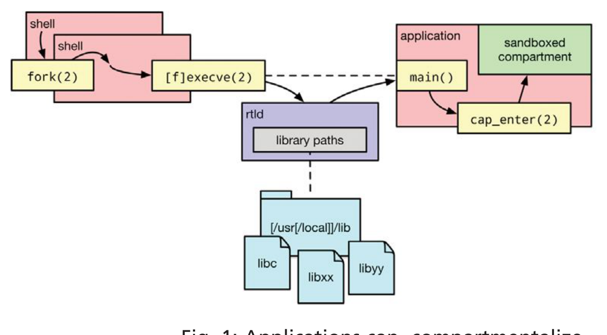
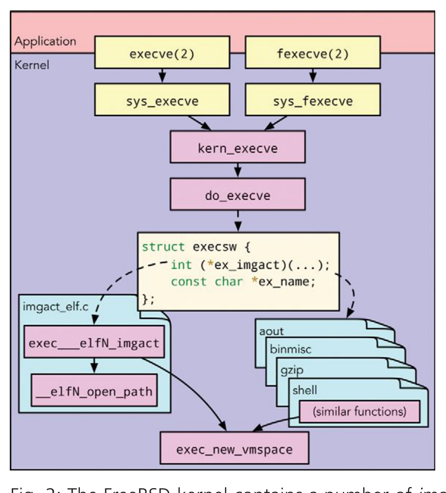
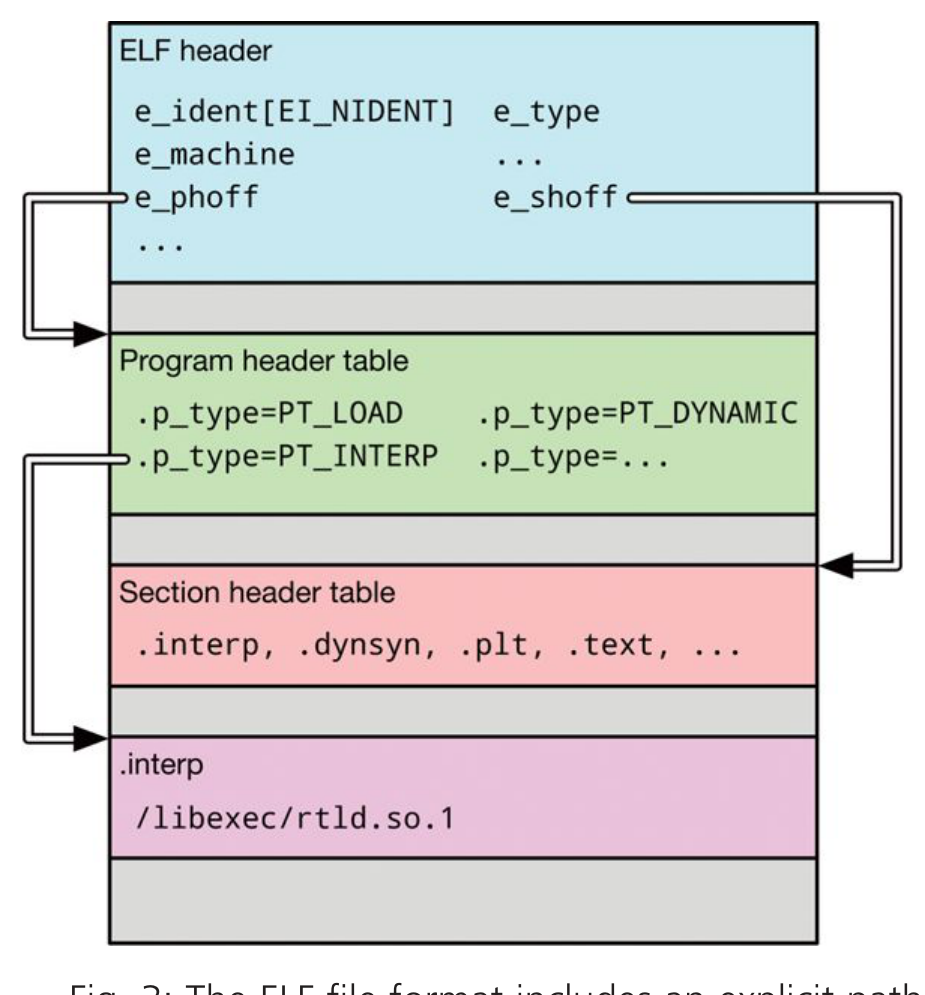
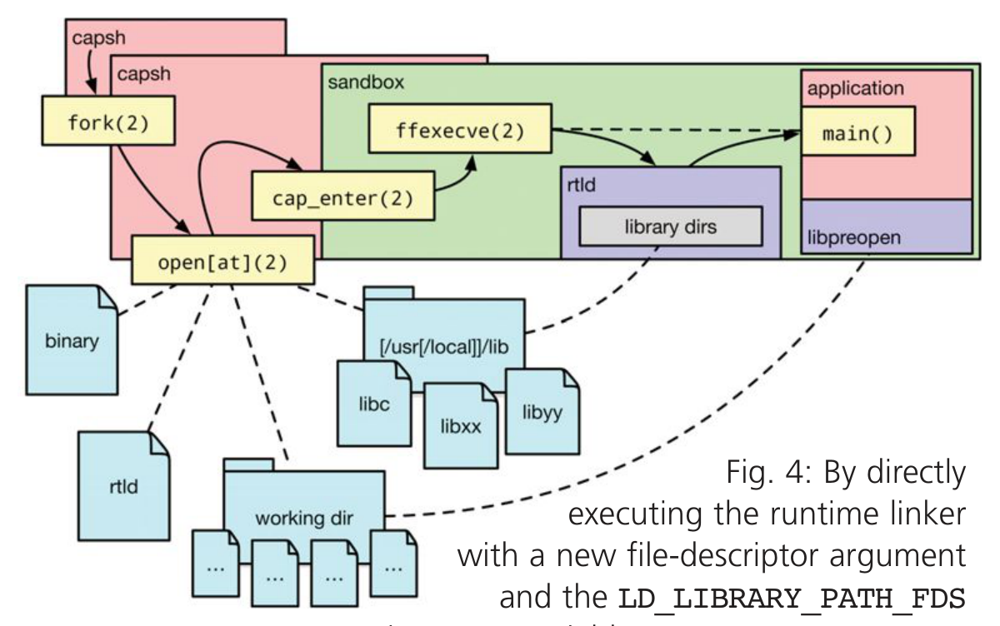
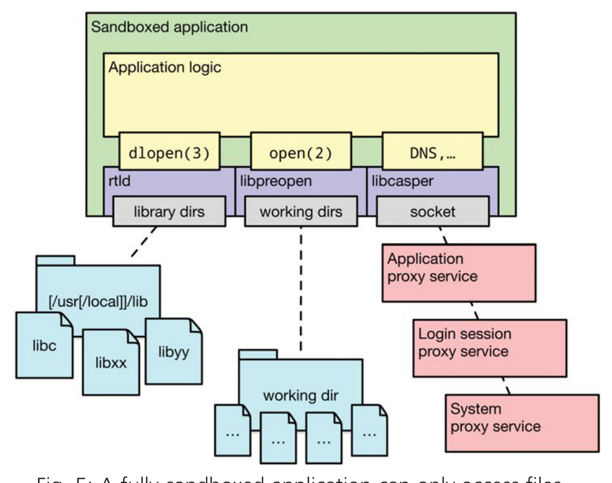

# 走向无感知沙箱：Capsicum

作者：Jonathan Anderson、Stanley Godfrey 和 Robert N. M. Watson

Capsicum [Wat+10] 是一个框架，用于对 FreeBSD 应用程序进行有原则、连贯的分隔。

它之所以有原则，是因为它汲取了计算机安全概念的丰富历史，如能力（capability）——授权持有者执行操作的令牌，例如从文件中读取（使用文件描述符作为令牌，非常类似于能力）或调用方法（使用对象引用作为能力）。Capsicum 之所以连贯，是因为它在应用程序中统一应用清晰、简单的安全策略。不可能出现在限制应用程序对一组操作的访问时，却留下等效操作可用的情况——这在其他方案中是可能发生的。当我们说 Capsicum 提供有原则、连贯的分隔时，是指它允许应用程序将自身拆分为相互隔离且与其他应用程序隔离的隔间。正如注重隐私的公司将用户数据加密密钥置于自身触及范围之外，Capsicum 允许应用程序及其隔间放弃某些能力以保护其他隔间、其他应用程序，最终保护它们的用户。然而，Capsicum 当今的一个显著局限是它只在应用程序自愿放弃执行某些操作的权利时才起作用。它适用于理解 Capsicum 并已修改以利用它的应用程序；到目前为止，Capsicum 尚未提供无需应用程序配合即可限制它们的机制。这是我们的长期目标：将应用程序放入沙箱而无需修改应用程序本身，使得应用程序中被攻击者利用的任何漏洞，其危害都能被限制在应用程序的内存和输出中，而不是授予对用户所有数据和活动的完全访问权限。本文描述了推进这一议程的近期和正在进行的工作，追求的愿景是无论应用程序是否愿意，都能保护我们免受脆弱应用程序的侵害。

## 一窥 Capsicum 的现状

如今，Capsicum 允许应用程序通过两种机制保护自身、其他应用程序及其用户免受自身的侵害：能力模式和能力。

### 能力模式

能力模式是一种限制进程的方式，阻止它访问进程间共享的任何命名空间，如文件系统命名空间、进程标识符（PID）命名空间、套接字地址命名空间和进程间通信（IPC）命名空间（System V 和 POSIX）。它对文件和其他系统对象的唯一访问通过能力进行中介，能力将在下文描述。一旦进程进入能力模式，它将失去访问这些命名空间的所有能力，且无法离开能力模式（从该点起由它 `fork` 出的任何进程也不行）。Capsicum 的第一个关键概念创建了强隔离：如果进程无法打开任何资源且不持有能力，它就无法影响其他进程的操作或留下任何副作用。但要让应用程序做有用的工作，某些通信和/或副作用是必要的。从安全角度看，关键在于确保这些交互以受控方式发生。

### 能力

Capsicum 的第二个关键概念——能力——允许应用程序以受控方式被授予对潜在共享资源的访问。Dennis 和 Van Horn 在 1966 年 [DV66] 描述的能力，由对象的标识符或地址连同使用该能力可对该对象执行的操作描述组成。在 Dennis 和 Van Horn 的模型中，计算发生在保护域（“保护范围”）内，通过内核维护的 C-list 的索引访问资源。这种用户态通过内核维护数组中的索引对系统资源执行有限操作的模型，对当前从业者来说应该很熟悉：能力是 PSOS 设计 [FN79] 的核心，PSOS 深刻影响了 Multics 的设计 [SCS77]，而 Multics 直接启发了 Unix 及其文件描述符 [RT78]。然而，从能力到现代文件描述符的旅程中，有些东西在转译中丢失了：对能力作为安全策略的单调编码（即拥有一组可缩减但永不增加的允许操作）的严格、有原则的专注。Unix 在文件系统中对用户 ID 的关注自然导致文件描述符角色的扩展，使得通过文件描述符允许的操作集包含未在描述符本身中表达、但基于文件系统中编码权限的操作。例如，大多数类 Unix 系统允许用户以只读模式 **open(2)** 一个只读文件，然后 **fchmod(2)** 将其改为可写文件（见清单 1）。这是文件描述符更强调能力的身份方面而非操作的例证。Capsicum 能力为文件描述符恢复了对允许操作的严格专注。在 FreeBSD 10 及更高版本中，每个文件描述符都与一组明确的权限相关联，定义了可对该文件描述符执行的操作。在能力模式之外，文件描述符以全部权限打开以保留传统文件描述符语义。当描述符被显式限制或从其他能力派生（例如通过相对于目录能力的 **openat(2)**）时，只有能力显式允许的操作可通过该能力执行。有与现有 **open(2)** 标志对应的能力权限，如 `CAP_READ` 和 `CAP_WRITE`，但也有将以前隐含的特权变为显式策略的权限，如 `CAP_SEEK`、`CAP_MMAP`、`CAP_FTRUNCATE` 和 `CAP_FCHMOD`。能力是单调的：能力的持有者始终可通过 **cap_rights_limit(2)** 放弃与该能力关联的权限，但永远不能向现有能力添加新权限。如果能力模式中的进程需要它尚未拥有的访问权限，它必须从确实有权委派该权限的另一个进程获取。与所有文件描述符一样，

```c
int fd = open("my-data.dat", O_RDONLY);
if (fchmod(fd, 0777) < 0)
    err(-1, "unable_to_chmod");    // 通常不会执行！
```

清单 1：文件描述符允许的操作超出描述符中直接表达的范围——此例中，只读文件描述符被用于修改文件属性。

能力可通过继承或 IPC 从一个进程委派给另一个进程，但由于其强单调保证，能力可以被放心委派：具有 `CAP_READ` 的能力可以与能力模式中的不受信任进程共享，确切知道它不能用于 **fchmod(2)** 文件或执行 **read(2)** 以外的任何操作。（FreeBSD 9 中能力的实验性实现涉及额外间接：一个包含一组权限和指向底层 `struct file` 指针的 `struct capability`。）

允许用户态进程定义自己的“安全”系统调用集合的尝试（如 Linux 的 seccomp-bpf [Cor12] 或 OpenBSD 的 **pledge(2)** 机制 [Chi15]），可能导致不连贯的安全策略——禁止对系统资源的一种访问方式，却允许通过另一路径进行等效访问。这可能使尚未完全沙箱化的进程在虚假安全感下暴露于恶意数据。相比之下，Capsicum 由内核定义的能力模式充分且必要地表达了与全局操作系统命名空间的隔离，是一种连贯且易于理解的安全策略。能力模式的简单性和可靠性帮助应用程序开发者有效使用它，只要其应用程序符合先获取资源再进行计算的简单模型。Capsicum 也不需要特权即可让应用程序分隔自身，这不同于依赖强制访问控制（MAC）的方法（如 SELinux [LS01] 或 AppArmor [BM06]）或依赖 Linux 命名空间 [Bie06] 的方法。这些方法需要系统管理员支持和/或 setuid 辅助二进制文件才能被应用程序使用，而 Capsicum 可应用于任何开发者编译和运行的程序。

### 用 Capsicum 分隔

要利用 Capsicum，应用程序（包括主应用程序进程的 **fork(2)** 子进程）在暴露于任何不可信数据（如网络请求）之前调用 **cap_enter(2)**。一旦进程分隔自身，它就可以开始执行潜在危险的操作，如解析网络流量或用户输入，并确信任何恶意利用最多只会导致进程显式输出（文件、网络响应等）的损坏。当进程能够在进入能力模式之前打开其所需的所有资源时，这种自沙箱方法效果良好。在分隔前需要打开的最明显资源是文件和套接字，但在现代二进制文件中，即使像 **cat(1)** 或 **echo(1)** 这样简单的程序，动态链接也意味着必须在分隔前加载一组共享库。如图 1 所示，运行时链接器在进程内运行，共享其地址空间，并在启动时共享其主线程。

## 为什么选择 Capsicum？

Capsicum 是一种有原则且连贯的方式来在应用程序中构建隔间。它有原则，因为它依赖概念上严格的机制来执行清晰的安全策略，这些策略由于能力的单调性可自然组合。正如 Linden 在 1976 年的操作系统安全与可靠性调查 [Lin76] 中观察到的，“一种无例外使用的通用保护机制，优于有许多例外的僵化机制。”能力自然映射到许多程序需求，因为今天的软件已经围绕对作为具有显式方法的对象的文件的引用式访问来组织。Capsicum 的连贯性源于其“内核深处”的实现以及其对能力和能力模式的简单而完整的定义。尝试提供“浅层”系统调用包装（如 Provos 的 systrace [Pro03]）无法提供对安全策略评估至关重要的原子性保证：当内核看到的对象和操作受安全策略的竞争影响时，策略执行会被削弱。



图 1：应用程序可通过在调用 **cap_enter(2)** 之前从全局命名空间获取静态资源来分隔自身。

大多数简单应用程序只需运行时链接器在启动时找到所有库，之后即可进入能力模式，让运行时链接器从已打开的库文件中按需修复动态符号。沙箱隔间可能需要访问的其他静态资源包括显式文件——可由应用程序在调用 **cap_enter(2)** 前预打开，或通过预打开的目录描述符访问，然后隔间通过 **openat(2)** 及相关系统调用（**fstatat(2)**、**renameat(2)** 等）访问。隐式资源包括许多 libc 函数所需的区域设置文件，但这些也可预打开并缓存其结果。更动态的资源需要与外界连接，使沙箱进程能请求非沙箱进程访问新资源。这种操作模式在许多平台的分隔化应用程序中广泛采用，包括 Web 浏览器——也许令人惊讶的是——还包括通过 Mac App Store 下载的所有 macOS 应用程序，其中所有请求访问用户文件的应用程序都必须通过一个称为 powerbox 的可信 UI [App16; Yee04]。为帮助满足这些更动态应用程序的需求，FreeBSD 包含 libcasper（能力服务提供者 [Zab16]）机制来代理对命名服务的访问，其中一些（如 `system.dns`）由系统本身提供。有了预打开的能力、区域设置缓存、目录描述符、libcasper 和外部代理，许多应用程序能够用 Capsicum 分隔自身。然而，这只适用于那些愿意投入精力采用 Capsicum 特性并调整应用程序以适应分隔的作者。如果我们能够透明地对应用程序进行沙箱处理而不对其作者施加任何额外要求——即采用无感知沙箱——将能产生更大影响。

## 走向无感知沙箱：进展与实现

以无感知沙箱为目标，Capsicum 的工作在 FreeBSD 的运行时链接器、一个新库和一个新的具备能力感知（但功能不完整）的 shell 中取得了进展。最近，其中一些组件开始开花结果，带来了一项令人兴奋的新发展：在 Capsicum 能力模式内首次实现了对未修改应用程序的透明沙箱。目前能以这种方式执行的应用程序非常简单，但它们在没有全局命名空间访问权限且无需任何修改的情况下运行：它们不是自行沙箱化，而是从沙箱中诞生。

### 无名称的 **exec(2)**

一个应用程序执行另一个应用程序的传统方法是先 **fork(2)** 一个子进程，然后在该新进程中调用 **exec(2)** 开始运行新程序。**exec(2)** 系统调用清理当前进程的内存映射，关闭所有设置了标志 `O_CLOEXEC` 的文件描述符（保留所有其他打开的文件以及当前环境变量），并将控制权转移给新应用程序。为此，**exec(2)** 必须先找到要执行的二进制文件。按名称查找二进制文件——如传统 **exec(2)** 调用那样——需要访问全局文件系统命名空间；这在能力模式中不被允许。FreeBSD 提供了 **fexecve(2)** 系统调用来执行由文件描述符（可以是能力）指定的二进制文件，而非按路径名执行。在 Linux 上，**fexecve(3)** 是一个 glibc 函数，使用文件描述符在 **/proc/self/fd** 中查找符号链接，然后以该路径名调用 **exec(2)**。Linux 的 Capsicum 实现需要添加一个具有真正文件描述符语义的 **execveat(2)** 系统调用 [Dry14]。**fexecve(2)** 运行时，会检查传递给它的文件以确定其类型（ELF 可执行文件、脚本、a.out 可执行文件等），并将其传递给内核中的映像激活器（见图 2）。映像激活器解析各种类型的可执行文件并开始运行它们；ELF 映像激活器（32 位和 64 位）编码了对运行时链接器的了解以及如何在文件系统中找到它们。



图 2：FreeBSD 内核包含若干映像激活器，用于解析各种类型的可执行文件并开始运行它们。

虽然各种平台的各种 ABI 有默认的运行时链接器名称，但二进制文件也可显式编码首选运行时链接器的路径，如图 3 所示。无论是通过程序内部格式头部发现还是映像激活器的默认值，运行时链接器都通过路径名描述。在传统的 **exec(2)** 或 **fexecve(2)** 调用中，运行时链接器将使用此路径查找并首先执行，然后才运行新应用程序的 `main` 函数（如图 1 所示）。然而在 Capsicum 隔间内，不允许访问



图 3：ELF 文件格式包含指向预期用作二进制文件解释器的运行时链接器的显式路径。

全局文件系统命名空间，因此需要另一种方法。FreeBSD 的运行时 ELF 链接器最近已被修改以支持直接执行，即在 FreeBSD 12-CURRENT 上可将 **/libexec/ld-elf.so.1** 作为可执行文件运行——撰写本文时的用法字符串如清单 2 所示。这种能力在 Linux 的 `ld-linux.so.2` 中早已存在，但在 FreeBSD 上直到无感知沙箱的需求出现前并不需要。如今，直接执行已与运行时链接器接受要链接和运行的文件描述符作为命令行参数的能力一同实现——这些更改将出现在 FreeBSD 12 和 11.1 中。它们使得能力模式中拥有运行时链接器和二进制文件能力的进程能够 **fexecve(2)** 链接器，保留打开的文件（包括二进制文件的能力），并通过命令行参数指定链接器要执行的文件。最终结果如图 4 所示，指定的二进制文件使用指定的运行时链接器执行。然而，如果无法访问存储在文件系统中的共享库，运行时链接器将无法满足应用程序的动态代码加载需求。这需要额外的机制：库路径描述符。



图 4：通过用新的文件描述符参数和 `LD_LIBRARY_PATH_FDS` 环境变量直接执行运行时链接器，`capsh` 可在 Capsicum 沙箱内执行不受信任的程序。此应用程序启动时没有访问全局命名空间的环境权限。

### 能力模式中的共享库

如前所述，基本上所有现代可执行文件都是动态链接的，因此依赖对共享库的访问才能正确执行。事实上，基于 FreeBSD 的 macOS 不支持静态链接二进制文件：ABI 保证只在核心系统库的接口层面而非内核层面维护 [App11]。当应用程序通过 **cap_enter(2)** 分隔自身时，可以在动态运行时链接器发现库依赖并 **mmap(2)** 它们到位以供后续链接之后进行。但如果应用程序在这些库打开之前就开始运行，链接器将无法满足动态符号解析的需求。传统上，动态运行时链接器支持若干控制其行为的环境变量。例如 `LD_LIBRARY_PATH` 告知链接器一组可找到额外库的目录。例如，程序可将 `LD_LIBRARY_PATH` 设为包含应用程序代码或可动态加载插件的内部目录。我们扩展了 FreeBSD 的 ELF 运行时链接器以支持一个额外的环境变量 `LD_LIBRARY_PATH_FDS`。此变量允许指定包含共享库的目录，其搜索方式与 `LD_LIBRARY_PATH` 完全相同，但有一个关键区别：此变量包含的不是以冒号分隔的路径名列表，而是以冒号分隔的目录描述符列表。由于环境变量和打开的文件都在 **fexecve(2)** 边界上保留——不像内存映射那样——这允许父进程打开一组库描述符，设置 `LD_LIBRARY_PATH_FDS`，然后进入能力模式并 **fexecve(2)** 运行时链接器本身，使其能访问其共享库目录。结合上一节描述的直接执行支持，这允许从沙箱内执行动态链接的应用程序。

```sh
Usage: /libexec/ld-elf.so.1 [-h] [-f <FD>] [--] <binary> [<args>]
Options:
  -h        显示此帮助信息
  -f <FD>   执行 <FD> 而非搜索 <binary>
  --        RTLD 选项结束
  <binary>  要执行的进程名称
  <args>    传递给所执行进程的参数
```

清单 2：FreeBSD 的 ELF 运行时链接器当前用法选项。

### libpreopen：透明文件系统代理

能够在沙箱内执行代码（包括动态链接的代码）很有用，但对无感知沙箱的目标而言还不够。大多数 Unix 应用程序使用 **access(2)**、**stat(2)**、**open(2)** 等常见系统调用来测试和获取对文件系统中文件的访问。这些系统调用本质上需要访问全局文件系统命名空间，因此能力模式中不允许使用它们。可以编写使用 **fstatat(2)**、**openat(2)** 等相对于显式基目录的应用程序，但许多现有应用程序并非如此编写。为实现无感知沙箱，必须在不修改应用程序的情况下限制应用程序并提供资源。我们可以利用运行时链接器在运行时将系统调用从能力不安全版本转换为能力安全版本进行插入：`LD_PRELOAD` 环境变量允许我们指定应最先加载的库。当以此环境变量命名库而不使用绝对路径时，运行时链接器在其默认搜索路径中搜索给定名称的库，但会先查询 `LD_LIBRARY_PATH_FDS`，使 `LD_PRELOAD` 成为能力模式兼容的指令。如果我们提供 libc 函数（如 **open(2)**）的实现，我们的实现将优先于 libc 中定义为“弱”符号的版本。我们的 **open(2)** 实现可将提供的参数 `path` 转换为 **openat(2)** 调用，但单靠这种调整达不到目的：应用程序仍会尝试查找不相对于目录的路径名，只不过这次它会使用 **openat(2)** 而非 **open(2)**。使文件系统命名空间操作适用的最后一个组件是一组预打开的目录描述符，其他操作可相对于它们执行。这是 libpreopen 提供的核心抽象——目前独立于 FreeBSD 维护的库。（libpreopen 可从 <https://github.com/musec/libpreopen> 下载并构建。）libpreopen 提供 `struct po_map` 类型，用于将目录名映射到目录描述符、标志和能力权限，以及 libc 包装器，可查找和查询默认 `po_map`。例如，当 libpreopen 的 **open(2)** 实现收到绝对路径时，它查找默认 `po_map`，该 `po_map` 可作为数据打包到匿名共享内存段中指定。FreeBSD 的 POSIX 共享内存实现允许将常量“路径”`SHM_ANON` 传递给 **shm_open(2)**，创建一个可通过文件描述符操作但不出现在常规 POSIX 共享内存命名空间中的共享内存段，使其在能力模式中安全使用。libpreopen 可打开这样一个共享内存段（由环境变量中的文件描述符指定），并将其数据解包到内存中的 `struct po_map` 对象。从该 `po_map`，包装器查询：“你是否有名称是此绝对路径前缀的目录描述符？”如果映射中存在这样的描述符，绝对路径被分解为目录描述符和从该描述符出发的相对路径。这两个元素随后可传递给 **openat(2)**。libpreopen 为能力模式中的进程提供了访问文件系统资源的机制，只要一些目录描述符已预打开并以库可访问的方式存储。打开此类描述符、构建 `struct po_map` 表示、将其打包到匿名共享内存中并将共享内存段的文件描述符存储在环境变量中，这些都是

### capsh：能力增强的 shell

基于 Capsicum 的无感知沙箱的最后一个主要组件是一个透明地沙箱化未修改——且毫不知情——的应用程序的程序。此类程序的概念验证实现是 `capsh`，一个使用能力和能力模式沙箱化应用程序的 shell。`capsh` 目前独立于 FreeBSD 托管，允许用户从 Capsicum 沙箱内执行简单的未修改应用程序。（`capsh` 源代码可从 <https://github.com/musec/capsh> 获取。）在当前实现中，该程序几乎算不上 shell：它没有交互模式，每次调用只执行一个程序。它也只支持具有静态可枚举资源需求的简单应用程序。尽管如此，符合此模型的程序可以从创建之初就被沙箱化而无需修改程序。`capsh` 通过将上述无感知沙箱拼图的各部分串联起来工作。它查找并打开用户指定的可执行文件以及解释它的运行时链接器。它打开库目录并存储在

`LD_LIBRARY_PATH_FDS` 环境变量中。它操作预打开的目录描述符，将它们存储在 libpreopen 提供的 `struct po_map` 类型中，并通过共享内存和环境变量使它们可用于子进程。然后通过 **cap_enter(2)** 进入能力模式，并使用 **fexecve(2)** 执行运行时链接器。最终结果是，未修改的应用程序从 Capsicum 沙箱内开始运行，如图 4 所示。

## 无感知沙箱

在 `capsh` 下运行的应用程序只能访问显式委派给它们的资源；关于应委派哪些资源，可有多种策略来源。用户运行 `capsh` 时通过向沙箱化应用程序键入命令行参数隐式指定策略：文件名作为参数出现可能表明该文件应在应用程序执行前预打开，或应通过 `libcasper` 等代理机制授予打开它的权限。用户也可通过与图形用户界面的交互隐式驱动策略决策，如前文“用 Capsicum 分隔”一节中描述的 powerbox 模型，`capsh` 的未来工作可连接到现有的图形登录会话模型以提供这种策略获取方式。策略也可从与应用程序一起打包的文件中得出：编译器的软件包元数据可指定其标准库的位置，`capsh` 可预打开该目录并赋予只读能力。更复杂的策略文件可描述与命名 libcasper 服务的有限交互，从而形成如图 5 所示更通用的 Capsicum 应用程序模型。机制的进一步探索也是可能的：本文作者特别感兴趣的是对嵌入 LLVM 位代码的库和应用程序应用基于 LLVM 的转换，允许透明重写函数调用为能力模式友好的 API，而无需 `LD_PRELOAD` 进行插入。



图 5：完全沙箱化的应用程序只能访问已委派给它的文件和服务：运行时链接器可通过 `LD_LIBRARY_PATH_FDS` 在预打开的目录中查找库，libpreopen 可操作预打开工作目录中的文件——将 **open(2)** 等依赖全局命名空间的系统调用转换为 **openat(2)** 等相对变体——而 libcasper 可代理对外部服务器命名空间的访问。

## 结论

Capsicum 作为一种有原则且连贯的软件分隔设计，近日已迈向新的安全模型。FreeBSD ELF 运行时链接器的更改，加上 libpreopen 和 `capsh` 的发展，使简单应用程序能被透明沙箱化而无需应用程序方面的任何参与。这些基础元素已为更深入探索编程模型如何与分隔需求交互以及软件能在多大程度上被无感知沙箱化（正常运行而无需知道自身是否在沙箱中运行）奠定了基础。无感知沙箱更广泛的可用性将使我们迈向一个应用程序“即装即用”且默认安全的 FreeBSD。•

---

**Jonathan Anderson** 是纽芬兰纪念大学电气与计算机工程系的助理教授，研究横跨操作系统、安全和编译器等软件工具。他是 FreeBSD 提交者，并一直在寻找志趣相投的新研究生。

**Stanley Godfrey** 是纽芬兰纪念大学的研究生。他的研究兴趣是 Capsicum、FreeBSD 和操作系统安全。他在赫尔辛基都市应用科学大学完成本科学习，主修软件开发，获信息技术工程学士学位。

本研究由纽芬兰与拉布拉多研究与发展公司（合同 5404.1822.101）、NSERC Discovery 项目（RGPIN-2015-06048）以及美国国防高级研究计划局（DARPA）和美国空军研究实验室（AFRL）资助，合同编号 FA8650-15-C-7558。本文所含的观点、意见和/或发现均为作者本人观点，不应被解读为代表美国国防部或美国政府的官方观点或政策，无论明示或暗示。

**Dr. Robert N. M. Watson** 是剑桥大学计算机实验室的高级讲师（副教授），领导横跨操作系统、安全和计算机体系结构的研究。他是 FreeBSD 开发者、FreeBSD 基金会董事会成员，并合著了《FreeBSD 操作系统设计与实现》（第二版）。

[App11] Apple Inc. “Technical Q&A QA1118: Statically linked binaries on Mac OS X,” Apple Developer Guides. <https://developer.apple.com/library/content/qa/qa1118>. (2011)
[App16] Apple Inc. “App Sandbox in Depth,” Apple Developer Guides. <https://developer.apple.com/library/content/documentation/Security/Conceptual/AppSandboxDesignGuide/AppSandboxInDepth/AppSandboxInDepth.html>. (2016)
[Bie06] Biederman, Eric W. “Multiple Instances of the Global Linux Namespaces,” Linux Symposium Volume One, pp. 101–111. <https://www.landley.net/kdocs/ols/2006/ols2006v1-pages-101-112.pdf>. (2006)
[BM06] Bauer, Mick. “Paranoid Penguin: An Introduction to Novell AppArmor,” Linux Journal 2006.148, p. 13. ISSN: 1075-3583. URL: <https://dl.acm.org/citation.cfm?id=1149839>. (2006)
[Chi15] Chirgwin, Richard. “Untamed pledge() aims to improve OpenBSD security: Monkey with the wrong permissions, your program dies,” The Register. <https://www.theregister.co.uk/2015/11/10/untamed_pledge_hopes_to_improve_openbsd_security>. (2015)
[Cor12] Corbet, Jonathan. “Yet another new approach to seccomp.” <https://lwn.net/Articles/475043/>. (2012)
[Dry14] Drysdale, David. “syscalls, x86: Add execveat() system call,” Linux Kernel Mailing List. <https://lkml.org/lkml/2014/5/27/147>. (2014)
[DV66] Dennis, Jack B. and Van Horn, Earl C. “Programming semantics for multiprogrammed computations,” Communications of the ACM 9.3, pp. 143–155. DOI: 10.1145/365230.365252. (1966)
[FN79] Feiertag, R. J. and Neumann, Peter G. “The foundations of a provably secure operating system (PSOS),” NCC ’79: Proceedings of the 1979 AFIPS National Computer Conference. DOI: 10.1109/AFIPS.1979.116. (1979)
[Lin76] Linden, Theodore. “Operating System Structures to Support Security and Reliable Software.” ACM Computing Surveys (CSUR) 8.4, pp. 409–445. DOI: 10.1145/356678.356682. (1976)
[LS01] Loscocco, Peter A. and Smalley, Stephen D. “Meeting Critical Security Objectives with Security-Enhanced Linux,” Proceedings of the 2001 Ottawa Linux Symposium. <https://lwn.net/2001/features/OLS/pdf/pdf/selinux.pdf>. (2001)
[Pro03] Provos, Niels. “Improving Host Security with System Call Policies,” Proceedings of the 12th USENIX Security Symposium. <http://niels.xtdnet.nl/papers/systrace.pdf>. (2003)
[RT78] Ritchie, O. M. and Thompson, K. “The UNIX time-sharing system,” Bell System Technical Journal 57.6, pp. 1905–1929. ISSN: 0005-8580. DOI: 10.1002/j.1538-7305.1978.tb02136.x. (July 1978)
[SCS77] Schroeder, Michael D.; Clark, David D.; and Saltzer, Jerome H. “The Multics kernel design project,” SOSP ’77: Proceedings of the Sixth ACM Symposium on Operating Systems Principles. ACM. DOI: 10.1145/800214.806546. (1977)
[Wat+10] Watson, Robert N. M.; Anderson, Jonathan; Laurie, Ben; and Kennaway, Kris. “Capsicum: practical capabilities for UNIX,” Proceedings of the 19th USENIX Security Symposium. <https://www.usenix.org/legacy/events/sec10/tech/full_papers/Watson.pdf>. (2010)
[Yee04] Yee, Ka-Ping. “Aligning security and usability,” IEEE Security and Privacy Magazine 2.5, pp. 48–55. ISSN: 1540-7993. DOI: 10.1109/MSP.2004.64. (2004)
[Zab16] Zaborski, Mariusz. “libcasper(3),” FreeBSD Library Functions Manual. <https://www.freebsd.org/cgi/man.cgi?query=libcasper>. (2016)
