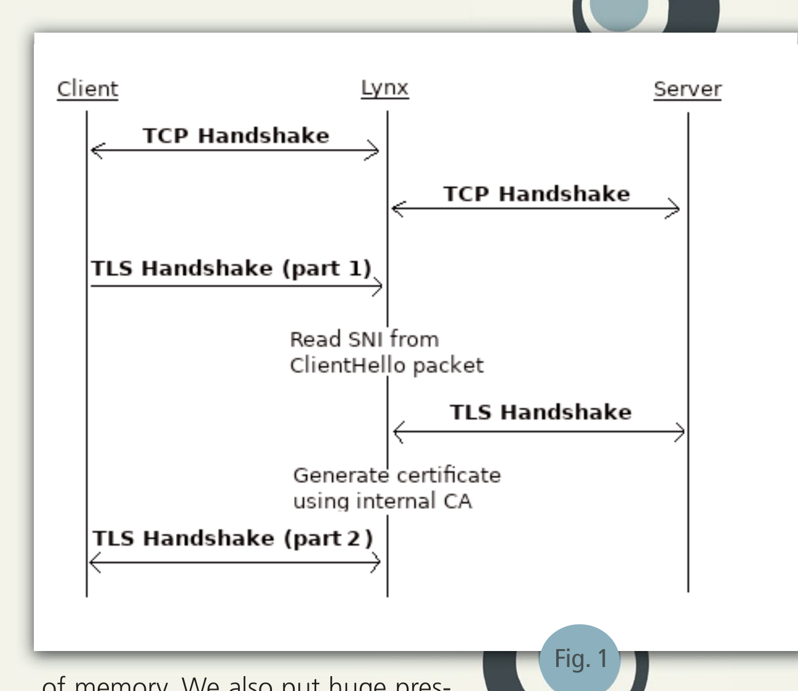
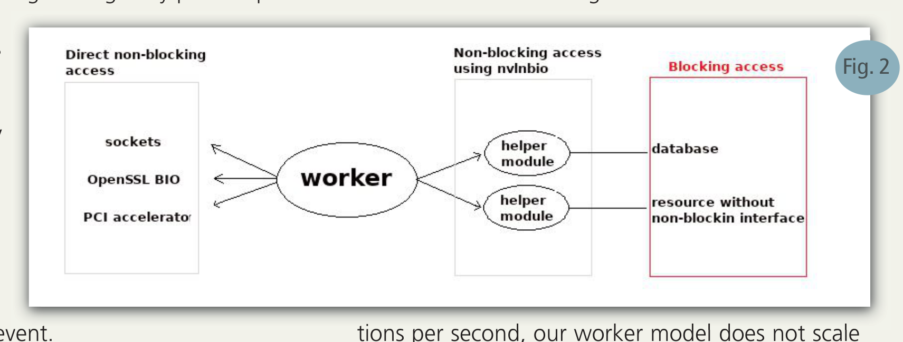
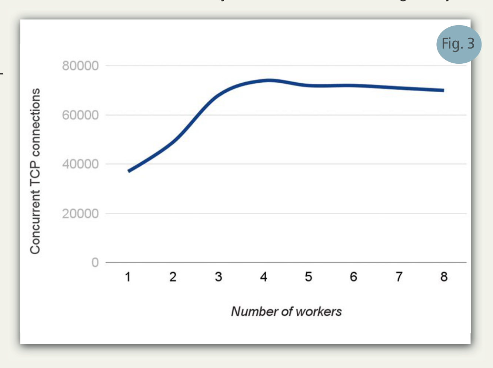
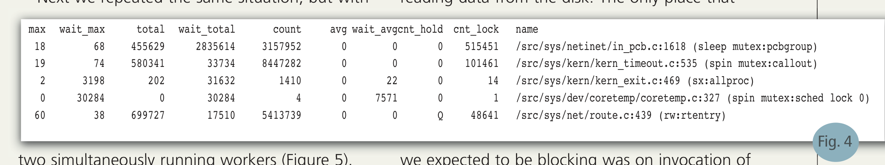
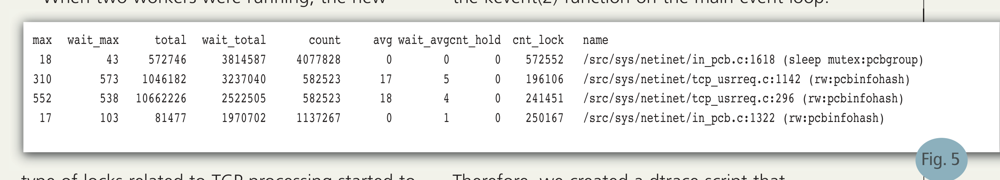
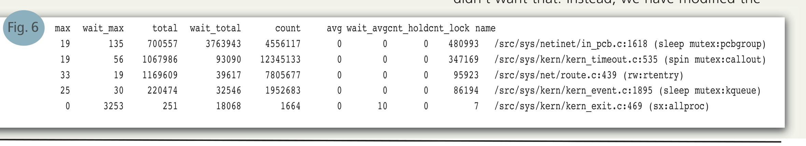
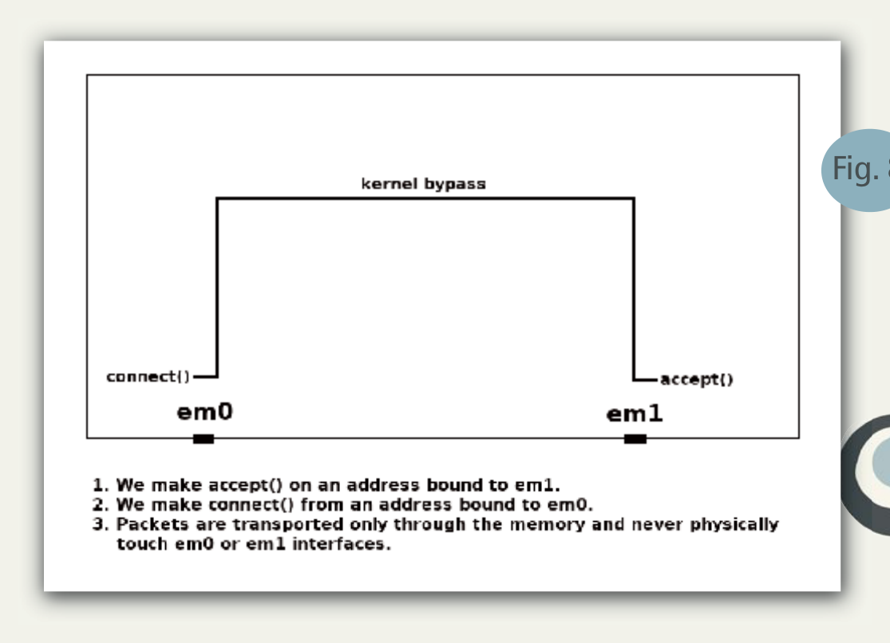
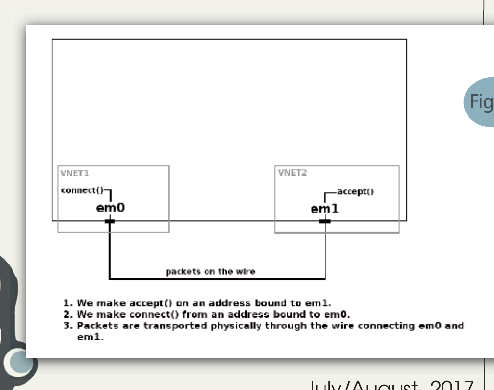
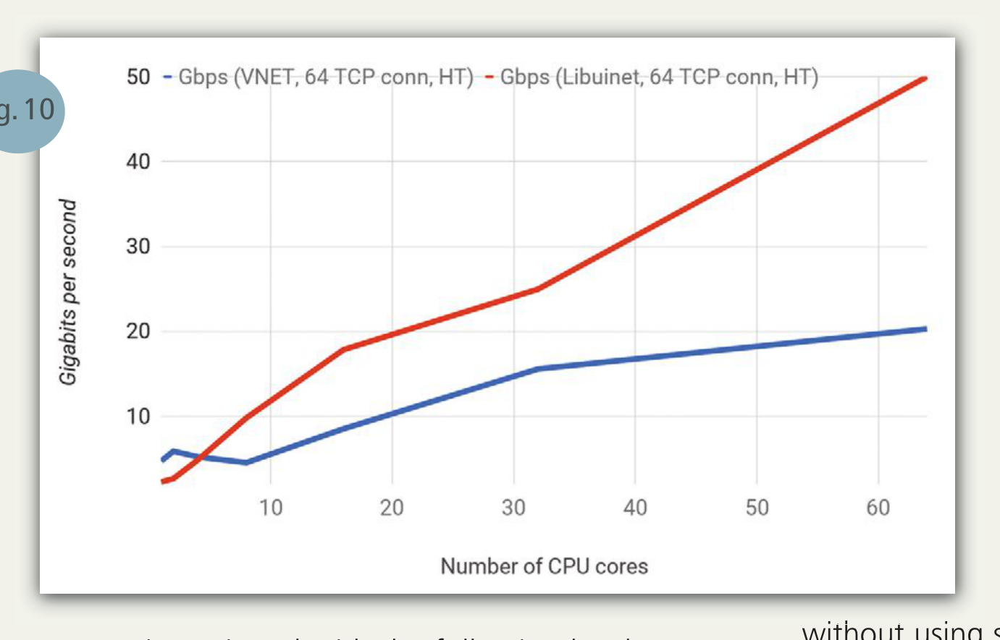

# Lynx 网络流量分析

作者：Pawel Jakub Dawidek 与 Milosz Kaniewski

过去几年，企业网络内部 TLS 连接的数量大幅增长。去年加密互联网流量占比超过 50%，而且这一趋势短期内不会放缓。看到加密被广泛采用当然是好事，但别忘了安全有多副面孔。

在企业网络中，安全团队必须控制与外部世界交换的流量。传入流量可能包含病毒或勒索软件等有害软件。恶意软件作者已开始使用 TLS 隐藏本不应被安全软件检测到的流量。此外，如今可以免费获得受信任证书，“浏览器地址栏的挂锁图标意味着网页安全”这类假设不再成立。从本地网络到互联网的流量控制也存在巨大需求——其中可能包含绝不应离开公司内部基础设施的机密数据。流量分析领域有大量专用工具市场，帮助网络管理员为网络流量控制提供必要的安全保障和指导。然而，IDS（入侵检测系统）、IPS（入侵防御系统）和 DLP（数据泄露防护）工具在监测的流量被加密（例如用 TLS 协议）时可能无能为力。处理这个问题的一种办法是阻断全部 TLS 流量，但如今这显然完全不切实际。获得洞察的唯一办法是使用受控的中间人（MiTM）技术，下文将详细描述。由我们公司开发的 Lynx 是一款企业级产品，执行以安全为导向的 TLS 拦截。借助 FreeBSD 作为基本系统，我们打造出的产品在性能上能大幅超越市场上领先厂商的同类产品。本文中，我们希望分享一些经验。过去两年间，我们测试并试验了多种快速包处理方案。希望我们的故事对所有关注网络系统架构的人都有所启发。

Lynx 需要处理两条独立的 TLS 连接：一条与客户端，一条与服务器。作为两条连接的中间一环，Lynx 能够查看在两个方向上传输的解密流量。这些解密数据随后可发送给其他工具，由它们分析内容，查找恶意软件或数据泄露。

## TLS 拦截

如前所述，要正确拦截 TLS 连接，必须使用受控的 MiTM 技术（图 1）。首先，我们伪装成目标服务器，接受来自客户端的 TCP 连接。接下来，我们创建到目标服务器的第二条 TCP 连接。此后，我们就可以在客户端和服务器之间转发数据包，从而看到载荷内容。接着，我们开始分析客户端发送的包，检查是否存在 TLS Client Hello 包——它会标记 TLS 会话的开始。检测到这种包时，我们检查 Server Name Indication（SNI）扩展，如果存在就保存它。该扩展用于允许服务器在单一 IP 地址上提供多张证书。比如有两个服务器 example1.org 和 example2.org，都托管在同一 IP 地址上，SNI 让服务器选择向客户端出示哪张证书。服务器也可能拥有一张同时匹配两个 SNI 的证书。但这并非必须，服务器可以有两张证书，如本例所示。读取 SNI 后，我们暂停与客户端的通信，与服务器建立新的 TLS 会话（当然使用刚刚保存的同一个 SNI）。建立这条 TLS 连接后，我们就知道服务器证书长什么样。有了这个信息，我们可以生成几乎相同的证书，并用自定义证书颁发机构（CA）签名。然后我们恢复与客户端的通信，完成 TLS 握手并出示刚刚生成的证书。要让 TLS 会话成功，客户端需要信任这张证书。通常在企业网络中，TLS 客户端（如 Web 浏览器）已被配置为信任用于签名内部资源证书的附加 CA 证书。如果 Lynx 使用相同的 CA（或子 CA）来签名为其生成的证书，客户端会自动信任它们。这一步结束协商阶段，留下两条 TLS 通道：一条与客户端，一条与服务器。可以看到，对每条被拦截的 TLS 会话……



## Lynx 架构的起点

我们试验过的最初版本架构是每条连接一个进程。当然，从性能角度看这是非常天真的做法，但有一些极佳的安全特性——我们可以用 Capsicum 把每个进程关进非常紧密的沙箱，从而隔离每条连接。这种架构下，我们能处理的连接数相对较少：受系统进程数限制（默认是 100,000），而且需要大量内存。我们也给调度器造成巨大压力，因为数据包到达时要不断在所有这些进程间切换。我们甚至没尝试优化这种架构，因为它无法让我们处理数十万并发连接——而这已经是我们的目标。使用线程也不是选项，因为这会带来相同问题（主要是调度开销）。我们转而采用完全非阻塞、事件驱动的架构。这种包处理方式当时已在 Nginx 等一些网络应用中实现。顾名思义，它基于两个核心概念：

- **非阻塞**：在非阻塞编程中，用户程序绝不执行会阻塞其执行的操作。如果某个资源不能立即可用，函数就返回，由用户负责稍后再次调用。
- **事件驱动**：用户程序需要知道何时应重试非阻塞操作。在经典模型中，用户程序定期轮询指定资源以检查其状态变化。但轮询代价较高。通常更好的方案是让操作系统通知用户程序资源可用。这类信息称为事件。

这种架构的结果是数量有限且较少的工作进程。所有 worker 都监听同一个 accept socket，由内核负责将传入连接公平地分配给它们。通过把 worker 绑定到特定 CPU，我们保证调度开销完全察觉不到。要把 Lynx 适配到这种新模型，我们必须定位所有阻塞操作并改写为非阻塞版本。首先需要修改所有网络 I/O 操作，这并不太难，因为 BSD sockets 早已支持非阻塞操作。OpenSSL 的修改也很直接。我们需特殊对待的资源之一是 PostgreSQL 数据库。由于 DBMS 的特性，数据库在任一时刻只能执行一条查询。执行多条查询的一种方法是建立多个数据库连接。但连接数有限（对 PostgreSQL 来说，不应超过数百），用太多反而影响性能。因此，处理更多查询的唯一办法是在用户程序层面排队。为了让 worker 误以为它们在以完全非阻塞的方式与数据库通信，我们决定把直接数据库操作委托给一个独立模块。为了让 worker 与该模块之间的通信非阻塞，我们准备了一个修改版的 **nv(3)** 接口（我们把这个新 IPC 命名为“nvlnbio”）。在 worker 需要与某些不提供完全非阻塞 API 的资源通信时，我们也开始使用独立模块（图 2）。



一段时间后的测试中，我们发现：在每秒大量 TCP 连接的情况下，我们的 worker 模型扩展性不佳。事实证明它并非线性扩展——每增加一个 worker，“每 worker”性能反而下降；在四个 worker 之后，扩展完全停止，即便每个 worker 都有专属 CPU 核心（图 3）。



为排查这个问题，我们决定在高负载下（我们用的是 FreeBSD 10.2）查找网络栈使用的锁。为此我们使用了内核提供的 **LOCK_PROFILING(9)** 接口。首先，我们检查了一个 worker 运行时的锁使用情况（图 4）。然后我们重复同一场景，但用两个同时运行的 worker（图 5）。

我们还用 dtrace 检测所有可能发生阻塞的情况。我们的目标是：只在确实没有工作可做时才阻塞。我们希望消除在 socket 操作、IPC 通信或从磁盘读数据时的阻塞。我们预期唯一会阻塞的地方是在主事件循环中调用 **kevent(2)** 函数。

```sh
max  wait_max  total  wait_total  count  avg  wait_avg  cnt_hold  cnt_lock  name
/src/sys/netinet/in_pcb.c:1618  (sleep mutex:pcbgroup)
/src/sys/kern/kern_timeout.c:535  (spin mutex:callout)
/src/sys/kern/kern_exit.c:469  (sx:allproc)
/src/sys/dev/coretemp/coretemp.c:327  (spin mutex:sched lock 0)
/src/sys/net/route.c:439  (rw:rtentry)
```



图 4：单 worker 的锁使用情况

```sh
max  wait_max  total  wait_total  count  avg  wait_avg  cnt_hold  cnt_lock  name
/src/sys/netinet/in_pcb.c:1618  (sleep mutex:pcbgroup)
/src/sys/netinet/tcp_usrreq.c:1142  (rw:pcbinfohash)
/src/sys/netinet/tcp_usrreq.c:296  (rw:pcbinfohash)
/src/sys/netinet/in_pcb.c:1322  (rw:pcbinfohash)
```



图 5：两个 worker 的锁使用情况

两个 worker 同时运行时，与 TCP 处理相关的新型锁开始成为热点。当启动超过两个 worker 时，这些锁越来越活跃，我们怀疑这就是性能下降的根源。

因此，我们写了一个 dtrace 脚本，在除主事件循环之外的任何函数中发生阻塞时通知我们（见下页）。**sleepq_add(9)** 是检查进程是否在内核某处阻塞的最佳位置。

```sh
#!/usr/sbin/dtrace -s

syscall::kevent:entry
/execname == "lynxd"/
{
    self->inkevent = 1;
}

fbt::sleepq_add:entry
/!self->inkevent && execname == "lynxd"/
{
    printf("%s(%d)\n", execname, pid);
    stack();
    ustack();
}

syscall::kevent:return
/execname == "lynxd"/
{
    self->inkevent = 0;
}
```

## 网络栈虚拟化（VNET）

为克服锁问题，我们决定试一试 **VNET(9)**。我们希望测试中检测到的锁会被虚拟化，从而 worker 不再需要争抢它们。测试结果表明我们的假设正确（图 6）。使用 VNET 后，TCP 栈上的热点锁不复存在。性能测试也表明，使用 VNET 后 worker 扩展性好得多。要把 VNET 技术方便地融入我们的架构，我们必须对内核代码做几处改动。按设计，VNET 与 Jail 紧密集成。例如，当接口被附到 VNET 时，它会从全局系统视图中消失，只能从相应 Jail 内访问。因此，要用附到 VNET 的接口，我们本应在许多独立 Jail 中启动 worker 程序，但我们不希望如此。我们改为修改 **socket(2)** 接口，允许在创建 socket 时定义 VNET 编号（图 7）：

```sh
max  wait_max  total  wait_total  count  avg  wait_avg  cnt_hold  cnt_lock  name
/src/sys/netinet/in_pcb.c:1618  (sleep mutex:pcbgroup)
/src/sys/kern/kern_timeout.c:535  (spin mutex:callout)
/src/sys/net/route.c:439  (rw:rtentry)
/src/sys/kern/kern_event.c:1895  (sleep mutex:kqueue)
/src/sys/kern/kern_exit.c:469  (sx:allproc)
```



图 6：使用 VNET 后的锁使用情况

```c
/* 创建绑定到 VNET（Jail）编号 100 的 socket。 */
int sock = socket(PF_INET, SOCK_STREAM | VNET_TO_SOCKTYPE(100));
```


图 7：socket(2) 修改

选择 VNET 技术还能解决我们当时面临的另一个问题。如前所述，Lynx 只负责解密流量，不做任何流量分析。其他监测设备（如 IDS 或 IPS）负责分析。这类设备通常可以工作在两种模式。第一种是抓取流量副本进行分析，不接入主数据路径——这种模式称为“带外”（out-of-band）。第二种模式中，监测设备需要访问真实流量，因而要接入主数据路径——这种模式称为“inline”。带外模式自始就在 Lynx 中支持，但 inline 模式尚待实现。由于 Lynx 本身位于主数据路径中，需要为监测设备开辟一条子路径接入。从硬件角度看，这种子路径只是两个 NIC 接口之间的物理环路。我们面临的问题是：如何在这种环路上建立 TCP 连接。一种办法是在我们的代码中手工构造所有 TCP 包（带外模式下我们就是这么做的）。但带外模式下我们只发包，不会发生包重排或丢包之类的 TCP 问题。inline 模式下可能发生这种情况（比如监测设备会丢包），必须正确处理。因此我们很快确信：唯一可行的方案是使用完整的 TCP 栈实现。最显而易见的方案就是用 FreeBSD 内核网络栈。计划是在一个 NIC 端口上调用 **accept(2)**，在第二个端口上 **connect(2)**，从而建立 TCP 连接，让数据包出现在连接两个接口的物理网线上。然而事实证明，这种情况下网络栈会检测到自己控制传输的两端，于是所有流量都通过内核转发。结果是 TCP 连接正确建立，但根本不会有数据包通过物理网线传输（图 8）。



使用 VNET 解决了这个问题，因为它把两个 NIC 接口放入两个独立的虚拟化栈中，这两个栈不再互相可见（图 9）。



结果，数据包被迫通过网线传输。VNET 还允许我们在多个接口上使用相同的 TCP/IP 地址，单 TCP/IP 栈下做不到这点。

## 完整可扩展性

到这里，我们一直在以每秒最大 TCP 连接数为主要指标谈性能。但对网络设备来说，另一个非常重要的基准是吞吐量。使用现代 CPU 的好处在于，传输明文流量与加密流量之间没有太大差异。在 AES-NI 加速的支持下，加密包的处理几乎免费。一个 CPU 核心（测试在 Intel Xeon E5-2697A v4 上进行）每秒可处理约 10.4 Gb 加密数据。这意味着理论上两颗核心就足以在 10 Gb 全双工 NIC 端口上完成 TLS 流量的解密/加密。测试中我们发现，启用 Hyper-Threading 后可用的逻辑核心在 AES 处理上和物理核心一样好。但在如此高吞吐下，其他因素对性能产生显著影响，多数与内存有关：

- 缓存未命中次数
- NUMA 架构下的内存局部性
- RAM 内存的速率（吞吐量与延迟）
- 主板上内存通道数
- QPI 总线速率

处理这些情况的一般方法是：保证设备处理的数据尽可能少地被读/写，而当读写发生时，对它执行尽可能多的操作（run-to-completion 架构）。换言之，我们需要完全掌控包在哪里被处理（即在哪个 CPU 上）以及何时处理。我们能控制包的第一个位置是网卡。现代 NIC 中，包在独立队列中处理，可以引导它们如何分配到这些队列。通常使用 RSS（Receive Side Scaling），并按 IP 地址（有时按端口号）分类。结果是，一条连接的包总由同一个 NIC 队列处理。如果要让双向连接都哈希到同一个 RSS 队列，必须确保用于哈希的 RSS 密钥是对称的。这样的密钥很容易在网上找到。再进一步，我们希望能让一个队列的包始终在同一 CPU 核心上处理。为此，必须把所有 worker 及对应的 IRQ 线程（每个接收 NIC 队列一个）绑定到指定核心。所有这些硬件优化都可能用到内核栈。但即便用 VNET，仍有可能多个 worker 争抢某些锁。在内核和用户空间上下文之间切换也会降低性能。每次读/写操作都要执行一次 syscall，触发内存从用户缓冲区复制到 socket 缓冲区。为缓解这些问题，我们决定尝试近来备受关注的方案——用户空间 TCP 栈。有许多这样的栈实现可用，但我们决定试 Patrick Kelsey 开发的 libuinet。它是 FreeBSD 内核栈的用户空间实现，因此继承了它大部分特性，比如稳定性和效率。它运行在 netmap 之上——netmap 是另一款优秀软件，允许用户空间应用直接访问 NIC 缓冲区。这两项解决方案保证：NIC 收到包后，包会被直接送到用户空间程序，无需动用内核上下文（IRQ 线程用于通信除外），且内存操作尽可能少。总结一下，此时传入包按以下顺序处理：

1. 在 NIC 上接收，由 NIC 转发到合适的队列。
2. 通过 DMA 把包送到 netmap 映射的内存区域。
3. 由 libuinet 栈处理包。
4. 将包数据读入 worker 代码。

这条路径上所有工作都在同一个 CPU 核心上完成。输出路径非常相似（在我们的方案中，一个 worker 进程同时负责收发包，所以输出处理仍在同一个 CPU 核心上完成）。使用 libuinet 和 netmap 还允许我们优化几处。比如，我们可以对非 TCP 包做零复制——它们不含 TLS，对我们不感兴趣。这个功能已在 libuinet 中实现，使用它就像设置一个 L2 网桥一样简单。把这些新架构部分实现后，我们开始了性能测试。如我们所料，新架构相比之前的（VNET）方案扩展性好得多（图 10）。



我们用自己的软件生成 TCP 流量，工作方式类似 `iperf` 工具。我们有一台客户端机器和一台服务器机器，用 64 条 TCP 连接交换随机数据。在这两台机器之间放置 Lynx，在两侧连接间转发数据。

Lynx 配备以下硬件：

- 2 颗 Intel Xeon E5-2697A v4 CPU（启用 HT 后有 16 个物理核心，共 64 个逻辑 CPU 核心）。
- 256 GB 2400 RDIMM 内存，分布在 8 个通道中（每个 CPU 插槽 4 个通道）。
- 10 Gbps T540-CR Chelsio NIC 卡。

我们通过递增处理包的 CPU 核心数来跑测试，从 1 到 64。对单个 CPU，VIMAGE 架构给出非常好的结果（约 5 Gbps）。当 4 个核心处理包时，VIMAGE 和 libuinet 架构结果相近。但核心数更多时，libuinet 架构展现出潜力。虽然其性能并非线性扩展，但处理流量与所用核心数之比仍非常理想。在 64 核满载下，它让 Lynx 能处理超过 50 Gbps 流量（这里仍指 TCP 流量；但配合本文未描述的其他优化，我们还能处理 50 Gbps 的 TLS 流量）。同一配置下，VIMAGE 架构只能处理 20 Gbps 流量。

## 下一步

libuinet 架构表现出色，但仍有大量我们未来希望探索的优化空间。我们确信，目前最大的瓶颈是内存带宽。用 PCM 工具我们测得 RAM 吞吐量已接近极限。我们需要研究是否所有包复制操作都是必需的，并寻找方案，让被处理的数据更可能已在 CPU 缓存中。测试中我们没启用 NUMA 或 COD。这两项技术都应有助于在每个 CPU 插槽上获得更好的内存局部性。没启用时，两颗处理器都使用对方的 RAM 内存库，导致内存访问延迟增加。此外还会让 QPI 总线利用率居高不下，而其吞吐量本身也有限。NIC 卡上还有大量可做的优化。我们用的是 Chelsio 卡，提供许多有趣功能。例如，它们允许在一张 NIC 卡的端口之间移动包，完全不占用系统 RAM。这类方案可用于移动非 TCP 包，反正 Lynx 对非 TCP 包也毫无兴趣。还有 Direct Cache Access（DCA），可以减少读操作次数，从而降低 RAM 使用。Lynx 的下一站是 100 Gbps。敬请关注！

---

**PAWEL JAKUB DAWIDEK** 是 Wheel Systems 的联合创始人兼 CTO，也是公司产品的主要架构师。他亦是 FreeBSD 长期 committer，GELI 磁盘加密、HAST 高可用存储、auditdistd、ZFS 文件系统移植以及 Capsicum 与 GEOM 诸多贡献的作者。

**MILOSZ KANIEWSKI** 是程序员和 FreeBSD 用户。他就职于 Wheel Systems，负责开发 Lynx SSL/TLS Decryptor。他主要关注网络编程，尤其是使用 TLS 协议的软件。
