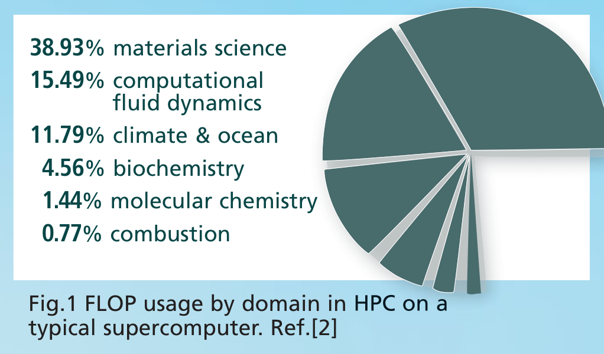
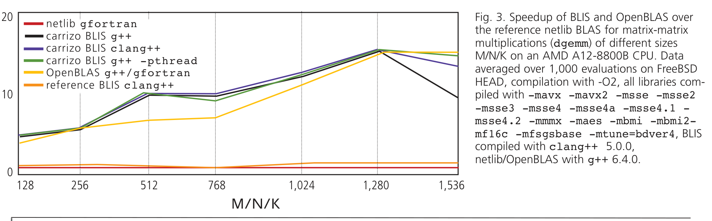

# 高性能计算与 FreeBSD

作者：Johannes M. Dieterich

高性能计算涵盖从科学和工程到金融和社会研究等多个领域。共同点在于聚合计算能力，使其能够交付远高于典型桌面计算机或工作站的性能，以解决大型问题 [1]。更具体的例子按计算份额降序排列包括：材料设计、药物发现、气候建模、材料设计、计算流体力学、经济模拟和大数据分析。

可以说，就所用的操作系统和微架构而言，我们生活在一个高度集中的 HPC 世界中。粗略一看，当代 HPC 安装看起来非常相似。典型安装会包含一个由数千个节点通过快速互连连接组成的 Beowulf 集群。本文撰写时，世界上最快的超级计算机 TOP500 名单包含 91.5% 的 amd64 处理器和 99.6% 的 Linux 操作系统 [3]。

那么 FreeBSD 在这个单一文化中有什么空间？FreeBSD 社区为何应该关心 HPC？首先，HPC 仍然是通用计算中广泛使用的重要基础技术来源，也是创新技术的熔炉，例如基础数值库以及最近的深度学习应用。其次，更深入地看会揭示一个更复杂的生态系统，还包含通信和前述数值库、工具链和编程语言，以及网络交换机和存储等辅助硬件解决方案。最后，还有许多系统（如开发者工作站）更具多样性，有不同的能力要求，对操作系统替代品更易接受；例如，Ubuntu Linux 是开发者工作站的首选，但不太适合集群安装。

**图 1：典型超级计算机上 HPC 中按领域的 FLOP 使用情况。参考文献 [2]**

在某种程度上，甚至可以认为云计算是为传统上没有或无法负担大型安装投资或访问的客户重新打包或分解的 HPC。尽管 FreeBSD 已经作为设备解决方案表现出色，但其他功能（虚拟机管理程序选择、存储、安全、网络等）比计算 OS 更重要。我在此关注 HPC 功能，无论是计算 OS 还是开发者 OS，如何映射到更通用的计算需求，并尝试强调 FreeBSD 如何从针对 HPC 的改进中受益。

作为 FreeBSD 用户和开发者，我们意识到并重视 FreeBSD 的固有优势：Ports 系统中应用和库的一致体验，自定义包的轻松构建和部署（可能带有架构特定优化），以及总体上非常稳定的操作系统体验。最重要的是，统一的 Ports 体验使我们能够在与用户或开发者交互的 OS 的所有部分一致地传播更改。

## 语言

HPC 工具——研究者使用的应用，将 FLOPS 转化为知识——由什么构成？如果我们记得 HPC 是计算机最初用途之一，那么大部分计算时间用于 Fortran 代码就不足为奇。典型安装上超过 65% 的计算周期用于 Fortran 代码。如果考虑混合语言代码中使用的数值 Fortran 库，这个份额还会增加。不幸的是，这表明 Fortran 仍然活跃，现有代码库规模大、复杂度高，中短期内不太可能消失。因此，HPC 支持绝对需要 Fortran 支持。由于 FreeBSD 上通常使用的商业编译器实际缺席，我们回退到开源替代方案。

目前，如果 port 指定 `USES=fortran`，所有架构将使用 `lang/gcc` 中的 `gfortran` 编译器。`gfortran` 是好的 Fortran 编译器，产生稳定、快速的二进制文件，支持所有相关的 Fortran 标准。目前，使用 `gfortran` 需要显式指定 `rpath` 给链接器以搜索 GNU 库，用于该 port 以及（如果是库）所有依赖 ports（或 Ports 树外的应用，就此而言）。虽然简单，但显著增加了 porter 和开发者的维护负担。正在讨论补救措施，但尚未有补丁进入树。还请记住，所有可能的架构（包括 amd64）使用基于 LLVM 的 `clang` 编译器作为基础编译器，原因在于许可，并因此作为默认的 Ports 编译器。与其整理混合编译器环境，往往更简单，完全依赖 GNU 编译器来处理混合语言程序。这种情况略令人不满。

是否有更根本的改进可能？也许有。`flang` 是基于 LLVM 的开放、新的 Fortran 编译器 [4]。其前端源自著名的 Portland Group 的编译器，由 NVIDIA 开源并继续维护。后来也得到了 AMD 在其 AOCC 包中的支持和使用。`flang` 仅支持到 Fortran 2003 语言特性，限于 64 位架构。FreeBSD 现在包含 `devel/flang` 作为预览。当然，需要一些时间和努力才能使此 port 与 `gfortran` 竞争，并正确审查用于 HPC 用途。就在最近，NVIDIA 公布了重写 `flang` 大部分以改善其特性集和被官方 LLVM 接受的可能性的计划。在 HPC 社区内的采用将是有趣的观察，但增加的竞争无论如何都应证明对 GNU 编译器有益。

让我们超越单核思考。如上所述，典型集群包含数万个核心，作业通常需要使用数十到数百个并行。扩展 HPC 有两种主要方法：OpenMP [5] 和消息传递接口（MPI）[6]。

OpenMP 主要针对共享内存机器，后来的标准支持加速器 offloading，下面讨论。这是相对简单、基于 pragma 的方法，支持 C/C++ 和 Fortran，通常用于以数据并行方式并行化循环。

目前，我们的 Ports 树将再次默认使用 `lang/gcc` port 如果遇到 `USES=compiler:openmp`。因此，ports 通常不会默认启用 OpenMP（包括一些常用的，如 `graphics/ImageMagick`），因此将限于单核。amd64 和 i386 至少有更好的替代方案，即 LLVM 项目自 Intel 最初开源以来的 `libomp` 库。它尚未导入基本系统，但存在较旧库版本的审查。在其有望暂时缺席期间，Ports 系统应使用包含 `libomp` 的 `devel/llvm` port 之一。已进行多次集成测试，该功能应该很快就能落地。希望这也会激励其他开发者为其他架构添加必要的 FreeBSD 位，上游支持这些架构。我的测试表明 `libomp` 在 LLVM 中的集成从性能角度看不理想；特别是，LLVM 的向量化器在 OpenMP 的 `simd` pragma 与标准 OpenMP 线程并行化（例如 `parallel for`）一起使用时无法（良好）工作。但当然，次优并行化优于无并行化。

另一方面，MPI 通过函数调用操作 MPI 通信库。它具有简单的发送/接收/广播功能以及更高级的操作如归约。MPI 用于基于进程的节点内和节点间并行化，在硬件级别，典型使用快速互连如 InfiniBand。通常，启用 MPI 的软件包使用 `mpicc`/`mpif90` 包装脚本编译，配置底层编译器以查找 MPI 头文件并链接 MPI 库。在 Ports 树中，存在多个 MPI 选择，我们仅受限于底层 Fortran 的编译器工具链。

## 数值库

HPC 中的高性能很大一部分不来自应用代码，而是来自谨慎和大量使用高度优化的数值库，实现标准化 API。可以说最重要的 API 是 BLAS，一组基本密集线性代数运算（如矩阵-矩阵乘法），LAPACK，一组更复杂的求解器（如 Cholesky 或 LU 分解），以及快速傅里叶变换（FFT），通常在 FFTW3 API 中体现。它们的根本性质也使它们成为我们 Ports 系统中的常见依赖，例如音频和图形应用。

实现这些 API 的库的选择远不如单一集合的性能和特性重要。大多数 HPC 集群提供厂商调优的、汇编优化的 BLAS 和 LAPACK 库。对于 FreeBSD，我们有多个通过 `blaslapack` 选择器公开的选项。默认情况下，此选择器将使用 `math/blas` 和 `math/lapack`。这些是 Fortran 源码的参考实现，因此无法与优化替代方案如 `math/blis` 和 `math/libflame` 竞争。参考实现和 `math/openblas` 都有 Fortran 依赖，不同于 FLAME 项目的 BLIS 和 libflame [7]。

如图 3 所示，无论是 OpenBLAS 还是 BLIS 实现，如果使用其 CPU 架构优化内核，从小型到中型矩阵-矩阵乘法中都显示出显著的性能领先。更重要的是，即使使用 BLIS 的仅源参考实现，其实现和阻塞方案也带来高达 80% 的性能优势。此外，BLIS 提供使用 pthread 并行化的能力，在此测试案例中影响较小。FLAME 项目表示有兴趣与我们合作，接受 FreeBSD 更改的 pull request，并实现我们通用包所需的功能，如运行时内核选择。因此，BLIS 是我们默认 BLAS 实现的良好候选，并使我们摆脱低级 Fortran 依赖。

`math/libflame` port 最近已更新到最近的开发快照，并配置为公开 amd64 和 i386 CURRENT 的 LAPACK 接口。在 FLAME 库可以作为近期版本的 `blaslapack` 选项添加之前，需要更多审查。关于这方面的工作正在进行中。

其他数值、工程和科学库在 FreeBSD 上的状态已经非常优秀：`math/fftw3` port 状态良好；我们还拥有来自各领域（包括量子物理/化学）的开发库，可直接使用，并有多个活跃的该领域的 Ports 提交者。

**图 3：BLIS 和 OpenBLAS 相对于参考 netlib BLAS 在不同大小矩阵-矩阵乘法（dgemm）上的加速。M/N/K 在 AMD A12-8800B CPU 上。数据在 FreeBSD HEAD 上平均 1,000 次评估，编译使用 `-O2`，所有库使用 `-mavx -mavx2 -msse -msse2 -msse3 -msse4 -msse4a -msse4.1 -msse4.2 -mmmx -maes -mbmi -mbmi2 -mf16c -mfsgsbase -mtune=bdver4` 编译，BLIS 使用 `clang++ 5.0.0` 编译，netlib/OpenBLAS 使用 `g++ 6.4.0` 编译。**

## 在 FreeBSD 上开发与移植

有了语言和库在 FreeBSD 上的总体积极状态，移植 HPC 应用到 FreeBSD 和在其上开发有多难？典型挑战来自非标准 make 系统（通常是 shell 和其他脚本以及 make 文件的组合），Linuxism [8] 的盛行使用如硬编码系统路径和其他假设，代码通常不符合标准（例如只在特定编译器 [版本] 下编译并产生正确结果），以及我们自己的 BSD-ism 如 `rpath`。除了最后一个挑战外的所有都是移植的论据：代码库通常改进，潜伏的 bug 会暴露和修复。如果做得正确，移植到 FreeBSD 有切实优势：与任何其他应用一样，更改应上游化、解释和持续维护。同时，我们应考虑减少 BSD-ism 以减轻移植任务。

FreeBSD 上的持续维护或开发简单。尽管没有用于分析、调试等的商业工具链，基本系统和 Ports 包括优秀的自由替代方案。`dtrace` 和 `hwpmc` 与 `benchmarks/flamegraph` 一起使从用户到内核级别分析应用性能变得简单。`devel/gdb` 和 `lldb` 可能没有与商业替代方案相同级别的图形用户界面支持，但能完成工作。尽管大多数 HPC 代码仍使用 `vi` 或 `emacs` 开发，现代编辑器/IDE 替代品如 `java/eclipse`、`java/netbeans` 和使用 Linuxulator 的 `editors/linux-sublime3` 可用。最近，我发现 `bhyve` 为 HPC 开发者工具包提供了宝贵的补充。无论 bug 是仅出现在特定平台配置上，需要支持特定 Linux 发行版，还是需要完整、连续的集成设置，`bhyve` 为所有这些用例提供出色的解决方案。

## 加速器

可能过去十年 HPC 景观中最具颠覆性的变化是引入加速器到 HPC 主流及其随后渗透到工作站和主流市场。尽管大多数 TOP500 安装仍然不包含加速器，但加速器对 HPC 和工作站应用的重要性无法被夸大。存在各种利用其潜力的方法，最重要的有通过 NVIDIA 的专有 CUDA 语言直接编程、开放替代方案 OpenCL 或通过 OpenMP offloading。

这些编程框架都依赖三个基本部分：内核驱动支持、编译器或库，以及运行时环境。通过 FreeBSDDesktop 项目，我们现在可以使用更近期的 AMD 和 Intel GPU 的开放驱动程序。NVIDIA GPU 仍然由 Ports 中的二进制驱动支持。FreeBSD 没有官方 CUDA 支持；但有些人过去曾在 Linux 上编译 CUDA 应用程序并通过 Linuxulator 在 FreeBSD 上运行它们。

我们的 OpenCL 支持处于合理状态：我们包含来自 Mesa 项目的非官方 OpenCL clover 库，用于 AMD GPU。其性能绝对无法竞争，但工作相当可靠。对于 Intel，我们包含其官方 beignet 实现；但 Intel GPU 在计算任务上竞争力较弱。开发 OpenCL 应用程序得到良好支持；我们包含 CPU OpenCL 模拟器 `lang/pocl` 和完整性检查器 `devel/oclgrind`。通过 OpenMP offloading 利用加速器目前不支持，但总体上尚未普及。

一项重大改进可能是纳入 Radeon Open Compute（ROCm）项目 [9]。它需要一个开放配套内核驱动 `amdkfd`，用于常规开放 `amdgpu` 驱动，并提供以 LLVM 编译器技术为中心的大型开放生态系统，支持 OpenCL 和在 AMD GPU 上的 CUDA 开放竞争者 HIP。FreeBSDDesktop 团队现在积极移植 `amdkfd`，大型 ROCm 栈移植应该比较直接，尽管劳动量较大。

## 接下来？

最高优先级应该是审查 FLAME 的 BLAS 和 LAPACK 库，并将它们添加为 `blaslapack` 选择器的选项。其次，`libomp` 应通过 `devel/llvm` 成为 amd64 的默认选项。随后，需要对这些重大更改进行稳定并扩展到非 amd64 架构。在中期，我希望我们将能够让 ROCm 在 FreeBSD 上工作。另一个重要事项是在我们的 `libm` 和来自 LLVM 中正确支持 SIMD/向量化。这些应该已经是有趣的 HPC 平台，供开发者使用。希望从长远来看，我们能够改善 Fortran 情况，使 FreeBSD 成为真正引人注目的 HPC 替代方案。

还需要认识到，为 HPC 改进 FreeBSD 不会损害它作为服务器或工作站系统。相反，它很可能对这些用例大有裨益。

## 致谢

我要向所有 FreeBSD 开发者和用户表达感激之情，是他们让 FreeBSD 成为今天这样的平台。特别地，我要感谢 FreeBSDDesktop 团队和我的导师 Matthew Macy、Niclas Zeising、Steve Wills 和 Rene Ladan。我还要向 BSDTW 会议和组织者表达深深的感谢，本文内容最初作为讲座在那里展示。•

## 参考列表

[1] InsideHPC: <https://insidehpc.com/hpc-basic-training/what-is-hpc/>

[2] 数据源：UK 超级计算机 ARCHER 上月应用使用情况，<http://www.archer.ac.uk/status/codes>

[3] 数据源：TOP500 列表，2017 年 6 月，<https://www.top500.org/statistics/list/>

[4] Flang github: <https://github.com/flang-compiler/flang>

[5] OpenMP: <https://www.openmp.org/>

[6] MPI forum: <https://www.mpi-forum.org/>

[7] FLAME 项目：<https://github.com/flame>

[8] Linuxism 讨论：<https://wiki.freebsd.org/AvoidingLinuxisms>

[9] Radeon Open Compute: <https://github.com/RadeonOpenCompute/>

JOHANNES DIETERICH 自 6.1 版本开始使用 FreeBSD，一年前成为 Ports 提交者。白天，他过去九年在学术研究中从事高性能计算工作，解决从全局优化到量子化学方法的一系列问题。最近，他开始为 AMD 从事 GPU 加速深度学习工作。
