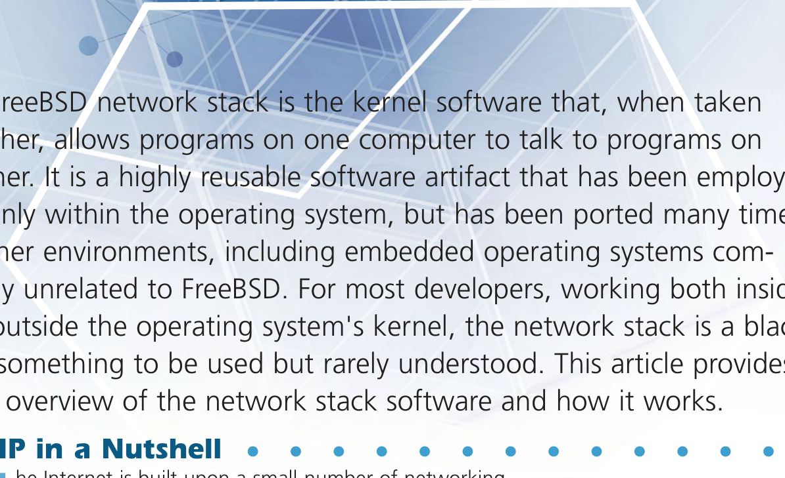
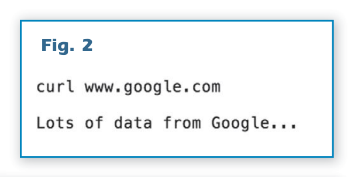
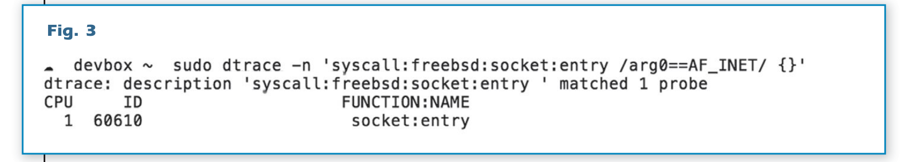
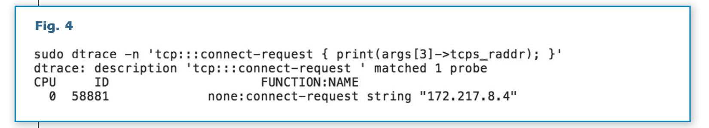
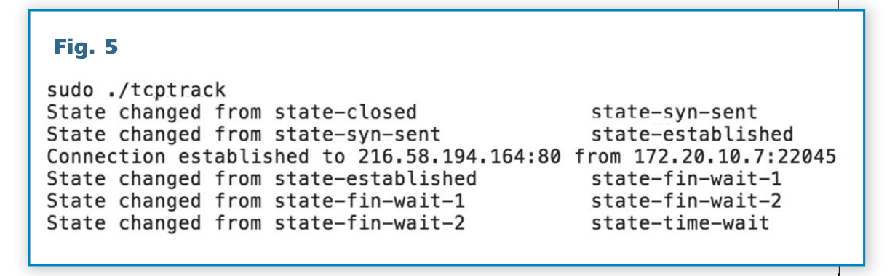
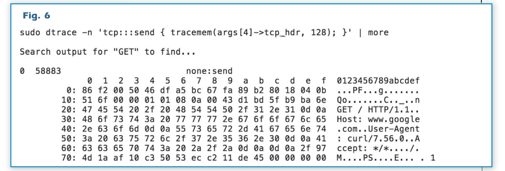
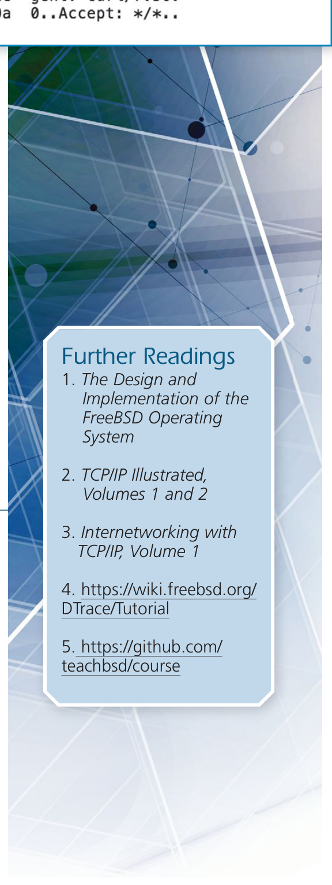

# FreeBSD 中的网络互联

FreeBSD 网络栈是内核软件，整体上允许一台计算机上的程序与另一台计算机上的程序通信。它是高度可重用的软件工件，不仅用于操作系统内部，还多次移植到其他环境，包括与 FreeBSD 完全无关的嵌入式操作系统。对于大多数在操作系统内核内外工作的开发者来说，网络栈是黑盒，可以使用但很少有人理解。本文简要概述网络栈软件及其工作原理。

## TCP/IP 概述

互联网建立在一小部分网络协议之上，这些协议整体上实现了一台计算机与另一台通信所需的一切。所有这些网络协议都在操作系统内核中实现。网络协议在内核中实现的原因是它们是系统所有用户共享的资源，无论这些用户是人还是程序。图 1 显示了实现当前互联网的一些网络协议。我们看到协议是分层的，形成一个栈，因此术语“网络栈”。网络协议被视为层，因为像互联网这样复杂的系统由几个协作的协议构建，每个协议都有特定的职责，并依赖于其下方的层提供必要的服务，以实现整体。我们的图显示了三个协议：地址解析（ARP）、互联网（IP）和传输控制（TCP）。

为了两台计算机能在互联网上成功通信，必须发生三件事。首先，来自一台计算机的信息必须分解成足够小的块，我们称之为数据包，以便在通信的源和目的地之间传输。当你在网络上点击链接并请求页面时，该数据页面不会作为一张大的猫图像传输；该图像必须分解成块，通常每块约 512 字节；每个块必须通过网络发送，目标计算机必须将所有块重新组合。传输控制协议（TCP）是负责将图像分解成数据包并为每个数据包分配序列号的协议和层，以便目标计算机将其接收到的数据包重新组装成原始图像。

一旦数据分解成数据包，它们必须在源和目标计算机之间传输。互联网协议（IP）负责在源和目标之间传输每个数据包。每个 IP 数据包都有源和目标地址，指示通信的最终端点，但互联网是存储转发、分组交换网络，这意味着大多数端点不直接连接到同一个本地网络。为了让 IP 数据包到达目的地，它必须经过一个或多个路由器之间的一系列跳，然后到达最终目的地。操作系统内核中的 IP 层负责在源和目标端点之间的路径上寻找下一跳。

互联网协议足够抽象，各种类型的网络硬件可以传递这些数据包，而不知道数据包内含什么。数据包是通过有线还是无线链路传输对 IP 来说不重要，但在某个时刻，每台计算机或路由器必须联系到达最终目的地的路径上的下一跳。对于基于以太网的网络，地址解析协议（ARP）负责在网络路径上为下一跳查找硬件地址。每件以太网硬件都有 6 字节的源和目标地址，ARP 的工作是将本地 IP 地址（通常是下一跳路由器）转换为路由器正在监听的硬件地址。

大多数程序员通过 **sockets(2)** 系统调用集与 TCP/IP 栈交互。套接字的关键创新之一是为程序员提供了看起来非常像简单文件访问的 API，所有标准 API（如 **read(2)** 和 **write(2)**）在网络通信中的工作方式与本地文件访问相同。套接字代码可以视为 TCP/IP 协议之上的一层，它跨越用户/内核边界，让程序访问网络通信。

总结，在以太网上运行于内核中的 TCP/IP 协议套件必须：将数据流分解成数据包（TCP），为这些数据包寻址以便它们可以在源和目标之间移动（IP），最后确定哪个硬件是源和目标之间路径上的下一跳（ARP）。套接字 API 将网络栈绑定回用户空间，以便程序可以访问网络代码。所有这些层都在 FreeBSD 内核中实现。

## 网络栈

这里的目标不是完整阅读源代码，这远远超出了本文的范围，而是让读者了解这些部分如何组合在一起，并了解如何着手学习代码的工作原理。

FreeBSD 网络栈在操作系统 **sys/** 目录中的一组 C 文件中实现。TCP 和 IP 协议包含在 **sys/netinet/** 中，ARP 协议和各种链路层（如以太网）的大部分支持都保存在 **sys/net/** 中。套接字 API 和大部分通用内核基础设施主要包含在 **sys/kern/** 目录中。

网络栈实现为一组层，我们不仅要关注每层的职责，还要关注数据在它们之间传递的形式和功能。从栈顶向下看，程序通过套接字 API 将任意长度的字节集交给网络栈。

程序在系统上的每个通信端点对应一个套接字。套接字结构包含大量关于它处理数据的元数据和两个数据队列——一个用于入站通信，一个用于出站，我们分别称之为接收和发送套接字缓冲区。

网络栈中的所有内存都保存在一种统一的、单一数据类型中，称为 mbuf，即内存缓冲区的缩写。一组 mbuf 可以通过前向指针链接在一起，这就是大块内存如何分解成可以被网络栈较低层正确处理的数据包。mbuf 系统是内核私有内存池，用户程序永远不会接触到。

对套接字调用 **write(2)** 会获取一块内存，并通过系统机制使该数据在内核中可用，将其放入套接字缓冲区。每个套接字缓冲区维护一个缓冲区列表，其中包含要传输或正在接收的数据。一旦数据包含在套接字缓冲区中，内核就会调用 TCP 机制，将套接字缓冲区中的 mbuf 更新并转换为 TCP 段；然后 IP 协议机制进一步分解这些段，最后内核通过以太网设备驱动程序传输。

在网络栈中接收数据比从本地系统上的文件读取更复杂，因为网络数据可以随时到达。Web 服务器不知道在 Web 浏览器联系它之前调用 **read(2)**，所以 FreeBSD 内核必须不断等待数据并准备好在新端点到达时创建它们。当客户端联系服务器时，内核收到带有特殊标志（SYN）的 TCP 数据包，然后内核尝试设置与新端点通信所需的所有状态。只有当内核确信它可以与新端点通信后，它才会通知用户空间程序有新的传入连接，用户空间程序现在可以 **accept(2)** 然后开始 **read(2)** 数据。

## 看但不碰（DTrace 和网络栈）

我们如何查看网络栈而不试图一次阅读整个源代码？使用 FreeBSD 内置的 DTrace 跟踪系统，我们可以在运行一些简单的测试程序时实际看到每层运行。DTrace 在运行的系统上完全安全使用，我们可以开始探索网络栈而无需修改和重新编译内核代码。对于不熟悉 DTrace 的人，你可能想从 <https://wiki.freebsd.org/DTrace/Tutorial> 的教程开始。本文提供了一组可操作的示例，在你自己的系统上运行这些命令很容易，无需了解 DTrace 的所有细节。

为简单起见，我们从查看出站网络连接开始。`curl` 命令可用于检索单个网页，因此我们以 <www.google.com> 为例。

`curl` 不加密其数据（与 `ssh` 不同），它是出色的测试工具，我们可以用它查看网络栈。

图 2 显示了我们如何手动从谷歌网站检索基础页面。谷歌呈现的网页在 Web 浏览器中看起来非常简单，但基础页面中嵌入了大量代码，因此 GET 命令的输出在标准终端中会运行几页。我们对输出不感兴趣；我们对发起通信时发生的事情感兴趣。

从套接字层开始，我们可以通过查找对 **socket(2)** 系统调用来查看 `curl` 如何开始与谷歌通信。所有网络通信都需要创建套接字。DTrace 在图 3 中看到的 **socket(2)** 调用没有显示太多有趣的东西，这是因为 **socket(2)** 调用只是为通信设置程序的本地端点。要捕获 `curl` 与谷歌通信，我们需要查看 **connect(2)** 调用。从程序的角度来看，**connect(2)** 是通信的真正开始，也是启动网络栈机制的过程，然后我们可以观察。**connect(2)** 系统调用最终在内核中调用 TCP 的连接例程，可以使用 DTrace 的 `tcp:::connect-request` 跟踪点看到。connect-request 跟踪点有相当多关于正在尝试的连接的信息，但现在我们只想看到连接要去哪里。

图 4 显示了 DTrace 一行程序的输出，捕获了 `curl` 联系谷歌的行为。我们指定 connect-request 跟踪点以便看到源机器试图联系目的地，并打印 `tcps_raddr`（远程地址）以查看谷歌当前愿意从哪个 IP 地址与我们通信。如果你运行 `curl` 命令三次，你会看到三行输出，每次连接一行。

将源系统连接到目标系统需要执行 TCP 状态机。使用 **/usr/share/dtrace/tcptrack**，我们可以看到联系谷歌并检索其主页时的所有状态变化。图 5 显示了 TCP 层为设置连接、检索数据、然后关闭连接并清理自身而经历的整个状态转换集。每个套接字从关闭状态（state-closed）开始并等待，直到通信发起。当我们的源连接到目标时，它发送带有 SYN 标志的特殊数据包，将状态机移动到 state-syn-sent。我们的套接字将保持在此状态，直到目标回复并继续设置连接，以 state-established 表示。TCP 状态机保持已建立状态，直到连接的一方希望关闭它。当连接关闭时，状态机在各种状态间转换，所有状态都显示在图 5 的最后三行中。《The Design and Implementation of the FreeBSD Operating System》中有更完整的 TCP 状态机讨论，但就我们的目的而言，一旦状态转换到 state-time-wait，我们就确认这个连接已关闭。

虽然连接设置和拆除是复杂的事情，但它实际上不会在系统之间移动任何数据。为了让我们看到 `curl` 如何与谷歌通信，我们可以使用 DTrace 的 TCP 发送跟踪点。图 6 的 DTrace 一行程序显示通过 TCP 发送和接收的所有数据。如果我们尝试用 **ssh(1)** 或启用 HTTPS 的 Web 服务器测试，我们将无法找到明文，因为数据在 TCP 层看到之前就已加密，但使用 `curl` 我们可以看到明文。在我们的示例中，我们可以看到表格形式的原始字节和通信的 ASCII 表示，我们可以清楚地看到向谷歌服务器发出的 GET 命令。这与通过 **write(2)** 调用传递到网络栈的 GET 命令相同，然后放入套接字缓冲区，交给 TCP，分解成数据包，最后通过 IP 传输到服务器。

为了清楚地看到 TCP 和 IP 层如何交互，我们可以比较图 7 和图 6 的输出。图 6 在 TCP 层，因此只有 TCP 信息，如数据包的源和目标端口、序列号等。图 7 在 IP 层，低一层，因此我们看到 GET 命令已经移动到数据流中更深处。IP 层所需的信息，如目标和源网络地址，导致了 GET 命令的这种位移。

## 结论

网络是一个复杂的话题，它在操作系统内核中的实现不同程度地在一些延伸阅读（1, 2, 3）中涵盖。理解网络栈如何工作需要记住，网络栈分解成大致与正在实现的协议相匹配的模块。互联网协议在 IP 层，传输控制协议包含在 TCP 层，这些层通过少量定义良好的内核 API 相互交互。FreeBSD 上的 DTrace 系统是那些希望开始探索网络栈的人的完美工具。各种与 DTrace 相关的教程可以在右侧的延伸阅读部分找到（4, 5）。

### 延伸阅读

1. The Design and Implementation of the FreeBSD Operating System

2. TCP/IP Illustrated, Volumes 1 and 2

3. Internetworking with TCP/IP, Volume 1

4. <https://wiki.freebsd.org/DTrace/Tutorial>

5. <https://github.com/teachbsd/course>

---

**GEORGE V. NEVILLE-NEIL** 出于兴趣和利润从事网络和操作系统代码工作。他还教授与编程相关的各种主题课程。他的兴趣领域包括代码探索、操作系统、网络和时间协议。他与 Marshall Kirk McKusick 和 Robert N. M. Watson 合著了《The Design and Implementation of the FreeBSD Operating System》。十多年来，他是专栏作家，更广为人知的名字是 Kode Vicious。他在波士顿东北大学获得计算机科学学士学位，是 ACM、USENIX 协会和 IEEE 的成员。他是狂热的自行车手和旅行者，目前住在纽约市。
