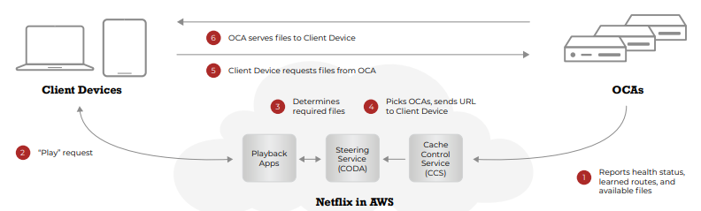
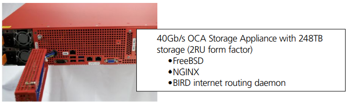
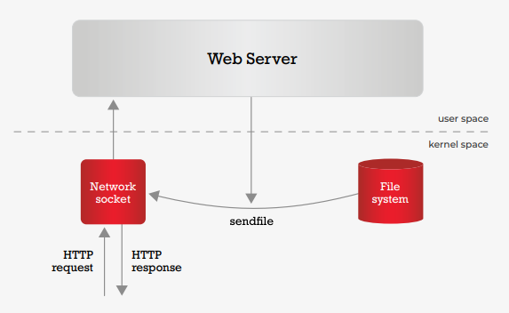
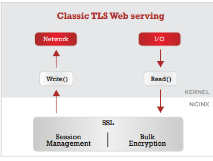
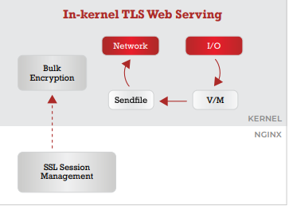
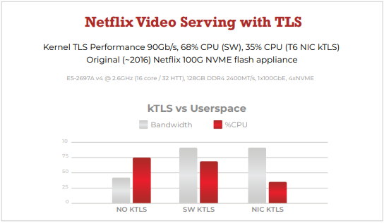

# Netflix Open Connect

- 原文链接：[Netflix Open Connect](https://freebsdfoundation.org/wp-content/uploads/2021/03/Netflix-Open.pdf)
- 作者：**GREG WALLACE**

## 概述

Netflix（纳斯达克股票代码：NFLX）是全球领先的流媒体娱乐服务，拥有 1.83 亿付费会员，遍布 190 多个国家，可观看各种类型和语言的电视剧、纪录片和故事片。会员可以随时随地、在任何连接互联网的屏幕上想看多少就看多少，还能播放、暂停并继续观看，全程没有广告，也无需任何承诺。<https://www.netflix.com>

Open Connect 是负责将 Netflix 电视节目和电影传送给全球会员的全球网络。此类网络通常被称为内容分发网络（CDN），因为它的工作是将人们观看的内容放到他们附近，以高效地传递基于互联网的内容（通过 HTTP/HTTPS）。Open Connect 设备运行轻度定制的 FreeBSD 版本。<https://openconnect.netflix.com/Open-Connect-Overview.pdf>

Netflix 拥有几位 FreeBSD 提交者，Open Connect 团队的其他成员也为上游贡献了代码。

## Open Connect 达到超过 100 Tb/s 的峰值流量

我们这些年纪大到还记得互联网泡沫和电信繁荣的人，可能会记得 1999 年 Quest Communications 那则标志性广告：一位疲惫的旅客在荒郊野外入住酒店。前台工作人员承诺提供乏味的早餐，但娱乐呢？

他们可不缺娱乐。“史上每一部电影，任何语言，任何时间，不分昼夜。”

客人惊愕地自言自语：“这怎么可能？”怎么可能呢！（继续往下读）。二十年后的今天，酒店电视成了最后一批提供“史上每一部电影”的设备。技术似乎不无讽刺意味。

在讨论流媒体娱乐和使其成为可能的技术的最新趋势时，Netflix 绝对是绕不开的话题。截至 2019 年 4 月，Netflix 美国目录包含 47,000 部电视节目和 4,000 部电影。Netflix 报告称，全球 Open Connect 网络在峰值时传送超过 100 Tb/s 的流量。根据 Sandvine 的数据，这约占 2019 年全球互联网总流量的 15%。

## Open Connect：一个网络与一个计划

Netflix 于 2011 年启动 Open Connect 项目，以应对 Netflix 流媒体规模不断扩大。该项目的主要动机有两个：

1. 随着 Netflix 成为消费者互联网服务提供商（ISP）网络流量的重要部分，直接、协作地与这些 ISP 开展工作变得至关重要。

2. 为 Netflix 创建定制的内容分发解决方案，让工程师得以设计主动的定向缓存解决方案，比标准的需求驱动型 CDN 高效得多。定向缓存架构将上游网络容量的总体需求减少了几个数量级。

**Netflix 播放过程**

### 网络

大多数 CDN（内容分发网络）按需求驱动方式工作。这意味着网络缓存什么内容及缓存位置由某地区的请求决定。对于预测用户内容需求能力有限的通用 CDN，这种方式效果很好。

由于 Netflix 掌控终端用户应用，并拥有详细的观看趋势数据，转向定向 CDN 能带来显著的效率提升。在 Netflix 的定向 CDN 模型中，其 Open Connect Appliances（OCA）机群（下文详述）在观看量极低的所谓 Fill 窗口期间，每天接收目录更新。

### 计划

Netflix 实行开放对等互联政策，意味着会与任何同意该计划条款的 ISP（互联网服务提供商）对等互联。开放对等互联通过本地化流量改善互联网用户体验，还能降低传输成本，对 Netflix、ISP 以及整个互联网都有益。

除了在 Netflix 数据中心和互联网交换点（IXP）部署 OCAs，Netflix 还免费向符合条件的 ISP 提供 OCA，让其直接安装在 ISP 的网络中。这进一步提高了本地化程度，并减少了上游流量¹。有趣的是，这些 OCA 虽由 Netflix 拥有，但由 ISP 使用，这引发了一些许可方面的考量，最初促使 Open Connect 工程师因 FreeBSD 宽松的许可证而选择它²。

1 详情请见 <https://openconnect.netflix.com/Open-Connect-Overview.pdf>。  
2 <https://www.nginx.com/blog/why-netflix-chose-nginx-as-the-heart-of-its-cdn/>  

## Open Connect Appliances

Open Connect CDN 的主力是 Open Connect Appliances，简称 OCA。这些设备有三种主要配置，运行轻度定制的 FreeBSD head（开发）分支。如此庞大且关键的网络运行快速变化的开发分支，乍看似乎有些冒险。在 2019 年的 FOSDEM 大会上，负责维护 OCA 操作系统的 Netflix 工程经理 Jonathan Looney 解释了跟踪 FreeBSD head 分支的理由。

首先，Jonathan 和他的团队认为 FreeBSD 代码通常非常稳定且高质量。其次，他们更喜欢迅速发现并修复那些相对少见且大多影响较小的 bug。否则，Jonathan 解释说，等待长期（稳定）分支的开发团队可能会陷入他所称的恶性循环——合并不频繁，冲突/回归问题多，最终导致功能开发进度变慢。

跟踪 head 分支帮助 Netflix 更快地添加功能。他们还发现，跟踪 head 分支让与开发社区中的其他人合作更加容易。

- 40Gb/s OCA 存储设备，具有 248TB 存储（2RU 机架形式）  
  - FreeBSD  
  - NGINX  
  - BIRD 互联网路由守护进程

## 吞吐量效率

这些 OCA 有多高效？使用 FreeBSD 和商用零件，Netflix 在配备 Intel 6122 CPU、96GB RAM 和 16TB NVMe 闪存的 1RU 机架中，以约 55% 的 CPU 占用率实现了 90 Gb/s 的 TLS 加密连接服务吞吐量。

由于目标是尽可能多地将代码提交到上游，所有 FreeBSD 用户都能受益于帮助 Netflix 实现这种性能的许多增强功能。其中一些贡献包括 NUMA 增强、异步 sendfile、内核 TLS、Pbuf 分配增强、“未映射”mbufs、I/O 调度、TCP 算法和 TCP 日志基础设施。

为以具有成本效益的方式实现这种性能，Netflix 工程师意识到需要尽可能减少内核与用户空间之间的上下文切换。异步 sendfile 就是帮助实现这一目标的关键技术之一。

新的 sendfile(2) 系统调用实现是旧版的直接替代，加速了 TCP 数据传输，因为避免了将文件数据复制到缓冲区再发送。新版 sendfile 通过支持异步 I/O 进一步加速并简化了大数据传输。

> "运行 FreeBSD head 让我们能够非常高效地向用户传送大量数据，同时保持高节奏的功能开发。"
> —— Jonathan Looney，Netflix

新版 sendfile 是 NGINX 与 Netflix 开发合作的成果，在 2016 年 Netflix 服务扩展到近 200 个国家时同期发布。

**Async 服务器**

## 提高效率和隐私保护 — 内核 TLS

为保护最终用户的隐私，Netflix 于 2016 年添加传输层安全性（TLS）。Jan Ozer 在《Streaming Media》杂志的文章中很好地总结了这一举措：

> Netflix 早就部署了 DRM 防盗版，并通过 HTTPS 在账户登录和任何管理操作中保护客户数据。但是，实际视频数据传输并未受保护，因此服务器和客户端之间通信中的任何信息都可能被黑客、网络管理员或 ISP 访问。这些信息可用于判断观众正在观看的内容，或许还有其他细节。

高效添加 TLS 加密要求对 OCA 软件栈做额外性能增强。这是因为现有的 TLS 技术依赖 Web 服务器——Netflix 流媒体标准总监 Mark Watson 在 2014 年报告称，这种方法会使容量“下降 30-53%”。

答案是内核端 TLS，简称 kTLS，将 TLS 与新的 sendfile 模型结合。这种混合 TLS 方案（由 John Baldwin 在 vBSDCon 2019 大会上描述）将会话管理保留在应用程序空间，并将批量加密插入到内核中的 sendfile 数据管道。TLS 会话协商和密钥交换消息从 Nginx 传递到 TLS 库，会话状态存储在该库的应用程序空间。一旦 TLS 会话建立，生成适当的密钥并与客户端交换，这些密钥就与客户端的通信套接字关联，并共享到内核。

**传统 TLS Web 服务**

**内核内 TLS Web 服务**

在 2019 年 EuroBSD 演讲中，Drew Gallatin 和 Slava Shwartsman 展示了 kTLS 如何将带宽性能提升 50 Gb/s，同时降低 CPU 占用率。TLS 性能提升的下一个前沿是所谓的 NIC TLS，加密操作由硬件完成。如下图所示，这有望显著降低 CPU 利用率。

内核 TLS 性能 90Gb/s，68% CPU（软件），35% CPU（T6 NIC kTLS）  

原始（~2016）Netflix 100G NVME 闪存设备

**Netflix 使用 TLS 视频服务**

## 达到 200 Gb/s 的 NUMA 优化

随着会员对更多节目和更高分辨率的需求持续增长，Netflix 一直在寻找提高 OCA 吞吐量的方法。随着高核心数系统的演进，团队自 2014 年以来一直在开发和测试非一致性内存架构（NUMA）支持，现在开始显现成效。典型系统只有一个 CPU、磁盘和内存，而 NUMA 系统可以有更多。与 sendfile 和 TLS 类似，NUMA 也可能带来吞吐量瓶颈，Netflix 工程师一直在努力将其降到最低。

NUMA 使 CPU 访问本地资源（例如内存）成本更低，访问连接到其他节点的资源成本更高。因此，内存和 I/O 本地化会影响性能。为充分利用 NUMA 提供的更高计算密度，Netflix 必须设法将尽可能多的磁盘到 CPU 到网络的流量保留在本地节点，并最小化消耗性能的 NUMA 总线传输。这促成了一系列增强，目前正以不同阶段合并到上游，包括：

- 为通过 sendfile(9) 发送的文件分配 NUMA 本地内存
- 为内核 TLS 加密缓冲区分配 NUMA 本地内存
- 将连接引导到绑定到本地域的 TCP Pacers 和 kTLS 工作线程
- 通过对 `SO_REUSEPORT_LB` 监听套接字的修改，将传入连接引导到绑定到本地域的 Nginx 工作线程

在测试中，这些增强将 Xeon 性能从 105Gb/s 提高到 191Gb/s，同时将 NUMA 互联利用率从 40% 降到 13%。对于 AMD EPYC，性能从 68Gb/s 提升到 194Gb/s。

**四节点配置在 AMD EPYC 上很常见**

## FreeBSD 为 NETFLIX 提供三种效率：吞吐量、开发和运营

对于常见问题“为什么选择 FreeBSD？”，Jonathan 说他们最初为许可证而来，最终因效率而留——Netflix 从三方面衡量效率：

1. 吞吐量或性能效率，如前一部分所述
2. 开发效率
3. 运营效率

从开发角度看，与 FreeBSD 社区合作的便利性帮助 Netflix 将增强提交到上游，由社区持续维护。他们还乐于与社区中在同一领域工作的其他成员合作。与这些社区成员共享代码可以改进各方正在开发的代码。

最后，庞大的 OCA 机群需要复杂的监控和运营工具。一些所需工具已经存在，其余的他们自己编写。对于后者，Jonathan 发现 FreeBSD 能很好地呈现必要的挂钩，如果没有，团队也能自己实现。

## Open Connect 智囊团的下一步

除了 NUMA 和持续探索 NIC TLS，团队还在致力于向 kTLS 上游提交一些增强，以及 UFS 增强。

最后，Open Connect 的巨大规模加上团队对效率的关注以及对开源的承诺，意味着每个有类似用例的 FreeBSD 用户都能获得相同的性能收益。开启 kTLS 并利用异步 Sendfile 的功能，让任何通过 HTTPS 提供静态内容的用户都能延长硬件寿命、降低密度，并更高效地提供卓越的用户体验。

---

**GREG WALLACE** 是一位自由职业的技术营销人员，自 2005 年以来一直与开源软件和社区合作。除了目前在 FreeBSD 基金会的工作外，Greg 还涉猎 Kubernetes、安全、DevOps 和路由。此前，他曾领导 Node.js、ODPi 和 Hyperledger 的营销工作。
