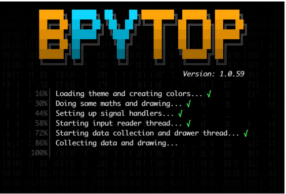

# 在世界之巅

- 原文链接：[On Top of the World](https://freebsdfoundation.org/wp-content/uploads/2021/03/Practical-Ports.pdf)
- 作者：BENEDICT REUSCHLING

本专栏介绍 FreeBSD 的 Ports 和软件包，它们或实用、或奇特，或值得了解。Ports 扩展了基本系统的功能，确保你能完成任务，或者简单来说，让你会心一笑。一起来吧，也许你会发现新东西。

自从我开始使用 Unix 以来，我就记得在用 top.1。对于那些一直在 Unix 岩石下生活的人，你真的应该爬出来看看。通过不断显示进程，top 能让你即时查看机器上正在发生的事情——从进程角度来看。与 ps.1 的静态输出相比，它至少会让任何严肃的 Unix 系统管理员屏幕的一角看起来忙碌。无论是否有花哨的屏幕保护程序，一瞥就能帮助你初步评估系统负载。当然，BSD 也不例外，它们甚至提供了一些其他 top 实现没有的额外功能。对于 I/O，使用

```sh
top -m io
```

每秒钟都给你理由，最终把那块硬盘换成更炫的东西——闪存。

如果你只想列出霸占你系统的十个最活跃进程？只需在终端输入

```sh
top 10
```

就能得到结果。非常直观！另外，初学者退出 top 比退出 vi 要容易一些（提示：按 `q`）。也许这就是多年来这个程序被克隆和重写用于其他目的的原因之一。每当需要弄清楚为什么系统变得迟缓时，top 就是找出原因的一种方法。用户通常会抱怨它，结果发现是他们自己的进程把系统拖到几乎停滞。

最流行的重写版本可能是 sysutils/htop，它通过颜色和可定制的显示扩展了基础的 top。从在笔记本电脑上添加剩余电池显示，到为那些在系统间跳跃的 ssh 用户显示主机名，一切都可以配置。进程视图提供了一个整洁的树形视图，显示由你的 shell 或处理数据的系统守护进程所产生的线程。不过，多年来玩 DOS 游戏频繁按空格键的习惯，让我在 htop 中有点犯迷糊。在 FreeBSD 的 top 实现中，这会导致显示刷新。而在 htop 中，它会选中光标下的进程。我应该查看 man 页面，看看它到底是做什么的，而不是指望 top 在每个地方都一样。

说到旧的 DOS 游戏：在安装 sysutils/bashtop 并首次启动它后，我又无法摆脱一种感觉，仿佛自己又运行在专业的保护模式运行时中。它完全冻结了，首页将我重定向到 bpytop。仅仅从 GitHub 页面 <https://github.com/aristocratos/bpytop> 上看，我看到它不仅列出了对 FreeBSD 的支持，还支持很多其他平台。我的手指迅速输入

```sh
pkg install bpytop
```

在我的终端中拉取最新的移植版本。应用程序运行起来，我愣了一下：又是一个初始化例程。我那训练有素的游戏手指足够快，在主显示界面出现之前为读者截取了这一幕。你可能觉得我已经把它推到极限了，但接下来发生的几乎是我人生中最接近药物迷幻体验的时刻——这些颜色实在让我吃不消。不过，它确实展示了很多关于系统的好信息。左上角的小点为我提供了这个系统上 24 个 CPU 的合并视图。选中一个进程并按下回车键会显示更多关于它的细节。网络和内存也显示在同一屏幕上。确实很整洁，但现在我需要去换眼球——我想我冰箱里还有些备用的……



好吧，Dilbert 的 Topper 会说：“这没什么……”所以我开始在 freshports.org 上搜索其他类似 top 的工具。果不其然，几乎每个字母都似乎以某种方式放在了 top 前面。从 sysutils/atop（尽管 man 页面声称它是 Linux 的资源监视器，但它在 FreeBSD 上运行得非常好），到 databases/mtop 或 mytop 查看 MySQL 进程，再到 pgtop（用于 Postgres），有很多选择。我唯一缺少的是 stop——停止一个进程。那“程序应该只做一件事，并做好它”呢？也许我在这方面有些老派！

网络管理员可能会看看 dns/dnstop，用来捕获并查看流经的 DNS 流量。比 bpytop 更简单的视图，但具备所需的一切。或者试试 net-mgmt/bandwhich，弄清你的带宽整日流向何处。

我还发现一个尚未移植、与进程查看器无关的工具——topgrade <https://github.com/r-darwish/topgrade>。它不仅能从一个软件包管理器升级，还能从系统上的所有软件包管理器升级。做这件事时或许可以播放《壮志凌云》主题曲，那个 logo 确实让人联想到这一点。我运行这个工具的服务器没有声卡，所以我无法确认。想象一下数据中心所有工作人员忙成一团，想弄清这声音来自机架中的哪台机器！

我还记得（当然是我随口想起的）一些尚未移植到 FreeBSD 的其他 top 类程序。电影《创：战纪》似乎启发了 eDEX-UI <https://github.com/GitSquared/edex-ui> 的未来感设计。我们能把它移植过来吗？拜托了（撒点糖在上面）？

有一个名为 tui-rs <https://github.com/fdehau/tui-rs> 的基础 RUST 库，为终端中许多其他灵活而动态的类窗口显示提供了构建模块。这里我只提其中一个，它之于 top，就像 tail.1 之于 head.1：bottom <https://github.com/ClementTsang/bottom>。顺便说一下，sysutils/gotop 可能引起你的兴趣，它用波浪线显示 CPU 使用情况。在笔记本和服务器上，它还尝试确定 CPU 温度。

如果 <www.unixtop.org> 没有下线的话，我会推荐你去那里了解这个工具的历史。幸运的是，archive.org 有 2017 年的存档，可以使用。维基百科也有启发性的信息，所以我就留给你自己去查吧。希望这篇专栏不会太过火，你能将一些实用工具加入你的 Unix 工具箱。

---

**BENEDICT REUSCHLING** 是 FreeBSD 项目的文档提交者，也是文档工程团队的成员。他是 FreeBSD 基金会董事会的副主席。过去，他曾任两届 FreeBSD 核心团队成员。他在德国达姆施塔特应用科技大学管理一个大数据集群，还为本科生教授“Unix for Developers”课程。与 Allan Jude 一起，他是每周 bsdnow.tv 播客的主持人。
