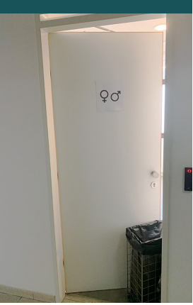
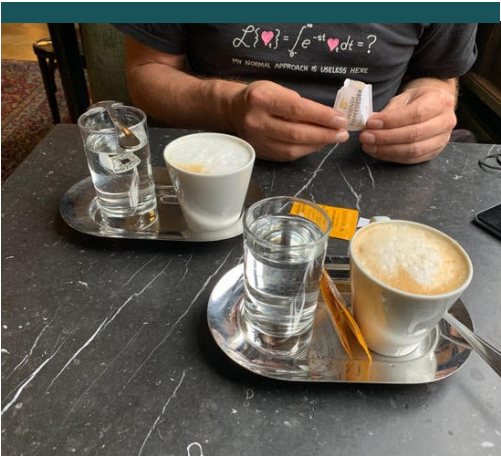
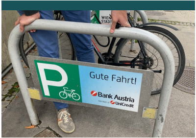

# 会议报告：EuroBSDCon 2021 我的第一次 EuroBSDCon：一位新组织者的视角

- 原文：[EuroBSDCon 2021 My First EuroBSDCon:  A New Organizer’s Perspective](https://freebsdfoundation.org/wp-content/uploads/2022/03/ConferenceReports.pdf)
- 作者：**KATIE MCMILLAN**

我在新冠大流行期间开始参与 EuroBSDCon。那是 2020 年 9 月，我并不认识 EuroBSDCon 基金会（以下简称“基金会”）的董事会成员，只知道一些来自其他会议（如 BSDCan）的组织委员会和评审委员会的成员。EuroBSDCon 2020 已经取消，BSDCan 2021 也取消了，而 EuroBSDCon 2021 的前景也不太明朗。对于虚拟会议（或称为“线上”会议，听起来比“虚拟”稍好一点，但还是不好）并没有太多热情。

我会具体说明我是如何参与的，因为我认为如果人们想要参与会议和开源项目的管理工作，尤其是在国际层面上，知道该怎么做是很重要的。我是加拿大女性，鼓励所有想要参与开源项目的人联系项目的关键人物，首先是董事会成员。我们都是普通人，志愿服务/捐赠（无论是代码行、错误修复、移植、漏洞发现、资金捐赠、在会议上设立展位、做演讲、提供行政支持、编写文档、项目管理、社区建设、宣传等）都能留下深刻印象。有很多方式可以回馈开源项目，而这些项目正为人类带来一些当今最好的硬件和软件。

在这种情况下，我给负责 EuroBSDCon 的基金会发了电子邮件，询问如何参与。我简短地写道：

---

你好，

我想为 EuroBSDCon 2021 志愿服务，想请问最好的参与方式是什么？我住在加拿大渥太华，通常会为 BSDCan 志愿服务，但由于 2021 年的 BSDCan 被取消，我希望将我的精力转向 EuroBSDCon。

谢谢，  

Katie

---

几周后，我开始负责网站管理。嗯，不，事情没有那么简单。原来，我实际上是要学习 Wordpress，并接手一个可能举办也可能不举办的会议网站。里面有一些插件、内容、资产、不同的用户、SEO 配置、主题……虽然接手这个网站看起来可能让人害怕，因为这意味着要进入与基金会的“委员会决策”过程，尤其是对一个不使用社交媒体的人来说，这一切显得有些神秘，但最终事实并非如此。实际上，他们需要有人帮助管理网站，并且很高兴我愿意以这种方式贡献。所以，我开始学习如何使用 Wordpress 作为 CMS，学习 HTML 和 CSS，并通过 Lighthouse 审核和 SEO 工具，意识到开源工具在网页开发中的强大功能。董事会成员像经验丰富的向导一样指导我；我感到有人陪伴、帮助和认可。我按自己的节奏成长，一切非常顺利。当我搞砸了并且导致网站崩溃（这种情况只发生了一两次）时，大家也都能接受。这让我意识到，学习是一个持续的过程，我不可能只是学会网页开发，拿到金星，然后就结束了。在他们的支持下，我一直在不断进步，学习新的东西。

## 会议

我们中的一些人参加了线上会议，其他人则亲自到场；最终它变成了一个混合型活动。总的来说，我们有大约 500 名注册者，最高时有 100 名同时在线参与。看到如此多精彩的演讲、提问，并且能够将名字与面孔对应，真是令人惊叹。对我来说，这次会议特别合时宜，因为 PGDay 奥地利正在同一时间举行线下活动，所以我能够在维也纳的时候参加。能够亲自参加非常高兴，由于疫情，我已经很久没有出差了。我真的很想在那儿支持社区和工具。当我看到奥地利当地人也亲自来参加并支持会议时，我感到非常惊讶和高兴！

在会议基础设施方面，我们结合使用了开源和闭源工具。Kristof Provost 提出了关键的见解，确保这些工具能够和谐地工作，提供流畅的体验。我们的目标是尽量模拟（或借鉴）线下会议的体验，设置了有主持人管理的讲座房间，允许与演讲者互动并进行问答环节，同时还有社交咖啡时间和单独设置的赞助商展位区。对我来说，最喜欢的部分是使用我从会议组织初期就支持的工具：Big Blue Button。我们用它作为视频会议和录制软件：这个开源软件太棒了！我经常使用它来快速创建会议室，它是我工具箱中最喜欢的开源工具之一，尤其是它在如此规模的线上会议中表现得如此出色。

使用 Big Blue Button 的另一个好处是，我们能够找到一家出色的托管、支持和视频编辑服务提供商。因为它是开源的，我们能够严格筛选，从各个地方寻找，最终选择了一家名为 RiAdvice 的公司，位于突尼斯。CEO Ghazi Triki 和他的团队与我们合作得非常愉快，感觉就像有了一个战略合作伙伴，成了团队的一部分。我们非常感激 RiAdvice 团队在规划、执行、支持和会后活动（包括视频编辑）方面提供的帮助。有这样友好且专业的支持，确实为整个活动增添了乐趣，减轻了压力。能成为这样一个创新且合作的会议体验的一部分，并能够利用开源软件来举办开源软件会议，真是太棒了。

我很感激在会议中作为女性能感到如此被接纳。不仅厕所门上贴有包容性标识，而且每个人都让我感到受欢迎，并成为团队的一部分。事实上，我感到如此被接纳，以至于后来正式加入了基金会的董事会。我请求各位——尤其是认同自己为非男性性别的人——考虑提交明年 [会议](https://2022.eurobsdcon.org/) 的演讲摘要或志愿参与！

## 为什么明年我还会参加

咖啡非常棒。好吧，这并不是唯一的理由，但你绝对应该把“在维也纳喝一杯梅朗日咖啡”加入你的心愿单，那真是一次美妙的体验。维也纳是座令人叹为观止的城市，拥有其壮丽的建筑、食物、纪念碑、购物、剧院、宫殿和公共交通——我鼓励大家都去这座美丽的城市旅行。

我明年肯定还会参加，因为那里的人。我喜欢这个兼收并蓄的群体，热情好客和包容精神让我感动。我笑得合不拢嘴，不仅是在 Henning Brauer 品尝 SBA Research 阳台上长的野生植物时。他没事，但我决定明年参加会议之前更新我的急救和心肺复苏证书。

说到底，会议和其他类型的社区建设、网络交流、职业发展和参与活动对所有类型的开源项目的成功至关重要。这些都是社区项目，依靠透明、社区驱动的开发模式。这种方法促进了项目的可持续性、先进的安全性、供应商中立性、社会正能量、包容性、创新性和互操作性。它还促进了跨国的人际连接和关系。不要忽视在这个数字化的世界中人际连接的重要性。有时候，当你感觉周围的人和你的兴趣不同时，很容易觉得自己像一个孤岛。

感谢 EuroBSDCon 基金会董事会、会议赞助商、组织委员会、选拔委员会和所有与会者让我成为这一切的一部分，以促进 BSD 国际社区的多样性、创造力、团结、幽默感和韧性。

我的朋友们，明年见，祝你们“Gute Fahrt！”

---

**KATIE MCMILLAN** 自 2004 年以来一直在加拿大医疗行业工作；她在加拿大卫生部开始了自己的职业生涯，协助开发空气质量健康指数（AQHI）。她继续从事健康相关工作，并围绕对标准、创新和数字卓越的热爱发展自己的职业生涯。她专注于通过安全性和互操作性来赋能数字战略，这使她接触到开源解决方案，曾担任 GIS 分析师、应用服务顾问和数字战略与卓越领导等职务。自 2021 年以来，她拓宽了对医疗系统的视野，目前在加拿大知名的营销、应用和软件供应商 Snap360 工作。她继续通过使用、开发和推广开源技术，如 OSCAR EMR、R/R Studio、PostgreSQL、Mirth Connect、\*BSD、WordPress 和 HL7，参与数字健康的推进。Katie 喜欢远足、咖啡、越野滑雪、数独、骑马和贝湾。

---

## EuroBSDCon 2021：René Ladan 的报告

- 作者：**RENÉ LADAN**

Q = 假想采访者

R = René

**Q：你是如何参与 EuroBSDCon 基金会的？**

**R**：自 2003 年起，在尝试了一些 Linux 发行版之后，我开始使用 FreeBSD。我开始为（现已不复存在的）FreeBSD 手册荷兰语翻译做贡献，因此在 2008 年获得了文档提交权限。我在 Ports 领域犯了同样的错误，在 2010 年获得了 Ports 提交权限。自 2016 年起，我加入了 Ports 管理团队（portmgr@），主要担任秘书职务。

**Q：好的，那 EuroBSDCon 基金会呢？**

**R**：啊，是的，因为我关注一些邮件列表，我读到了一个名为 BSDCan 的加拿大会议。那时我才知道开发者们其实会偶尔面对面聚会，这让我感到惊喜。所以，我在 2010 年以 BSDCan 作为我的 BSD 会议之旅的起点。不幸的是，由于工作原因，我无法参加 2010 年的 EuroBSDCon，但我在 2011 年参加了，此后从未缺席过一届 EuroBSDCon。

这种不间断的参与也在 2016 年引起了 EuroBSDCon 基金会的注意，结果在一次晚宴上有人把我拉到一边，邀请我参加第二天的董事会会议。在那次会议上，他们正在寻找更多的荷兰籍成员，依据章程规定——基金会是荷兰的，而我恰好也是荷兰人。我同意加入董事会，此后一直从事秘书工作——比如提议议程和做会议记录，还帮助与会者处理大使馆的文书工作。

**Q：你帮助组织的会议是什么样的？**

**R**：通常，EuroBSDCon 是一场线下活动，但 COVID 疫情改变了规则。我们决定完全取消 2020 年的会议，因为 BSDCan 已经转为线上，我们觉得当年第二次线上会议不会增加太多价值。我们曾希望今年的会议能再次以线下形式举行，可能规模较小——大概主要是欧洲与会者。但我们无论如何都要为海外与会者组织一个线上组件，所以我们觉得保持线上更容易。

**Q：你以前组织过线上会议吗？**

**R**：虽然我们不需要组织任何本地组件，但我们确实需要从头学习如何组织线上会议。我们参观了一些其他线上会议，只是为了看看他们是怎么做事的。我们决定使用 BigBlueButton 作为演讲平台，使用 Spatial.chat 作为走廊交流区。

我们选择两个服务是因为，BigBlueButton 当时拥有更成熟的录制功能和可用于安排录制的 API，而 Spatial.chat 提供了很好的线上走廊体验。

我认为这次会议尽管是线上的，但还是成功的。我们确实感觉到与人的互动缺失了，在屏幕前发表演讲或发布公告与在座无虚席的观众面前完全不同。我们在维也纳举办了一场非正式的线下迷你会议，吸引了一些组织人员和一些当地人——这让我们有机会在会议前、会议中和会议后稍作社交。

**Q：你还会组织其他会议吗？**

**R**：会，有多个原因。

首先，参加这些会议很有趣，每年都有新城市可去。所以，这些会议对我来说也是一种迷你假期。演讲提供了对当前事态的洞察，但更重要的是，走廊交流让我能和可能一年或更久没见的人叙旧。虽然我大部分时间做的是对大多数人来说看不见的工作，但这些工作本身确实让几个人能够每年参加，也维持了整个机制的运转。

希望今年晚些时候，这些工作是为了在维也纳（再次）举办一场完整的线下会议！

---

**RENÉ LADAN** 在埃因霍温理工大学学习计算科学，于 2006 年毕业。之后他在多家公司工作过，包括这所大学本身。他目前在 Carapax IT 担任软件工程师。

René 的开源影子生涯始于 Sourceforge 上的一些小项目，但真正起步是在他 2004 年开始参与 FreeBSD 工作时。此后，他获得了文档和 Ports 提交权限，现在是 Ports 管理团队（即 portmgr@）的成员。在参加了太多次 EuroBSDCon 之后，他在 2016 年被拉入附属的基金会，此后一直担任秘书。

在不做 BSD 相关事情且仍处于极客模式时，他喜欢摆弄自制的授时台接收器。在技术之外，René 喜欢远足、拼图和在父母的花园里劳作。
