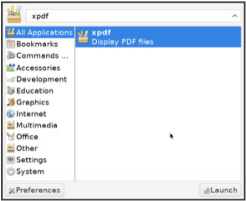
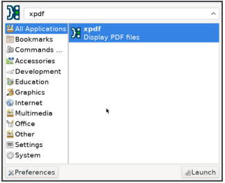

# 为 FreeBSD Ports 做贡献

- 原文：[Contributing to the FreeBSD Ports Collection](https://freebsdfoundation.org/wp-content/uploads/2022/03/Contributing-to-the-FreeBSD-Ports-Collection.pdf)
- 作者：**MATEUSZ PIOTROWSKI**

## 为何要用 Ports？

在数个 FreeBSD 版本之前，FreeBSD Ports 是安装第三方软件的主要方式。用户会从 Ports 构建所需的软件。理论上，有一些二进制包可用，但它们的整体支持并不好。软件包管理工具难用，软件包仓库中的包已经过时。从 Ports 构建软件是必需的。

随着新的 pkg(8) 包管理工具的出现，情况开始发生变化。如今，FreeBSD 的软件包仓库是开源世界中最大、最新的之一（参见 repology.org 上的图表）。大多数 FreeBSD 用户使用二进制包，而不是自己编译 Ports，自从我开始使用 FreeBSD（大约是 10.3 版本）以来，情况一直如此。

虽然二进制包很棒，但人们仍然时常直接使用 FreeBSD Ports。无论是 FreeBSD 的维护者还是用户，都一直在使用它。那为什么 FreeBSD 用户会使用它呢？因为 Ports 使得根据非常具体的需求定制二进制包变得非常简单。你想用自定义补丁重新构建 Nginx 包吗？没问题。你想为你的 collectd 守护进程添加一个不常见的后端吗？很容易。你想获得 Python 的调试版本吗？没什么大不了的。

在这篇文章中，我想给你一些如何为 FreeBSD Ports 做贡献的见解。如何开始？为什么要开始？提交补丁需要什么？如果你想知道这些问题的答案，请继续阅读。

## 大家好，我是 Mateusz，我想为 FreeBSD 做贡献

这是我经常看到的信息，无论是在邮件列表、Discord 还是 IRC 频道上。

通常，这类信息会得到一堆指向 bug 跟踪器和带有项目想法的 wiki 页面的回复。你会认为长期贡献者乐于将新手介绍到项目中。这是对的（这也是开源社区健康的标志）。但同样正确的是，长期贡献者往往不愿回复这样的消息。为什么会这样呢？因为他们知道，很可能再也不会收到那个新手的回复了。是的，你没听错，基本上这不是你开始贡献开源的方式。别误会，我过去也经常发送类似的信息。为什么？因为那时我觉得这是开始的正确方式！我有时间和动力，只需要社区给我一个有趣的项目让我专注。难道不简单吗？

事实证明，它的运作方式稍微有点不同。要全身心投入到某个项目（列在项目想法页面上的那些）几乎是不可能的。项目想法出现在 wiki 页面上，因为没有人有足够的动力花必要的时间做那些工作。如果连有经验的贡献者都觉得这些项目无法激发兴趣，那新手又怎么可能去接手呢？我不太确定。有些项目想法必须等到有志之士去推动。

那么如何开始呢？事实上，你需要自己找到你感兴趣的领域。以下是你可以做的事情。开始定期使用 FreeBSD。探索系统，注意那些让你烦恼的地方。问问自己这样的问题：

1. 如果电池电量低，如何让我的笔记本自动进入休眠状态？
2. GPU 设置文档能否更直观一些？
3. 在应用启动器和菜单中为 Xpdf 添加一个合适的图标该多酷啊？

贡献的最大动力来自想要挠的痒处。一个让你烦到决定亲自解决的问题。一个有趣到让你难以抗拒、忍不住立即解决的问题。一个常见的问题，解决它肯定能让你在下次大会上获得赞誉。换句话说，开始贡献的最简单方法是从你需要的事情做起。当然，在某个时候你会卡住。这次不同的是，你手头有一个具体的问题。这些问题在社区中会吸引大量关注。还记得那些“遥不可及”的经验丰富的贡献者吗？相信我，他们会更频繁地回答你的问题，因为你看起来很有动力去解决一些有趣的问题。因为帮助别人解决问题总比帮助别人找到问题更有趣。

## 抓住痛点（缺失 Xpdf 图标版）

本文的这一部分描述了为 FreeBSD Ports 开发补丁的工作流程。当我开始折腾 FreeBSD Ports 时，我常常想，其他人是如何开发补丁的。（现在想想，我仍然对某些 Ports 提交者的高效感到着迷，也许比以往更为着迷。）出于某种原因，官方的 FreeBSD 文档很少描述精确的开发工作流程。废话少说，下面来看看制作一个 Ports 补丁需要什么。

### 初见

这是星期六晚上，阳光明媚，雪正在融化。你正在 FreeBSD 桌面上处理重要的事情。你在过日益增多的待办事项清单。逐项处理。下一个任务需要 PDF 阅读器。没问题。我们用老牌的 Xpdf。于是你启动 Xfce 应用程序查找器，搜索 Xpdf。一切进行得很顺利。然后你看到了它。Xpdf 条目没有合适的图标。想象一下！这不行。我们得修复它。



在我们开始修改 Ports 树之前，先来了解一下为什么 Xpdf 图标会缺失。Xfce 应用程序查找器根据位于 **/usr/local/share/applications** 的桌面文件生成条目列表。

其中名为 **/usr/local/share/applications/xpdf.desktop** 的文件描述了 Xpdf 条目。看看这个文件中是否有与图标相关的内容。

```sh
$ grep -i icon /usr/local/share/applications/xpdf.desktop
Icon=xpdf
```

图标的名称是 xpdf。看看是否能在 **/usr/local/share/icons** 中找到这样一个图标。

```sh
$ find /usr/local/share/icons -name *xpdf*
```

`find(1)` 一行命令的输出为空，说明 Xpdf 图标并没有安装。此时，我们可能需要查看一下 Ports 树。

## 开发补丁

我们需要的第一件事是 FreeBSD Ports 树的副本。你可以在 FreeBSD 手册中查阅详细信息（<https://docs.freebsd.org/en/books/handbook/ports/#ports-using>）。最终，我们只需要以下命令：

```sh
$ git clone https://git.FreeBSD.org/ports.git ~/ports
```

下面查看 Xpdf 的 port。如何在所有 Ports 中找到它呢？有几种不同的方法。

最简单的方法是使用 pkg(8) 来查询这个软件包的来源。

```sh
$ pkg search -o xpdf
japanese/xpdf                  Japanese font support for xpdf
graphics/xpdf                  Display PDF files and convert them to other formats
graphics/xpdf3                 Display PDF files and convert them to other formats
graphics/xpdf4                 Display PDF files and convert them to other formats
print/xpdfopen                 Command line utility for PDF viewers
```

`pkg-search(8)` 会在软件包仓库目录中搜索与 "xpdf" 匹配的软件包名称。`-o` 选项告诉 `pkg-search(8)` 在输出中显示软件包的来源。来源是指 Ports 树中 port 目录的官方名称，这正是我们要找的内容。

>**技巧**
>
>有时候我不知道安装了我想要修复的文件的软件包名称。在这种情况下，我会使用 `pkg-which(8)`：

```sh
$ pkg which /usr/local/share/applications/xpdf.desktop
/usr/local/share/applications/xpdf.desktop was installed by package xpdf-4.03,1
```

好的，我们已经知道 Xpdf 包的来源是 `graphics/xpdf`。接下来，看看该 port 目录中有什么内容：

```sh
$ cd ~/ports/graphics/xpdf
$ ls
Makefile
```

啊哈！对于那些刚接触 Ports 的读者来说：我们这里看到的并不像一个典型的 port。通常，你会期望看到其他文件，比如 `distinfo`，其中包含源代码归档的校验和；`pkg-descr`，它包含 port 的详细描述；以及 `pkg-plist`，列出了这个 port 安装的所有文件。看看 `Makefile` 里面有什么内容：

```sh
$ cat -n Makefile
     1  VERSIONS=               3 4
     2  XPDF_VERSION?=          4
     3
     4  MASTERDIR=              ${.CURDIR}/../xpdf${XPDF_VERSION}
     5
     6  .include "${MASTERDIR}/Makefile"
```

看到第 4 行的 `MASTERDIR` 变量了吗？这意味着 `graphics/xpdf` 是一个主 port。当这个 port 被构建时，实际上是 `graphics/xpdf4` 在驱动整个过程。（顺便说一下，根据第 2 行，Xpdf 版本 4 显然是默认版本）。继续深入探索！

```sh
$ cd ~/ports/graphics/xpdf4
$ ls
distinfo    files       Makefile    pkg-descr   pkg-message pkg-plist
```

果然不出所料。是时候获取一份源代码了。我们可以通过 FreeBSD Ports 框架定义的 `extract` 目标来实现这一点。

```sh
make extract
```

所有的源代码和构建产物都位于 port 目录中的 `./work` 目录下。例如，Xpdf 的源代码会被解压到 `work/xpdf-4.03` 目录中。

>**技巧**
>
>最好也运行 `patch` 目标。原因是我们希望将所有本地的 FreeBSD Ports 补丁应用到新解压的、未修改的源代码上。

```sh
make patch
```

好了，我们已经打好了基础。下面开始挖掘代码。Xpdf 的源代码中有图标吗？

```sh
$ find work/ -name *icon*
work/xpdf-4.03/xpdf-qt/indicator-icon-err5.svg
work/xpdf-4.03/xpdf-qt/indicator-icon-err2.svg
work/xpdf-4.03/xpdf-qt/indicator-icon1.svg
work/xpdf-4.03/xpdf-qt/indicator-icon6.svg
work/xpdf-4.03/xpdf-qt/icons.qrc
work/xpdf-4.03/xpdf-qt/xpdf-icon.svg
work/xpdf-4.03/xpdf-qt/indicator-icon7.svg
work/xpdf-4.03/xpdf-qt/indicator-icon0.svg
work/xpdf-4.03/xpdf-qt/indicator-icon-err3.svg
work/xpdf-4.03/xpdf-qt/indicator-icon-err4.svg
work/xpdf-4.03/xpdf-qt/indicator-icon3.svg
work/xpdf-4.03/xpdf-qt/indicator-icon4.svg
work/xpdf-4.03/xpdf-qt/indicator-icon-err7.svg
work/xpdf-4.03/xpdf-qt/indicator-icon-err0.svg
work/xpdf-4.03/xpdf-qt/indicator-icon-err1.svg
work/xpdf-4.03/xpdf-qt/indicator-icon-err6.svg
work/xpdf-4.03/xpdf-qt/xpdf-icon.ico
work/xpdf-4.03/xpdf-qt/indicator-icon5.svg
work/xpdf-4.03/xpdf-qt/indicator-icon2.svg
```

太棒了！`xpdf-icon.ico` 和 `xpdf-icon.svg` 看起来很有希望。这些就是我们需要安装到 **/usr/local/share/icons** 的文件。为了实现这一点，我们需要编辑 port 的 Makefile，并扩展安装目标。这个 port 已经有了 `post-install` 目标，因此只需在其中再加四行。我们将使用 `${INSTALL_DATA}` 来安装图标文件，并使用 `${MKDIR}` 来创建目录。这些变量是 FreeBSD Ports 框架中定义的众多包装变量的例子。如果你想了解更多这些变量的信息，可以查看例如 `make -V INSTALL_DATA` 的输出。到目前为止，补丁应该如下所示：

```c
diff --git a/graphics/xpdf4/Makefile b/graphics/xpdf4/Makefile
index bd81dd1a16be..36bd84d97e7e 100644
--- a/graphics/xpdf4/Makefile
+++ b/graphics/xpdf4/Makefile
@@ -70,5 +71,9 @@ post-install:
                ${INSTALL_DATA} ${WRKDIR}/xpdf-man.conf \
                        ${STAGEDIR}${PREFIX}/etc/man.d/xpdf.conf
                ${INSTALL_DATA} ${FILESDIR}/xpdf.desktop ${STAGEDIR}${DESKTOPDIR}
+               ${MKDIR} ${STAGEDIR}${PREFIX}/share/icons/hicolor/256x256
+               ${INSTALL_DATA} ${WRKSRC}/xpdf-qt/xpdf-icon.ico ${STAGEDIR}${PREFIX}/share/icons/hicolor/256x256/xpdf.png
+               ${MKDIR} ${STAGEDIR}${PREFIX}/share/icons/hicolor/scalable
+               ${INSTALL_DATA} ${WRKSRC}/xpdf-qt/xpdf-icon.svg ${STAGEDIR}${PREFIX}/share/icons/hicolor/scalable/xpdf.svg
 .include <bsd.port.mk>
```

很好。由于我们现在要安装两个新文件，我们需要将它们添加到打包列表（pkg-plist）中。这个列表可以通过 `make makeplist` 重新生成，但这次我们手动添加。以下是补丁：

```c
diff --git a/graphics/xpdf4/pkg-plist b/graphics/xpdf4/pkg-plist
index e6cd3e15dd75..7eee2ae85bc6 100644
--- a/graphics/xpdf4/pkg-plist
+++ b/graphics/xpdf4/pkg-plist
@@ -10,6 +10,8 @@ libexec/xpdf/pdftotext
 %%GUI%%libexec/xpdf/xpdf
 %%GUI%%bin/xpdf
 %%GUI%%%%DESKTOPDIR%%/xpdf.desktop
+%%GUI%%share/icons/hicolor/256x256/xpdf.png
+%%GUI%%share/icons/hicolor/scalable/xpdf.svg
 etc/man.d/xpdf.conf
 %%DATADIR%%/man/man1/pdfdetach.1.gz
 %%DATADIR%%/man/man1/pdffonts.1.gz
```

列表中的路径是相对于 `${PREFIX}`（默认情况下是 **/usr/local**）的。行首的 `%%GUI%%` 表示这些文件只有在启用 GUI 选项时才会被安装（显然，有些人喜欢将 Xpdf 软件设置为无头模式）。

我们需要处理的最后一件事是增加 port 的修订号。一旦更改进入 Ports 树，port 构建者必须知道重新构建带有我们修改的包。增加修订号最简单的方法是使用 `portedit`（它是 `portfmt` 包的一部分）：

```sh
$ portedit bump-revision -i Makefile
```

因此，我们应该在 diff 中看到以下内容：

```c
diff --git a/graphics/xpdf4/Makefile b/graphics/xpdf4/Makefile
index bd81dd1a16be..36bd84d97e7e 100644
--- a/graphics/xpdf4/Makefile
+++ b/graphics/xpdf4/Makefile
@@ -1,5 +1,6 @@
 PORTNAME=      xpdf
 PORTVERSION=   4.03
+PORTREVISION=  1
 PORTEPOCH=     1
 CATEGORIES=    graphics print
 MASTER_SITES=  https://dl.xpdfreader.com/
```

太好了！现在来测试一下我们的更改。为此，我们需要构建并重新安装 Xpdf。以下命令就足够了。你可能想先运行 `make missing` 并使用 `pkg(8)` 安装依赖项，以节省时间。

```sh
make reinstall
```

现在是时候检查一下 Xfce 应用程序查找器中的 Xpdf 条目是否有图标了。



成功！

我们需要在提交补丁进行审查之前，再测试一下这个补丁。

1. Xpdf 是否仍然正常工作？（启动新安装的 Xpdf，看看是否一切正常。）
2. 我们的补丁是否按预期工作？（我们已经在 Xfce 应用程序查找器中看到图标，因此答案是肯定的。）
3. 你能在 Poudriere 中构建 Xpdf 吗？（嗯？）

Poudriere 的设置可以在 FreeBSD Porter’s Handbook 的“测试 Port”章节中找到详细解释：[https://docs.freebsd.org/en/books/porters-handbook/testing/](https://docs.freebsd.org/en/books/porters-handbook/testing/)

## 提交补丁

FreeBSD Bugzilla 是贡献者上传补丁并建议更改的服务：[https://bugs.freebsd.org](https://bugs.freebsd.org)。整个过程相当简单。首先，创建账户并登录。然后通过点击顶部导航栏中的“New”来打开一个新的问题报告（PR）。记得在摘要前加上“graphics/xpdf4”作为前缀，这样 port 的维护者就会收到关于 PR 的通知（更多撰写好 PR 的建议可以参考这里：[https://wiki.freebsd.org/Bugzilla/DosAndDonts](https://wiki.freebsd.org/Bugzilla/DosAndDonts)）。有时候，除了在 Bugzilla 上打开 PR，人们还会将补丁提交到 Phabricator。这项服务有更好的界面用于代码审查。

哦，顺便说一下，Xpdf 图标缺失的问题确实是基于真实的故事。我已经在 Bugzilla 上报告了这个 Xpdf 的问题（[https://bugs.freebsd.org/bugzilla/show_bug.cgi?id=261376](https://bugs.freebsd.org/bugzilla/show_bug.cgi?id=261376)），并将我的补丁发布到 Phabricator（[https://reviews.freebsd.org/D33984](https://reviews.freebsd.org/D33984)）。Xpdf 的维护者审查了我的补丁并批准了提交更改。由于我是 Ports 提交者，我自己提交了这个更改。

## 获取帮助

有一天，你也会踏上为 FreeBSD Ports 树贡献代码的旅程。许多人在面对这个挑战时会感到不知所措和害怕，但不要怕！FreeBSD 社区总是乐于帮助你。IRC 频道、邮件列表、论坛，最近还有 Discord，都是与其他 FreeBSD 朋友交流和提问的好地方。

最重要的是，折腾 FreeBSD 时要享受其中的乐趣，享受与 FreeBSD 朋友共度的时光。我们在动物园见！

---

**MATEUSZ PIOTROWSKI** 是 FreeBSD Ports 和文档提交者，现居柏林。他喜欢调试 bug、编写自动化脚本以及设计健壮的软件系统（在此过程中总是详细记录一切）。最近，他的兴趣转向了追踪和性能工程。当他不在折腾现代软件所谓的确定性电路时，他正在探索社会和文化中不断变化的动态。
