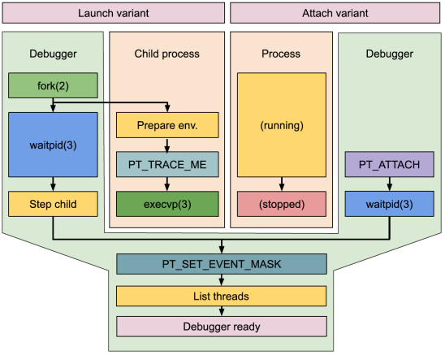
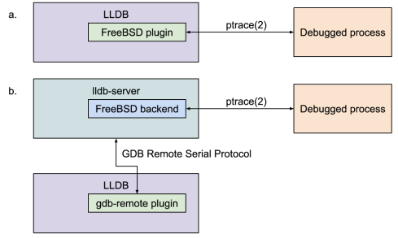
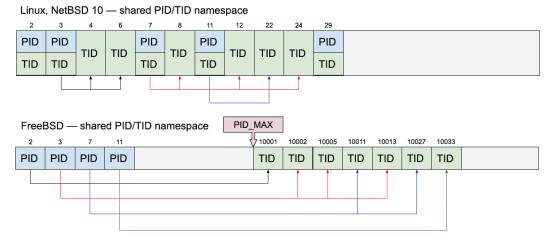
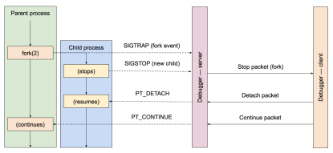
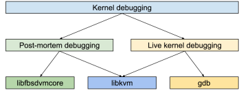

# LLDB 14 —— FreeBSD 新调试器

- 原文：[LLDB 14 – The New Debugger for FreeBSD](https://freebsdfoundation.org/wp-content/uploads/2022/06/moritz_LLDB.pdf)
- 作者：**MICHAŁ GÓRNY** 和 **KAMIL RYTAROWSKI**

在过去十年里，FreeBSD 一直在大力推进，将工具链的各个组件替换为更现代、许可更宽松的程序。其中一项工作是将老旧的 GNU GDB 调试器替换为 LLVM 项目的调试器 LLDB。Moritz Systems 参与了这一过程，承接了若干项目，现代化并改进 LLDB 对 FreeBSD 的支持，并实现缺失的功能。

LLDB 14 是迄今为止工作的集大成者。3 月发布的 LLVM 工具链包含多项改进，使 LLDB 更接近完全替代 GDB。该调试器支持 amd64、arm、arm64、i386 和 powerpc 架构上的 FreeBSD。它采用客户端-服务器布局，为本地和远程调试提供统一支持。除了提供的 lldb-server 外，还支持其他协议存根，例如 QEMU 模拟器或 FreeBSD 内核提供的存根。它完全支持多线程程序，也支持最常见的多进程场景，更多工作仍在进行中。此外，还提供类似 KGDB 的 FreeBSD 内核调试支持。

本文详细介绍 LLDB 架构和功能中一些较为有趣的方面。不过，在深入讨论具体细节之前，不妨先讨论一些基本原则，了解 Unix 衍生系统（如 FreeBSD）上的调试器如何实现。

## 在 Unix 衍生系统上的调试

在许多 Unix 衍生系统上（包括 Linux、FreeBSD 和其他 BSD），用户空间进程的调试通过 **ptrace(2)** 系统调用和信号的组合实现。前者通常用于控制被跟踪的进程并获取其状态的额外信息，后者用于向调试器异步报告事件。

**图 1. 调试会话的初始步骤，可以通过启动一个新进程或附加到一个正在运行的进程来启动。**

调试会话的第一步是跟踪器要么附加到一个已经在运行的进程，要么启动新程序。在前一种情况下，它会发出 `PT_ATTACH` 请求。请求成功后，被跟踪的进程被停止，调试器会收到信号。后一种情况的过程稍微复杂一些，如图 1 所示。

**ptrace(2)** API 没有提供显式请求来启动新程序。调试器需要使用常规的系统 API 完成这个操作，例如 **fork(2)** + **exec*(2)**。不过，在执行新程序之前，子进程会发出 `PT_TRACE_ME` 请求。这会使其开始被父进程（调试器）跟踪。此时，调试器会逐步执行子进程，直到 **exec*(2)** 调用完成。

附加或启动之后，被跟踪的进程会被停止。调试器会进行额外设置，例如设置报告事件掩码或查询被调试进程的额外信息。调试会话的其余部分由调试器发出 **ptrace(2)** 请求控制被调试进程并查询其额外信息，内核则通过信号传递与进程相关的事件。SIGTRAP 在这里有特殊作用，它用于指示大多数与调试过程相关的事件，例如断点和监视点的触发。

## LLDB 的架构

LLDB 利用插件抽象其代码库的大部分内容。撰写本文时，LLDB 源树中有 26 个插件类别。这些插件为不同的平台、ABI、编程语言、文件格式等提供支持。虽然插件架构尚未完成（尤其是目前不支持插件的动态加载），但它实施了必要的封装，以防止代码变得不可维护。

在插件系统的核心，有一个对 LLDB 调试功能至关重要的类别：进程插件。这些插件实现了启动进程或附加到已运行进程并调试它所需的所有例程。在现代版本的 LLDB 中，进程插件类别包含两类模块：基于 Process 类构建的客户端插件和基于 NativeProcessProtocol 类构建的 lldb-server 后端。

历史上，每个 LLDB 支持的操作系统都有自己的客户端进程插件。LLVM 13 之前的 FreeBSD 也是如此。在这个平台上运行时，LLDB 客户端会加载相应的进程插件，并用它控制被调试的程序。调试器的 UI 和 **ptrace(2)** 调用都在一个进程中完成。

LLDB 采用更现代的方法，将实际的调试进程抽象移到 **lldb-server(1)** 可执行文件中。平台支持移到专用 lldb-server 后端。客户端使用 gdb-remote 插件启动新的 lldb-server 实例，或使用 GDB 远程串行协议连接到另一个调试服务器。这个服务器不一定是 lldb-server：它也可以是 GDB 的 gdbserver，或者 QEMU、Valgrind 或 FreeBSD 内核提供的实现。

**图 2. 在传统上，FreeBSD 插件被加载到 LLDB 中，调试进程直接从 LLDB 可执行文件进行跟踪（子图 a.）。更现代的方法是将这一逻辑移到 lldb-server 中，并通过 GDB 远程串行协议让 LLDB 与它进行通信（子图 b.）。**

这一变化标志着 LLDB 从独立的调试器演变为客户端-服务器模型，能够进行跨平台远程调试。本地调试时也使用这种布局，为调试器 UI（即 LLDB 客户端）与发出实际 **ptrace(2)** 调用的服务器之间提供隔离。

从 LLDB 14 开始，绝大多数官方支持的平台使用客户端-服务器模型和 gdb-remote 进程插件。其他进程插件主要实现对各种核心转储格式的支持。

## 本地和远程跨平台调试

LLVM 工具链从一开始就设计为跨编译器，LLDB 同样如此，支持跨不同架构和操作系统的交叉调试。不过，由于大多数调试场景需要运行被调试程序，LLDB 需要克服操作系统内核的限制。

许多操作系统能运行与当前 CPU 兼容但 ABI 不同的可执行文件，最常见的是在 64 位 amd64 内核上运行 32 位 i386 可执行文件。在这种情况下，内核通过 **ptrace(2)** API 支持此类程序很有价值，调试器也需要能够正确使用它。这个问题可以分为三种场景：

1. 本地调试——内核、调试器和被调试可执行文件的架构相同。

2. 调试非本地程序——内核和调试器架构相同，但可执行文件架构不同。

3. 运行非本地调试器——内核和调试器架构不同。

**表 1. 架构到调试场景的示例映射。**

案例 | 内核 | 调试器 | 可执行文件  
---- | ---- | ------ | --------  
1 | amd64 | amd64 | amd64  
1 | i386 | i386 | i386  
2 | amd64 | amd64 | i386  
3 | amd64 | i386 | i386  

从调试器的角度来看，案例 1 和 3 是相同的。调试器和被跟踪的可执行文件是为相同的架构构建的。调试器需要显式支持该架构的可执行文件及其 **ptrace(2)** API。案例 3 还要求内核支持非本地的 **ptrace(2)** API。

第二种情况可能是最有趣的。调试器是为本地系统架构构建的，因此使用本地的 **ptrace(2)** API。然而，这个 API 需要根据非本地可执行文件格式进行调整。例如，如果在 amd64 上运行 i386 可执行文件，`PT_GETREGS` 请求使用 64 位寄存器转储格式，理想情况下调试器应在该格式和 i386 本地使用的格式之间转换。

尽管本地交叉调试受限于内核功能，但远程调试要强大得多。在这种情况下，可以在一台机器上启动 lldb-server、gdbserver 或任何实现兼容协议的服务器，然后使用 LLDB 客户端从另一台机器连接到它。这两台机器不必运行相同的架构，甚至不必运行相同的操作系统。

事实上，远程调试的能力不止于此。远程调试不仅限于跟踪用户空间应用程序，它还可以通过串口连接到 FreeBSD 内核中的 GDB 存根，检查内核的状态。它也可以连接到 QEMU 中实现的 GDB 存根，以控制虚拟机的 CPU 和内存。

LLDB 14 提供了比以前版本更兼容的 GDB 远程串行协议实现。多年来，LLDB 从使用仅适用于 LLDB 和 lldb-server 之间通信的自定义协议变体，发展到兼容许多其他调试服务器的协议。

一个有趣的演变例子是寄存器定义。最早版本的 lldb-server 使用基于 JSON 的格式传输寄存器定义，这种格式最适合 LLDB 的内部布局。随后，为与 GDB 兼容，添加了基于 XML 的格式。最终，为了支持那些根本不传输目标定义的存根，客户端添加了多种架构的后备定义。

## 调试多线程进程

现代调试器都需要能够处理多线程程序。通常，对多线程的支持包括：

- 接收线程创建和终止事件
- 能够区分适用于特定线程的其他事件（例如，针对特定线程的信号、断点）
- 能够控制单个线程的运行和停止

**图 3. 在 Linux 和 NetBSD 10 中，主线程与对应进程共享标识符。在 FreeBSD 中，进程标识符和线程标识符使用互不相交的范围。**

调试程序时，处理多个线程的具体机制取决于操作系统。现代内核使用统一命名空间处理进程和线程标识符。线程标识符（TID）是全局唯一的。在 Linux（和未来的 NetBSD 10 版本）中，主线程与对应进程共享标识符。在 FreeBSD 中，进程标识符和线程标识符使用互不相交的范围。

这种布局也决定了 **ptrace(2)** API 如何处理针对单个线程的请求。在 Linux 和 FreeBSD 中，TID 可以代替 PID 执行针对单个线程的操作。出于历史原因，在 NetBSD 中，线程标识符需要与进程标识符一起单独传递。

线程列表变化事件通常通过设置适当的事件掩码来启用。内核通过发送带有适当数据的 SIGTRAP 信号报告这些事件。但需注意，调试器需要考虑事件可能乱序接收的情况，例如新线程可能会先触发断点命中事件，而线程创建事件稍后才到达。

在当前版本的 FreeBSD 和 NetBSD 中，追踪 API 可以说是进程范围的。当发生特定于线程的事件时，整个进程会被暂停。调试器接收信号，并需要使用 **ptrace(2)** 获取额外的信号信息，特别是对应线程的标识符。此外，还有请求用于控制进程恢复时特定线程是保持暂停、继续运行还是进入单步执行。

另一方面，Linux API 对线程进行了更严格的隔离。调试器需要单独追踪每个线程。信号是针对特定线程报告的。当一个线程停止时，进程的其他线程会继续运行。

## 调试多个进程

调试器对多个进程的支持可以涵盖各种用例，从程序自行 fork 以同时执行多个操作，到运行外部程序或完整的管道。撰写本文时，LLDB 有两个用于调试多个进程的功能：支持多个目标和处理分叉事件。此外，正在开展的工作旨在引入完整的多进程支持。

在 LLDB 的术语中，目标代表单个被调试进程。相应地，为了同时追踪多个进程，LLDB 需要创建和跟踪多个目标。最常见的情形是使用 gdb-remote 插件追踪本地进程，每个进程都由单独的 lldb-server 实例追踪，每个目标都保持与其相应服务器的独立连接。这种方法的局限在于，每个目标需要单独创建，例如通过启动可执行文件或附加到已经运行的进程。

**图 4. 当一个进程分叉时，调试器会收到来自父进程的 SIGTRAP 和来自子进程的 SIGSTOP。服务器会报告因分叉而停止，客户端则请求分离其中一个进程（通过 `PT_DETACH`）并恢复另一个进程（通过 `PT_CONTINUE`）。**

另一个功能是处理 **fork(2)**、**vfork(2)**、**posix_spawn(3)** 及其等价函数。与多线程支持类似，这通过设置适当的事件掩码来启用。当进程被分叉时，调试器会收到信号并开始追踪父进程和子进程。不过，此时 LLDB 并不完全支持同时追踪这两个进程，而是会分离其中一个。LLDB 可以配置为继续追踪父进程，或者分离父进程并改为追踪新分叉出的子进程。

正在开展的多进程工作旨在将这两个特性结合起来，完整支持进程树调试。一个关键特性是能够立即开始追踪子进程，而无需恢复它或其父进程。主要有两种实现方式：使用类似 GDB 的多进程扩展，在单个 GDB 远程串行协议连接内复用多个被调试进程，或为每个新进程使用单独的连接。

## 非实时进程调试目标

虽然在 FreeBSD 上使用 LLDB 的主要目的是调试用户空间进程，但也有其他类型的“进程”插件：特别是处理核心转储和 FreeBSD 内核调试的插件。与 gdb-remote 插件类似，这些模块直接加载到 LLDB 客户端中，并不利用客户端-服务器架构。

现代 Unix 衍生系统上的核心转储使用 ELF 文件格式记录，就像这些平台上的可执行文件一样。相应地，它们由 LLDB 中的 elf-core 插件处理。然而，这个插件不适用于处理 FreeBSD 内核核心转储，因为这些转储使用的是物理内存布局，而非常规进程使用的虚拟布局。

**图 5. 调试 FreeBSD 内核的常见方法**

FreeBSD 内核调试是一个更广泛的话题。有多种方法可以处理活跃的内核（即运行中的系统的内核）或内核转储。首先，内核本身提供了内置调试器 kdb。其次，它提供了 GDB 存根，可以通过串口使用 GDB 远程串行协议连接远程调试器。LLDB 的最新版本为此提供了改进的串口支持。第三，可以通过 **/dev/mem** 特殊设备访问内核内存。最后，也可以使用内核转储文件。

LLDB 14 引入了新的 FreeBSDKernel 插件，支持后两种场景。它使 LLDB 能够正确打开并处理内核转储文件，包括较新的迷你转储格式和旧的“完整内存转储”格式。这通过两个库之一实现：FreeBSD 基本系统提供的 libkvm，或为跨平台调试创建的可移植替代品 libfbsdvmcore。

这使得 LLDB 可以替代 KGDB 工具。

## 总结

近年来，LLDB 作为调试器取得了重大进展。虽然它的功能尚未与 GDB 完全对等，但每个新版本都有所改进。此外，它不仅仅定位为 GDB 的替代品。基于 LLVM 工具链，它提供了基于 Clang 的强大表达式解析支持、JIT 支持、Python 和 Lua 脚本支持。插件化设计和良好的测试覆盖让扩展它成为一件愉快的事。

LLDB 的进展使 FreeBSD 最终可以淘汰老旧的 GDB，替换为更适合该项目的 LLDB。此外，得益于项目之间的密切合作，KGDB 功能直接集成到 LLDB 中，从而无需单独维护前端。这些成就很大程度上得益于 FreeBSD 基金会的支持。

LLDB 中一直有许多有趣的工作。其中一部分是最近启动的完整多进程支持项目——使用户能够高效调试 fork 或创建的完整进程树。另一个有趣的未来工作是 RISC-V 架构支持。

---

**KAMIL RYTAROWSKI** 和 **MICHAŁ GÓRNY** 是开源爱好者，十多年来一直为开源项目做贡献。他们创立了 Moritz Systems 公司，专注于 BSD 开发。他们编写了 NetBSD 的现代 LLDB 插件，并自 2020 年 9 月以来一直改进 LLDB 对 FreeBSD 的支持。
