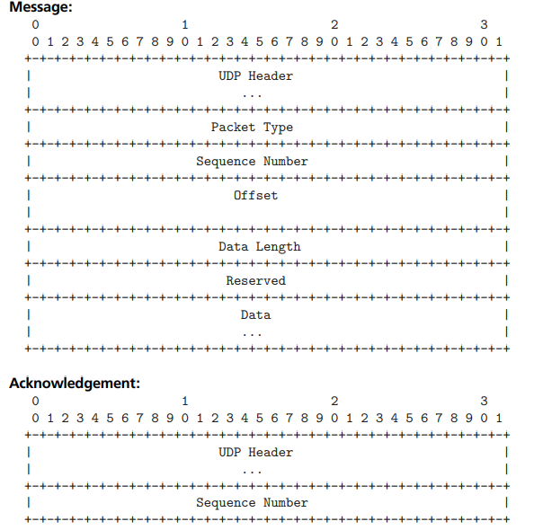

# 利用 netdump(4) 进行事后内核调试

- 原文：[Post-Mortem Kernel Debugging with netdump(4)](https://freebsdfoundation.org/wp-content/uploads/2022/06/kernal_debugging.pdf)
- 作者：**MARK JOHNSTON**

FreeBSD 内核 Panic 是希望尽可能避免的事件，但偶尔会发生。你可能运气不好，在生产系统上遇到内核错误，或者你正在开发内核补丁，测试时发现了错误。在这种情况下，重启系统会让系统重新上线，但内存中的内容会丢失，因此无法找到 Panic 的根本原因。FreeBSD 支持对内核 Panic 进行实时调试和事后调试。虽然实时调试通常更简单，但其本质意味着在开发人员完成调试前，Panic 的系统无法重启。这通常不切实际，因此通过核心转储进行事后调试是常见做法。

长期以来，FreeBSD 内核在发生 Panic 后能够保存核心转储，通常称为“内核转储”；保存内核转储后，Panic 系统可以重新启动并恢复上线，然后用该转储诊断问题。当用户空间程序崩溃并生成核心转储时，操作系统会将其状态保存为文件系统中的普通文件。然而，内核崩溃时情况就没那么简单：内核本身负责协调对其文件系统的访问，而 Panic 后，内核按定义处于不一致的状态，因此向文件写入数据是一件有风险的事。内核 Panic 已经够糟糕了，如果内核接着损坏自己的文件系统，那就更糟了！

FreeBSD 的传统解决方案是将内核转储写入原始磁盘分区，通常是用于交换空间的同一个分区。这样做比修改文件系统简单得多，并且由于交换的数据在重启后不会持久化，几乎不会覆盖重要数据。配置内核转储很简单：在 **/etc/rc.conf** 中，将 `dumpdev` 变量设置为保存内核转储的磁盘设备名称，或者如果要使用交换分区，则设置为字符串 `AUTO`。这个机制底层使用 `dumpon(8)` 告诉内核使用哪个磁盘设备。当系统在 Panic 后重新启动时，FreeBSD 会自动运行 `savecore(8)`，该命令读取保存的内核转储并放入目录 **/var/crash** 供后续使用。

基于磁盘的内核转储工作良好，只要系统有备用分区保存它们。然而情况并非总是如此：某些系统可能无盘启动，根本没有持久存储，或者像嵌入式设备那样，可能没有任何多余的磁盘空间。在这种情况下，过去只能依赖实时调试，或者使用类似 U 盘这样的临时方案存储内核转储。不过，从 FreeBSD 12.0 开始有了更好的方法！

## 介绍 netdump

`netdump(4)` 是相对较新的功能，它允许 FreeBSD 系统发生内核 Panic 时，在重启前通过网络传输内核转储。简而言之，它使用自定义的基于 UDP 的协议将内存内容传输到服务器，该服务器由 `netdumpd(8)` 实现（在 FreeBSD Ports 中为 `ftp/netdumpd`）。这使用户能够从 Panic 的内核获取转储，而无需在系统上配置任何本地存储。

需要事先说明，netdump 不执行任何加密或身份验证，因此内核内存的内容直接通过网络传输。内核内存通常包含敏感信息，因此使用 netdump 时必须确保仅在受信网络中使用。

netdump 历史悠久：它大约在 2000 年由杜克大学的 Darrell Anderson 作为 FreeBSD 4 补丁提出，在随后的几年里由几家使用 FreeBSD 的公司的开发者移植。最终在 2018 年提交到 FreeBSD 的源码仓库，首次在 FreeBSD 12.0 中可用。

在内部实现上，netdump 基于 debugnet，这是独立的 IPv4/UDP 协议实现，专门设计用于在内核发生 Panic 时使用。特别是，debugnet 的 UDP 堆栈运行在单线程中，不执行任何堆内存分配，也不阻塞（例如等待中断或互斥锁）。这些约束源于需要最小化内核在发生 Panic 后执行的代码复杂性：由于内核已经崩溃，netdump 必须避免在工作时使情况更糟。

由于 debugnet 需要传输和接收数据包，需要能够与网络接口控制器（NIC）硬件通信。因此，各个 NIC 驱动程序需要修改，才能供 netdump 使用。通常，这些修改是为驱动程序的数据包传输和接收路径添加“轮询”模式。实际上，所需的修改相对简单，通常只需为某个驱动程序添加不到 100 行 C 代码。如今，许多广泛使用的驱动程序都实现了 debugnet 支持，包括所有 Intel 驱动程序（实际上包括所有使用 `iflib` 框架实现的驱动程序）、现代 Mellanox 驱动程序、VirtIO 网络驱动程序以及几个用于 GigE NIC 的驱动程序，这些驱动程序常见于桌面系统或服务器管理端口；完整的驱动程序列表见 `netdump(4)` 手册页。

最后，debugnet 钩入内核的包缓冲区分配器。这是因为驱动程序代码在 Panic 后会继续使用标准的 `mbuf(9)` 分配器接口分配缓冲区，但 netdump 需要避免依赖标准分配器。在系统初始化期间，debugnet 会预分配并保留内存，供内核 Panic 后使用，从而确保 mbuf 分配成功，并且不会过多干扰内核状态。

## debugnet 协议

debugnet 协议符合 netdump 的要求，非常简单且专门用于其任务。它基于 UDP 协议实现，目前仅支持 IPv4；尽管也可以支持 IPv6，但尚未实现。netdump 由发生 Panic 的系统启动，该系统充当客户端，服务器由 `netdumpd` 实现。debugnet 协议有两种数据包类型：客户端消息和确认消息。



启动 netdump 时，客户端首先需要发现下一跳路由器的 MAC 地址。为此，其配置中包含“网关”IP，debugnet 通过广播 ARP 请求获取路由器地址。确定路由器地址后，客户端首先向服务器发送类型为 `NETDUMP_HERALD` (1) 的消息，目标端口为 20023。此操作与服务器建立会话，服务器绑定到一个临时端口，并向客户端的 20024 端口发送确认消息。客户端后续所有消息都发送到这个临时端口。所有客户端消息都会收到服务器的确认。

会话完全建立后，客户端开始传输内核转储数据。包含这些数据的消息类型为 `NETDUMP_VMCORE` (3)。每条消息都有唯一的序列号，并指定相对于内核转储文件起始位置的数据偏移量和长度。收到 `NETDUMP_VMCORE` 消息后，服务器将数据写入转储文件的相应偏移位置，然后发送确认消息。客户端通常会一次传输一批数据块，并等待所有数据块的确认消息到达后才继续传输。所有内核转储数据传输并确认后，客户端在一条 `NETDUMP_KDH` (4) 消息中提供描述 Panic 的元数据，然后用 `NETDUMP_FINISHED` (2) 消息完成会话。此时，内核转储已保存在服务器的文件系统中，可用于调试。

## 配置 netdump

了解 netdump 的工作原理后，我们可以探讨它的配置。实际上，netdump 需要四个配置变量才能工作：

1. 客户端 IP 地址
2. 服务器 IP 地址
3. 网关 IP 地址
4. 使用的接口（例如 em0）

就像传统的基于磁盘的内核转储一样，可以用 `dumpon(8)` 配置 netdump。例如，假设客户端 IP 为 `10.0.1.157`，位于 vtnet0，服务器 IP 为 `10.0.1.236`，网关 IP 为 `10.0.1.1`，配置 netdump 如下：

```sh
# dumpon -c 10.0.1.157 -s 10.0.1.236 -g 10.0.1.1 vtnet0
```

然后，在服务器上，可以将 `netdumpd` 作为前台程序运行。

```sh
$ netdumpd -d . -D -P ./netdumpd.pid
netdumpd: default: listening on all interfaces
Waiting for clients.
```

这会让内核转储保存在当前目录，由 `-d` 参数指定。

测试设置时，我们可以手动触发 panic，并让内核转储核心。

```sh
# sysctl debug.kdb.panic=1
debug.kdb.panic: 0panic: kdb_sysctl_panic
cpuid = 1
time = 1655412790
KDB: stack backtrace:
db_trace_self_wrapper() at db_trace_self_wrapper+0x2b/frame 0xfffffe007c573af0
vpanic() at vpanic+0x151/frame 0xfffffe007c573b40
panic() at panic+0x43/frame 0xfffffe007c573ba0
kdb_sysctl_panic() at kdb_sysctl_panic+0x61/frame 0xfffffe007c573bd0
sysctl_root_handler_locked() at sysctl_root_handler_locked+0x9c/frame
0xfffffe007c573c20
sysctl_root() at sysctl_root+0x213/frame 0xfffffe007c573ca0
userland_sysctl() at userland_sysctl+0x187/frame 0xfffffe007c573d50
sys___sysctl() at sys___sysctl+0x5c/frame 0xfffffe007c573e00
amd64_syscall() at amd64_syscall+0x12e/frame 0xfffffe007c573f30
fast_syscall_common() at fast_syscall_common+0xf8/frame 0xfffffe007c573f30
--- syscall (202, FreeBSD ELF64, sys___sysctl), rip = 0x8011a773a, rsp = 
0x7fffffffd938, rbp = 0x7fffffffd970 ---
KDB: enter: panic
[ thread pid 784 tid 100098 ]
Stopped at kdb_enter+0x32: movq $0,0x1279963(%rip)
db> dump
debugnet: overwriting mbuf zone pointers
debugnet_connect: searching for gateway MAC...
netdumping to 10.0.1.236 (02:9a:88:79:b5:0a)
Dumping 257 out of 4057 MB:..7%..13%..25%..32%..44%..56%..63%..75%..81%..94%
netdump finished.
debugnet: restoring mbuf zone pointers

Dump complete
```

在服务器上，我们应该看到类似如下内容：

```sh
New dump from client devvm [10.0.1.157] (to ./vmcore.devvm.0)
................(KDH from devvm [10.0.1.157])
Completed dump from client devvm [10.0.1.157]
```

现在，我们在 `-d` 参数指定的目录中得到了一个内核转储！

在这个例子中，客户端和服务器位于同一链路。因此，`gateway` 参数是多余的，可以省略：

```sh
# dumpon -c 10.0.1.157 -s 10.0.1.236 vtnet0
```

通过 **/etc/rc.conf** 配置 netdump 会稍微复杂一些。如果相关的 IP 地址是静态的，可以通过 rc.conf 变量 `dumpon_flags` 传递。如果不是静态地址，可以使用系统的 DHCP 客户端钩子，在客户端地址确定后调用 `dumpon`。手册页 `dumpon.8` 提供了如何使用 `dhclient(8)` 实现这一点的示例。自 FreeBSD 14.0 和 13.2 起，debugnet 在大多数情况下能够推断出客户端地址，从而简化配置。

## 动态配置 netdump

netdump 的一个限制是需要在 panic 之前进行配置。从 FreeBSD 13.0 开始，可以在 panic 后通过 DDB（内核调试器）配置 netdump。通过 DDB 的 `netdump` 命令即可配置：

```sh
# sysctl debug.kdb.panic=1
...
Stopped at kdb_enter+0x32: movq $0,0x1279963(%rip)
db> netdump -s 10.0.1.236
debugnet: overwriting mbuf zone pointers
debugnet_connect: searching for server MAC...
netdumping to 10.0.1.236 (02:9a:88:79:b5:0a)
Dumping 258 out of 4057 MB:..7%..13%..25%..31%..44%..56%..62%..75%..81%..93%
netdump finished.
debugnet: restoring mbuf zone pointers

Dump complete
```

## 下一步

仅有内核转储本身并不十分有用：调试器需要将核心转储与内核及其调试信息的精确副本配对。在将核心转储打包发送给开发人员时，请务必包含匹配的内核。默认情况下，内核调试信息会拆分成单独的文件，存放在目录 **/usr/lib/debug** 下。因此，通常最安全的做法是包含以下内容：

1. 内核转储文件（通常是 vmcore.<something>）
2. **/boot/kernel/** 的内容
3. **/usr/lib/debug/boot/kernel/** 的内容

`netdumpd` 提供了参数 `-i`，可以用来指定在 netdump 完成后执行的脚本。这可以用于执行内核转储的后处理。内核调试本身的讨论超出了本文的范围，但以前的文章提供了大量信息。

netdump 在某些环境下非常有用，但也有一些限制。已经提到的几个限制包括缺乏保密性、不支持 IPv6 和固定的端口号。如果你遇到这些限制（或者出现了 bug！），请务必在 FreeBSD 项目的 bug 跟踪器或项目邮件列表中报告问题。

---

**Mark Johnston** 是软件开发人员和 FreeBSD 源代码提交者，居住在加拿大安大略省的多伦多。他目前为 FreeBSD 基金会工作，对操作系统开发的各个方面都有兴趣。当他不坐在电脑前时，他喜欢和朋友们一起参加城市躲避球联赛。
