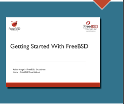
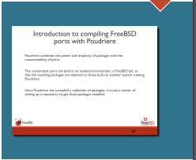
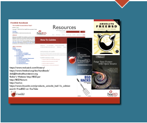

# FreeBSD 入门研讨会

- 原文：[Getting Started with FreeBSD Workshop](https://freebsdfoundation.org/wp-content/uploads/2022/08/angel_workshop.pdf)
- 作者：**Roller Angel**

## 与 Front Range BSD 用户组的合作

我与 **Front Range BSD 用户组** 合作，连续几年在 **SCaLE** 上教授《FreeBSD 入门》（Getting Started with FreeBSD）研讨会。我这样做是因为深知这些工具的强大，也乐于通过这样的研讨会分享自己的经验。

每次授课后，我都会对自己的 FreeBSD 配置方案有新的验证，同时也能得到学员们的反馈，持续改进研讨会内容。最近的一次授课是在 **SCaLE 19x**，前几年的研讨会则在 **SCaLE 17x 和 18x** 举行。



## SCaLE 19x 研讨会回顾

学员们陆续走进会场，映入眼帘的是投影屏幕上《FreeBSD 入门》的标题幻灯片——由 FreeBSD 基金会的市场协调员 **Drew Gurkowski** 制作。演示通过 YouTube 直播，链接为 <https://www.youtube.com/watch?v=ByFCRwMJATM>，可从直播中获取截图。

通常，研讨会由 FreeBSD 基金会的执行董事 **Deb Goodkin** 做开场介绍，但这一次，**Drew Gurkowski** 出色完成了这一任务。

在每次研讨会中，我们都希望确保学员能够克服困难并跟上整个流程。由于没有计算机实验室可用的实验机器，我们在 **VirtualBox** 中初始化并配置虚拟机来使用。

基本流程如下：

1. **插入虚拟光盘**：将虚拟光盘放入虚拟机的光驱。
2. **从光盘启动并安装 FreeBSD**：从光盘驱动器引导，将 FreeBSD 安装到虚拟机的虚拟硬盘。
3. **完成安装后执行 `shutdown -p now` 关机**：在 FreeBSD 安装程序结束时，运行 `shutdown -p now` 命令指示 FreeBSD 关闭计算机。这样可以 **移除虚拟光盘**，避免下次启动时再次从光盘引导。
4. **后续引导时改为从硬盘启动**：将 FreeBSD 安装到硬盘后，之后就从硬盘引导。

在这一阶段，我们会短暂休息，我会利用这段时间找到尚未跟上的学员，看看如何帮助他们。

## 常见问题与解决方案

在研讨会中，我遇到的最常见问题主要与虚拟机的错误配置有关。大多数设置我们都保持默认，但举例来说，有人在虚拟机的系统设置中取消勾选了 **“Enable I/O APIC”**，勾选该选项即可修复问题。另一位学员将机器类型设为 32 位，改为 64 位后问题解决。排查问题时请注意，即使是软件包名称或设置中的小小拼写错误，也可能是问题根源。

最近出现的一个问题是，新的 Apple 处理器上缺乏合适的 hypervisor，因为 VirtualBox 不支持这些处理器。我们还遇到了会场 WiFi 的一些小问题，涉及通过 DHCP 提供给虚拟机的 DNS 设置，最终修改了 **/etc/resolv.conf** 文件中的 `nameserver` 条目。



## 服务器与桌面的界限

下一步是演示服务器与桌面之间的界限有多么模糊。只需安装几个软件包并更新一些配置文件，桌面就能准备就绪。我们只需运行 `startx` 命令，告诉 FreeBSD 启动桌面。

看到学员们意识到他们刚刚搭建了自己的桌面，而且不需要特定的 FreeBSD 发行版或变体来运行特定的 X Window 系统窗口管理器（如 **KDE Plasma 5、Lumina 或 GNOME**），真是太好了。我们使用了 **XFCE**，但也演示了安装和配置任何你想使用的窗口管理器有多么容易。窗口管理器运行后，你可以与 GUI 应用程序交互，如网页浏览器、编程 IDE、文件管理器等。

## 构建自定义软件包仓库

我还认为，向学员介绍构建自定义软件包仓库的过程很重要。如果他们遇到需要自定义某个 Port 并构建自己的软件包的问题，就已经知道如何避免常见陷阱，不会走上混合使用 Ports 和软件包的道路。我们使用的工具叫 **Poudriere**，它让构建自己的软件包仓库变得非常简单和直接。

## 自动化管理与 Ansible

随着学员们学会在命令行中输入命令，一个值得讨论的合适工具是 **Ansible**，它通常用于配置管理，并且很适合通过 SSH 控制远程机器。我们演示了如何克隆 FreeBSD 虚拟机并通过 SSH 连接到它。这样，我们就可以试用 Ansible，看看使用 **Ansible Playbooks** 这个工具让 Ansible 输入命令有多么容易。

研讨会中包含一个 **Ansible Playbook**，我们在远程机器上用它搭建 Poudriere，构建所有软件包，并将生成的文件同步回本地机器。思路是：我们可以短期租用一台非常强大的机器来构建软件包，一旦软件包文件下载到本地机器、不再需要软件包构建机器，就销毁那台机器。要使用下载的软件包，我们可以将软件包仓库设置改为指向软件包文件所在的 **file://** 路径，而不是默认的 <https://download.FreeBSD.org> 设置。

## FreeBSD Jail 与 iocage



我们还讨论了 **FreeBSD Jail**，让学员对它们有所体会，并看看使用 **iocage** 管理它们有多么容易。我们推荐 **MWL.io** 上的深入书籍，涉及 **FreeBSD Mastery** 系列，研讨会学员可以跟随 **Michael W Lucas** 深入探讨 FreeBSD Jail、Poudriere、安装 FreeBSD 等更多主题。

## 研讨会参与者

这是一群很棒的学员，大家来自不同背景，经验水平各异，都能在一起钻研炫酷技术，学到有助于未来工作的新知识。一旦掌握了 FreeBSD 的安装和配置，就很容易看出可以用 FreeBSD 解决哪些问题。借助 **Ansible** 等配置管理工具，你可以将所学进一步拓展，因为你对配置文件的修改和安装的软件包都有越来越完整的记录。你可以快速从上次中断的地方继续，在 FreeBSD 之旅中不断学习更多。

这次学员们非常热情，有些人甚至带来了笔记本电脑，计划在上面安装 FreeBSD，还有一些人对 FreeBSD 的 WiFi 有疑问。你可以轻松使用 Android 的 USB 共享网络与 FreeBSD 共享互联网连接，插入数据线，启用共享网络，然后以特权用户身份执行命令：

```sh
dhclient ue0
```

该命令会通过 **DHCP** 从第一个 USB 以太网设备获取地址。当然，你也可以通过 **/etc/rc.conf** 和 **/etc/wpa_supplicant.conf** 配置内部 WiFi 卡。有关这些文件的详细信息（包括支持的选项列表），请查阅 FreeBSD 手册页第 5 节。更多 WiFi 信息见 FreeBSD 手册第 32 章：高级网络。了解哪些选项可用是好事，研讨会旨在回答所有常见问题，让人们用 FreeBSD 做些炫酷的事情，并帮助人们用软件解决问题。

## 研讨会后的小故事

最后，我想提到一位学员，他中途才到，进度严重落后，无法跟上。研讨会结束后，我在大厅里陪他一起，帮助他把一切跑起来。他的机器用的是旧的酷睿 2 Duo 处理器，所以完成整个过程格外耗时。他对帮助表示感谢，并表达了进一步学习 BSD 的兴趣。我推荐了 FreeBSD 期刊、MWL.io 和 BSD 用户组。此外，我总是乐于助人，我的网站是 [http://BSD.pw](http://BSD.pw)。

---

**Roller Angel** 大部分时间都在帮助人们学习如何通过技术实现目标。他是一名热心的 FreeBSD 系统管理员和 Pythonista，热衷于学习开源技术（尤其是 FreeBSD 和 Python）所能实现的惊人之事，用以解决问题。他坚信，只要有心学习，就能掌握任何想学的知识。他总是寻找创造性的解决方案，乐于接受挑战。他充满动力，积极学习、探索新想法，保持技能敏锐。他还喜欢参与研究社区，分享自己的想法。
