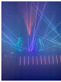
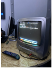
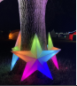
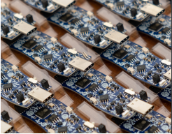
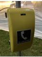
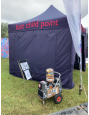
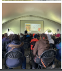
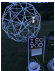
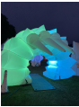
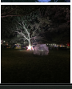

# 支持 Electromagnetic Field 2022

- 原文：[Electromagnetic Field 2022 Support](https://freebsdfoundation.org/wp-content/uploads/2022/08/jones_trip_report.pdf)
- 作者：**Tom Jones**

我站在夜总会顶部，开始意识到自己身处一条鲸鱼体内。它在 DJ 放着鼓与贝斯的地方向上弯曲，形成了这只怪兽的嘴巴。这种地板若放进建筑物里肯定造价不菲。但下面只是草地，这不过是地形的偶然。DJ 下方的墙上有一排排红色条形灯，随着房间逐渐充满烟雾，它们看起来越来越像这只动物的喉咙。DJ 上方悬挂着巨大的水母，我无意中听说每只水母由 200 块 PCB 板组成，它们看起来像眼睛。加上帐篷的形状，整个效果就齐了。这是一只鲸鱼。鲸鱼的嘴巴从生物技术实验室延伸出来，我是穿过一座气体火炬塔走到那里的。我还没弄清楚如何启动生物技术实验室的设备，在田野里待了 3 天，我已经很累，但有些勇敢的黑客正试图弄清楚如何控制实验室的系统。我并没有走进 Ian M. Banks（**译者注：苏格兰科幻小说作家**）的小说世界；我在 Electromagnetic Field。Electromagnetic Field（EMF）是英国唯一的露营式黑客与创客节。这场为期一个周末的庆祝活动涵盖了技术、艺术和人类让世界变得更加有趣的愿望。鲸鱼嘴巴是 Null Sector 的一部分，这项集艺术装置、逃脱室、夜总会于一体的活动已经成为 EMF 的招牌。EMF 有节日应有的一切，你可以在英格兰美丽的夏日天气中露营，享受各种设施：厕所、淋浴、食品摊位、（免费的）可破解电子徽章，还有电源和千兆互联网接到你的帐篷。EMF 是个特别的地方，活动丰富多彩，活动期间根本不可能看完所有内容。

## 节日组织内容

该节日采用会议形式——有演讲和工作坊。2022 年有 3 个演讲轨道，分别在可容纳 500 至 1000 人的帐篷内举行，此外还有 5 个并行的工作坊环节。为了加强“走廊环节”，还专门设置了帐篷作为休息区。

演讲内容涵盖从技术话题到对人类世环境、心理学和艺术的探索。演讲者包括特定系统的世界级专家和深入研究事物工作原理的业余爱好者。今年的重点演讲涉及安全问题，以及一个意外的“铁路话题”，评分前十的演讲中有 4 个最终都是关于铁路的。

演讲面向技术观众，但因为我们每个人都有自己的专业领域，演讲对任何特定领域的外行人来说也易于理解。

到了晚上，演讲帐篷改作他用，主舞台上演互动内容，如周六晚上的 PowerPoint 卡拉 OK。EMF 还在小舞台上举办了电影节，每晚都座无虚席。除了 Null Sector 的夜总会外，每晚还有 Stage B 的音乐演出。Stage B 的表演者如 Look Mum No Computer 和 AA Battery 在自制合成器和 Gameboy 上演奏音乐。适合技术爱好者的音乐。

工作坊为大家提供了学习全新内容的机会。作为黑客节，工作坊包括技术类、硬件相关的课程。你可以第一次学焊接，或者学习如何缝制柔性可穿戴电子电路；如果这不是你第一次参加黑客营，你可以参加徽章团队的工作坊，学习他们是如何做 PCB 布局的。

工作坊还涉及一些更轻松的话题，比如绘画活动、面部彩绘和皮革工艺。

EMF 是个适合所有年龄段的活动。让家有老小的家庭在周末外出非常困难。EMF 认识到这一点，并为儿童提供了世界级的设施。有一个托儿所，孩子可以在软性游乐区玩耍和探索（但在帐篷里）。与主活动相呼应的是家庭休息区，今年设有巨型充气 RGB 触手、为儿童和照看他们的大人准备的活动，以及可以坐下来让活动从身边自然流过的地方。

青少年工作坊环节在节日期间每天开放至晚上九点，内容包括建造桥梁、用人工智能教计算机、用树莓派 Pico 硬件黑客入门，以及著名的 DJ 工作坊。

在青少年 DJ 工作坊后，据说一些孩子聚集在一起，计划接管 Null Sector 的夜总会，并以自己新起的 DJ 名字在下午表演 DJ set。

## 安装

EMF 是由黑客社区举办的活动，几乎不可能参观这片场地而不想带着自己的 LED 装置回去，加入夜间的灯光装饰。EMF Camp 的装置作品为夜晚增添了奇妙的氛围，日落时分在场地里四处走走成了必做之事。装置作品有的是展示有趣图案的 LED 灯带，也有一些规模发展得很庞大。今年湖面上有一个巨大的时钟，由荧光管组成，这个时钟在活动大部分时间都显示时间，直到它联网后，几小时内显示了“HAKD”。

继美国 Toorcamps 的“ShadyTel”电话网络之后，今年 EMF 也拥有了自己的电话公司 cuTel 和相应的电话网络。cuTel 乐意随时为你安装电话线路，只需支付适度的费用（其实是免费的），就可以接到你的帐篷、村庄或装置。到处都有挂在杆上的电话亭。我听说有一组带有大卫·林奇风格的桌子、灯和电话，它们会在营地里四处移动，当你移开视线时就会消失。cuTel 提供传真服务，并在活动结束时偷偷加入了拨号上网服务。下次，我相信你可以舒舒服服地从充气床垫上拨号进入一个 BBS。

## EMF Camp 2022

EMF 是场非常棒的活动，绝对值得你未来去尝试参加。可能只是因为人们对疫情仍心存余悸，门票才没有像 2018 年那样立刻售罄。这个活动靠志愿者努力办成，每个人都有一张票，包括主要的组织者。活动中有太多事情可以做，几乎让人感到不知所措。有些地方你只能匆匆一瞥，很多活动细节也只能在之后通过社交媒体发现。有些整辆的机器人车辆我当时没能亲眼看到，但却在推特上看到它们驶过。有些事情我只能简要提及，比如 DECT 电话网络、专门为活动安装的 GSM 电话网络，或者志愿者为活动的顺利举办所做的成千上万件事情。很难不感到充满活力，脑中充满了下一次活动的项目、演讲、工作坊和装置创意。看到别人的充气 LED 蘑菇时，你绝对会想，下次也要为这个环境增添点什么。我强烈推荐所有年龄段的人参加黑客节，既适合想跳舞到凌晨 2 点的人，也适合想和小孩子一起度过轻松周末的人。这类活动并不是每年都会举办，EMF 每两年举办一次。德国和荷兰的黑客节每四年举行一次，荷兰的 MCH 活动也将在今年夏天举行，而 CCCamp 预计将在 2023 年举办。如果有机会，务必特别努力参加其中的一个活动。这些活动值得你在露天的田野里睡几天，并勇敢面对天气。作为回报，你可以体验用转盘电话战争拨号、在生物技术实验室解谜，或者仅仅坐在湖边的躺椅上享受日落。

---

**Tom Jones** 希望基于 FreeBSD 的项目能够获得应有的关注。他住在苏格兰东北部，并提供 FreeBSD 咨询服务。
