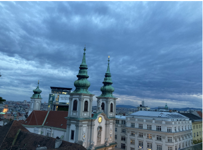
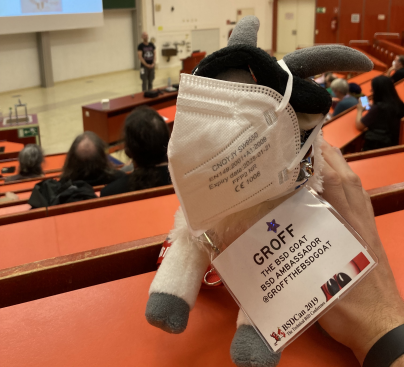

# EuroBSDCon 会议报道

- 原文：[EuroBSDCon 2022](https://freebsdfoundation.org/wp-content/uploads/2023/01/evans_conference_report.pdf)
- 作者：**KYLE EVANS**

九月，我前往美丽的维也纳参加了 2022 年的 EuroBSDCon；非常感谢我的雇主 Klara 承担了足够的旅行费用，让这次旅行得以成行。这是我第二次参加 BSD 大会（当然不会是最后一次），出于种种原因，这次比上一次更令人兴奋。这次旅行是我首次跨洋飞行，目的地在家乡以东整整七个时区，我还带上妻子和幼儿同行。我上次参加的大会是 2018 年的 BSDCan，所以我非常激动能和多年来在线上合作过的许多人见面。

我们当天稍晚才到达，比开发者峰会开始早了一天。我们的旅程大致平稳，直到在最后一段航程 AMS（阿姆斯特丹）时，我们在跑道上多滞留了两三个小时。dch@ 很好心地提供了从机场到酒店的交通，并简短地带我们参观了这座城市，然后把我们送到了 Erzherzog Rainer 酒店。到达时我们都非常疲惫，所以我松了一口气，因为我忘记了 RSVP（回复请柬）参加原定于我们到达后一两小时内举行的休闲核心晚宴。

第一天是 FreeBSD 开发者峰会和相关集体晚宴。我和 Klara 的其他一些人碰面，待在峰会举办场地的后排。在后面，我遇到了 Modirum 的 Eirik Øverby，他给我带来了更多的苹果硬件，让我可以带回家，并添加到我用于移植的 Apple Silicon 硬件塔中。我还遇到了苹果工程师 Cosimo Cecchi，他提前到达并参加了开发者峰会。我们聆听了 FreeBSD 基金会的演讲，还听取了各个开发者关于他们工作进展的报告（工作流程问题、ALTQ、Netlink、CI）。全天分布的午餐和咖啡休息时间，为大会前几天提供了很好的走廊交流机会。

虽然有专门的时间段用于编程小组活动，但旅行前的混乱中，我显然把笔记本电脑充电器忘在家里了，于是我利用这段时间和家人一起散步，顺便在开发者峰会晚宴前买了 USB-C 充电器。晚宴主办方非常好心地允许我妻女参加，我非常感激，因为在那期间，我实际上有一半时间都把她们抛在一边。尽管小女儿有时有些闹腾，但其他与会者对她非常友善。

开发者峰会的第二天和第一天差不多，仍有更多的讲座和工作小组，同时也安排了更多的自由编程时间。jhb@ 花了十分钟解决了我们长时间无法解决的 Apple Silicon 上的 PCI 问题，这既令人兴奋又令人沮丧。开发者峰会后，家人在 TU 大楼外面和我汇合，我们稍微四处走了走，探索了一下周围的区域。

EuroBSDCon 的第一天以 Frank Karlitschek 的非常有趣的主题演讲开始。接下来，我参加了 Taylor R Campbell 的演讲《How I learned to stop worrying and yank the USB》（《我是如何学会停止担心和拔掉 USB 的》），他在演讲中讲述了在 NetBSD 中破坏又修复 USB 热插拔的许多有趣方式，以及如何以相当简洁的方式修复这些问题。我需要同步本地代码库中的一两个分支，于是我去参加了 Brooks 讲解如何在 FreeBSD 中添加系统调用的讲座，因为我对这个话题已有相当了解。尽管如此，讲座中仍充满了关于其他 ABI 和兼容性问题的有趣小细节。

当天我参加的最后两场讲座是 Mateusz 关于衡量追踪性能开销的演讲和 Allan 关于 ZFS 扩展的演讲。在我从事操作系统工作的这些年里，我并没有花很多时间追踪，但我仍然对 dtrace 和 ebpf 在实际场景中执行追踪时的开销比较感兴趣。我原本想参加 Ken 关于 OpenBSD 文件系统块的讲座，却沉浸在走廊的社交活动中。

妻子和女儿再次在外面和我汇合，这次我们去找了我一直很想尝试的 döner kebab（土耳其烤肉）。那夜灾难发生了，我们的小宝贝终于意识到她有时差，几乎没怎么睡觉。最后一天，我在大约 07:00 到达了关闭的校园（只睡了大约一个小时，但不想吵醒其他人），大约 30 分钟后，一名楼内的工作人员（我想是安保？）注意到我站在外面，耐心等待大会开始，并让我进入。

盯着笔记本电脑看了一会儿后，我意识到在讲座期间我很可能无法理解太多内容，于是我承认失败，在大厅里待了一天，断断续续地捣鼓各种东西。

尽管看起来我不参加最后一天的讲座似乎有所损失，但我觉得自己从这一决定中收获更多。我最终遇到了很多如果我参加讲座本不会见到的不熟悉面孔。我还带着 Eirik 借给我用于移植的 MacBook，和几个人一起在走廊上与笔记本搏斗，将挪威语键盘重新映射成我更熟悉的布局。macOS 的键盘映射完成了 98% 的工作，但它没有重新映射我最常用的五个键之一：波浪符/反引号。如果你也因为类似原因遇到这个问题，解决办法是使用 `hidutil` 完成这项工作，找回波浪符。

随着会议的结束，我们互道再见，我从 krion@ 那里要到一份适合家庭活动的清单，供我们在维也纳剩下的三天里游玩，他是我之前在 Allan 关于 ZFS 扩展的讲座中认识的。这份清单确实充满了很棒的建议，可惜天气不太配合，我们没能全部完成。

远离“家”的会议，我的总体建议就是 Allan Jude 曾试图告诉我的：稍早预订航班，在大会前给自己留出一两天，尽量调整作息。很难不建议在大会结束后再预订几天用于旅游，说不定会从与会者那里了解到更多值得一看的景点。

---

**KYLE EVANS** 是 FreeBSD 开发者，目前受雇于 Klara, Inc. 他自 2017 年起加入 FreeBSD 项目，参与了基本系统中多个项目的工作。
