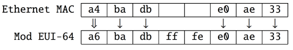
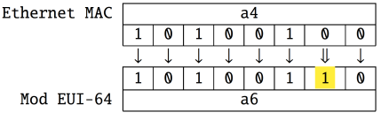
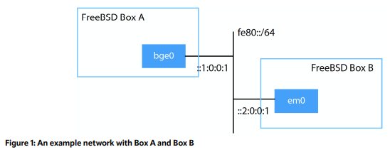
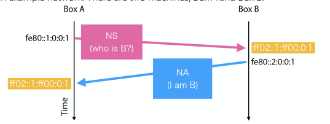
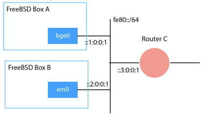
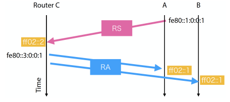

# 实用 IPv6（第四部分）

- 原文：[Pragmatic IPv6 (Part 4)](https://freebsdfoundation.org/wp-content/uploads/2023/01/sato_IPv6_part4.pdf)
- 作者：**佐藤広生**

正如前面几期文章所提到的，IPv6 看起来与 IPv4 类似，唯一不同的是地址格式。然而，这两种协议是独立工作的，当然，每种协议都有其特有的功能。本文将探讨 IPv6 基于多个地址的独特特性及其实际应用，并介绍邻居发现协议（NDP，Neighbor Discovery Protocol），该协议负责 L2 到 L3 的地址解析以及同一网络上主机和路由器的发现。  

在你的 FreeBSD 主机上使用 IPv6 时，你通常会看到多个地址，像这样：

```sh
% ifconfig vlan100
vlan100: flags=8843<UP,BROADCAST,RUNNING,SIMPLEX,MULTICAST> metric 0 mtu 1500
options=80003<RXCSUM,TXCSUM,LINKSTATE>
ether a4:ba:db:e0:ae:33
inet6 2001:db8:fb5d::1prefixlen64
inet6 fe80::a6ba:dbff:fee0:ae33%vlan100 prefixlen 64 scopeid 0x6
inet6 fe80::ffff:2:7b%vlan100 prefixlen 64 scopeid 0x6
inet6 fe80::ffff:2:35%vlan100 prefixlen 64 scopeid 0x6
inet 192.168.100.1 netmask 0xffffff00 broadcast 192.168.100.255
groups: vlan
vlan: 100 vlanproto: 802.1q vlanpcp: 0 parent interface: lagg0
media: Ethernet autoselect
status: active
nd6 options=21<PERFORMNUD,AUTO_LINKLOCAL>
```

这是作者某台主机的实际示例。**/etc/rc.conf** 文件包含以下内容：

```sh
ifconfig_vlan100_ipv6="inet6 2001:db8:fb5d::1/64"
ifconfig_vlan100_alias0="inet6 fe80::ffff:2:7b/64"
ifconfig_vlan100_alias1="inet6 fe80::ffff:2:35/64"
```

你可以在 **ifconfig(8)** 的输出中看到四个 IPv6 地址。**2001:db8:fb5d::1** 是 GUA1，而其他三个是 LLA2。在 **/etc/rc.conf** 文件中，只显式指定了两个 LLA。为什么会有四个？

## 自动配置的 LLA

请记住，当指定 `ifconfig_IF_ipv6` 时，会发生以下情况：

- 移除标志 `IFDISABLED`，且
- 基于接口的 L2 地址自动配置 LLA。

更准确地说，所有支持 IPv6 的接口在内核级别默认具有标志 `AUTO_LINKLOCAL`，并且在接口变为“up”时会自动配置 LLA。**rc.d(8)** 脚本会在没有指定 `ifconfig_IF_ipv6` 时添加标志 `IFDISABLED`，以防止接口配置 LLA。这是为了那些只想使用 IPv4 的用户。只要没有 `ifconfig_IF_ipv6` 这行，接口就不会获取 IPv6 地址。自动配置的 LLA 是 L33 地址，因此同一网络上的任何人都可以通过 IPv6 TCP/UDP 尝试访问你的主机。因此，LLA 不是无条件配置的。

请注意，如果要使用 IPv6 GUA，LLA 是强制性的。与 IPv4 不同，你必须始终配置 LLA。这就是默认情况下有标志 `AUTO_LINKLOCAL` 并由内核配置 LLA 的原因。虽然你可以手动删除 LLA，但删除后会出现一些奇怪的行为。

## 修改后的 EUI-64 格式接口标识符

让我们再次查看自动配置的 LLA。前缀始终是 **fe80::/64**。IID 是通过使用 L2 地址填充的。如果你使用的是以太网，它就是 IEEE 802 的 48 位 MAC 地址，也就是以太网 MAC 地址。以太网 MAC 地址是 48 位长的。你可以在 ifconfig(8) 命令的输出中找到关键字“ether”。

```ini
ether a4:ba:db:e0:ae:33
inet6 fe80::a6ba:dbff:fee0:ae33%vlan100 prefixlen 64 scopeid 0x6
```

IID 看起来类似于 MAC 地址，但并不相同。这被称为“修改后的 EUI-64 格式接口标识符”，是从 48 位的 MAC 地址生成的。生成算法 4 非常简单。让我们逐个字节比较 IID 和 MAC 地址 5：



IID 的长度为 64 位，因此需要填充两个八位字节。IID 中间的“0xff”和“0xfe”始终会被加入。换句话说，如果 IID 中间有 `0xfffe`，那么它就是由 EUI-48 MAC 地址生成的。还有一个不同点——第一个八位字节略微发生了变化。MAC 地址中第一个八位字节的第一个和第二个位（从最低有效位开始）的含义如下：

- 第一位：“个体”（0）或“组”（1）
- 第二位：“全局”（0）或“本地”（1）

“个体”意味着单播（即 1 对 1 的通信），而“组”意味着多播或广播（1 对 n 的通信）。在使用真实的硬件网卡时，而非虚拟网卡，网卡具有由供应商分配的唯一 MAC 地址。在这种情况下，地址是全球唯一的，第一个八位字节的第二位为 0。然而，在修改后的 EUI-64 格式中，第二位被指定为 MAC 地址的反转值。因此，在大多数情况下，第一个八位字节的第二位为 1。在这个例子中，第一个八位字节“0xa4”将按以下方式变化：十六进制值“0xa4”的位数组为“10100100”。数组中从右边数起的第二个位将被反转，最终得到“0xa6”作为 IID 中的值。



目前，在 FreeBSD 上，通过 SLAAC 自动配置的 LLA 和 GUA 使用此算法。你需要注意两个问题。一是为什么第二位会被反转，二是生成的 IID 存在的问题。

## 修改后的 EUI-64 IID 的问题

反转第二位的原因是为了方便手动配置地址。真实硬件网卡上的 MAC 地址有“全局”位，因此生成的 IID 的第一个八位字节永远不会是“0x00”。利用这一点，你可以配置 IID，使其不与自动配置的地址冲突。例如，“0:0:0:1”或“::1”是你可以选择的地址，因为第一个八位字节是 0x00。如果没有定义这个反转，你将不得不使用类似“0200:0:0:1”的地址。

尽管修改后的 EUI-64 IID 在 IPv6 实现中非常流行，但隐私问题依然存在。如你所料，生成的地址中的 MAC 地址可以用来追踪你的网络活动。尽管 IPv6 地址空间非常广阔，足以避免地址扫描，但 EUI-64 IID 的地址空间要小得多。RFC 7721《IPv6 地址生成机制的安全性和隐私考虑》中广泛讨论了该算法的安全性和隐私方面的问题。

有两种算法可以缓解这些问题。RFC 8981《IPv6 无状态地址自动配置的临时地址扩展》定义了“临时地址”。临时地址是通过 SLAAC 自动配置的 IPv6 地址，具有随机 IID，并且在短时间内有效。临时地址用作发起外发会话时的源地址。外部实体很难预测临时地址将使用的 IID。FreeBSD 部分支持此扩展，你可以通过设置以下 sysctl 变量来启用它：

```sh
# sysctl net.inet6.ip6.use_tempaddr=1
```

启用后，SLAAC 将配置两个地址：

```SH
# ifconfig vlan84
vlan84 : flags=8843<UP,BROADCAST,RUNNING,SIMPLEX,MULTICAST> metric 0 mtu 1500
          options=80003<RXCSUM,TXCSUM,LINKSTATE>
          ether a4:ba:db:e0:ae:33
          inet6 2001:db8:fb5d:8001::42 prefixlen 64
          inet6 fe80::a6ba:dbff:fee0:ae33%vlan84 prefixlen 64 scopeid 0x7
          inet6 fe80::ffff:2:7b%vlan84 prefixlen 64 scopeid 0x7
          inet6 fe80::ffff:2:35%vlan84 prefixlen 64 scopeid 0x7
          inet6 2001:db8:fb5d:8001:a6ba:dbff:fee0:ae33 prefixlen 64 autoconf
          inet6 2001:db8:fb5d:8001:7c36:33b7:b967:382f prefixlen 64 autoconf
          temporary groups: vlan
          vlan: 84 vlanproto: 802.1q vlanpcp: 0 parent interface: lagg0 media:
          Ethernet autoselect
          status: active
          nd6 options=23<PERFORMNUD,ACCEPT_RTADV,AUTO_LINKLOCAL>
```

请注意，vlan84 是与之前示例中的 vlan100 不同的接口。你可以看到两个带有“autoconf”关键字的地址。第一个地址由 SLAAC 和修改后的 EUI-64 IID 生成，第二个地址具有随机 IID，并标记为“临时”。默认情况下，临时地址每 24 小时会自动更换一次。

请注意，如果你已有 SLAAC 地址并启用了变量 `use_tempaddr`，则需要首先删除 SLAAC 地址。

该扩展在某种程度上是有用的，但当前 FreeBSD 实现存在以下问题：

- 你无法按接口控制临时地址的生成。当启用时，所有接受路由通告（Router Advertisement）的接口都会有临时地址。
- 地址生成算法基于 RFC 4941 中的旧规范，而不是 RFC 8981。

当你尝试使用它时，也有一些陷阱。这个话题将在以后的专栏中详细讨论。目前，你应该知道修改后的 EUI-64 IID 很流行，FreeBSD 在执行自动配置时使用它。自动配置的地址是正常地址，可以用于 TCP 或 UDP 通信。因此，你可能需要注意，位于同一网络段的其他人可以尝试使用该地址访问你的主机。

另一个算法是 RFC 7217 中提出的稳定 IPv6 接口标识符，“一种使用 IPv6 无状态地址自动配置 (SLAAC) 生成语义不透明接口标识符的方法”。这是替代修改后的 EUI-64 IID 的方法，解决了使用 MAC 地址引发的安全性和隐私问题。FreeBSD 尚未支持该算法，但作者正在进行实现工作，相关内容将在以后的专栏中讨论。

## 非单播地址

当配置 IPv6 地址时，你的 FreeBSD 主机实际上会有更多的地址。尝试如下 `ifmcstat` 命令：

```sh
% ifmcstat -i vlan84 -f inet6
vlan84 :
inet6 fe80::a6ba:dbff:fee0:ae33%vlan84 scopeid 0x7
mldv2 flags=2 <USEALLOW > rv 2 qi 125 qri 10 uri 3
group ff02::1:ff67:382f%vlan84 scopeid 0x7 mode exclude
 mcast-macaddr33:33:ff:67:38:2f
group ff02::202%vlan84 scopeid 0x7 mode exclude
 mcast-macaddr 33:33:00:00:02:02
group ff02::1:ff02:35%vlan84 scopeid 0x7 mode exclude
 mcast-macaddr 33:33:ff:02:00:35
group ff02::1:ff02:7b%vlan84 scopeid 0x7 mode exclude
 mcast-macaddr 33:33:ff:02:00:7b
group ff02::1:ffe0:ae33%vlan84 scopeid 0x7 mode exclude
 mcast-macaddr 33:33:ff:e0:ae:33
group ff01::1%vlan84 scopeid 0x7 mode exclude
 mcast-macaddr 33:33:00:00:00:01
group ff02::2:a17e:3d85%vlan84 scopeid 0x7 mode exclude
 mcast-macaddr 33:33:a1:7e:3d:85
group ff02::2:ffa1:7e3d%vlan84 scopeid 0x7 mode exclude
 mcast-macaddr 33:33:ff:a1:7e:3d
group ff02::1%vlan84 scopeid 0x7 mode exclude
 mcast-macaddr 33:33:00:00:00:01
group ff02::1:ff00:42%vlan84 scopeid 0x7 mode exclude
 mcast-macaddr 33:33:ff:00:00:42
```

关键字 `group` 后的地址是分配给接口 vlan84 的地址。你甚至可以尝试向这些地址发送 ping 并得到响应：

```sh
% ping6 ff02::1:ff67:382f%vlan84
PING6 (56=40+8+8 bytes) fe80::a6ba:dbff:fee0:ae33%vlan84 --> ff02::1:
ff67:382f%vlan84
16 bytes from fe80::a6ba:dbff:fee0:ae33%vlan84, icmp_seq=0 hlim=64
time=0.073 ms
16 bytes from fe80::a6ba:dbff:fee0:ae33%vlan84, icmp_seq=1 hlim=64
time=0.044 ms
16 bytes from fe80::a6ba:dbff:fee0:ae33%vlan84, icmp_seq=2 hlim=64
time=0.054 ms
ˆC
--- ff02::1:ff67:382f%vlan84 ping6 statistics ---
3 packets transmitted, 3 packets received, 0.0% packet loss
round-trip min/avg/max/std-dev=0.044/0.057/0.073/0.012ms
```

然而，它们并不在 `ifconfig` 命令的输出中。它们是什么呢？  

### 知名地址及其应用

你可以看到所有的地址都有相同的前缀“ff00::/12”。你还记得在上一篇文章中，我们用 **ping6(8)** 工具测试地址“ff02::1”来检查 IPv6 通信是否正常吗？“ff02::1%vlan84”在第六条中列出。以“f000::/4”前缀开头的地址是 IPv6 多播地址，用于 1 对 n 的通信。当你发送 ping 到该地址时，可能会收到一个或多个响应。前缀确定地址是否为多播地址以及该地址所属的范围。而且每个地址的用途也已定义。所有知名的多播地址及其应用可以在“IPv6 多播地址空间注册表”中找到。

让我们看看上面示例中列出的地址。带有“ff01::/16”的地址是接口本地多播地址，而带有“ff02::1/16”的是链路本地多播地址。你总是需要 `%zoneid` 部分。 “ff02::1”是所有节点地址，其范围是链路本地。这意味着所有支持 IPv6 的节点都会在同一网络中拥有这个多播地址。如果你向“ff02::1%vlan84”发送 ping，将会收到来自 vlan84 网络的多个响应。多播地址不属于单一节点。因此，我们通常说主机“加入”该地址。所有支持 IPv6 的主机都会自动加入所有节点的多播地址。无需配置。这就是为什么你总是可以使用“ff02::1”作为检查接口上是否存在 IPv6 节点的工具。

“ff02::2”是链路本地所有路由器地址。由于这台机器没有配置为 IPv6 路由器，因此它不会出现在 `ifmcstat` 命令的输出中。如果你向“ff02::2%vlan84”发送 ping，你可以检查 vlan84 上是否有路由器。

“ff01::1”是接口本地的所有节点地址。“接口本地”意味着仅包含该接口的孤立组。你发送 ping 到这个地址时，将会收到来自同一接口的响应。

“ff02::202”是 **rpcbind(8)** 守护进程使用的多播地址。

当然，这些地址不仅仅用于 **ping6(8)** 工具。当需要 ICMPv6 或其他 1 对 n 的通信时，就会使用这些地址。如果所有 IPv6 节点都需要接收该消息，就使用“ff02::1”；如果所有 IPv6 路由器需要接收该消息，就使用“ff02::2”。因此，大多数本地 ICMPv6 控制消息将通过主机上的 LLA 和这些知名多播地址的组合传递。

让我们来看一些更具体的例子。接下来是什么？以下地址仍然不清楚：

```sh
ff02::1:ff67:382f%vlan84 scopeid 0x7 mode exclude
ff02::1:ffe0:ae33%vlan84 scopeid 0x7 mode exclude
ff02::1:ff00:42%vlan84 scopeid 0x7 mode exclude
ff02::1:ff02:35%vlan84 scopeid 0x7 mode exclude
ff02::1:ff02:7b%vlan84 scopeid 0x7 mode exclude
ff02::2:a17e:3d85%vlan84 scopeid 0x7 mode exclude
ff02::2:ffa1:7e3d%vlan84 scopeid 0x7 mode exclude
```

## 请求节点多播地址

以下地址被称为“请求节点多播地址”：

```sh
ff02::1:ff67:382f%vlan84 scopeid 0x7 mode exclude
ff02::1:ffe0:ae33%vlan84 scopeid 0x7 mode exclude
ff02::1:ff00:42%vlan84 scopeid 0x7 mode exclude
ff02::1:ff02:35%vlan84 scopeid 0x7 mode exclude
ff02::1:ff02:7b%vlan84 scopeid 0x7 mode exclude
```

请求节点多播地址是以前缀 `ff02:0:0:0:0:1:ff00::/104` 开头的地址。这意味着它的范围从 `ff02::1:ff00:0` 到 `ff02::1:ffff:ffff`。这五个地址都以这个前缀开头。那么它的目的是什么，以及 IID（接口标识符）是如何配置的呢？目标是邻居发现协议（NDP）。

### 邻居发现协议（NDP）

NDP 是 IPv6 协议族的核心协议之一，负责以下功能，这些功能在 IPv4 中是由以下协议实现的：

- ARP（L2 到 L3 地址转换）
- ICMP 路由器发现

以及以下特定于 IPv6 的功能：

- DAD（重复地址检测）
- SLAAC（无状态地址自动配置）

在深入了解细节之前，让我们看看请求节点多播地址的地址格式及其 IID。这些地址是从单播地址生成的。要理解它们的对应关系，可以比较 `ifconfig` 和 `ifmcstat` 命令的输出：

```sh
inet6 2001:db8:fb5d:8001:7c36:33b7:b967:382f prefixlen 64 autoconf temporary
ff02::1:ff67:382f%vlan84 scopeid 0x7 mode exclude
inet6 2001:db8:fb5d:8001:a6ba:dbff:fee0:ae33 prefixlen 64 autoconf
ff02::1:ffe0:ae33%vlan84 scopeid 0x7 mode exclude
inet6 2001:db8:fb5d:8001::42 prefixlen 64
ff02::1:ff00:42%vlan84 scopeid 0x7 mode exclude
inet6 fe80::ffff:2:35%vlan84 prefixlen 64 scopeid 0x7
ff02::1:ff02:35%vlan84 scopeid 0x7 mode exclude
inet6 fe80::ffff:2:7b%vlan84 prefixlen 64 scopeid 0x7
ff02::1:ff02:7b%vlan84 scopeid 0x7 mode exclude
```

简而言之，单播地址的最后三个八位字节会用于多播地址。例如，`ff02::1:ff67:382f%vlan84` 中的 0x67、0x38 和 0x2f 位于单播地址 `2001:db8:fb5d:8001:7c36:33b7:b967:382f` 的最后三个八位字节。因此，你的主机将拥有与单播地址数量相同的链路本地多播地址。虽然在 `ifconfig` 命令的输出中不会显示多播地址，但它们总是会自动配置。

## 地址解析

接下来，我们来看一下多播地址在 NDP 中是如何使用的。NDP 最关键的功能之一是 L2-L3 地址解析。对于 IPv4，ARP 负责这个功能。大的区别在于 ARP 是 L2 网络协议（如以太网），而不是 IPv4 协议。要在 IPv4 中通信，需要源和目标的 L2 地址。然而，由于“先有鸡还是先有蛋”的问题，IPv4 无法获取这种地址映射信息。在 IPv6 中，通过使用 LLA 和请求节点多播地址，主机可以在不知道目标地址的情况下发起 IPv6 通信。全节点地址总是可用的。



更具体地说，NDP 中的地址解析按以下方式工作。图 1 显示了一个示例网络。网络中有两台计算机，A 主机和 B 主机。



当 A 主机发起通信时，它需要 B 主机的 L2 地址。如图 2 所示，A 主机发送 ICMPv6“邻居请求”（NS）消息。该消息包含一对 LLA 和 MAC 地址。NS 消息的目标地址是请求节点多播地址。A 和 B 的单播地址的最后三个八位字节为 0:0:1，因此地址将是 ff02::1:ff00:0:1。B 主机会发送“邻居通告”（NA）消息，包含 B 主机侧的另一对 LLA 和 MAC 地址。通过这次交换，A 主机知道了 B 主机的 LLA 和 MAC 地址。请注意，在这个示例中，A 和 B 的请求节点多播地址恰好是相同的。这取决于 A 和 B 的 IID。

## 路由器发现和自动配置



图 3 显示了另一个有路由器的网络示例。在这个网络中，NS 和 NA 消息也用于 L2-L3 地址解析。此外，主机还可以发现路由器的存在。



主机可以发送 ICMPv6“路由器请求”（RS）消息，如图 4 所示。RS 的目标地址是全路由器组播地址。连接的路由器将接收 RS 并发送回“路由器通告”（RA）消息。RA 的目标地址是全节点组播地址，以便所有主机都能接收。RA 消息包含网络配置参数，如 MTU、子网前缀、默认路由器地址等。主机节点可以使用这些信息自我配置。默认路由器地址和子网前缀足以使主机准备好与 IPv6 网络通信。

如前几期专栏所述，RA 由 **rtadvd(8)** 守护进程发送，RS 可以由 **rtsol(8)** 工具发送。内核处理 NS 和 NA，因此通常不需要关注它们。需要注意的是，内核仅在接口具有标志 `ACCEPT_RTADV` 时才处理 RA。即使没有接收到 RS，路由器也会定期发送 RA，因此不一定总是需要运行 **rtsol(8)** 工具。

通过这种方式，IPv6 为每个特定的目的使用不同的地址。与 IPv4 不同，并非所有地址都会出现在 `ifconfig` 命令的输出中。组播地址可以通过 `ifmcstat` 命令查看。此外，作者想强调的是，接口上的 LLA 对于 NDP 至关重要。没有 LLA，IPv6 的工作将会受到影响。实际上，标志 `IFDISABLED` 用于禁用接口上的 IPv6 通信，这意味着在内核中禁用了所有的 NDP 流量。它仅阻止 NDP 流量，但有效地禁用了 IPv6。

## 总结

本文介绍了 IPv6 中多个地址的工作原理。对于使用 TCP 或 UDP 的通信，你无需了解这些细节。然而，从系统管理员的角度来看，理解已配置的地址非常重要。在某些情况下，你可能希望配置额外的访问控制列表或数据包过滤规则，因为主机上的 LLA 是另一个可以访问的地址。另一方面，阻止通过 LLA 的通信可能会破坏 NDP。

在下一期中，将介绍几个有用的配置技巧，这些技巧基于我们到目前为止了解的知识，并包括一些遗漏的部分，如 IPv6 上的 DNS 和 DHCPv6。

脚注  

1. 全球范围单播地址（Global-scope Unicast Address）。这是可路由的地址，由你的 ISP 分配的前缀和你分配的或通过 SLAAC² 或 DHCPv6 自动分配的 IID（接口标识符）组成。
2. 链路本地地址（Link-Local-scope Address）。前缀始终为 fe80::/64。该地址仅在链路上唯一，不可路由。  
3. L3 代表 OSI 参考模型中的第三层（Layer 3）。这是 ISO/IEC 7498 中定义的通信协议的经典抽象。用于互联网的 TCP/IP 协议套件并没有完全遵循这一抽象模型。然而，第 1 层、第 2 层和第 3 层对于理解以太网、IP 和 UDP/TCP 的层次结构仍然很有帮助。  
4. 该算法在 RFC 4291 中进行了说明。  
5. 八位字节（octet）指 8 位长的数据。
6. 最低有效位（Least Significant Bit）。二进制值中的最低位。  
7. <https://www.iana.org/assignments/ipv6-multicast-addresses/ipv6-multicast-addresses.xhtml>  
8. 这在 RFC 4861 中定义，“IPv6 的邻居发现”（Neighbor Discovery for IP version 6, IPv6）。  
9. RFC 1256，“ICMP 路由器发现消息”（ICMP Router Discovery Messages）。  
10. RFC 826，“以太网地址解析协议”（An Ethernet Address Resolution Protocol）。  

---

**佐藤広生** 是东京工业大学的助理教授。他的研究方向包括晶体管级集成电路设计、模拟信号处理、嵌入式系统、计算机网络和软件技术等。他曾是 FreeBSD 核心团队成员（2006-2022），自 2008 年以来一直是 FreeBSD 基金会的董事会成员，并自 2007 年起主办 AsiaBSDCon，亚洲地区 BSD 衍生操作系统的国际会议。
