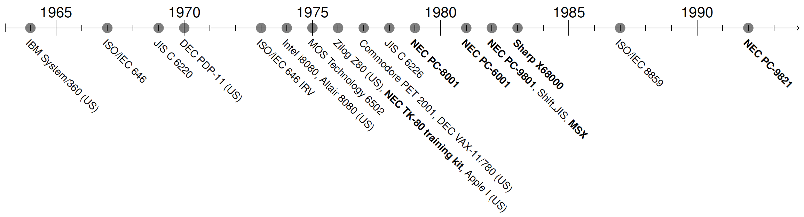
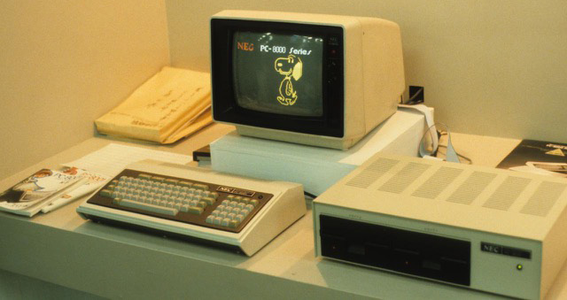
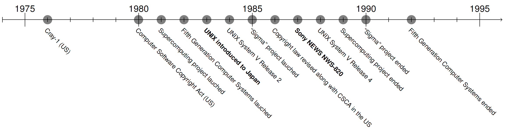
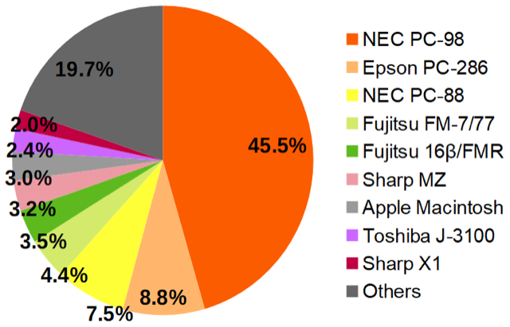
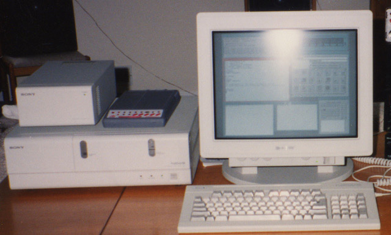
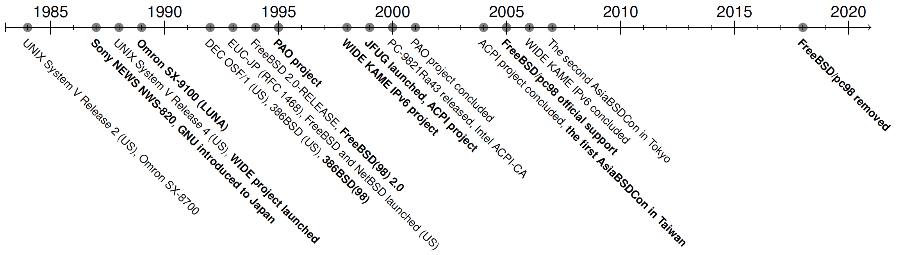

# FreeBSD 在日本：回忆之旅与今日之实

- 原文：<https://freebsdfoundation.org/wp-content/uploads/2023/06/sato_japan.pdf>
- 作者：**佐藤広生**
- 译者：颜曾一

日本是 BSD 及其衍生操作系统流行的地区之一。虽然计算机和软件技术的大部分发展历程发生在北美和欧洲，但日本在上世纪 80 年代的半导体工业取得成功，拥有相当大的国内计算机市场和未来发展的雄心。在同一时期，商业化 Unix 和 BSD 操作系统也得到发展。虽然日本的计算机产业和用户社群发生了很多事情，但这些故事很少被讲述，因为记录仅为日语，其中也有许多失败案例，对日本以外的影响也较小。

尽管这个话题信息密集，但本文将重点关注 BSD 和日本的历史以及当下 FreeBSD 的使用情况。你将了解日本人为什么以及何时开始使用 BSD，以及他们现在的感受。

**1970 年至 1980 年：日本国内计算机**

## 大型机和大型计算机

要了解日本的计算机产业，你必须了解它是如何发展起来的。就商用计算机而言，自 1950 年代开始，大型机在美国最受欢迎。IBM System/360 在 1964 年推出，是最著名的型号之一。日本公司在研究阶段后开始开发计算机，由于所需技术在 1960 年代还不成熟，它们与 RCA、Honeywell 和 General Electric 等公司开展商务合作，开发了兼容型号。日本的参与者有富士通、日立、NEC、东芝、三菱和 OKI，它们得到了日本政府资助的项目的支持，以发展国内产业。它们也被称为 "NTT 家族公司"，长期以来一直在开发通信设备及基础设施。

1970 年，像 DEC PDP-11 和 VAX 这样的小型计算机作为办公室计算机在美国开始流行，日本公司开发了类似的型号。虽然进口的小型计算机在大学、研究机构和一些软件开发公司用作 UNIX 和 BSD 的工程工作站，但由于对办公用户来说过于复杂，并且支持服务相比国内型号较差，因此它们在市场上所占份额较小。

## 个人计算机

个人电脑也在这个时间段出现。日本在 20 世纪 70 年代获得了微处理器技术，然而，除了计算器之外，微处理器业务并不顺利。人们不知道它的好处。1974 年，美国发布了 Altair 8800 微型计算机，被认为是引发了微型计算机革命的火花。尽管它在 1975 年抵达日本，但由于进口费用过高，因此没能产生重大影响。1976 年，NEC 发布了基于 Intel 8080 微处理器的 TK-80 培训套件。确切地说，处理器是 NEC 的 uPD8080A，它是 Intel 8080 的软件兼容克隆版本。它迅速变得非常受欢迎，一年销售了 17,000 台。这激励了 NEC 开发“个人电脑”，日本的计算机行业进入了个人电脑时代。在美国，几家公司，如 Commodore 和苹果，于 1977 年发布了个人电脑，16 位 IBM PC 于 1981 年发布。在日本，NEC 于 1979 年发布了 PC-8001。它是日本首批“国产”个人电脑，配备了 Z80 处理器、16KB 内存和 N-BASIC（Microsoft BASIC 的增强版本）。PC-8001 在四年内销售了 250,000 台，占据了 40% 的市场份额。NEC 在 1979 年发布了 PC-8000 系列，在 1981 年发布了 PC-6000 系列，在 1982 年发布了 PC-9800 系列，并在市场上占据最强地位直到 1997 年。PC-8000 和 PC-6000 都基于 Z80，而 PC-9800 从 8086 到 Pentium II 都是 Intel x86 架构。这三个系列由 NEC 的不同部门独立开发。为了避免竞争，PC-6000 被终止，PC-8000 和 PC-9800 分别专注于业余爱好者和商业用户。

## 技术差异：日语支持

与美国计算机的主要区别是，日本的计算机必须处理日文字符。日语使用三组字符：平假名、片假名和汉字。前两组字符是表音文字系统，大约有 100 个字符，而汉字则是表意文字系统。虽然汉字的数量约为 10 万个，但要阅读报纸，至少需要掌握 2200 个精选字符——日本小学在 6 年内教授 1026 个字符。汉字的字形在显示屏或纸张上至少需要 16x16 个像素。这意味着单个字符需要 16 位编码，显示一个字符需要 16x16 位图数据。

显然，美国市场的计算机需要做相当大的修改才能支持日语。然而，即使对于当时的日本计算机来说，支持所有汉字字符也颇具挑战，因为它需要大量的内存。最初的模型只支持片假名，使用修改后的 ASCII 码作为单字节编码。

PC-8001 的分辨率为 160 x 100，不支持汉字。而专为办公使用而设计的 PC-9801 则具有 640 x 400 的分辨率，并支持汉字。对于严肃的商业机器来说汉字是必需的。为了支持汉字，我们不得不开发一种针对汉字字符的编码。在 1978 年，即 PC-9800 发布前四年，发布了字符集 JIS C 6226 的标准。C 6226 包含 6802 个汉字和非汉字字符，并根据使用频率分为一级和二级。一级包含 3418 个字符，这是支持汉字所需的最低要求。为了给它们编码，我们开发了编码标准；微软、Digital Research、ASCII（日本公司）和三菱共同开发了 1982 年的“Shift JIS”编码。这种编码方案可以容纳的最大字符数为 11,438 个，足以支持 JIS C 6226 字符集中的汉字。

另一个问题是汉字字体字形。如果要支持 C 6226 一级中的所有汉字，需要消耗 14 KB 的内存来存储 16 x 16 位图字体。PC-9800 系列的文本 VRAM 带有汉字字符生成器。VRAM 是用作图形显示帧缓冲区的双端口 DRAM。在 IBM-PC 上，日语的显示依赖于软件。读取字形数据并渲染到帧缓冲区所需时间，比 PC-9800 系列的硬件辅助 VRAM 要长得多。

这些语言特定因素是 PC-9800 系列在 Windows 95 之前市场强势的部分原因。在 1987 年，PC-9800 系列占据了国内 16 位个人计算机市场销售的 90% 以上。它们可以分为 PC-9801 系列和 PC-9821 系列。前者从 1982 年生产到 1995 年，后者从 1992 年生产到 2003 年。所有型号基本上是兼容的。早期阶段，ROM BASIC 或磁盘 BASIC 很受欢迎，然后是 MS-DOS，最后是微软 Windows 的到来。这一系列事件类似于美国的 IBM-PC。简而言之，日本人也享受着英特尔 x86 机器，包括游戏和商业软件，如 Lotus 1-2-3，以及使用电话线的计算机极客文化，如 BBS。

其他公司也推出了一些令人兴奋的计算机。1983 年的 MSX 和 1987 年的夏普 X68000 是其中著名的两款。它们主要面向爱好者市场，但很快就在市场上消失了。在 BSD 会议上，作者经常问：“你的第一台计算机是什么？”是 Amiga 500？还是 Sinclair ZX80？如果你见到我，请分享你的故事。

IBM-PC 和 PC-9800 在 I/O 端口和内存映射方面是不兼容的，但是移植软件是可行且简单的，除了处理日语语言之外。

因此，当 386BSD 发布时，一些人对将其移植到 PC-9800 上感兴趣。

**1980 年至 1990 年：国家级软件项目**

在继续讨论 386BSD 移植的话题之前，先看看当时日本工业的硬件和软件技术。在 1980 年代，大型机或小型机仍然是日本较大规模的计算机中流行的选择。许多应用程序使用 FORTRAN 或 COBOL 编写，并在政府机构、办公室、银行等场所使用。主要的电气公司与美国公司合作学习技术，包括硬件和软件。1975 年之前，外国公司无法进入日本市场。日本政府通过保护政策培育了该行业。即使在此之后，1979 年富士通在国内计算机市场的销售超过了 IBM，这些公司也获得了与美国相当的技术水平。

直到 1980 年，日本所有商用计算机都是美国计算机的克隆或稍作修改的版本。日本设法获得了技术，但需要更多创新和更好的原创性。为了克服这种局面，日本政府开始以与硬件相同的方式启动软件项目，主要电气公司也参与其中。这一动力来自于美国在同一时期出现的软件业务。1980 年，美国总统吉米·卡特签署了《计算机软件版权法案》，IBM 开始解除硬件和软件的捆绑销售，并独立销售软件。在日本经过长时间的讨论后，同样的法律于 1986 年生效。在此之前，IBM 的软件是软件技术的源头，代码处于公有领域。日本公司可以从 MVS for System/360 学到一切，这是 IBM 于 1974 年为 System/360 系列大型机发布的操作系统。如果日本公司继续依赖 IBM 的软件，他们需要支付软件许可费用。

1982 年，启动了名为第五代计算机系统（FGCS）的项目。FGCS 旨在开发人工智能的硬件和软件。这是日本最早的原创硬件和软件开发尝试之一。虽然 LISP 在日本以外的人工智能领域很受欢迎，但日本坚持使用 Prolog。并行计算和并发逻辑编程是该项目的目标技术。该项目于 1992 年结束，提供了专用于逻辑编程的处理器、操作系统和应用软件。随后，在《国际先驱论坛报》上发表了一篇题为《日本放弃新一代计算机——号称对美国新优势的威胁未能实现目标》的文章。FGCS 没有产生实际的商业影响，尽管研究结果对学术界有所贡献。这个持续了十年的项目尚未能够取代美国在超级计算方面的领导地位。

1985 年，启动了 Sigma 计划。日本政府认为日本需要一个标准的开发平台来培养更多的软件开发人员。随着计算机数量和软件业务的迅速增长，程序员的缺乏被认为是 20 世纪 90 年代的一个大问题。Sigma 平台由参与大型机业务的公司设计，将积累的技术转移到国内办公计算机是主要目标。

**图表 2：截至 1989 年家庭个人计算机的使用份额。509 名日本商人参与调查。来源：《日经个人计算杂志》1989 年 4 月 10 日刊（维基百科的公有领域图表）。**

## Sigma 和 UNIX 工作站业务

从终端用户的角度来看，该项目的派生产品是 Sigma 工作站和 Sigma 操作系统。其目标是 32 位 1 MIPS MPU，4 MB RAM，80 MB HDD 和 IEEE802.3（以太网）。操作系统使用了 AT&T 的 UNIX System V 2.0（SVR2）和 4.2BSD 的一些功能。Sigma 工作站是一个 SysV UNIX 工作站，但操作系统应该是经过大幅修改的版本，以适应 Sigma 工具的特定需求，这些工具应是可重用的、有用的软件，通过 Sigma 项目的网络基础设施进行分发。

工作站和操作系统是由不同公司独立开发的，有符合 Sigma 标准的工作站和操作系统。虽然 Sigma 工作站的硬件相对容易实现，但 Sigma 操作系统的开发却是混乱的。与此同时，UNIX 系统在同一时期迅速发展。SVR2 于 1984 年发布，SVR3 于 1986 年发布，SVR4 于 1988 年发布。该项目无法跟上这种发布速度，他们基于 SVR2 的实现已经过时。由于 Sigma 操作系统是独立开发的，兼容性也是一个大问题。

所有大公司已经在产品线中拥有 UNIX 工作站，因此开发 Sigma 操作系统的动力很低。截至 1988 年，计算机市场规模为 130 万台。工作站只占大约 2.5 万台。Sun、Apollo 和 HP 已经出现，很少有大公司认真考虑过 Sigma。

该项目只有两年时间来实现第一个版本。最终有 199 家公司参与其中。1990 年，《日经计算机》（一家报道计算机行业的杂志）总结道：“五年时间和一亿美元没有产生任何结果。”开发非硬件部分过于雄心勃勃。

另一方面，UNIX 在日本被引入，岸田浩一于 1983 年成立了日本 UNIX 协会，比 Sigma 项目提前两年。岸田先生是 SRA（Software Research Associates, Inc.，日本私人软件公司，成立于 1967 年）的创始人，也是 1980 年在商业公司首次使用 UNIX 的人。虽然主机制造商加入了 Sigma 项目，但一些公司决定不加入，其中包括 SRA 和索尼。他们开始开发名为 Sony NEWS 的 UNIX 工作站，与 NeWS（Network extensible Window System）无关。

与此同时，Sun Microsystems 于 1982 年成立，当 Sigma 项目开始时，他们正在销售基于 68k 的 BSD 工作站 Sun-3。索尼希望开发自己的工作站，并认为将其作为 Sigma 的一部分是好主意。岸田先生在早期阶段对 Sigma 计划感到失望，他和索尼同意各自走自己的路。目标是开发比 Sun 更好的产品。Sony NEWS 的出现对 Sigma 项目产生了重大影响，因为与当时可用的 Sigma 工作站相比，NEWS 价格实惠且性能良好。据报道，日本政府要求推迟产品发布。日本的 UNIX 用户喜爱 Sony NEWS。

**Sony NEWS**

在 Sigma 项目结束时，只有 NEC、日立、富士通和欧姆龙四家公司销售 Sigma 工作站，这些只是其 UNIX 工作站的修改版本。如果运行 Sigma 操作系统，它们可以作为 Sigma 工作站运行，也支持 SysV、BSD 或它们为商业目的而拥有的传统操作系统。据信没有取得创新的结果，然而，日本的软件工程师通过 Sigma 学习了 UNIX。

从历史角度看，索尼 NEWS 和欧姆龙 LUNA 是认真考虑移植 BSD 并在 1993 年发布的 4.4BSD 中正式支持的 "日本制造" 的机器。除此之外，HP-9000 300 系列、DECstation 3100/5000 和 SPARCstation 1/2 也得到了支持。UC 伯克利的 CSRG 当时使用 HP-9000 300 系列作为参考机器。

索尼 NEWS 系列的第一款型号于 1987 年发布。虽然 Sigma 项目坚持使用 System V，因为 AT&T 在推动它，但索尼的开发人员和岸田先生认为 BSD 更好。直到 1990 年，它都基于 68k，后来的型号采用了 MIPS R3000、R4000 和 R10000。NEWS-OS 1.0 是 4.2BSD 的移植版本，支持 Shift JIS 而不是 EUC-JP。2.0 到 4.0 版本基于 4.3BSD。最终版本是 1996 年的 6.1.2 版，但在 1993 年之后切换到了基于 SVR4 的版本。WIDE 项目成员使用了许多索尼 NEWS 工作站作为研究平台，并与索尼合作移植了 4.3BSD 和 4.4BSD。

著名的 UNIX 战争发生于 1988 年至 1994 年间，在 OSF 和 UI 之间。上述型号在 1993 年左右停产。日本软件工程师参与移植工作，供应商通过这些工作追赶 SysV 和 BSD 演进，但很少有日本特有的创新发展。

总之，日本的软件工程师学习了 UNIX 和 BSD，也有运行它们的工程工作站。接下来呢？

## 商业和工业中的 BSD——Linux 的广泛采用

**1990-2000: BSD 及 FreeBSD 在日本**

那么，2005 年之后的情况如何，今天又是怎样的呢？2000 年左右，FreeBSD 在 PC-UNIX 市场上的用户数量最多，部分原因是只有 FreeBSD 有良好的 PC-9800 系列支持。Linux 和 NetBSD 也在使用，但没有稳定的移植版本。即使在 IBM-PC/AT 流行起来后，FreeBSD 的用户基础仍然很强大。在商业领域，FreeBSD 和 NetBSD 用于互联网服务器，也用于实现嵌入式系统，如路由器和打印机的以太网卡。这是因为许多软件工程师在上世纪 90 年代熟悉 UNIX 和 BSD。业余爱好者和商业用户社区都非常活跃，有很多与 FreeBSD 和 Linux 相关的杂志、书籍和会议。

然而，Linux 最终在日本市场上占据主导地位。2000 年至 2010 年间，日本的 UNIX 市场发生重大变化。正如前面提到的，几家大型计算机制造商开始销售 UNIX 工作站。无论是 SysV 还是基于 BSD，销售量都在下降，因为像 Sun Microsystems 这样的进口机器很强大，他们正在寻找转移开发成本的途径。另一方面，在上世纪 90 年代，雅虎等互联网公司开始使用 PC-UNIX 和通用硬件开展业务。昂贵的 UNIX 工作站的前景变得不明朗，尤其是对那些只是追随美国市场的供应商来说。

2000 年，东芝、日立、富士通和 IBM 日本各自宣布将支持 Linux 作为其业务基础。IBM 日本于 2000 年 5 月的举动产生了重大影响。日立于 2000 年 9 月宣布，东芝在 10 月宣布。到上世纪 90 年代末，这些公司的 UNIX 工作站业务基于商业 UNIX，如 Solaris 和 HP-UX，而不是国内版本的 SVR4 或 BSD。宣布之后，每家公司开始建立适应 PC-UNIX 的业务结构，转向以 Linux 为中心的业务。这些公司成立了 Linux 支持公司，更重要的是，共同建立了 Linux 教育基础设施。

日本有独特的招聘方式，即 "同期入职招聘"。大多数学生在大学毕业前寻找工作，寻求 "正式录用通知"。政府控制这个过程，公司通常在四月开始选拔。在日本，其他时间或晚些时候获得正式员工职位通常很困难。这意味着大多数新员工在入职时没有业务经验，公司负责他们的教育。因此，上述大公司成立了 LPI-Japan（Linux Professional Institute Japan，Linux 国际专业协会日本支部），以非盈利、厂商中立的方式提供教育服务。LPI（Linux Professional Institute, Inc.国际专业协会）是成立于 1999 年的加拿大非盈利组织，致力于 Linux 认证。LPI-Japan 成立为日本分部。

这些大公司向 LPI 投入了大量资金，开发了日文版的教材和考试。结果，大型计算机公司的大多数新员工都以 Linux 作为参考平台学习。每年的数量超过 1000 人。正式采用 Linux 和这种教育体系增加了用户群体，年轻人没有机会学习 UNIX 或 BSD。这是日本 BSD 用户群体失去人气的原因。老一代人仍然喜欢 BSD，但年轻一代没有这样的动力。虽然 1999 年时 FreeBSD 是最受欢迎的 PC-UNIX，但 Linux 在 2005 年左右成为标准选择。所有使用 BSD 的业务部门，如嵌入式系统开发，也转向了 Linux。许多曾在公司从事 BSD 工作的老开发人员也离开了。

可悲的是，FreeBSD 在日本的未来不容乐观。FreeBSD 基金会不断接触日本的企业用户，与 FreeBSD 项目建立联系。尽管全国范围内都在转向 Linux，但仍有一些公司在使用 BSD。IIJ 一直在使用 NetBSD 构建其路由器产品，索尼著名的游戏机 PlayStation 4 和 5 使用 FreeBSD 内核作为核心组件。FreeBSD 的商业用途已经从完整的操作系统变为组件级别的采用。例如，FreeBSD 的网络堆栈经常用于实现各种产品中的 TCP/IP 功能。作者建议 FreeBSD 项目应该认识到这些用例的需求，投资于这些用例将有助于加强其优势，即使在 Linux 成为标准选择之后也是值得的。

## 结论

本文追溯了日本国内工业 50 年来的若干方面。虽然作者尽可能地使用了各种参考资料和自己的经验来保证准确性，但如果你发现任何错误，请告知作者。包括所有的 BSD 衍生操作系统在内，日本的 BSD 社区活跃了很长一段时间。由于英语交流一直困难，这些活动在官方 BSD 项目运行的地方往往看不见。就 FreeBSD 而言，许多来自日本以外的人通过访问日本交流。我要感谢 FreeBSD 项目的创始人之一——Jordan Hubbard（<jkh@FreeBSD.org>），前 FreeBSD 核心团队成员和长期 BSD 贡献者 Warner Losh（<imp@FreeBSD.org>），4.X-RELEASE 的发布工程师 Murray Stokely（<murray@FreeBSD.org>），以及 George Nevile-Neil 对他们的大力支持，当然还有在过去 15 年里 AsiaBSDCon 的与会者。

---

**佐藤広生** 是东京工业大学的助理教授。他的研究课题包括晶体管级集成电路设计、模拟信号处理、嵌入式系统、计算机网络和软件技术等。他曾是 FreeBSD 核心团队的成员（2006 年至 2022 年），自 2008 年起担任 FreeBSD 基金会董事会成员，并自 2007 年起主办 AsiaBSDCon，这是一个关于 BSD 衍生操作系统的国际会议。
