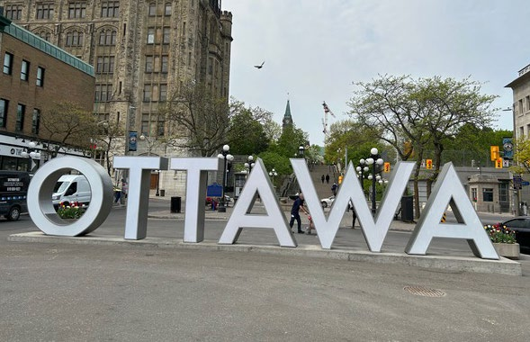
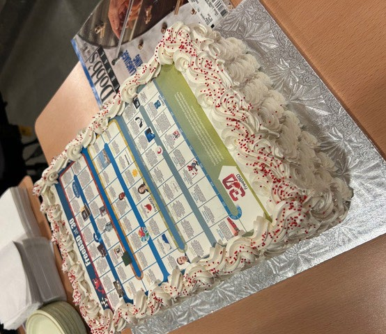
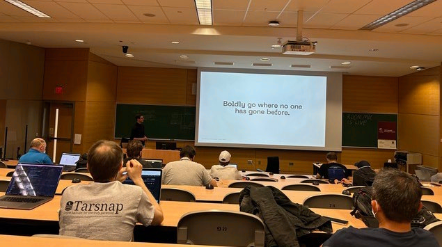
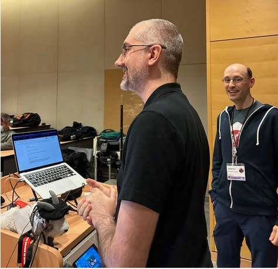
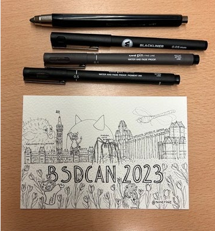

# 会议报告：C 与 BSD 正如拉丁语与我们——一位神学家的旅程

- 原文链接：<https://freebsdfoundation.org/wp-content/uploads/2023/08/stephan_conference_report.pdf>
- 作者：COREY STEPHAN
- 译者：ykla & ChatGPT

坐在我那历经战火的 ThinkPad 前，它正运行着 OpenBSD 7.3-current，我正在加拿大多伦多飞往美国德克萨斯州休斯顿的加拿大航空航班上，回家与妻子、孩子团聚，并恢复我那（不）规律的工作——担任圣托马斯大学的神学助理教授和核心研究员。这是我第一次参加有关计算机科学或信息技术的会议，此刻我感到疲惫但满足。我从会议离开时就穿着那件芥末色的 OpenBSD 7.2 发行 T 恤，上面有着 Dr. Seuss 的主题：“One diff, two OKs, commit, blowfish”（这是对“One fish, two fish, red fish, blue fish”【译者注：类似美国版的《千字文》】的一种模仿）。我意识到我再次置身于现实世界，可惜普通人在笔记本电脑上不（还未？）运行 BSD 操作系统，我不禁轻笑，同时思考着在渥太华国际机场遭遇个人安全检查不只是巧合这一极其遥远的可能性。毕竟，这件 T 恤代表着一个操作系统，其创始人 Theo de Raadt 因美国有关密码学出口的法律而将项目从美国迁至加拿大。

我半开玩笑地想，这也许是有人第一次把我误认为是黑客（恶意的那种）。如果是这样，我刚刚又经历了进入 BSD 群体的入门仪式吗？

作为一个明显的外来者，我在 BSDCan 上向许多与会者介绍自己时，收到了各种各样的问题。奇怪的是，最常见的问题对我来说却是最难回答的：“Corey，你为什么会在这里？”那些常去 BSDCan 的人真的很好奇，一位职业的天主教神学家在一个关于类 Unix 操作系统的会议上会做什么。即使在会议结束之后，我仍然不确定我为什么会前往渥太华参加 BSDCan 2023。最重要的是，我想尝试一些与日常工作完全不同的事物。多年以来，我一直是业余爱好者，通过 Michael W. Lucas 的《Absolute FreeBSD》（第三版）和《Absolute OpenBSD》（第二版），以及来自 BSDCan、EuroBSDCon 和 AsiaBSDCon（以及 YouTube 主播 RoboNuggie）的在线演讲录音来了解 BSD。尽管我偶尔会进行一些简单的家庭实验，但我对 FreeBSD、OpenBSD 和其他 BSD 操作系统的主要兴趣一直是它们作为完全可定制的桌面操作系统的通用实用性。具体来说，我喜欢使用 FreeBSD 和 OpenBSD 帮助我作为基督教神学历史学者开展多元化来源的研究和写作。我在 2021 年 10 月的 FreeBSD Friday 讲座“FreeBSD for the Writing Scholar”（面向写作学者的 FreeBSD）就是关于这个主题的，同样我在 BSDCan 上的演讲也是，题为“BSD for Researching, Writing, and Teaching in the Liberal Arts”（BSD 用于博雅领域的研究、写作和教学）。

在标准的学术会议上，装扮成精致的学者形象是很重要的，特别是在我们这个反智主义、二十一世纪西方社会的背景下，比如一个英语文学的岗位会吸引数百名博士学位持有者、合格（和绝望）的申请人，这已经成为常态。在准备参加 BSDCan 的时候，我几乎本能地拿起了我定制的藏蓝色西装，搭配我最喜欢的金色领结。但出于天意，我还是写了一封简短的电子邮件给 Dan Langille，他是 BSDCan 的创始人之一，负责了二十年的会议协调工作，并在今年的闭幕会议上宣布他当之无愧的退休。我询问他与会者和演讲者通常穿什么。他回复说，他在整个会议期间都会穿着工装短裤和 T 恤，我想起我曾在几个 BSD（Can/Con）的视频中看到的讲演者都是这样穿的（Theo de Raadt 穿着短裤和凉鞋，Michael Lucas 穿着印有可怕卡通图案的 T 恤，等等）。我意识到如果继续坚持我的首次穿着选择，我将显得非常不合时宜，但我又无法割舍不穿正装去进行正式演讲，我妥协地只带了一套我标准的大学（教学和会议）着装（在这种情况下，紫色的裤子、紫色领结和灰色麂皮鞋——没有外套）。哪怕有了这个改变，Michael Lucas 在我演讲后告诉我，我是“我们曾经有过的穿着最讲究……的演讲者”。我还确保随身携带了我所有的 BSD T 恤，以便在会议的其余时间里穿着，即那件 FreeBSD 基金会送的 FreeBSD Polo 衫，我在为 FreeBSD Friday 做演讲时穿的那件，还有我正在撰写这份报告时穿的 Seussical OpenBSD T 恤，以及几件库存旧但全新的、由一位不愿透露姓名的慷慨 Unix 老手送给我的 OpenBSD T 恤。

经过多年参加有关神学和早期到中世纪教会历史的学术会议，我已经习惯了一套关于会议的文化和行为预期，这些预期在 BSDCan 上根本不适用。从相当愚蠢的着装点开始，BSDCan 为我带来了似乎没有尽头的一系列新思考的机会。实际上，如果创造力是在看似不相关的主题交汇处找到的，那么我很高兴地说，在 BSDCan 上，我进行了几次引人入胜的讨论，它们本身就是创造天才的地方。按照时间顺序，以下是三次这样的聊天：技术作家 Michael Lucas 与我讨论了一直以来我心中的一些教育书籍项目的可能性；Tom Jones，我从 BSD.Now 播客中认出了他的声音，我在休斯顿长时间通勤时经常听，他建议我应该为 FreeBSD 期刊写这份报告（他在编辑委员会上任职）；而最初的 BSD Unix 贡献者和（曾祖父级别的）FreeBSD 之父 Marshall Kirk McKusick 博士，仍在提交代码，他解释说著名的 Beastie 角色【即小恶魔】是一个由迪士尼艺术家想象的 Unix 后台守护程序。

对于 McKusick 关于 Beastie，Unix 后台守护程序的故事，我回应说，整个艺术背后的理念是有道理的。我指出，在古希腊语中，δαίμων（daemon）指的是一个在背景中隐形地帮助或干扰人类的流浪灵魂（就像 Unix 后台守护程序一样）。由于守护程序可能是善良的或恶意的，但基督教传统中的恶魔（显然）只是恶意的，所以守护程序并不等同于恶魔。我并不认为 Beastie 的黄草叉和红角（它们不可避免地会冒犯一些人）是必要的，因为古代的小恶魔很少被描绘在艺术作品中——当然更没有被描绘成这样的形象。然而，这个问题似乎最好留待下一次我与一直面带微笑的 McKusick 聊天的时候讨论。此外，我不能责怪一位有才华的迪士尼动画师对希腊-罗马民间传说的陌生，而且我相当喜欢中世纪的那个至今仍然点缀（或诅咒）FreeBSD 通讯区域的角色。

说到 McKusick，我在 BSDCan 的第一个晚上（星期三）偶然走进了 FreeBSD 开发者大会当天结束时的黑客马拉松部分。我观察到 McKusick 与一位年龄至少小他四十岁的人合作编码，这令我印象深刻。让 BSD 操作系统项目保持多代际人参与的精神贯穿于整个 BSDCan。那些最年长、最有成就的参与者，他们可能有合理的理由忽视新手，尤其是外来者（就像我一样），但却把我当做值得讨论的合作伙伴。在那个晚上的会议上，我们中的几个既是丈夫又是父亲，谈论着我们的妻子和孩子，讨论在严肃和有趣之间自然流动，然后回到了 BSD。

我并不羞于承认，我并没有完全理解我参加的讲座中的所有内容。理解一切从来不是我的目标，也不应该是任何人参加任何会议的目标，无论是学术、技术、精神还是其他。我去参加 BSDCan 是为了交换新颖的想法，与我正常圈子之外的人分享我所知道的，并且更重要的是从这些人所知中学习。尽管我经常不得不试图实时推测必要的背景知识，几乎所有我参加的演讲我都很喜欢。我在每个环节都学到了一些东西。太棒了！BSDCan 的组织团队，他们选择了一批出色的演讲者（如果我可以这么写的话，因为我是其中的一个演讲者）。

Tom Jones 的“制作 FreeBSD QUIC”和 Marshall Kirk McKusick 的“**Gunion(8)**：FreeBSD 内核中的新 GEOM 工具”使星期五，即第一天变得愉快，因为 Jones 和 McKusick 都知道如何以似乎具有魔力的魅力来引导观众。（我想知道，McKusick 博士如何使文件系统细节的历史几乎像肯·伯恩斯关于伟大美国战争的纪录片一样引人入胜？）此外，在一个拥挤的礼堂里录制 BSD.Now 的第 512 集（不是第 500 集，而是第 512 集，因为在计算机中 512 是重要的数字）是一个迷人的想法，播客团队应该在将来重复这种想法。令人震惊的是，（同一位）Tom Jones 向整个会议宣布，他最期待我关于 BSD 和博雅的演讲。毫无疑问，他的宣言提高了我演讲的出席率。

在星期六，第二天，Philipp Buehler 的“在 OpenBSD 上使用 Jitsi - Puffy 呈现视频会议”包括对他运行中的 OpenBSD 托管 Jitsi 服务器的大胆现场演示，其中一些观众同时连接。单单因为这一点，即使在他进行了其余卓越的演讲之前，Buehler 也赢得了我的坚定掌声。像埃隆·马斯克和已故的史蒂夫·乔布斯这样知名的领先技术公司 CEO，都曾尝试在大型观众面前进行现场演示，只是他们打算展示的技术在展示中失败，从而使自己尴尬不已。然而，Buehler 并没有让我觉得他是个傻瓜；相反，他对自己的实现有足够的信心，敢于向世界展示。Brooks Davis 的“使用 CheriBSD 创建内存安全工作站”是关于剑桥大学领先技术研究应用的，因此理解它需要我所缺乏的大量背景知识。更糟糕的是，Davis 的演讲直接在我的演讲之前。我观察到 Davis 是一个出色的演讲者，性情开朗，但我必须谦卑地承认，几乎他的所有演讲内容我都一个耳朵进，一个耳朵出。而我则在急切地等待着我演讲的时间。

最后，终于轮到我上台了。Tom Jones 在前一天已经为会议的其他与会者给我做了准备，所以我被分配去演讲的渥太华大学教室相当宽敞，里面熙熙攘攘。整个上午，我观察到了典型的会议第二天所特有的疲惫面孔，这可能在 BSDCan 变得更糟，因为会议组织者鼓励人们去酒吧品尝当地啤酒，然后保持清醒直到（如果不是过了）午夜来合作编程。虽然我既不是酒徒，也不是黑客，但我欣赏在第二天填满会议大厅和房间的那些惺忪的睡眼，这些眼睛在轻松的同伴情谊中度过了一个夜晚，一起为我们所有人建设了更美好的技术未来。然而，也许是因为我站在大学教室的前面，穿着我正常的教学服装，我立即进入了我作为一个异想天开的传统博雅助理教授的工作方式。这个房间缺乏我这个异类成功所需的活力。因此，我号召在房间里的每个人都站起来，问候他或她的邻座，并说：“今天能坐在你旁边真是一种幸福。”

我使用的传统教授的技巧似乎取得了成功。听众对我的演讲的反应从开始到结束都是响亮、充满活力和令人惊叹的。人群在我演讲中最喜欢的时刻之一是当我指着房间后面的摄像机，用这个原创的语句向我的同事们说：“C 对于 BSD 就像拉丁语对于我们一样。”

我的演讲问答环节超时了，McKusick 博士本人提出了几个问题。之后的走廊讨论很引人入胜。总的来说，我的演讲受到热烈欢迎，让我感到欣喜。

在没有明显的结论方式的情况下，我将写两件事。首先，如果你对 BSD 操作系统感兴趣，但对 BSDCan 感到紧张，不必担心。虽然会议的常客构成了一个自我选择的紧密团结的群体，但他们真诚地欢迎新人，新人不需要很长时间就能融入这个群体。此外，BSDCan 不乏娱乐活动（慈善拍卖会非常有趣），并且讲座的安排使得会议的任何一个部分都不会变得痛苦。其次，我希望能够在 BSDCan 2024 再次与我在 BSDCan 2023 认识的每个人互动，并呈现更加大胆的内容。

---

**COREY STEPHAN** 博士是休斯顿圣托马斯大学的神学助理教授和核心研究员。他自豪地专门使用自由和开源软件工具，包括 **\*BSD** 操作系统，来协助他的天主教历史神学研究以及他的传统博雅教学。他的专业网站是 <coreystephan.com>。

照片由 Tom Jones 提供。
