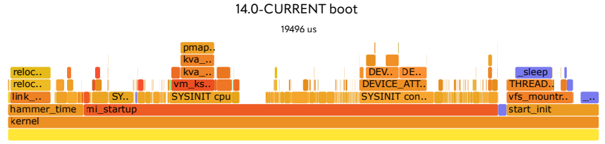

# 在 Firecracker 上的 FreeBSD

- 原文链接：<https://freebsdfoundation.org/wp-content/uploads/2023/08/percival_firecracker.pdf>
- 作者：COLIN PERCIVAL
- 译者：ykla & ChatGPT

许多出色的开源软件源于“解决问题”的动机。Firecracker 也是如此：在 2014 年，亚马逊推出了 AWS Lambda 作为“无服务器”计算平台：用户只需提供一个函数，比如十行 Python 代码，Lambda 就会提供在 HTTP 请求到达与函数被调用以处理请求并生成响应之间所需的全部基础架构。

为了高效且安全地提供此服务，亚马逊需要能够以最小开销来启动虚拟机。因此，Firecracker 诞生了：这是一个与 Linux KVM 配合工作的虚拟机监视器，用于创建和管理具有最小开销的“microVMs”（微型虚拟机）。

## 为什么在 Firecracker 上使用 FreeBSD？

2022 年 6 月，我开始将 FreeBSD 移植到 Firecracker 上运行。我的兴趣源于几个因素。首先，我为加速 FreeBSD 启动过程做了大量工作，想知道在最精简的虚拟机监视器下能达到何种极限。其次，将 FreeBSD 移植到新平台总是有助于发现 FreeBSD 本身、这些平台上的 bug。第三，目前 AWS Lambda 仅支持 Linux；我一直渴望让 FreeBSD 在 AWS 中更易使用（尽管能否在 Lambda 中采用不在我控制之内，但支持 Firecracker 将是必要前提）。然而，最大的原因仅仅是它就在那里。Firecracker 是一个有趣的平台，我想看看自己能否让它运行起来。

## 启动 FreeBSD 内核

虽然 Firecracker 是针对 Lambda 的需求——启动 Linux 内核——而设计的，但自 2020 年起已有补丁在“linuxboot”之外添加了对 PVH 引导模式的支持。FreeBSD 在 Xen 下支持 PVH 引导，因此我决定看看是否可行。

在这里，我遇到了第一个问题：Firecracker 可以将 FreeBSD 内核加载到内存中，但找不到开始运行内核的地址（“内核入口点”）。根据 PVH 引导协议，此值在 ELF Note（存储于 ELF（可执行和链接格式）文件中的一段特殊元数据）中指定。事实证明，有两种类型的 ELF Note：PT_NOTEs 和 SHT_NOTEs，而 FreeBSD 没有提供 Firecracker 正在寻找的那种。对 FreeBSD 内核链接器脚本的一处小改动修复了这个问题，现在 Firecracker 能够开始执行 FreeBSD 内核了。

这个过程持续了大约 1 微秒。

## 早期调试

FreeBSD 具有出色的调试功能，但如果内核在调试器初始化或串行控制台设置之前崩溃，你无法获得太多帮助。在这种情况下，Firecracker 进程退出，告诉我 FreeBSD 客户机发生了三重故障（triple-fault）——但这就是我知道的全部。

然而，事实证明，稍动点脑筋，这点信息就足够让我开始了。如果 FreeBSD 内核执行到 `hlt` 指令，Firecracker 进程会继续运行，但占用主机 CPU 时间的 0%（因为它虚拟化的是已停机的 CPU）。因此，我可以通过插入 `hlt` 指令来区分“FreeBSD 在此点之前崩溃”和“FreeBSD 在此点之后崩溃”——如果 Firecracker 退出，我就知道它在执行到该指令之前崩溃了。我由此开始了一个我称之为“内核二分法”的过程——不是对提交列表二分查找以找到引入 bug 的提交（如 `git bisect` 那样），而是通过内核启动代码进行二分搜索，以找到导致 FreeBSD 崩溃的代码行。

## Xen 超级调用

在这个过程中我发现的第一件事是 Xen 超级调用。PVH 引导模式起源于 Xen/PVH 引导模式，而 FreeBSD 的 PVH 入口点实际上是专门用于在 Xen 下引导的入口点——代码对此的假设相当合理，即它确实在 Xen 内部运行，因此可以发起 Xen 超级调用。当然，提供 Firecracker 所使用的内核功能的 KVM 并不是 Xen，因此不提供这些超级调用；尝试使用其中任何一个都会使虚拟机崩溃。作为最初的解决方法，我仅注释掉了所有 Xen 超级调用；稍后，我添加了代码，在调用（例如向 Xen 调试控制台写入调试输出）之前，先检查 CPUID 中是否存在 Xen 签名。

然而，有一个 Xen 超级调用提供了必要的功能：检索物理内存映射。（当然，在虚拟机监视器内部，“物理”内存实际上只是虚拟物理内存。层层如此，无穷无尽。）在这里，我们得益于以下事实：Xen/PVH 事后被宣布为 PVH 引导模式的版本 0——从版本 1 开始，指向内存映射的指针通过 PVH start_info 页传递（当虚拟 CPU 开始执行时，该指针在寄存器中提供）。我必须编写代码，以利用 PVH 版本 1 的内存映射，而不是依赖 Xen 超级调用来获取相同的信息，但这并不难。

另一个相关问题源于 Xen 和 Firecracker 在内存中排列结构的方式：Xen 首先加载内核，然后将 start_info 页放在末尾，而 Firecracker 则将 start_info 页放在固定的低地址，然后再加载内核。这本来没问题，但 FreeBSD 的 PVH 代码——是为 Xen 而编写的——假定 start_info 页之后的内存可用作临时空间。在 Firecracker 下，这很快就意味着覆盖了初始内核堆栈——结果并不理想！修改 FreeBSD 的 PVH 代码，将临时空间分配在虚拟机监视器初始化的所有内存区域之后，解决了这个问题。

## ACPI——或者没有

在 x86 平台上，FreeBSD 通常使用 ACPI 来了解（并在某些情况下控制）其运行的硬件。除了通过 ACPI 发现我们通常视为“设备”的组件——如磁盘、网络适配器等——FreeBSD 还通过 ACPI 了解 CPU 和中断控制器等基本组件。

Firecracker 有意保持极简，不去实现 ACPI，当 FreeBSD 无法确定有多少个 CPU 或者如何找到它们的中断控制器时，会感到不安。幸运的是，FreeBSD 支持历史悠久的 Intel 多处理器规范，通过“MPTable”结构提供了这些关键信息；尽管它不是 GENERIC 内核配置的一部分，但在 Firecracker 中运行时，我们会使用经过精简的内核配置，因此很容易添加 `device mptable` 以利用 Firecracker 提供的信息。

然而……这并没有奏效。FreeBSD 仍然无法找到所需的信息！事实证明，Linux 在查找和解析 MPTable 结构时存在 bug——而 Firecracker 设计用于引导 Linux，以 Linux 支持的方式提供 MPTable，但实际上并不符合标准。FreeBSD 的实现独立编写以遵循标准，既未能找到（位置不正确的）MPTable，也未能解析（无效的）MPTable。

因此，FreeBSD 现在有了新的内核选项：如果你需要与 Linux 的 MPTable 处理保持逐 bug 兼容，可以在内核配置中添加 `options MPTABLE_LINUX_BUG_COMPAT`。有了这个选项，FreeBSD 能在 Firecracker 中进一步引导。

## 串行控制台

Firecracker 提供的少数模拟设备之一（与 Virtio 块和网络设备等虚拟化设备相对）是串口。实际上，在常见的配置中，当你启动 Firecracker 时，Firecracker 进程的标准输入和输出会成为虚拟机的串口输入和输出，使其看起来像是客户机操作系统只是在你的 shell 内部运行的另一个进程（从某种意义上讲，确实如此）。至少，这是它应该工作的方式。

在让 FreeBSD 在 Firecracker 中运行起来的过程中，我能够启动已将根磁盘编译到内核映像中的 FreeBSD 内核——虚拟磁盘驱动程序尚未工作——并读取了内核的所有控制台输出。然而，在所有内核控制台输出之后，FreeBSD 进入了引导过程的用户空间部分，我看到 16 个字符的控制台输出，然后就停止了。

有趣的是，我在十多年前就见过完全相同的症状，当时我首次在 EC2 实例上运行 FreeBSD。QEMU 中的一个错误导致 UART 在传输 FIFO 清空时不发送中断；FreeBSD 向 UART 写入 16 字节，然后不再写入，因为它在等待永远不会到达的中断。现代的 EC2 实例运行在亚马逊的“Nitro”平台上，但在早期，它们使用 Xen，设备用 QEMU 的代码模拟。不知何故，在 QEMU 中修复了这个错误十年后，完全相同的错误又出现在 Firecracker 中；但幸运的是，我当初加入 FreeBSD 内核的解决方法——`hw.broken_txfifo="1"`——仍然可用，添加这个加载器可调参数后（由于 Firecracker 直接加载内核，不经过引导加载器，这意味着将该值编译为内核的环境变量）修复了控制台输出。

然后我发现控制台输入也坏了：FreeBSD 对我在控制台中键入的任何内容都没有响应。事实上，在我跟踪 Firecracker 进程时，我发现 Firecracker 甚至没有从控制台读取——因为 Firecracker 认为模拟串口上的接收 FIFO 已满。结果证明这是 Firecracker 的另一个错误：在初始化串口时，FreeBSD 用垃圾填充接收 FIFO 以测量其大小，然后通过写入 FIFO 控制寄存器来刷新 FIFO。Firecracker 没有实现 FIFO 控制寄存器，因此 FIFO 保持满状态，也就合理地不再读取更多字符放入其中。在这里，我向 FreeBSD 添加了另一个解决方法：如果在我们尝试通过 FIFO 控制寄存器刷新 FIFO 后，`LSR_RXRDY` 仍然被断言（也就是说，如果 FIFO 没有按要求清空），那么我们现在会继续逐个读取和丢弃字符，直到 FIFO 清空。有了这个解决方法，Firecracker 现在可以认识到 FreeBSD 已准备好从串口读取更多输入，我有了可工作的双向串行控制台。

## Virtio 设备

虽然没有磁盘或网络的系统对某些用途可能有用，但在我们能够在 FreeBSD 中做很多事情之前，我们需要这些设备。Firecracker 支持 Virtio 块和网络设备，并将它们以 mmio（内存映射 I/O）设备的形式暴露给虚拟机。让这些在 FreeBSD 中工作的第一步：在 Firecracker 内核配置中添加 `device virtio_mmio`。

接下来，我们需要告诉 FreeBSD 如何找到虚拟化的设备。FreeBSD 期望通过 FDT（扁平化设备树）发现 mmio 设备，这在嵌入式系统上是常用机制；但是，Firecracker 通过内核命令行传递设备参数，比如 `virtio_mmio.device=4K@0x1001e000:5`。让这些设备在 FreeBSD 中工作的第二步：编写解析此类指令并创建 virtio_mmio 设备节点的代码。（创建设备节点后，FreeBSD 的常规设备探测过程就会启动，内核将自动确定 Virtio 设备的类型并连接适当的驱动程序。）

然而，如果我们有多个设备，例如磁盘设备和网络设备——则会出现另一个问题：Firecracker 以 Linux 所期望的方式传递指令，即作为内核命令行上的键值对序列，而 FreeBSD 将内核命令行解析为环境变量……这意味着如果在命令行上传递了两个 `virtio_mmio.device=` 指令，只会保留一个。为了解决这个问题，我重新编写了早期的内核环境解析代码，通过附加带编号的后缀来处理重复变量：我们会得到一个设备的 `virtio_mmio.device=`，而第二个设备则为 `virtio_mmio.device_1=`。

有了这个，我终于让 FreeBSD 能够引导并发现所有设备了，但磁盘设备还出现了另一个问题：如果我未正常关闭虚拟机，在下一次引导时，系统会在文件系统上运行 fsck，并且内核会 panic。事实证明，fsck 是 FreeBSD 中极少数会导致非页面对齐磁盘 I/O 的操作，而 FreeBSD 的 Virtio 块驱动在尝试将非对齐的 I/O 传递给 Firecracker 时会导致内核 panic。

当 I/O 跨越页面边界时——未对齐到页面边界的页面大小 I/O 就会发生这种情况——物理 I/O 段通常不连续；大多数设备可以处理指定一系列待访问内存段的 I/O 请求。然而，极简的 Firecracker 不这样做：它只接受单个数据缓冲区——这意味着跨越页面边界的缓冲区无法像其他 Virtio 实现那样简单地拆分成多段。幸运的是，FreeBSD 有专门处理此类设备问题的系统：busdma。

这可能是让 FreeBSD 在 Firecracker 中运行最困难的部分，但经过多次尝试，我认为我终于做对了：我修改了 FreeBSD 的 Virtio 块驱动以使用 busdma，现在非对齐的请求会“弹回”（即通过临时缓冲区复制），以符合 Firecracker Virtio 实现的限制。

## 显露出的可优化项目

让 FreeBSD 在 Firecracker 中运行起来后，我很快发现还有一些可改进之处。我首先注意到，尽管我正在测试的虚拟机有 128 MB 内存，但系统几乎无法使用，进程经常因内存耗尽而被杀掉。**top(1)** 工具显示，几乎一半的系统内存处于“已绑定”状态，这对我来说似乎很奇怪；因此我进一步调查，发现 busdma 为 bounce 页面保留了 32 MB 内存。这显然远远超过所需——考虑到 Firecracker 的限制以及 bounce 页面通常不需要连续分配，每个磁盘 I/O 最多应使用单个 4 kB 的 bounce 页面——通过针对 busdma 的补丁，我将这部分内存消耗减少到 512 kB，限制它只为支持少量 I/O 段的设备保留 bounce 页面。

系统更加稳定之后，我开始关注引导过程。如果你在观看系统启动时，滚动的消息突然停顿，那么很可能在那一刻有什么操作拖慢了启动过程。简单观察引导过程——以及关机过程——发现了几个可改进之处：

- FreeBSD 的内核随机数生成器通常从硬件设备获取熵，但在虚拟机中这可能不是有效的来源。作为熵的备用来源，在 x86 系统上，我们用 `RDRAND` 指令从 CPU 获取随机值；但我们每次请求仅获取很少的熵，每 100 毫秒只请求一次。将熵收集系统改为请求足够的熵以完全播种 Fortuna 随机数生成器，将引导时间缩短了 2.3 秒。
- 当 FreeBSD 首次引导时，会记录系统的主机 ID。这通常是通过环境变量 `smbios.system.uuid` 从硬件获取的，引导加载程序根据来自 BIOS 或 UEFI 的信息设置它。然而，在 Firecracker 下，没有引导加载程序——因此也没有提供 ID。我们有备用系统，可以在没有有效硬件 ID 的系统上在软件中生成随机 ID；但我们也打印了警告，并等待 2 秒钟以便用户读取。我将此代码更改为在硬件提供无效 ID 时打印警告并等待 2 秒，但如果硬件压根不提供 ID，则静默且快速进行。
- IPv6 要求系统在使用 IPv6 地址之前等待“重复地址检测”。在 **rc.d/netif** 中，在启动接口后，如果我们的任何网络接口启用了 IPv6，我们都会等待 IPv6 DAD。但有一个问题：我们总是在回环接口上启用 IPv6！我将逻辑更改为仅在除回环接口之外的接口上启用了 IPv6 时才等待 DAD，从而加速引导过程 2 秒钟——如果其他系统尝试在我们的 `lo0` 上使用与我们相同的 IPv6 地址，那么我们面临的问题比地址冲突要大得多！
- 在重新启动时，FreeBSD 会打印一条消息（“Rebooting...”），然后等待 1 秒钟“等待 printf 输出完成并被读取”。由于人们通常可以看出系统正在重新启动，所以这没什么用——现在有 `kern.reboot_wait_time` sysctl，默认为 0。
- 在关闭或重新启动时，FreeBSD 的 BSP（CPU #0）会等待其他 CPU 发出停止信号……然后再等待额外的 1 秒钟，以确保它们有机会停止。我删除了额外的 1 秒等待时间。

容易解决的问题处理完之后，我拿出 [TSLOG](https://www.daemonology.net/papers/bootprofiling.pdf) 并开始查看引导过程的火焰图。出于两个原因，Firecracker 是进行此项工作的绝佳环境：首先，极简的环境消除了很多噪音，更容易看清剩下的内容；其次，Firecracker 能极快地启动虚拟机，让我能快速测试对 FreeBSD 内核的更改——通常不到 30 秒就能构建新内核、启动它并生成新的火焰图。

用 TSLOG 调查揭示了许多可用的优化：

- `lapic_init` 中有迭代 100000 次的循环，用来校准 `lapic_read_icr_lo` 的执行时间；将其缩减到迭代 1000 次可减少 10 毫秒。
- `ns8250_drain` 在每次读取字符后调用 `DELAY`；改为检查 `LSR_RXRDY`，仅在无可读字符时才调用 `DELAY`，减少了 27 毫秒。
- FreeBSD 使用 CPUID 叶，大多数虚拟化程序用它广播 TSC 和本地 APIC 时钟频率；而与 VMWare、QEMU 和 EC2 不同，Firecracker 没有实现这个。为 Firecracker 添加对此 CPUID 叶的支持可将 FreeBSD 引导时间减少 20 毫秒。
- FreeBSD 将 `kern.nswbuf`（控制为各种临时目的分配的缓冲区数量）设为 256，不论系统大小；将其改为 `32 * mp_ncpus` 可将小型（1 CPU）虚拟机的引导时间减少 5 毫秒。
- FreeBSD 的 `mi_startup` 函数，用于启动机器无关的系统初始化例程，使用冒泡排序对其调用的函数排序；虽然考虑到当时需要排序的例程数量很少，在 90 年代这么做是合理的，但现在有 1000 多个这样的例程，冒泡排序变得很慢。将其替换为快速排序可节省 2 毫秒。（在出版时尚未提交。）
- FreeBSD 的 `vm_mem` 初始化例程为所有可用物理内存初始化 `vm_page` 结构。即使在 128 MB RAM 的相对较小的 VM 上，这也意味着要初始化 32768 个这样的结构，需要几毫秒。将此代码改为在内存分配使用时“惰性”初始化 `vm_page` 结构可节省 2 毫秒。（在出版时尚未提交。）
- Firecracker 通过匿名 `mmap` 分配 VM 客户机内存，但 Linux 未设置整个 VM 客户机地址空间的分页结构。结果是，第一次读取任何页面时都会发生页错误，花费大约 20,000 个 CPU 周期来处理，同时 Linux 映射一页内存。在 Firecracker 的 `mmap` 调用中添加 `MAP_POPULATE` 标志可节省 2 毫秒。（在出版时尚未提交。）

## 当前状态

FreeBSD 在 Firecracker 下引导——并且非常迅速。包括未提交的补丁（对 FreeBSD 和 Firecracker 都是如此），在具有 1 CPU 和 128 MB RAM 的虚拟机上，FreeBSD 内核可以在不到 20 毫秒的时间内引导；下面是引导过程的火焰图。

仍然有工作要做：除了提交上述补丁，并将 PVH 引导模式支持合并到 Firecracker 主线中，还有大量的“清理”工作要做。由于 PVH 引导模式起源于 Xen，用于 PVH 引导的代码仍与 Xen 支持混合在一起；将它们分开会大大简化工作。同样，目前无法在没有 PCI 或 ACPI 支持的情况下构建 FreeBSD arm64 内核；找出虚假的依赖项并删除它们，就能使用更小的 FreeBSD/Firecracker 内核（并将启动时间再减少几微秒——我们花 25 微秒检查是否需要为 Intel GPU 保留内存）。

更具雄心的是，如果能把 Firecracker 移植到 FreeBSD 上运行，那将是一件很棒的事——在某种程度上，虚拟机就是虚拟机，虽然 Firecracker 是为使用 Linux KVM 而编写的，但没有根本性的理由阻止它改用 FreeBSD 的 bhyve 虚拟机监视器的内核部分。

任何想要在 Firecracker 中尝试 FreeBSD 的人都可以使用 `amd64 FIRECRACKER` 内核配置构建 FreeBSD 14.0 内核，并从 Firecracker 项目中 checkout [feature/pvh](https://github.com/firecracker-microvm/firecracker/tree/feature/pvh) 分支；或者如果该分支不存在，则意味着代码已合并到 [Firecracker 主线](https://github.com/firecracker-microvm/firecracker) 中。

如果你在 Firecracker 上尝试 FreeBSD——尤其是最终在生产环境中使用它——请告诉我！我开始这个项目主要是出于兴趣，但如果它最终派上用场，我很乐意听到。

---

**COLIN PERCIVAL** 自 2004 年以来一直是 FreeBSD 开发者，并在 2005 年至 2012 年间担任该项目的安全官。2006 年，他创立了 Tarsnap 在线备份服务，并持续运营。2019 年，为表彰他将 FreeBSD 引入 EC2 的工作，他被评为 Amazon Web Services Hero。
