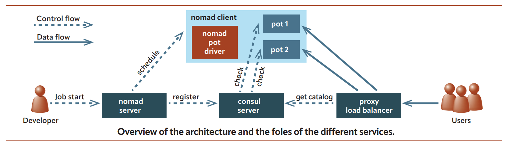

# 使用 pot 和 nomad 管理 Jail

- 原链接：<https://freebsdfoundation.org/wp-content/uploads/2023/08/Pizzamiglio.pdf>
- 作者：LUCA PIZZAMIGLIO
- 译者：段龙甫
  
容器是很好的工具，可在多台服务器上分发水平可扩展的应用。当应用数量和其实例数增长时，容器数量很容易变得难以手工管理。

容器编排器是一类应用，旨在简化大量容器的管理，隐藏复杂性并提高可靠性，尤其是在自动伸缩和持续部署带来的动态环境中。在本文中，我们将讨论基于 FreeBSD 的配置，使用 pot（支持 Jail 镜像的 Jail 框架）和 nomad（由 HashiCorp 开发的与容器无关的编排器）。

## 系统架构

为了解释编排器如何工作，我们需要介绍一些服务并说明它们的作用。

### nomad 客户端

nomad 客户端是一台服务器，接收编排器的命令以执行容器。Nomad 客户端也称为节点，如同 kubernetes 中那样。

在大型部署中，大多数服务器是 nomad 客户端，因为它们负责执行用户的应用程序。在云原生术语中，nomad 客户端构成集群的数据平面。

Nomad 客户端能支持多种容器驱动：一些驱动与操作系统无关，而其他驱动如 docker 或 pot，仅在特定操作系统上可用。

要使用 pot 编排 FreeBSD 的 Jail，我们需要基于 FreeBSD 的 nomad 客户端。

### nomad 服务器

nomad 服务器是实现编排器的机器。nomad 服务器负责维护集群状态，并将容器调度到 nomad 客户端。需要多个实例（3 到 5 个）来提供冗余并共享负载。在云原生术语中，nomad 服务器构成集群的控制平面。

用户与 nomad 服务器交互，将应用部署到集群。nomad 服务器负责维护集群的健康状态，并在客户端发生故障时重新调度容器。

Nomad 服务器能运行在任何受支持的操作系统上。要编排 Jail，至少要有一个 nomad 客户端基于 FreeBSD。

### 容器注册表

编排器（nomad 服务器）是集群的大脑，它将容器分配给支持该容器类型的客户端。这意味着：

- 任何 nomad 客户端都可能被选中来运行所支持的容器，

- 客户端事先不知道将要托管哪些容器，

- 客户端可以执行同一容器的多个实例。

每个客户端都需要服务来下载被指派执行的容器镜像。容器注册表满足这一需求，提供容器镜像服务。

当编排器选择客户端来执行容器时，该客户端将从注册表下载容器镜像，然后启动容器。

在我们的例子中，我们将使用 potluck，由 pot 社区维护的公共容器注册表，从开源的镜像配方目录构建镜像。但是，由于容器镜像包含二进制文件，出于安全考虑，我们强烈建议所有人都拥有自己的本地注册表。

在 pot 中，镜像是文件，通过 fetch(1) 下载，因此注册表可以只是简单的 web 服务器。

### 服务目录

服务目录是服务列表，附加了额外信息，例如实现这些服务的所有容器地址。

当编排器调度实现服务的容器时，它也会将容器地址注册到实现该服务的容器列表中。

服务目录也可以配置为定期检查所有容器的服务健康状态，因此容器地址列表只包含健康的地址。

我们要使用的服务目录基于 consul，服务网格应用，同样由 HashiCorp 开发。

### 入口（可选）

因为编排器的动态性，很难知道服务在哪里运行。每次发生新的部署时，容器都可能被调度到不同的节点和不同的端口。通过入口，我们定义代理/负载均衡器，配置为给服务提供固定的入口点。

例如，我们可以这样配置代理，让 URL 路径（例如，<https://example.com/foo>）提供关于目标服务的信息（即重定向到实现服务 foo 的容器）。另一种常见方法是使用 host header。

入口代理通过持续与服务目录交互，动态维护有效容器地址列表。

在我们的例子中，我们使用 traefik，由 Traefik Labs 开发的入口代理。

### Nomad-pot-driver

Nomad 的构建旨在支持多种容器技术和不同的操作系统。事实上，nomad 软件包是可用的，HashiCorp 公司也为 FreeBSD 提供二进制包。

Nomad 有插件架构，允许扩展以支持新的容器技术。Esteban Barrios 编写并开源了 [nomad-pot-driver 插件](https://github.com/bsdpot/nomad-pot-driver/)。该插件作为 nomad 客户端和 pot 之间的接口，提供编排 Jail 所需的特性。

编排器将工作负载调度到使用插件与 pot 交互的客户端。

图片：**架构概述和不同服务的角色。**



### Minipot

Minipot 是软件包，在一台 FreeBSD 机器上安装并配置上述所有服务，也是展示示例所用的参考安装。

Minipot 是适用于测试的配置，但不适用于生产环境安装，因为所有服务会集中在一台机器上，将集群缩减为单节点来完成所有工作。

具体来说，它将安装并配置 consul、traefik 和 nomad。Nomad 将作为客户端和服务器运行，扮演编排器和执行者的双重角色。

在 [Klara 网站](https://klarasystems.com/articles/cluster-provisioning-with-nomad-and-pot-on-freebsd/)上有一篇关于如何安装 minipot 的详细指南。

## 调度任务

minipot 初始化完成且所有服务运行后，我们可以使用以下任务描述文件在 nomad 中启动一个任务。

```sh
 job "nginx-minipot" {
   datacenters = ["minipot"]
   type = "service"
   group "group1" {
     count = 1
     network {
       port "http" {}
     }

     task "www1" {
      driver = "pot"

      service {
        tags = ["nginx", "www"]
        name = "hello-web"
        port = "http"

        check {
          type     = "tcp"
          name     = "tcp"
          interval = "5s"
          timeout  = "2s"
        }
     }

     config {
       image = "https://potluck.honeyguide.net/nginx-nomad"
       pot = "nginx-nomad-amd64-13_1"
       tag = "1.1.13"
       command = "nginx"
       args = ["-g","'daemon off;'"]

       port_map = {
         http = "80"
       }
     }

       resources {
         cpu = 200
         memory = 64
       }
     }
   }
 }
```

上述 job 节描述了 nomad 调度任务所需的所有细节。任务“nginx-minipot”（1）包含名为“group1”的组（4），组里包含名为“www1”的任务（9）。

任务“www1”是 pot 容器（10），镜像注册表是 potluck（23），pot 镜像是 nginx（24），版本是 1.1.13（25）。指定任务基于 pot 驱动后，编排器会将该任务调度到支持 pot 的客户端。在我们的例子中，服务器和客户端是同一台机器。

与通常使用 rc 脚本引导的 Jail 相比，我们将直接执行 nginx（26），不需要任何额外的服务。args 参数（27）很重要，让 nomad 能正确跟随容器生命周期并捕获其日志。Pot 将负责初始化网络和所需的一切。

port_map 节（28）和网络节（6）表示 nginx 将在 Jail 中监听 80 端口，但 nomad 客户端将使用不同的端口（“http”），由 nomad 服务器动态分配。

服务节（11）提供了 nomad 用于将服务注册到 consul 的信息。在我们的例子中，任务“www1”实现了服务“hello-web”（11），将使用 nomad 服务器分配的端口“http”（14）注册到 consul。对于 IP 地址，nomad 服务器将使用 nomad 客户端的 IP 地址，该地址在调度期间确定。

在我们的例子中，任务还配置了 tcp 健康检查，consul 将每 5 秒运行一次，以确定实例的健康状态。

这个任务描述需要保存为文件（即 nginx.job），任何用户都可以通过命令启动服务。

```sh
$ nomad job nginx.job
```

> **注意**：第一次部署需要一些时间，因为客户端需要下载镜像。在连接缓慢的情况下，第一次部署甚至可能因为部署超时而失败。下载完成后，可以安全地重新运行部署，它将在几秒钟内执行完成。

### 检查 nomad

任务被调度后，可以通过命令行检查部署状态：

```sh
$ nomad jobs allocs nginx-minipot
ID       Node ID  Task Group Version Desired Status  Created    Modified
636d3241 c375b833 group1     3       run     running 28m43s ago 28m27s ago
$ nomad alloc status 636d3241
[...]
Allocation Addresses:
Label Dynamic Address
*http yes     2003:f1:c709:de00:faac:65ff:fe86:9458:22854
[...]
$ curl "[2003:f1:c709:de00:faac:65ff:fe86:9458]:22854"
```

“Allocation”是 nomad 用来标识容器（任务实例）的名称。

IPv6 地址是 nomad 客户端的地址。

22854 端口是 nomad 选择的端口，用于将 nomad 客户端导向容器的 80 端口。

要查看端口重定向设置，我们可以使用以下命令：

```sh
$ sudo pot show
```

作为命令行的替代方案，nomad 服务器也配置为提供功能强大的 web UI，可以通过 **localhost:4646** 访问。在 UI 中可以看到“nginx-minipot”任务，并导航查看集群、分配、客户端等所有信息。

通过 nomad，我们可以直接看到所有容器的状态。进入分配页面后，点击"exec"按钮即可在运行中的容器里启动 **/bin/sh** shell。

### 检查 consul

通过命令行，我们可以看到 consul 目录中的服务列表（命令 `consul catalog services`），但看不到详细信息。不过，我们可以通过访问 web UI 来检查“hello-web”服务的状态，地址为 **localhost:8500**。

从这里，可以导航查看“hello-web”服务及其“tcp”检查的状态。

### 检查 traefik

代理 traefik 配置为在 8080 端口路由流量，同时在 9200 端口（**localhost:9200**）提供 web UI 来监控状态。Traefik 也配置为从 consul 同步服务目录。

选择 http 服务后，我们可以看到“hello-web”服务（标记为 **hello-web@consulcatalog**）。

点击该服务，可以看到服务详情和路由选项。配置基于主机头，在我们的例子中是“hello-web.minipot”。

现在可以通过入口访问服务 hello-web：

```sh
$ curl -H Host:hello-web.minipot http://127.0.0.1:8080
```

或者，我们可以添加条目

```sh
127.0.0.1 hello-web.minipot
```

到 **/etc/hosts** 文件中，然后直接使用主机名：

```sh
$ curl http://hello-web.minipot:8080
```

我们将得到与直接对 Jail 执行 curl 时相同的输出。

### 水平扩展

要查看编排器的实际运作，我们现在只需将任务文件（第 5 行）中的 count 从 1 改为 2，并重新提交任务。

```sh
$ nomad run nginx.job
```

调度完成后，运行中的 nomad 分配数量为 2，consul 中的服务“hello-web”有两个实例，traefik 中的服务器同样如此。

- 为了验证入口的轮询分发，我们可以：

- 跟踪一个容器的日志（`$ nomad alloc logs -f allocation1`）

- 跟踪另一个容器的日志（`$ nomad alloc logs -f allocation2`）

- 在入口执行 curl（`$ curl -H Host:hello-web.minipot http://127.0.0.1:8080`）

在每次执行 curl 时，代理都会在容器之间分发请求，这可以从容器的日志中看出来。

### 拆掉一切

为了停止我们的示例，我们建议执行以下拆除操作：

- 停止 nomad 任务（`$ nomad stop nginx-minipot`）
- 停止 traefik（`$ sudo service traefik stop`）
- 停止 nomad（`$ sudo service nomad stop`）
- 停止 consul（`$ sudo service consul stop`）

### 从试验场到生产

Minipot 是单节点安装，适合作为试验场，用于学习或本地测试。

生产环境应以不同方式部署：

- 3 或 5 台独立的 consul 服务器
- 3 或 5 台独立的 nomad 服务器
- 2 台入口代理服务器（HA 配置）

若干台 nomad 客户端服务器（取决于预期的工作负载和可靠性需求，如超配因子）

值得一提的是，前述配置可以混合不同的操作系统：唯一必须运行 FreeBSD 的服务器是针对 Jail/pot 工作负载的 nomad 客户端。

Nomad 或 consul 服务器可以在 Linux 或 Solaris 上运行，让你可以重用可能已有的基础设施。

作为入口代理，我们使用 traefik，它原生与 consul 同步。不过，也可以使用其他服务，如 nginx 或 ha-proxy，配合 consul-template 来实现相同的效果。在这种配置中，consul-template 负责检测 consul 的变更，渲染代理配置模板，并将新配置通知代理。

此外，所有服务的配置都需要改进，比如为 nomad 添加身份验证。

## 鸣谢

我想强调走到这一步所需的社区努力，从第一位 nomad-pot-driver 开发者 Esteban Barrios，到 Michael Gmelin（grembo@），他确实为提升该解决方案的可靠性和稳定性提供了大量帮助。我还想提及 Stephan Lichtenauer 和 Bretton Vine，他们参与了 Potluck（公共镜像注册表）以及许多其他项目，如 Ansible playbook 和专注于 pot 与 nomad 用例的[博客文章](https://honeyguide.eu/tags/pot)。

---

**LUCA PIZZAMIGLIO** 是 FreeBSD 项目的 Ports 提交者，也是 Ports 管理团队（portmgr）的成员。2017 年，他启动了 pot 项目，旨在探索 FreeBSD 上的容器会是什么形态。
