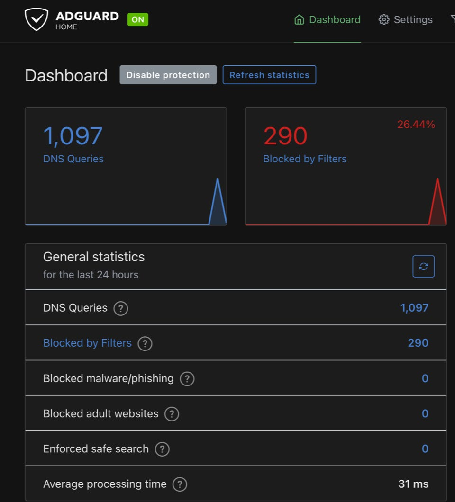
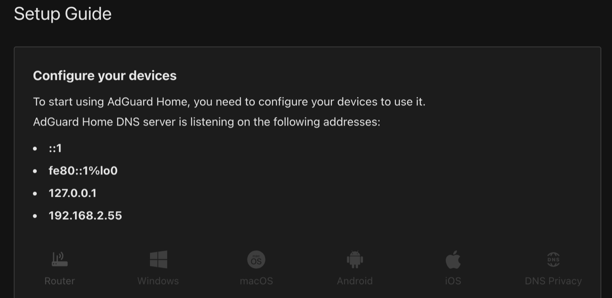

# 基于 Jail 的广告拦截教程

- 原链接：<https://freebsdfoundation.org/wp-content/uploads/2023/08/reuschling_practical_ports.pdf>
- 作者：BENEDICT REUSCHLING
- 译者：ykla & ChatGPT

FreeBSD 最早吸引我的一点是它能够轻松运行服务。这些服务可以是随操作系统提供的系统服务（最简单的例子可能是 ssh 守护进程），也可以是通过 pkg 或 Ports 安装的第三方软件。无论哪种情况，过程都是相同的：你在 **/etc/rc.conf** 中添加一行以启用该服务（可以通过 sysrc 或 `service ... enable`），使其在系统下次启动时运行。接下来通常会有一个配置文件，用于自定义设置以满足你的需求。通常，这需要输入要监听的 IP 地址或 DNS 主机名、网络端口和软件的一些具体细节。从那时起，要么直接启动该服务（使用 `service ... start`），要么在下次重新启动时启动，若需要加载 `kldload` 无法加载的内核模块（这种情况在如今很少出现）。

这一过程很简单直接，将所有系统服务的配置放在方便的位置，并且配置过一两个服务后，很容易复现。当然，在 FreeBSD 主机系统上运行整套服务也是没有问题的，直到情况变得更复杂。并行运行相同软件的不同版本是非常合理且并不罕见的。这是出于测试目的——检查升级是否按预期运行，或者某些软件是否仍需要较旧版本作为依赖。例如尝试并行运行不同版本的 PostgreSQL 数据库。在这种情况下，pkg 和 Ports 都会检查版本，或者取消安装操作并显示信息，指出某些二进制文件会放到同一位置，因此会相互覆盖。这种情形并不理想，用户必须选择其中一个版本，因为它们无法共存。

除非借助虚拟化或容器技术。这允许在独立执行环境中隔离进程，使用各种方法让多个这样的系统在同一硬件上运行。虚拟化在操作系统上添加了额外一层，允许安装相同或不同的操作系统，并使用模拟的硬件。容器或 jail 使用 chroot(8) 隔离进程。本文重点关注后者，因为它资源开销更小，并且启动较快。

这种隔离的好处不仅在于可以并行运行各种不同版本，还可以实现安全隔离。当应用程序在 jail 容器中运行时，默认情况下，内部进程无法访问主机系统。应用程序可以发现所有常见设备（如网络）、目录结构和文件都在正确位置，但实际上，它是独立环境，模仿主机系统的行为和布局。当这样的 jail 遭到入侵时，很容易停止它，而不会影响其他 jail 或主机系统中的服务。严格禁止访问它们，将任何入侵者阻隔在特定的 jail 单元中。

这也方便系统迁移到其他主机，只需停止、复制 jail 的目录结构到新位置，然后在那里重新启动（并作一些本地修改，例如更换 IP 地址）。备份和恢复方式相同。通常由 jail 管理软件管理多个这样的 jail，负责创建、修改和删除 jail。

其中一款 jail 管理器是 Bastille，完全用 shell 脚本编写。本文通过设置主机系统、创建 jail 并基于模板在其中启动服务的过程，深入了解 Bastille。这些模板允许在中央存储库中共享配置，无需了解服务内部工作原理即可应用。这样，想快速部署服务的人也能轻松应对复杂的配置场景。

本文将部署名为 AdGuard 的服务，由 AdGuard Software Limited 提供。通过在网络中运行 AdGuard 服务，将 DNS 解析指向该服务的客户端可以过滤掉网页浏览活动中的广告。这有助于避免广告商跟踪用户、建立用户画像，同时还可以加快页面加载速度，因为不必在传输用户想看的内容时一并传输广告。AdGuard 通过过滤列表和 DNS sinkholing 完成屏蔽。基于过滤列表，AdGuard 会在浏览器中呈现广告之前，通过发送无效的地址响应来阻止已知的广告站点。有多种使用 AdGuard 服务的方式——作为个人设备的浏览器扩展、桌面应用程序，或者将其作为递归 DNS 解析器运行。请注意，AdGuard 并不能完全防范所有形式的广告（尤其是动态嵌入在视频站点中的广告），但能有效屏蔽网页中的很大一部分广告。



我们从树莓派开始，因为这个服务基本上一直在运行，而且我们希望功耗较低。我这里有一台树莓派 3，但其他能够运行 FreeBSD 的设备（包括完整的服务器）同样适用。安装操作系统，应用最新的安全补丁，并使用 SSH 密钥锁定远程访问。

## 环境设置

我连接了一块旧的 32GB 固态硬盘到树莓派上，这个固态硬盘通过单磁盘 ZFS 池来执行大部分 I/O 密集的操作，而不是使用速度较慢的存储卡。撰写本文时，我正在运行 FreeBSD 13.2，我颇有信心未来的版本也会同样表现出色，或者只需稍作调整。

```sh
# pkg install bastille git-lite
```

Bastille 是 shell 脚本，安装相当迅速，没有额外的依赖。它某些功能可能不如其他 jail 管理器全面，但仍然能够正常工作。为了从 Bastille 的 GitLab 存储库中克隆 AdGuard Home 模板（以及其他模板），需要安装 Git。接下来，我们在 **/etc/pf.conf** 中创建针对 bastille 的 PF 配置，内容如下：

```sh
ext_if="ue0" ## <- 将 "ue0" 更改为你机器的配置。
set block-policy return
scrub in on $ext_if all fragment reassemble
set skip on lo
table <jails> persist
nat on $ext_if from <jails> to any -> ($ext_if:0)
rdr-anchor "rdr/*"
block in all
pass out quick keep state
pass in inet proto tcp from any to any port ssh flags S/SA keep state
pass in inet proto tcp from any to any port bootps flags S/SA keep state
pass in inet proto tcp from any to any port {9100,9124} flags S/SA modulate state
```

请确保将顶部的 `ext_if` 行改为正在使用的接口。在我的树莓派上，网线连接到了 `ue0`，所以我输入了 `ue0`。`pf.conf` 会为 jail 流量创建表（使用 NAT）。Bastille 支持多个用于网络的选项，足够灵活，既适用于办公室和家庭网络，也适用于托管服务提供的网络。这些选项在此处有详细描述：<https://docs.bastillebsd.org/en/latest/chapters/networking.html>。

我将使用基于 VNET 的 jail，因为我在本地网络上有可用的 IP 地址。编辑配置文件后，我们添加条目，随系统启动 PF 和 pf 日志设备等其他服务。Bastille 也应该会启动，我们列出了将为 AdGuard 创建的 jail 的名称（我的命名方案既传奇又无聊）。

```sh
# sysrc pf_enable=YES
# sysrc pflog_enable=YES
# sysrc bastille_enable=yes
# sysrc bastlle_list="adguard"
```

启动防火墙前，最好先检查防火墙规则集有无错误。使用：

```sh
# pfctl -nvf /etc/pf.conf
```

用于此类检查。成功时，它将回显整个规则集，或者显示你可能遇到的任何错误。请注意，它无法检查逻辑错误，比如阻止了 SSH 端口 22，而这可能是唯一的远程连接方式。幸运的是，已有一条规则允许 SSH 流量通过。检查完成后，请启动 PF 服务，并开始过滤流量：

```sh
# service pf start
# service pflog start
```

预计你的 SSH 连接将会断开，因此请保持单独的终端连接，以免把自己锁在系统外。重新连接后，我们需要编辑另外一些配置文件。启用 VNET 的 jail 需要在 **/etc/devfs.rules**（而不是 `.conf`）中添加条目，新安装的系统可能没有这个文件。只需创建该文件并添加以下规则：

```sh
[bastille_vnet=13]
add path bpf* unhide
```

这让 Bastille 能看到 VNET 接口上的流量，并将 jail 连接到外部网络。这可能是外行对背后原理的粗浅解释。幸运的是，我们不需要过于担心它（也许下次网络考试时我得深入研究）。

我们还需要访问的另一个文件是 **/etc/sysctl.conf**，需要添加以下行：

```sh
sysctl net.inet.ip.forwarding=1
sysctl net.link.bridge.pfil_bridge=0
sysctl net.link.bridge.pfil_onlyip=0
sysctl net.link.bridge.pfil_member=0
```

Bastille 运行时会在树莓派外部接口（`ue0`）和 jail 网络接口（`vtnet`）之间动态创建桥接。这两个接口通过虚拟网线连接在一起，一端连接在主机的接口上，另一端连接在 jail 上，通过它交换流量。

将这些更改应用到正在运行的系统中，而无需重新启动，可以使用以下命令：

```sh
# sysctl -f /etc/sysctl.conf
```

完成设置并重启树莓派后，发现 jail 无法再访问网络，我十分困惑。经过一番苦思冥想，我从以下的交流中得知了原因：

<https://www.mail-archive.com/freebsd-net@freebsd.org/msg64577.html>

在 FreeBSD 13 中，这需要在 **/boot/loader.conf** 中添加额外的一行。这可能会让你发疯，所以在发疯之前，请将以下内容加入其中，确保今后重启时正常工作：

```sh
if_bridge_load="YES"
```

正确加载桥接接口后，sysctl 变量随之出现，使得 `sysctl.conf` 可以将它们从默认值 1 更改为 0。尽管如此，完成前我们还要访问最后一个文件。

Bastille 的配置文件位于 **/usr/local/etc/bastille/bastille.conf**。你可以直接编辑它（它有很详细的注释），或者如果你不介意输入很多内容，可以使用 sysrc 命令。我在连接到树莓派的 ZFS 池上运行，因此设置 `bastille_zfs_enable` 指定池名称。

```sh
# sysrc -f /usr/local/etc/bastille/bastille.conf bastille_zfs_enable=YES
# sysrc -f /usr/local/etc/bastille/bastille.conf bastille_zfs_zpool=rpi3
```

如果你的池名称与 `bastille_zfs_zpool` 行上的名称不同，请将其更改为你的池名称。我还更改了选项 `bastille_network_gateway=""`。我输入了默认网关地址，因为后续我遇到 jail 无法解析名称的问题。你可能需要设置这个选项，也可能不需要，但如果你确实遇到问题，请重新查看这个选项，看看是否可以解决问题。

## Bastille 自举

所有设置就位后，是时候让 Bastille 在我们分配给它的池上创建数据集结构了。它会下载 FreeBSD 13.2-RELEASE 基本系统，并用后续发布的补丁更新。执行以下命令，直至它完成：

```sh
# bastille bootstrap 13.2-RELEASE update
Bootstrapping FreeBSD distfiles...
/usr/local/bastille/cache/13.2-RELEASE/MANIFES 782 B 1670 kBps 00s
/usr/local/bastille/cache/13.2-RELEASE/base.tx 168 MB 6526 kBps 26s
Validated checksum for 13.2-RELEASE: base.txz
MANIFEST: 7d1b032a480647a73d6d7331139268a45e628c9f5ae52d22b110db65fdcb30ff
DOWNLOAD: 7d1b032a480647a73d6d7331139268a45e628c9f5ae52d22b110db65fdcb30ff
Extracting FreeBSD 13.2-RELEASE base.txz.
Bootstrap successful.
See 'bastille --help' for available commands.
src component not installed, skipped
Looking up update.FreeBSD.org mirrors... 2 mirrors found.
Fetching metadata signature for 13.2-RELEASE from update2.freebsd.org... done.
Fetching metadata index... done.
Inspecting system... done.
Preparing to download files... done.
The following files will be updated as part of updating to
13.2-RELEASE-p1:
/bin/freebsd-version
/usr/lib/libpam.a
/usr/lib/pam_krb5.so.6
/usr/share/locale/zh_CN.GB18030/LC_COLLATE
/usr/share/locale/zh_CN.GB18030/LC_CTYPE
/usr/share/man/man8/pam_krb5.8.gz
Installing updates...
Restarting sshd after upgrade
Performing sanity check on sshd configuration.
Stopping sshd.
Waiting for PIDS: 1063.
Performing sanity check on sshd configuration.
Starting sshd.
Scanning /usr/local/bastille/releases/13.2-RELEASE/usr/share/certs/blacklisted for certificates...
Scanning /usr/local/bastille/releases/13.2-RELEASE/usr/share/certs/trusted for certificates...
 done.
```

自举操作后，我的池中增加了这些数据集：

```sh
# zfs list -r rpi3/bastille
NAME USED AVAIL REFER MOUNTPOINT
rpi3 621M 28.0G 24K /rpi3
rpi3/bastille 584M 28.0G 26K /usr/local/bastille
rpi3/bastille/backups 24K 28.0G 24K /usr/local/bastille/backups
rpi3/bastille/cache 169M 28.0G 24K /usr/local/bastille/cache
rpi3/bastille/cache/13.2-RELEASE 169M 28.0G 169M /usr/local/bastille/cache/13.2-RELEASE
rpi3/bastille/jails 24K 28.0G 24K /usr/local/bastille/jails
rpi3/bastille/logs 24K 28.0G 24K /var/log/bastille
rpi3/bastille/releases 414M 28.0G 24K /usr/local/bastille/releases
rpi3/bastille/releases/13.2-RELEASE 414M 28.0G 414M /usr/local/bastille/releases/13.2-RELEASE
rpi3/bastille/templates 24K 28.0G 24K /usr/local/bastille/templates
```

再运行一次自举操作，这次用于获取 AdGuard Home 模板。

```sh
# bastille bootstrap https://gitlab.com/bastillebsd-templates/adguardhome
warning: redirecting to https://gitlab.com/bastillebsd-templates/adguardhome.git/
Already up to date.
Detected Bastillefile hook.
[Bastillefile]:
PKG ca_root_nss adguardhome
CP usr /
SYSRC adguardhome_enable=YES
SERVICE adguardhome start
RDR tcp 80 80
RDR udp 53 53
Template ready to use.
```

很快就完成了。Bastille 拥有自己的模板语言，大写的命令（如 PKG、CP 等）就体现了这种语言。它们的功能与小写系统命令相同。借助这些命令，可以在 jail 中按正确的顺序设置服务。它们大多不言自明。最后的两个 RDR 命令将网络端口从主机系统重定向到 jail 中。所有其他端口仍受防火墙保护，因此只有端口 80 和 DNS 端口 53 在主机与 jail 之间连通。在 **/etc/pf.conf** 中检查 `rdr-anchor "rdr/*"` 这一行。这正是它灵活之处。不必为所有 jail 都打开端口，每个 jail 都可以打开所需的端口并保持其他端口关闭。

是时候创建并启动第一个 Bastille jail 了。使用 VNET 时需要在 `bastille create` 命令中传入 `-V` 选项，以及 jail 的名称、要运行的发行版，随后是分配给 jail 的本地网络上的 IP 地址，以及用于桥接的主机网络接口。组合起来，命令如下：

```sh
# bastille create -V adguard 13.2-RELEASE 192.168.2.55 ue0
Valid: (192.168.2.55).
Valid: (ue0).
Creating a thinjail...
[adguard]:
e0a_bastille0
e0b_bastille0
adguard: created
[adguard]:
Applying template: default/vnet...
[adguard]:
Applying template: default/base...
[adguard]:
[adguard]: 0
[adguard]:
syslogd_flags: -s -> -ss
[adguard]:
sendmail_enable: NO -> NO
[adguard]:
sendmail_submit_enable: YES -> NO
[adguard]:
sendmail_outbound_enable: YES -> NO
[adguard]:
sendmail_msp_queue_enable: YES -> NO
[adguard]:
cron_flags: -> -J 60
[adguard]:
/etc/resolv.conf -> /usr/local/bastille/jails/adguard/root/etc/resolv.conf
Template applied: default/base
No value provided for arg: GATEWAY6
[adguard]:
ifconfig_e0b_bastille0_name: -> vnet0
[adguard]:
ifconfig_vnet0: -> inet 192.168.2.55
[adguard]:
defaultrouter: NO -> 192.168.2.1
[adguard]: 0
[adguard]:
[adguard]: 0
Template applied: default/vnet
[adguard]:
adguard: removed
no IP address found for -
[adguard]:
e0a_bastille0
e0b_bastille0
adguard: created
```

你可以看到我之前提到的虚拟网线的两端：`e0a_bastille0` 和 `e0b_bastille0` 形成了主机系统与 jail 之间的连接。在主机上检查 ifconfig 输出，可以看到从 jail 的流量创建的新桥接。

创建 jail 时应用的设置相当标准，主要是禁用了我们不会使用的服务。创建 jail 后，我的池中还存在两个数据集，其中保存了所有 jail 的数据：

```sh
# zfs list|grep adguard
rpi3/bastille/jails/adguard 2.36M 28.0G 26.5K /usr/local/bastille/jails/adguard
rpi3/bastille/jails/adguard/root 2.34M 28.0G 2.34M /usr/local/bastille/jails/adguard/
root
```

这构成了 jail 的根文件系统，并遵循其他 jail 管理器的布局。要在 jail 与外部之间复制文件，只需使用前缀 **/usr/local/bastille/jails/adguard/root** 来访问 jail 的根目录。

jls 命令将列出 bastille jail 及其设置：

```sh
# bastille list -a
 JID State IP Address Published Ports Hostname Release Path
 adguard Up 192.168.2.55 - adguard 13.2-RELEASE-p1 /usr/local/bastille/
jails/adguard/root
```

此时，jail 正在运行。唯一缺少的是 AdGuard Home 的安装。我们之前自举过该模板，可以使用以下命令将其应用于 jail：

```sh
# bastille template adguard bastillebsd-templates/adguardhome
bastille template adguard bastillebsd-templates/adguardhome
[adguard]:
Applying template: bastillebsd-templates/adguardhome...
[adguard]:
Bootstrapping pkg from pkg+http://pkg.FreeBSD.org/FreeBSD:13:aarch64/quarterly, please wait...
Verifying signature with trusted certificate pkg.freebsd.org.2013102301... done
[adguard] Installing pkg-1.19.1_1...
[adguard] Extracting pkg-1.19.1_1: 100%
Updating FreeBSD repository catalogue...
[adguard] Fetching meta.conf: 100% 163 B 0.2kB/s 00:01
[adguard] Fetching packagesite.pkg: 100% 6 MiB 6.5MB/s 00:01
Processing entries: 100%
FreeBSD repository update completed. 31664 packages processed.
All repositories are up to date.
Updating database digests format: 100%
The following 2 package(s) will be affected (of 0 checked):
New packages to be INSTALLED:
 adguardhome: 0.107.22_5
 ca_root_nss: 3.89
Number of packages to be installed: 2
The process will require 41 MiB more space.
7 MiB to be downloaded.
[adguard] [1/2] Fetching adguardhome-0.107.22_5.pkg: 100% 6 MiB 6.7MB/s 00:01
[adguard] [2/2] Fetching ca_root_nss-3.89.pkg: 100% 266 KiB 272.1kB/s 00:01
Checking integrity... done (0 conflicting)
[adguard] [1/2] Installing ca_root_nss-3.89...
[adguard] [1/2] Extracting ca_root_nss-3.89: 100%
[adguard] [2/2] Installing adguardhome-0.107.22_5...
[adguard] [2/2] Extracting adguardhome-0.107.22_5: 100%
=====
Message from ca_root_nss-3.89:
—
FreeBSD does not, and can not warrant that the certification authorities
whose certificates are included in this package have in any way been
audited for trustworthiness or RFC 3647 compliance.
Assessment and verification of trust is the complete responsibility of the
system administrator.
This package installs symlinks to support root certificates discovery by
default for software that uses OpenSSL.
This enables SSL Certificate Verification by client software without manual
intervention.
If you prefer to do this manually, replace the following symlinks with
either an empty file or your site-local certificate bundle.
* /etc/ssl/cert.pem
 * /usr/local/etc/ssl/cert.pem
 * /usr/local/openssl/cert.pem
=====
Message from adguardhome-0.107.22_5:
—
You installed AdGuardHome: Network-wide ads & trackers blocking DNS server.
In order to use it please start the service 'adguardhome' and
then access the URL http://0.0.0.0:3000/ in your favorite browser.
[adguard]:
/usr/local/bastille/templates/bastillebsd-templates/adguardhome/usr -> /usr/local/bastille/jails/
adguard/root/usr
/usr/local/bastille/templates/bastillebsd-templates/adguardhome/usr/local -> /usr/local/bastille/
jails/adguard/root/usr/local
/usr/local/bastille/templates/bastillebsd-templates/adguardhome/usr/local/bin -> /usr/local/bastille/jails/adguard/root/usr/local/bin
/usr/local/bastille/templates/bastillebsd-templates/adguardhome/usr/local/bin/AdGuardHome.yaml ->
/usr/local/bastille/jails/adguard/root/usr/local/bin/AdGuardHome.yaml
[adguard]:
adguardhome_enable: -> YES
[adguard]:
moving old config /usr/local/bin/AdGuardHome.yaml to the new location /usr/local/etc/AdGuardHome.
yaml
Starting adguardhome.
stdin:2: syntax error
pfctl: Syntax error in config file: pf rules not loaded
tcp 80 80
stdin:2: syntax error
pfctl: Syntax error in config file: pf rules not loaded
udp 53 53
Template applied: bastillebsd-templates/adguardhome
```

它只需要在 jail 中执行模板中的指令（PKG、CP 等）。这也验证了网络设置是否正确。如果没有设置正确，jail 将无法从存储库获取软件包。最后的 pfctl 警告让我有点担心，尽管有这些警告，它仍正常工作。

满怀期待，我按照屏幕上一条消息的指示，打开了浏览器，并将其指向 jail 的 IP 地址。果然，AdGuard Home 的登录界面出现了。但是，凭证在哪里呢？我在 Bastille 模板网站 <https://gitlab.com/bastillebsd-templates> 上查找了一下，没有找到有效的信息。Bastille 的博客文章提到将 AdGuard 作为用户名，但密码无效。因此，我不得不创建自己的凭证，这实际上更安全，因为不良分子很容易扫描到默认密码。

我使用以下命令在 jail 中打开了控制台：

```sh
# bastille console adguard
```

在 jail 中，我发现 AdGuard 将其配置文件放在了 **/usr/local/etc/AdGuardHome.yaml** 下。在顶部附近，我找到了以下部分：

```yaml
users:
 - name: adguard
 password: some password not in clear text
```

再次退出后，我需要办法创建 BCrypt 密码。htpasswd 工具可以做到这一点，因此我安装了包含该工具的 apache24 web 服务器：

```sh
# pkg install apache24
```

运行 `refresh` 命令后，我可以运行 htpasswd 工具。查看它的 man 页面，我必须构建类似这样的命令行：

```sh
htpasswd -Bnb adguard BastilleBSD!
```

我使用选项 `-B` 创建了 BCrypt 密码，接着是应用于此密码的用户（配置文件里已有该信息，但也许你想要其他用户或多个用户），然后是明文密码。是的，这不安全，因为这会出现在你的 shell 历史记录中。但是本教程中，我是否曾表示过它可用于生产环境？没错，我没有。htpasswd 老老实实在命令行输出了生成的密码，我将其复制并粘贴到了 AdGuard 的配置文件中。

然后我执行了：

```sh
# service adguardhome restart
```

（仍在 jail 中，提醒一下）重启服务并应用新设置。该文件中的其他设置在 AdGuard Home Wiki 中有详细记录：<https://github.com/AdguardTeam/AdGuardHome/wiki/Configuration>

刷新网页浏览器后，我输入了新凭证，页面跳转到主 AdGuard 仪表板。成功！

顶部有设置向导，显示了如何使用你的新 AdGuard 服务，无论是用于路由器（以覆盖整个网络）还是各种设备，并为移动设备和桌面操作系统都作了描述。太棒了！



我在手机上设置后——出于测试目的——稍微浏览了一下网页，就看到仪表板中出现了统计数据。这表明我们的设置正在运行，我们应该将互联网更名为 SnooperNet。几乎所有的网站在某种程度上都会追踪你或显示让你不悦的广告。树莓派能够处理这种负载，我在 `AdGuardHome.yaml` 的 `ratelimit` 参数中微调了连接数。

你可以在 jail 的 **/var/log/adguardhome.log** 目录中找到 AdGuard 为该服务编写的日志。

## 总结

这就是本教程的内容。我发现 AdGuard 的文档很完善，得益于模板创建者的工作，很容易入门。我已经享受到在互联网上留下更少痕迹、看到更少广告的好处。作为 DNS 服务的好处是，你网络上的任何设备都可以使用它：个人电脑、笔记本电脑、智能手机、平板电脑、电视、物联网设备，甚至可能还有邻居家的智能猫门。

Bastille 可能需要一些初始配置，但之后，创建 jail 就很简单。也许你会发现其他想要在 Bastille 模板上运行的服务：<https://gitlab.com/bastillebsd-templates>？

---

**BENEDICT REUSCHLING** 是 FreeBSD 项目的文档提交者，并且是文档工程团队的成员。过去，他曾担任两届 FreeBSD 核心团队成员。他在德国达姆施塔特应用技术大学管理着大数据集群。他还为本科生开设了“Unix for Developers”课程。Benedict 还是每周 bsdnow.tv 播客的主持人之一。
