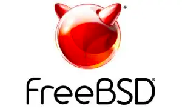

# 活动日历

- 原文链接：[2024 Events Calendar](https://freebsdfoundation.org/our-work/journal/browser-based-edition/networking-10th-anniversary/2024-events-calendar/)
- 作者：**Anne Dickison**

## 截至 2024 年 5 月的 BSD 活动

如需提交此处未列出的 FreeBSD 相关活动，或 FreeBSD 用户感兴趣的活动信息，请发送至 <freebsd-doc@FreeBSD.org>。

## SCALE 21X

3 月 14-17 日 • 加州帕萨迪纳

SCaLE 是北美规模最大的社区主办开源与自由软件大会，每年在大洛杉矶地区举办。Drew Gurkowski 还会在会议期间主持一场 FreeBSD 工作坊。

## AsiaBSDCon 2024

3 月 21-24 日 • 台湾台北

AsiaBSDCon 面向所有开发、部署和使用基于 FreeBSD、NetBSD、OpenBSD、DragonFlyBSD、Darwin 和 macOS X 的系统的人士。这是一场技术大会，旨在汇集最优秀的技术论文和演讲，确保开源社区的最新进展能传达给尽可能广泛的受众。

*敬请预留时间：*

## 2024 年 5 月 FreeBSD 开发者峰会

5 月 29-30 日 • 加拿大渥太华

欢迎参加 2024 年 5 月 FreeBSD 开发者峰会，该峰会与 BSDCan 2024 同地举办，地点位于加拿大渥太华。为期两天的活动于 5 月 29-30 日举行，包括开发者讨论会、厂商演讲和工作组。更多信息将于 2024 年 3 月公布。

## BSDCan 2024

5 月 29 日 - 6 月 1 日 • 加拿大渥太华

BSDCan 是面向从事 BSD 操作系统及相关项目开发与应用人士的技术大会。它是一场开发者大会，聚焦新兴技术、研究项目和进行中的工作，还关注 Userland 基础设施项目，并邀请自由软件开发者和商业厂商共同参与。
