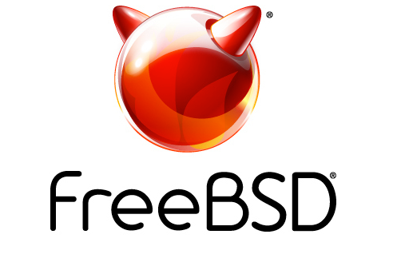
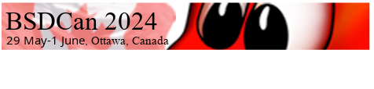

# 活动日历

作者：Anne Dickison

## 截至 2024 年 9 月的 BSD 活动

如需提交此处未列出的 FreeBSD 相关活动，或 FreeBSD 用户感兴趣的活动信息，请发送至 <freebsd-doc@FreeBSD.org>。

## 2024 年 5 月 FreeBSD 开发者峰会

5 月 29-30 日 • 加拿大渥太华

欢迎参加 2024 年 5 月 FreeBSD 开发者峰会，该峰会与 BSDCan 2024 同地举办，地点位于加拿大渥太华。为期两天的活动于 5 月 29-30 日举行，包括开发者讨论会、厂商演讲和工作组。

## BSDCan 2024

5 月 29 日 - 6 月 1 日 • 加拿大渥太华

BSDCan 是面向从事 BSD 操作系统及相关项目开发与应用人士的技术大会。它是一场开发者大会，聚焦新兴技术、研究项目和进行中的工作，还关注 Userland 基础设施项目，并邀请自由软件开发者和商业厂商共同参与。

## EuroBSDCon 2024

9 月 19-22 日 • 爱尔兰都柏林

EuroBSDCon 是年度国际技术大会，每年在欧洲不同国家举办，汇聚基于 4.4BSD（伯克利软件发行版）操作系统家族及相关项目的用户和开发者。FreeBSD 基金会很高兴再次作为银牌赞助商参与。
