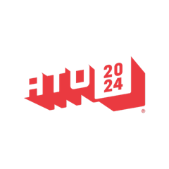

# 活动日历

作者：Anne Dickison

## 截至 2024 年 10 月的 BSD 活动

如需提交此处未列出的 FreeBSD 相关活动，或 FreeBSD 用户感兴趣的活动信息，请发送至 <freebsd-doc@FreeBSD.org>。

## EuroBSDCon 2024

9 月 19-22 日 • 爱尔兰都柏林

EuroBSDCon 是年度国际技术大会，每年在欧洲不同国家举办，汇聚基于 4.4BSD（伯克利软件发行版）操作系统家族及相关项目的用户和开发者。FreeBSD 基金会很高兴再次作为银牌赞助商参与。

## EuroBSDCon FreeBSD 开发者峰会

9 月 19-20 日

第一天为演讲和讨论组，第二天为黑客马拉松。

## All Things Open

10 月 27-29 日 • 北卡罗来纳州罗利

All Things Open 是美国东海岸规模最大的开源/开放技术/开放 Web 大会，也是全美最大的同类大会之一。大会常邀全球知名专家，几乎所有主流科技公司也到场。FreeBSD 很荣幸成为今年 All Things Open 的非营利合作伙伴。
