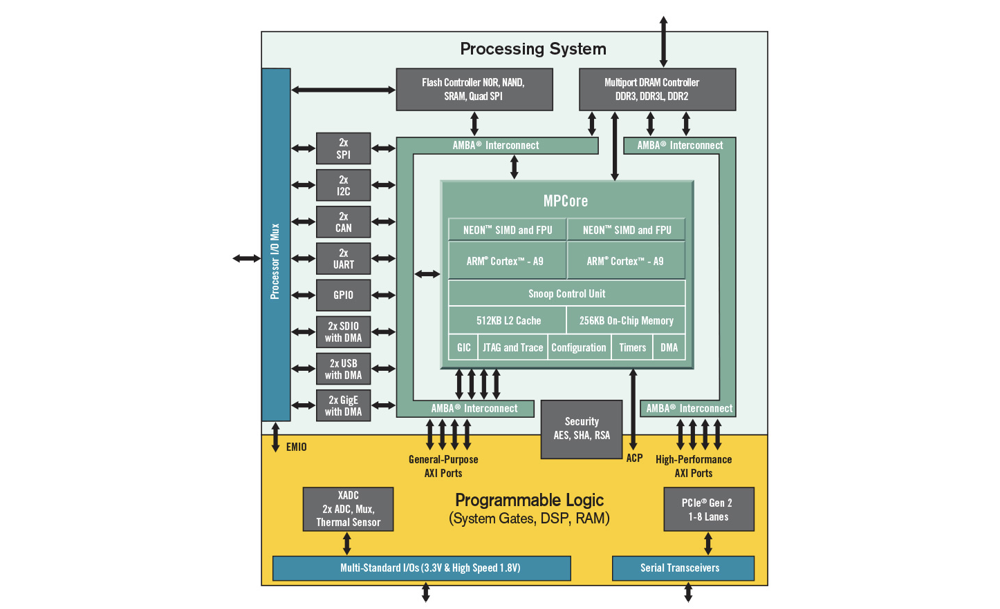

# 嵌入式 FreeBSD 面包板

- 作者：**CHRISTOPHER R. BOWMAN**
- 原文链接：<https://freebsdfoundation.org/our-work/journal/browser-based-edition/configuration-management-2/embedded-freebsd-breadcrumbs/>

我使用 FreeBSD 已近三十年。最开始，在上世纪九十年代初我安装了 FreeBSD，因为 FreeBSD 的软件包系统让我能轻松安装当时用于设计首批硅芯片的免费 CAD 软件（**译者注：freeCAD 诞生于 2001，时间不符，此处不是 freeCAD**），工艺精度为 2 微米（即 2000 纳米，这里不是错别字）。不必自己配置编译 3-4 个软件包，这意味着我在一个晚上就可以安好系统，然后在家里的地下室进行芯片设计。在那之前，我需要驱车赶往大学，然后每天在昂贵的 Sun 工作站上花费数个小时工作到深夜。现在我在家就能完成所有工作，而且工具的运行速度还更快！虽然我会编程，但我一直把 FreeBSD 用作计算基础，从未参与过社区开发。现在，我想要用 FreeBSD 做一些东西，而不仅仅是用 FreeBSD 完成我的工作。

市面上有大量的小型嵌入式板，其中某些享有极高的知名度——比如树莓派及其各种衍生版本。对我而言，这些小型嵌入式板最有趣的地方，就在于它们能够与外部世界接口通信。这样的小板大都带有从 CPU 引出的 GPIO 引脚，因此可以与各种真实世界的设备交互。但我本质上是硬件工程师，我真的很想做硬件。虽然我的职业发展还不错，但我仍然没有上百亿美元去建立自己的晶圆厂，或者花费数百万美元去购买电子设计自动化（EDA）软件来设计自己的芯片。如果你想要制作自己的 [硅芯片](https://developers.google.com/silicon)，现在有一些有趣的项目，但我在找到它们之前就走上了这条路。我一直在想，我的确可以购买树莓派或其他一些出色的板子（比如 Arduino 等），但我会用它们做什么呢？因此，我不断地阅读有关这些板子的资料，但从未尝试过。最后，我找到了适合我的板子。

[Xilinx](https://www.xilinx.com/)（赛灵思），现在是 AMD，生产了一套价格便宜的芯片，他们称之为 Zynq。这些芯片搭载了单核或双核 AMD Coretex A9 CPU，带有 MMU 和一系列内置外设。这些芯片虽未开源，但从硬件角度来看，文档齐全。最重要的是，有人（Thomas Skibo）已经做好了将 FreeBSD 移植到这些芯片上的所有繁重工作。正如我所说，我本质上是硬件工程师，虽然我喜欢编写软件，但从头开始移植 FreeBSD 却是一个比我当时想做的更大项目。板载这款芯片（[ZYBO](https://digilent.com/shop/zybo-z7-zynq-7000-arm-fpga-soc-development-board/)、[ZEDBOARD](https://digilent.com/shop/arty-z7-zynq-7000-soc-development-board/)、[ARTYZ7](https://digilent.com/shop/zedboard-zynq-7000-arm-fpga-soc-development-board/)）的电路板型号款式各异，价格不等——有些甚至低至约 200 美元。但对于作为硬件工程师的我来说，最重要的是这些芯片内置了 FPGA 结构，并与 CPU 相连。

对于那些不了解什么是 FPGA 的人来说，你可以把它们看作是 CPU 和专用集成电路（ASIC）之间的中间产物。FPGA 是 Field Programmable Gate Array（现场可编程逻辑门阵列）的缩写。在它们的基本形态中，它们是一个大型的门阵列，可以相互连接形成电路。你经常会听到将这些门阵列及其互连网络称为“结构”。FPGA 电路通常是用一种叫做 Verilog（或 VHDL）的语言设计的，这与设计专用集成电路 ASIC 时使用的语言相同。用于构建 FPGA 设计的工具流程与 ASIC 设计也非常相似。它非常灵活，但也可能非常复杂。虽然 Verilog 看起来很像 C 语言，但它实际上是一种完全不同的思维方式。

使用 Xilinx（赛灵思）/AMD Zynq 芯片的一个优点是，赛灵思免费提供了一套基本的工具集，用于针对 Zynq 芯片开发。缺点是它只能在 Windows、Linux 下运行。在专用集成电路 ASIC 设计中，这些工具可能需要数百万美元。

对我而言，这是个很好的开始。我可以购买一款价格相对便宜且搭载 Zynq 芯片的开发板。从硬件角度来看，它已经有了相当不错的文档支持。它已经能运行 FreeBSD。用于在可编程结构中进行设计的工具是免费的。我可以集中精力在我真正感兴趣的事情上：设计硬件并构建驱动程序和软件与其交互。可能性多得令人惊叹。

该图显示了 Zynq 芯片处理器子系统的框图。正如你所看到的，它配备有各种硬件模块，可与外部世界接口，包括 i²C、SPI、CAN、串口、USB 和千兆以太网。所有这些模块无需对可编程逻辑编程即可使用，这使 Arty Z7 成为优秀的开发板，即使未做任何硬件设计也是如此。



虽然有许多款 Zynq 开发板，但我选择的是 [Digilent Arty Z7-20](https://digilent.com/shop/arty-z7-zynq-7000-soc-development-board/)（**译者注：国内代理约 2400 元**），不要将其与采用全是可编程结构而不带处理器子系统的芯片的 Digilent Arty A7 混淆。Arty Z7-20 搭载了双核 ARM Cortex A9 处理器（Z7-10 仅有一个核心），我猜它们的性能大约与我几十年前运行的奔腾 Pro 处理器相当，但是呢，你想要在嵌入式板上有什么？这些核心在 FreeBSD 上运行的 LLVM 有完整支持。另外还搭载了 512MB DDR3 内存——以 1050 MBps 的速度通过 16 位总线运行。该板有一个 Arduino/chipKIT Shield 连接器，可让你轻松连接 Arduino Shield。它还配备有几个 PMOD 接口，就像 Arduino Shield 连接器一样，也是用于外设的标准连接器。在 [Digilent 网站](https://digilent.com/shop/boards-and-components/system-board-expansion-modules/pmods/) 上列出了各种廉价且方便购买的 PMOD 设备。这块主板包括两个 HDMI 端口：一个输入、一个输出，均连接至可编程逻辑。它还配有一个能在 FreeBSD 下运行的千兆以太网接口。还有 USB 接口（我从来没用过）以及各种 LED、开关和按钮，全部都连接到了可编程逻辑。Zynq 芯片本身还包含双 ADC（模数转换器），能让你对外部信号采样。存储系统是标准的 MicroSD 存储卡，容量最高可达 32GB。如果你从未接触可编程逻辑，那么这块嵌入式板就已经相当完整和功能强大了。哈哈，它比我在上世纪九十年代初在 FreeBSD 上运行的硬件还要强！

启动 Arty Z7 板子很简单。我用 `dd` 把预构建的镜像（你可以在这里找到我用的 [14.1 RELEASE](http://www.chrisbowman.com/crb/ArtyZ7/images/FreeBSD-armv7-14.1R-ARTY_Z7-10e31f09.img) ）复制到一张存储卡里，使用一款便宜的 [USB 转 SD 卡适配器](https://www.amazon.com/Reader-uni-Adapter-Aluminum-Memory/dp/B08P1T8R46/ref=sr_1_12_sspa?crid=1KGY0ZDEUJ5TV&keywords=usb%2Bsd%2Bcard%2Breader&qid=1695264050&sprefix=usb%2Bsd%2Caps%2C140&sr=8-12-spons&sp_csd=d2lkZ2V0TmFtZT1zcF9tdGY&th=1) 就行。请注意，存储卡不能大于 32GB。将存储卡插入我的系统后，会出现一个设备 **/dev/da0**。如果你已经有一个 **/dev/da0** 设备，那么你的系统中可能会稍有不同。你可以在插入卡前后列出 **/dev** 中的 da 设备，以便查看要使用的设备。以下是一个复制镜像的例子：

```sh
# dd if=FreeBSD-armv7-14.1R-ARTY_Z7-49874af3.img \
of=/dev/da0 bs=1m status=progress
```

与此同时，我将一端的 USB 线插入 Arty micro-B USB 连接器，另一端插入我的 FreeBSD 机器。然后启动一个串口终端程序，连接到适当的设备，并设置为 115kpbs 8-N-1。

```sh
# cu -s 115200 -l /dev/ttyU1
```

镜像复制完成后，我将 SD 卡插入 Arty 板子，然后按下复位键（reset）。在按下复位键之前，请确保设置好了串口终端，以便你欣赏整个 FreeBSD 启动过程。几秒钟后，我就能拥有一台小巧但功能完备的 Unix 主机，准备开始征服世界之旅！

由于我使用的镜像已预先配置了以太网端口上的 DHCP，并预先配置了用户账户和 SSH 密钥，因此我可以简单地将该板连接到我的以太网交换机，将板的 MAC 地址添加到我的 DHCP，创建 DNS 条目并使用其 DNS 名称通过 SSH 连接到该板。

就在那里，它是一个小巧、相对便宜、功能齐全的 Unix 主机。你可以搭建诸如 DHCP、DNS、NTP 之类的服务。你可以将其用于网络入侵。可能性是无穷的，但我们甚至还没有触及表面，因为我们甚至还没有谈论使用外部引脚或 FPGA。而那将成为将来专栏的重点。

你在使用这些板子吗？哪一块？你用它做什么呢。我很想听听你的评论和反馈。

---

**Christopher R. Bowman** 在 1989 年在约翰斯·霍普金斯大学应用物理实验室地下二层首次接触了 BSD——在 VAX 11/785 上使用。后来，在上世纪九十年代中期，在马里兰大学设计他的第一个 2 微米 CMOS 芯片时，他开始使用 FreeBSD。自那时起，他始终是 FreeBSD 的用户，并对硬件设计及驱动它的软件感兴趣。在过去 20 年中，他一直在半导体设计自动化行业工作。
