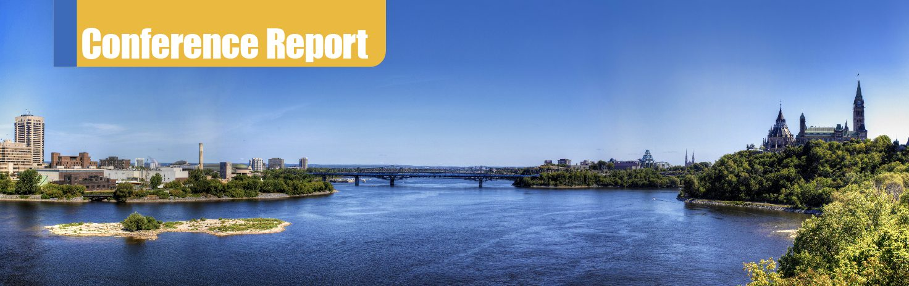

# 会议报告：BSDCan 2024

- 原文链接：[Conference Report: BSDCan 2024](https://freebsdfoundation.org/our-work/journal/browser-based-edition/storage-and-filesystems/conference-report-bsdcan-2024/)
- 作者：Aymeric Wibo

几个月前，我有幸参加今年的 BSDCan 并发表演讲。BSDCan 是三大年度 BSD 大会之一（另外两个是 AsiaBSDCon 和 EuroBSDCon），今年在渥太华举办。这是我第一次踏足北美——我来自比利时，那是华夫饼、啤酒以及组阁耗时 652 天的国度——所以我在从波士顿飞往渥太华参加 BSDCan 之前，先在东北走廊沿线转了两周。

我预定演讲的内容是我在 谷歌 Summer of Code（GSoC）期间的工作：把 Linux 内核中的 BATMAN 实现（`batman-adv`）移植到 FreeBSD，更广泛地说，是它在 Freifunk 这类项目中的应用，以及 FreeBSD 上用于移植 Linux 内核驱动的 LinuxKPI 系统。

抵达古朴的渥太华国际机场后，我坐巴士和渥太华轻轨到了会议举办地渥太华大学。我入住讲者住宿——90U 宿舍，条件相当不错。这里的学生显然过得挺舒服！我和 Kirk McKusick 同住一间，他还没到，于是我先去了 BSDCan 与会者的固定聚会点 Father & Sons 酒馆，想认识一些人。我到时恰逢 Goat BoF（Birds of a Feather）尾声，那里人头攒动。我喝了几品脱，吃了丰盛的肉汁奶酪薯条，然后回宿舍见 Kirk。自上次在葡萄牙科英布拉的 EuroBSDCon 之后，我们还没见过面。

BSDCan 前两天并行举办教程和 FreeBSD DevSummit。我参加了 DevSummit——FreeBSD 开发者和其他来宾聚在一起讨论项目进展和未来。这里也有几场有意思的演讲，比如 Mitchell Horne 介绍 RISC-V 硬件以及他在 FreeBSD 上对 RISC-V 的支持工作；Alex Pshenichin 关于 Antithesis 确定性 hypervisor 的有趣演讲（基于 FreeBSD 的 bhyve 的 "Determinator"），用于软件测试，并讨论了运行确定性虚拟机时那些并非显而易见的种种考量。

DevSummit 期间还专门留出 "下一版本规划" 环节。大家各抒己见，讨论要进入（或砍掉）下一版 FreeBSD（本次为 15.0）的特性。这些特性被归类为：已在树中完成的特性、已完成但尚未上游的特性、正在开发的特性、亟待开发的特性，以及有则更好但非优先级的特性。我对这个清单的小小贡献是 S0ix 空闲支持——较新 CPU（包括 AMD Framework 笔记本）进入睡眠状态所必需，几年前曾启动开发但随后搁置。我把聚焦消费级硬件支持视为让更多人用上 FreeBSD 的重要途径，免得他们因为某个 X 或 Y 功能在新笔记本上不工作而却步。很高兴看到项目里其他人也有同感。

接下来两天是主会期。我先听了 Kirk 关于 FreeBSD 成功秘诀的演讲，再听 Shawn 的 State of the Hardened Union（会议期间我和他多次聊起 BATMAN 和开放无线网络），然后发表了自己的演讲。这是我第一次正式做技术演讲，不知道该期待什么，也不确定在观众面前讲技术会不会自在。总的来说我相当满意，不过语速确实快了些，会后收到的反馈也印证了我讲得太快。下次得改 😉 不过我想核心要点是讲清楚了，对提问环节也挺满意。

最后一天我听了 Warner Losh 关于通过 GitHub 向 FreeBSD 贡献的演讲。我认为这对新贡献者很重要，相比学习 Phabricator 的运作方式，门槛低了不少——尤其是那些只在 GitHub 这类工具上学过本事的初出茅庐的开发者。事实上，我第一次尝试提交 FreeBSD 贡献时也是走 GitHub，后来才明白这不是首选方式。我听的最后一场是 Sheng-Yi Hong 关于用 LLDB 调试内核的工作——我个人很期待这个功能。我做 BATMAN 那年 Sheng-Yi Hong 也是 GSoC 学生，能当面见到他很开心。他是个开朗乐观的小伙子，期待未来大会再聚！

闭幕式和惯例拍卖之后，是 Sens House 的社交活动——这是这类大会里我最享受的环节。我觉得从大会的社交层面获得的收获几乎比演讲本身还多：这是与那些你只在 handle 或补丁说明里见过的人见面的机会。通过这些交流，我结识了许多朋友，接触到许多原本不会遇到的 FreeBSD 及其他软件的用例和视角。

第二天，在 Father & Sons 吃过丰盛得离谱的早餐后，Kirk 和我收拾行李赶往机场，飞芝加哥，在奥黑尔机场与 Eric Allman 会合（可惜他今年没能来 BSDCan）。

不久之后，我们得知一则非常不幸的消息：Michael Karels 在大会最后一天之后辞世。Mike 是 4.4BSD-Lite 版本开发中举足轻重且备受爱戴的人物，所有现代 BSD 都可追溯到这个版本。我很庆幸能在 BSDCan 上认识他，并向他的家人和朋友致以最诚挚的慰问。

在风之城游览一天后，我们坐了三天加州和风号列车到伯克利，我在那里又待了几周，然后飞回老家——我的 BSDCan 之旅就此结束。

总体而言，大会及整体组织都相当出色，从餐饮到 AV 到周边活动无一不精。我想向那些在幕后累断了腰、把这一切办得如此顺畅专业的人们致以诚挚谢意。BSDCan 报销了我的差旅费，并代办了住宿事宜，这极大地缓解了离家这么远的旅行中几个主要的压力点。演讲引人入胜，我结识了一群出色而有趣的人，Father & Sons 的啤酒冰凉透心。

如果你有想讲的话题，我真心建议你投稿。期待明年再会！

Aymeric Wibo 是比利时 UCLouvain 的计算机科学学生，从高中起就在使用并基于 FreeBSD 开发项目。他的主要兴趣在图形和网络。
