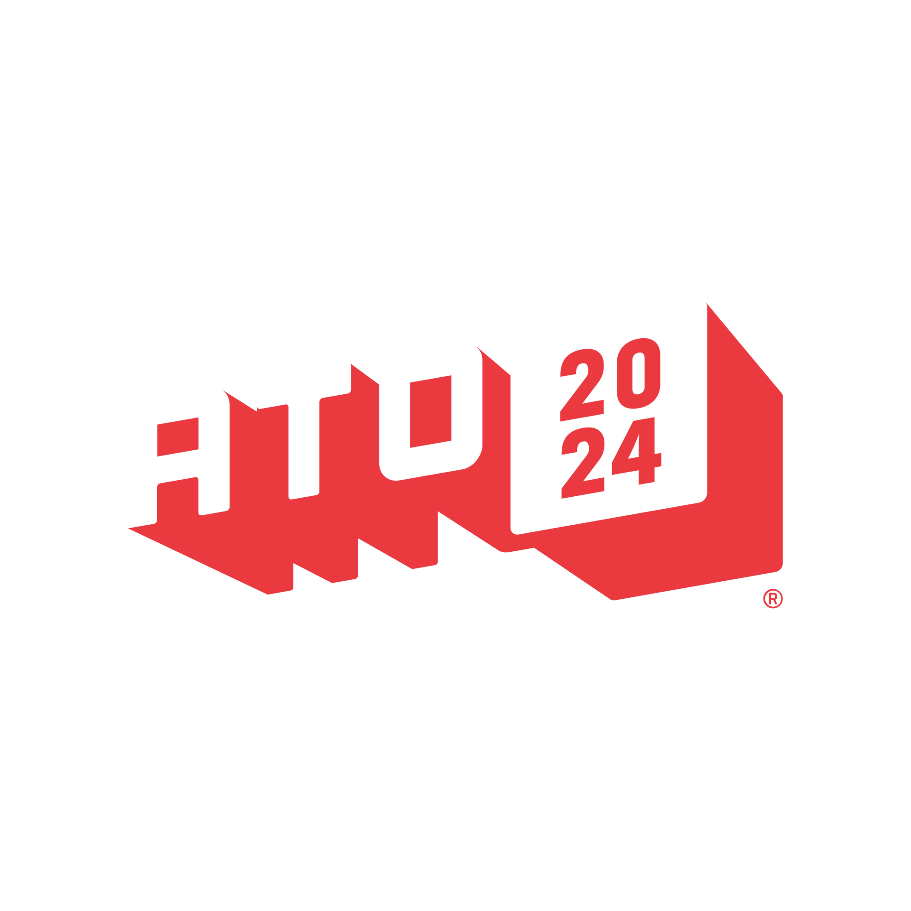
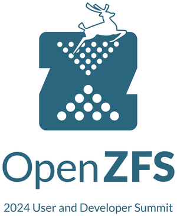
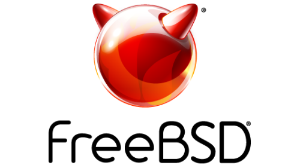

# 活动日历

- 原文链接：[2024 Events Calendar](https://freebsdfoundation.org/our-work/journal/browser-based-edition/storage-and-filesystems/events-calendar/)
- 作者：Anne Dickison

## 截至 2024 年 11 月的 BSD 活动

如发现此处未列出的 FreeBSD 相关活动或对 FreeBSD 用户有益的活动，请将详情发送至 <freebsd-doc@FreeBSD.org>。

## 2024 年 9 月 FreeBSD 开发者峰会

2024 年 9 月 19-20 日

爱尔兰都柏林

2024 年 9 月的 FreeBSD 开发者峰会将与 EuroBSDCon 2024 同地举办，地点在爱尔兰都柏林。本次活动为邀请制。FreeBSD 提交者可使用此 wiki 自行注册；非提交者须由一名提交者推荐方可参加。与会者还须参加 EuroBSDCon 2024，才能参与所有开发者峰会活动。

## EuroBSDCon 2024

2024 年 9 月 19-22 日

EuroBSDCon 是年度国际性技术大会，每年在欧洲不同国家举办。大会汇聚基于 4.4BSD（Berkeley Software Distribution）操作系统家族及相关项目的用户和开发者。FreeBSD 基金会再次荣任银牌赞助商。

## All Things Open

2024 年 10 月 27-29 日

美国北卡罗来纳州罗利

All Things Open 是美国东海岸规模最大的开源/开放技术/开放 Web 大会，也是全美规模最大的同类大会之一。大会常年邀请世界上最知名的专家，以及几乎所有主流科技公司。FreeBSD 荣任本年度 All Things Open 的非营利合作伙伴。

## 2024 年 OpenZFS 用户与开发者峰会

2024 年 10 月 26-29 日

美国俄勒冈州波特兰

第十二届年度 OpenZFS 开发者峰会与首届 OpenZFS 用户峰会将于 2024 年 10 月 26-29 日（周六至周二）在美国俄勒冈州波特兰举行。

用户峰会的议题包括：

- OpenZFS 的存储局域网与广域网网络
- 混合操作系统的 OpenZFS 环境
- 可机器读写的 OpenZFS，包括 JSON、SNMP、REST
- 安全、加密与 MPAA TPN 合规
- Channel Program 工作流
- 极限 OpenZFS，包括全闪存、DRAID、特殊分配类
- 候选议题：持续复制头脑风暴
- 候选议题：用户态 OpenZFS
- 候选议题：OpenZFS DMU 对象存储

基金会荣任铜牌赞助商。

## 2024 年秋季 FreeBSD 峰会

2024 年 11 月 7-8 日

美国加州圣何塞

FreeBSD 峰会是年度盛会，旨在汇聚社区，共同学习、交流，并推动 FreeBSD 的使用。每年大会都会邀请 FreeBSD 用户，包括决策者、软件工程师和个人贡献者及用户，分享使用 FreeBSD 的最佳实践和成功经验。FreeBSD 峰会还提供难得的机会，让你与开发者社区当面讨论问题。

请注意：2024 年秋季活动的名称由 “Vendor Summit” 更名为 “FreeBSD Summit”，以更准确地反映与会者群体，为未来几年的发展做好准备。

注册将于 9 月下旬开放。
