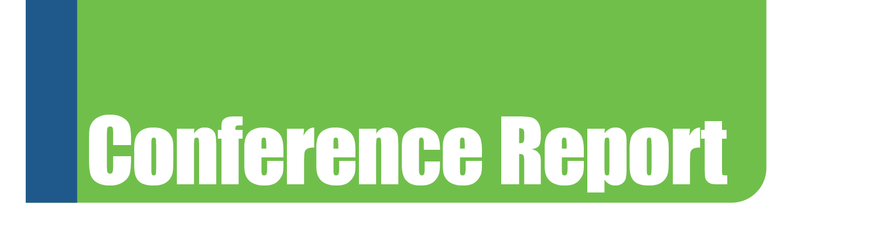
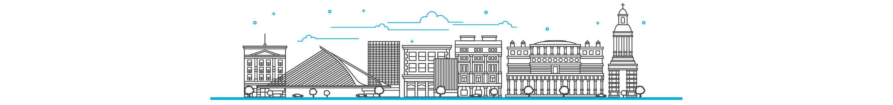
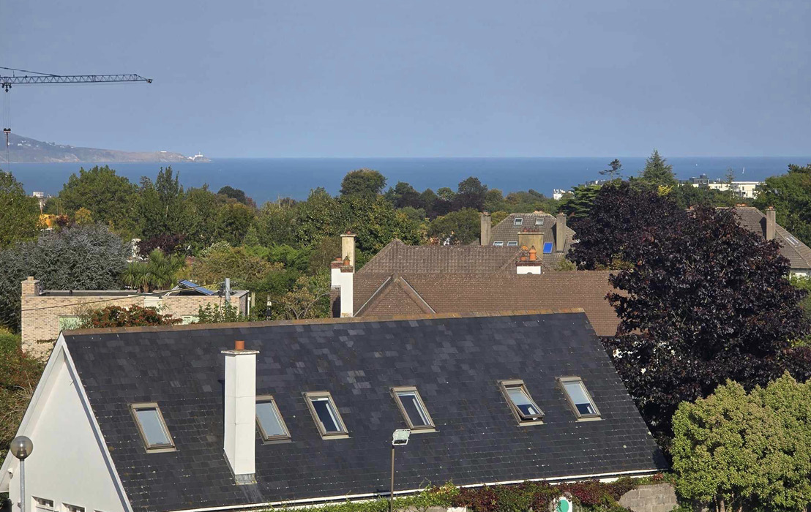
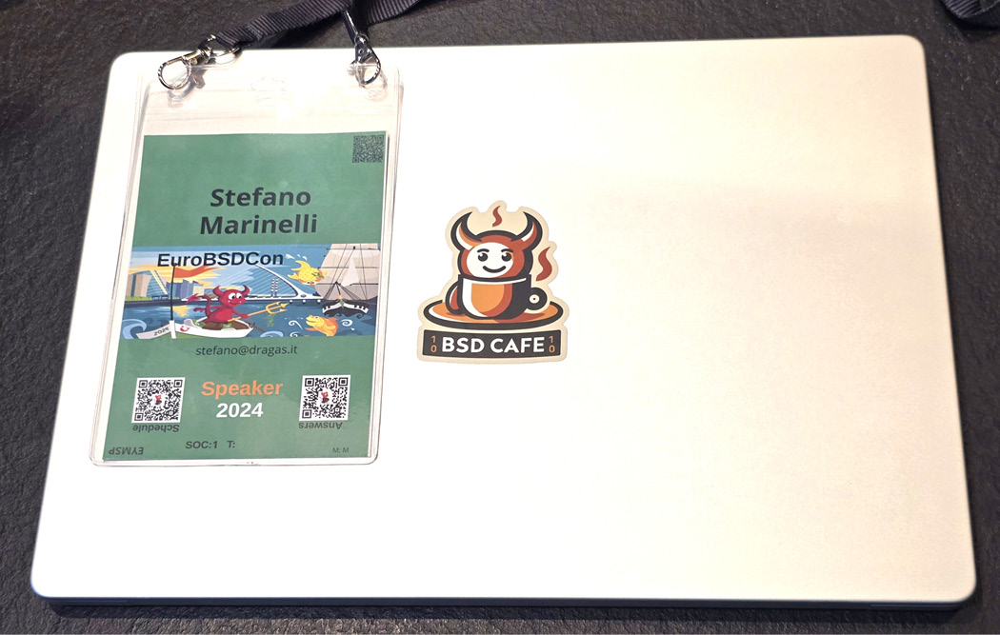
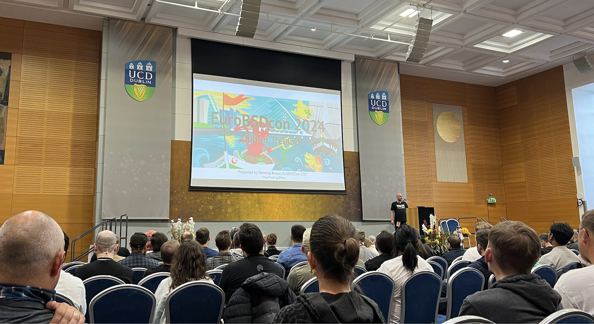
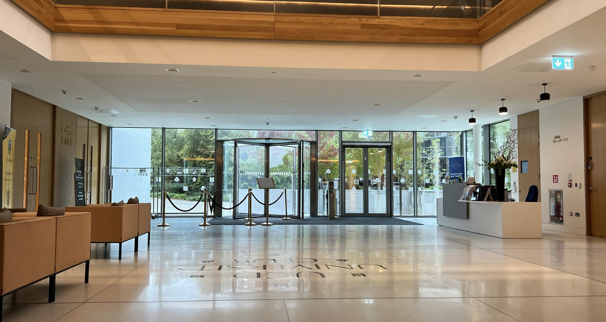
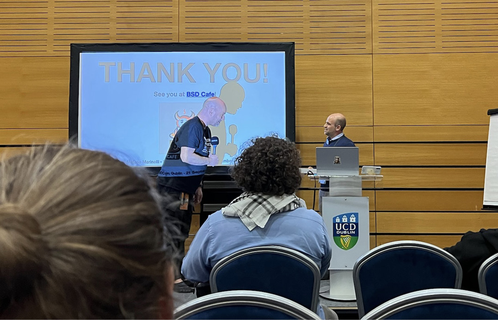

# 会议报告：我在都柏林的 EuroBSDCon 体验

- 原文链接：[Conference Report: My EuroBSDCon Experience in Dublin](https://freebsdfoundation.org/our-work/journal/browser-based-edition/virtualization-2/conference-report-my-eurobsdcon-experience-in-dublin/)
- 作者：Stefano Marinelli

## 在会议前

最初想到参加 EuroBSDCon 是在 2023 年。当时 [Coimbra](https://2023.eurobsdcon.org/) 本会是一个非常适合多年后重返会议的好地点，但遗憾的是我未能成行。当 [都柏林的注册通知](https://2024.eurobsdcon.org/) 发布时，我断定这将是一个合适的时机。与此同时，[BSD Cafe](https://bsd.cafe/) 项目也已启动，其所获得的热烈反响给了我很大的动力。我认为我可以发起一场 [演讲](https://events.eurobsdcon.org/2024/talk/LNMLZX/)。我在工作日常中接触 BSD 系统，服务于各种客户，分享我如何（以及仍然如何）从 Linux 过渡到 BSD 系统的经验，可能会引起社区的兴趣。

我还记得 6 月点击 “提交” 的那一刻。我对妻子说：“无论是作为讲者还是参与者，9 月我们都会去都柏林。” 她和我一起工作，所以她也会参加这次会议。这是近年来我最好的一个决定。

我还记得在去办公室的路上，我瞥了一眼智能手表上的通知：我的演讲被接受了。刹那间，我感到两种截然不同的强烈情绪：兴奋与恐惧。我不怕公开演讲，但在这样一个场合用英语演讲……事实上，这份恐惧是多余的，直到两个月后我才发现这一点。

随着活动临近，组织者提供了所有必要的信息。他们非常耐心，即使我问了一些看似琐碎的问题。这是我第一次参加 EuroBSDCon，而 “BSD” 作为名字的核心，本该让我意识到每个 BSD 用户都知道的事情：一切都被详尽地记录在案。FAQ 经常更新。这是一个公认的 **特性**：与 BSD 相关的文档总是无可挑剔的。

我们周四出发，因为不参加教程。这是我第一次到爱尔兰，第一次参加 BSD 大会，也是第一次作为演讲者。抵达后，一切都安排得妥妥当当：交通指引、讲者酒店，房间能看到壮丽的爱尔兰海景。组织者非常懂得如何款待讲者。

那天晚上我们下楼去吃晚餐，我有些紧张，因为我非常不擅长认脸。我确信会碰到一些我在网上认识很久的人，但我却认不出他们来。

## 演讲前一天

周五早上我专注于复习笔记和幻灯片。每场演讲的时段为 45 分钟，包括提问，我几乎可以肯定我会稍微超时。在测试演练中，我成功地控制在 50 分钟以内，但没有在 45 分钟以内。最后一场演讲恰好在社交活动之前，这意味着小小的超时不会影响其他讲者，我也可以把问题 “推迟” 到社交活动上。无论怎样，我对结果感到满意。我还不知道观众会如何接纳我的演讲，但社区的热情和完美的组织已经让我感到自己是某个特别群体的一部分。

早上，我收到了 Philipp Buehler 的一封邮件，建议下午去会场测试投影仪。目的是避免在我的演讲前出现任何临时的技术问题，浪费宝贵时间。所以午饭后，我们愉快地漫步穿过都柏林，前往会议场地。

## 会场和初步印象

EuroBSDCon 在 [都柏林大学学院（UCD）的 O’Reilly Hall](https://www.ucd.ie/universityclub/conferenceandbanqueting/theoreillyhall/) 举办——我觉得这个场地非常合适、舒适。入口处有两个区域：右边是签到和注册（胸卡分三种颜色：橙色给组织者和工作人员，白色给参与者，绿色给讲者）；左边是 T 恤区，也有几位工作人员和朋友。抵达后，我一自我介绍，就得到了温暖友好的欢迎。Henning Brauer 把胸卡递给我们——看到那枚绿色胸卡，我满心自豪。和他在一起的还有 Katie McMillan，我之前从未与她有过互动，连网上也没有，但我看过她在 BSDCan 的演讲视频，所以见到她本人真是荣幸。另一张桌子旁有几位朋友，包括 Mischa Peters（他送我一件 [OpenBSD.Amsterdam](https://openbsd.amsterdam/) T 恤）、我的 “同事” Jeroen Janssen（网名 h3artbl33d，Mastodon 实例 [exquisite.social](https://exquisite.social) 的管理员之一）、Peter Hansteen、Paul de Weerd、René Ladan、Janne Johansson、Guido Van Rooij、Michael Reim、Benny Siegert 等人。都是我敬重多年的人，全都聚集在那里。我们聊了一个多小时，期间有人加入有人离开。我早就知道 BSD 社区氛围积极，但各小组之间如此融洽还是让我吃惊。我立即感到自在，那种身处熟悉之地、被挚友环绕的感觉。

某一刻，Franco Fichtner 来做同样的技术检查。[OPNSense](https://opnsense.org/) 是我为客户选择路由器/防火墙方案时的首选之一，能直接和他聊天真是幸事。

教程恢复后，参与者各自回到自己的场次。我们回酒店稍作休息，又复习了一遍我的演讲，还写了那篇 “[I Solve Problems](https://it-notes.dragas.net/2024/10/03/i-solve-problems-eurobsdcon/) ” 博客——回家后才会发布。

## 周六：大会全面展开

周六早上 9:30：注册和参与者陆续到达。我有些紧张地积极打量着每个人的胸卡，读名字、辨认、记下！就在入口大厅，我开始认识人：Vanja、Toni 和 Natalino 走过来，我们自我介绍，聊了聊各自的角色。在嘈杂中我很高兴能讲几句意大利语。Alfonso Siciliano 也到了，我们聊了不少。Alfonso 为人亲切友好，又极具能力和认真——我在 Leonardo Taccari（NetBSD 团队）身上也看到同样的品质。

我四处走了走，看看一切怎么布置的。[共有三个会议室](https://2024.eurobsdcon.org/venue.html)（Foyer A、Foyer B 和 Stage End），还有一个俯瞰 UCD 湖的明亮宽敞的大厅。大厅供应茶、咖啡和水。有一张桌子，大家把贴纸和其他伴手礼留在那里——我带了很多 BSD Cafe 贴纸和杯垫，亲自分发了一些，也留在那张桌上，似乎颇受欢迎。还有赞助商展位，中央则是 [FreeBSD 基金会](https://freebsdfoundation.org/) 的专属展位。很高兴能当面见到 Deb Goodkin 和 Kim McMahon——和她们交谈真是乐事。从她们口中直接听到基金会的想法和项目，太棒了。

与此同时，技术团队在调校最后一些细节——包括某个 Decimator 设备的怪脾气——由 Michael Dexter 当机立断地处理，他迅速接上自己的笔记本电脑并替换了固件。和这帮能力极强的人在一起的妙处！

10:30，大家移步 Stage End 厅参加开幕式，互相致意，介绍议程，并给出了一些有用信息。11:00，Tom Smyth 发表主题演讲：《Evidence based Policy formation in the EU what Evidence are we Presenting to the EU?》

Tom 演讲时情绪饱满，满怀激情、能力与自豪。他的信息和内容丰富而宝贵，我相信大家都欣赏他的演讲。结束后，掌声实至名归，并发放了讲者礼物：一条精美的绿色美利奴羊毛围巾，上面用 [Ogham](https://ogh.am/?text=EuroBSDCon) 文字写着字。选哪场演讲听是最难的部分。所有演讲都很有趣，但三个 track 并行，逼迫你做出艰难选择。幸好我知道演讲视频之后会公开。

我听了 Franco Fichtner 的演讲：《Tooling Around With FreeBSD — A tale of scripting a custom firewall distribution》。对像我这样经常使用 OPNSense 的人来说，这场演讲非常有趣。理解他们的一些设计决策令人茅塞顿开，帮助我把握项目方向。

## 结识同行，分享经验

我有机会结识的人中，有一位我之前就通过社交互动和他 [BSD Now 播客](https://www.bsdnow.tv/) 中的角色认识——Jason Tubnor。Jason 友好乐观，他问我能否就这次大会、我自己、BSD Cafe 和我的演讲做 [一次简短采访](https://www.bsdnow.tv/579)。我欣然应允，我们在午休时进行了。楼上有间设备齐全的房间，专门为此而设。BSD 式组织——永远高效。

午休时我还见到并与 Benedict Reuschling 聊了天。我非常感谢 Benedict（以及 Jason 和其他主播）的 BSD Now 播客，以及大约一年前他们把我介绍给 Jim Maurer，让我得以撰写 [我在 FreeBSD 期刊的第一篇文章](https://freebsdfoundation.org/our-work/journal/browser-based-edition/networking-10th-anniversary/make-your-own-vpn-freebsd-wireguard-ipv6-and-ad-blocking-included/)。还在基金会的圈子里，我和 Ed Maste 进行了愉快的交谈。说实话，我有些害羞，总觉得主动靠近别人 “打扰” 了人家。比如，我没能和 Colin Percival、Allan Jude、Dan Langille 等人——包括伟大的 Jon “Maddog” Hall——说话。下次吧！

午餐在大厅供应。有各种小份菜肴轮番送上。还有几张桌子摆着不同的甜点，都很好吃。休息期间可以和许多人见面、聊天——人多得无法一一列举。我担心漏掉谁，那就太遗憾了，因为与会者都与 IT、开源和 BSD 世界有某种关联——都是我恨不得聊上几个小时而非几分钟的人。

午餐后，我选择听 Nicola Mingotti 的演讲：《An introduction to GPIO in RPi3B+ and NetBSD, building a wind-speed logger as an application》。会前我已经和 Nicola 聊过，而 NetBSD + 树莓派的组合也是我常用的。Nicola 展示了他的一个搭建、遇到的问题，以及这个方案如何有效地解决他的需求。

接下来的三场演讲都涵盖我极感兴趣的话题。无法抉择之下，我利用这个时段复习自己的演讲，钻进 UCD 楼里一片很舒适的休息区。柔软的沙发让我能专注。我最怕的是漏掉某个环节或忘了重要内容。在那里我遇见了 Dave Cottlehuber，我们聊了聊各种话题，包括邮件系统管理。见到 Dave 印证了我网上对他的印象：亲切友好，又极具学识。

接下来听的演讲是 Kim McMahon 的：《How You Can Advocate for FreeBSD — And How We Can Help》。我对此非常感兴趣，Kim 在 Stage End 厅讲得非常精彩。我尽量只为我使用并信赖的方案摇旗呐喊，不设门槛。如今 FreeBSD 能高效地应对我和客户面临的大多数挑战。但我不是受过训练的传播者，所以从 Kim 这样的专业人士那里得到建议很有帮助。

下一场的选择很简单：Foyer A，Walter Belgers：《Hacking — 30 years ago》。我选这场既因为对主题感兴趣（我喜欢真实经历），也因为我的演讲接下来就在同一间厅。况且，我知道这场演讲不会被录像，所以这是看现场的唯一机会。Walter 以反讽而引人入胜的方式分享了迷人的轶事和故事。那是一个不同的时代，一种不同的计算方式，一种与今天截然不同的安全观念。但有些事情从未改变，让人感受到时间上的连续性。

## 我的演讲

上台走向讲者席的时刻到了。肾上腺素瞬间飙升——然后又退去。有人离场，有人进场。我忙着连接笔记本电脑，几乎没注意到周围发生什么，只除了——令我倍感荣幸与喜悦的——Marshall Kirk McKusick 教授留下来听我的演讲。他也是这次我 “没勇气” 上前搭话的人之一，但下次一定。

Patrick McEvoy 一如既往地高效专业，帮我戴上麦克风，回到自己的位置，点了点头。一切完美。

观众落座，Henning 介绍了我。[舞台属于我了](https://www.youtube.com/watch?t=19285&v=u_bdSqqHm58)。是时候讲我的故事了：将近 30 年前一整套 Linux 发行版 CD-ROM 是如何让我走上这条路；22 多年前如何遇见一位老师（[Özalp Babaoğlu](https://en.wikipedia.org/wiki/%C3%96zalp_Babao%C4%9Flu)——最初的 BSD 之父之一）、买了一台激光打印机（说服父母说是 “大学用途”）、把 FreeBSD Handbook 全部打印出来——这一切如何把我带到今天。多亏一位老师、一台打印机、一份热爱，我来到了朋友中间，而这些朋友来这里是为了听我的故事。我瞬间平静下来。开头还有些拘谨，但只持续了几分钟。

“我是 Stefano Marinelli。I Solve Problems。” 我看到有人微笑。梗被听懂了。这一点毫无疑问。

随着演讲继续，我看到观众的注意力越来越集中。多年来，人们对 BSD 的兴趣有所消退。许多大公司在多年忽视开源方案之后，开始拥抱 Linux 及其生态。虽然这极大地推动了开源整体发展，但间接减少了 FreeBSD 等其他操作系统的采用。有时原因是公司政治、know-how（“找 Linux 经验丰富的人更容易”），或者纯粹是意识形态或商业动机（“人人都知道 Linux 是什么，所以更好卖”）。而我恰恰相反。我不鄙视 Linux，但我更偏爱 BSD。人们想知道这是怎么做到的。

讲到那篇关于 [一台 NetBSD 服务器无人值守运行超过 10 年](https://it-notes.dragas.net/2023/08/27/that-old-netbsd-server-running-since-2010/) 的博客时，我看到前排一个小伙子睁大了眼睛：“真不敢相信！你就是那个人！” 绝妙时刻：他关注我的博客很久了，来听演讲时却没意识到我就是作者。演讲后我们聊了好一阵，他说了些非常善意的话。我深为感激。谢谢你，Raymundo Soto！

演讲结束时（我略微超时），Henning 把讲者围巾送给我，建议把问题留到社交活动上。不过仍有几位听众立刻走过来，我很乐意和他们聊天、回答问题。如果这些人愿意花一个小时听我讲，那我能做的至少是听听他们的想法、经历和意见。

离开时我遇到 Max Stucchi 和 Salvatore Cuzzilla。握手之后，Max 确认 GUFI（Gruppo Utenti FreeBSD Italia）仍然活跃，并邀请我加入，我欣然应允。

## 社交活动

随后我们前往公交站，乘车去社交活动举办地 BrewDog——一栋位于港区、俯瞰利菲河的独特建筑。公交车迟迟不来，我们在外面等了一会儿。我对演讲的反响感到如释重负、心情大好，那段等待也算惬意。我们和其他人聊天，车终于来了。我们上了上层甲板，开了大约 25 分钟到达目的地。

我们穿过特色鲜明的港区走到酒馆。扫了胸卡后，每人拿到三张饮品券。演讲的紧张过后，能放松下来和同行聊天、享用美食美酒、在都柏林过一个真正的周六夜晚，感觉真好。从日本远道而来的 Masanobu Saitoh 走到我的桌前表达他的欣赏。这对我意义重大，他拍的照片里有几张是我在这次活动中最好的照片。

大约 22:30，我们决定回酒店，叫了一辆出租车。下楼时遇到 Robert Clausecker，他同路，于是结伴而归。

我情绪高涨。我看到妻子看我的眼神，她很高兴见到我如此平静积极，已经在想第二天的事了。

## 周日：收官

周日早上，活动推迟半小时开始。醒来发现：我几乎失声了。这几天说太多话，加上都柏林的气候——与意大利差别很大——大概各占一半原因。这进一步妨碍我与许多本想结识的人交流。

周日主题演讲由 Kent Inge Fagerland Simonsen 发表：《Is our software sustainable?》我对这个话题非常非常感兴趣，因为我对 IT 中的可持续性概念相当敏感。我坚信优化（硬件和软件两方面）至关重要，尤其是中长远期来看。让硬件更节能、更强大毫无意义，如果软件臃肿到抵消甚至恶化整体状况的话。

可惜我没能听，因为系统管理员没有固定工作时间。那天夜里，两台物理服务器决定同时宕机。这些都是重要服务器，而周日还是大会日，我宁愿先修好再出门，到会场晚了一些。`zfs-send`、`zfs-receive` 加一次 DNS 更新就搞定了。我等数据传完，确认一切正常。用户毫无察觉，这让努力都值了。FreeBSD、bhyve 和 jail 再次帮助我把问题和停机时间降到最低。

## 更多演讲和合影

下一场演讲同样难选——都很有趣。我最终听了 Alexander Bluhm 的：《A Packet’s Journey Through the OpenBSD Network Stack》。非常有趣。Alexander 一步步展示数据包的路径，解释沿途所做的决策。问答环节很多，让演讲更引人入胜。出场时我遇到 Sven Ruediger，他刚讲完自己的工作。我们交换了几句话。很遗憾错过他的演讲，我听到非常正面的评价。

午餐后，大家集合拍 [传统合影](https://2024.eurobsdcon.org/images/dublin-family-34636.jpg)。几分钟之内，我们在 UCD 大厅外集合——身后是湖，摄影师在前面——按下了快门。两百多人迅速整齐地排好。BSD 社区的效率在这里也体现得淋漓尽致。这是个欢乐而积极的时刻。“合影” 用 family photo 而非 group photo，恰如其分地传达了那种氛围。

接下来又是一次艰难的抉择：Kirk McKusick、David Brooks 还是 Jason Tubnor。我选了 Jason 的：《Building a SD-WAN appliance suitable for an Australian Health Sector NFP/NGO》。Jason 的思路和我相似，详细讲述了他搭建基础设施时的有趣动机和遇到的问题。我也喜欢用技术而非 “盒子” 来解决问题，所以很享受他的演讲。

接下来我选了 Michael Dexter 的：《FreeBSD and Windows Environments》。[Michael 长期投入 OpenZFS、jail 和 bhyve](https://callfortesting.org/)——这三者都是我工作中的必备工具——他的演讲一如既往地精彩、信息量大、富有启发性。他给了我又一个把一些 Windows 服务器从 Linux/KVM 迁到 bhyve 的理由，效果非常好。Michael 的演讲结束后，Patrick McEvoy 走过来告诉我他非常喜欢我的演讲。这对我意义重大。Patrick 是我高度尊重的人，他的看法对我很重要。

可惜运气盲目，厄运却什么都看得见。我正准备听 Dan Langille 的演讲《Doing stupid things with FreeBSD jails》时，一连串服务器警报涌来，我不得不冲出去处理。所幸 wifi 信号极好，我得以介入，但错过了演讲。下一个场次过半时我才脱身，半场入场不太好。于是我利用这段时间和 Deb、Kim 谈了谈我的倡导想法。人们常常不知道 FreeBSD 能为他们做什么。这就是我为什么试图通过分享我的故事和博客文章，展示 BSD 不是 “难以驯服的野兽”，而是我们的朋友。

## 闭幕式

最后，大家齐聚 Stage End 参加闭幕式。我了解了一些传统（比如 FreeBSD 基金会抽奖——Vanja 那么大的 Lego 吉他怎么带回家？）以及 “失物” 拍卖。所得款项捐给 <https://www.womensaid.ie/>。

闭幕式既有趣又有信息。感谢了所有赞助商和朋友，提供了合影下载链接，并预告了 AsiaBSDCon、BSDCan 等活动。然后是万众期待的时刻：宣布下一届 EuroBSDCon 举办地。我希望地点相对方便，因为现在 EuroBSDCon 对我而言已是必到活动。然后——萨格勒布！离我家只有几小时车程，必去无疑。Mischa 让我答应，既然我能开车去，就多带点 BSD Cafe 的小玩意。我会的。

最后是道别。这是发自内心的告别，相约不久再见。我感谢并祝贺了我能接触到的每个人，称赞大会在技术、组织和内容上的高质量。我从所有人那里收获了同样的温暖和情谊。可是……

……我口袋里还有最后一张贴纸。只有一张，因为一位 BSD Cafe 用户（Kaveman）告诉我他会来参加大会，但我们还没碰面。就在即将离开的那一刻，我们终于找到了彼此。把这张为他留了两天的贴纸亲手交到他手上，真是乐事。

## 最后的感想

连 Liam Proven（活动期间我没和他说过话）也参加了，几周后他在 The Register 上写了 [一篇关于这次大会和我演讲的文章](https://www.theregister.com/2024/10/08/switching_from_linux_to_bsd/)——我非常感激。

结识了这些人、听了这些演讲之后，我意识到 BSD 比以往任何时候都更充满活力，开发仍在继续，FreeBSD 基金会和开发者们对如何前行、需要什么、如何实现都有着清晰的规划。这是一场让我和其他与会者都大受裨益的大会，因为会议由每天与所讨论系统打交道的人主导。商业炒作很少，真实的技术内容很多。干货满满。人文价值和技术价值都极为巨大。

EuroBSDCon 对我而言是一场难忘的活动。我无法用言语完全表达它所传达的所有情感和积极能量。BSD 社区包容、开放、协作，活动在每一位参与者身上都体现了这种精神。协作而非竞争。BSD 社区有时低调，因为它专注于创造而非 “推销”。在我看来，这是巨大的优势，也是它的强项。

Janne Johansson 在 IRC 上完美地概括了我的感受：

“如果你看到一个一直笑个不停的小个子，那就是 Stefano Marinelli。每次我看到他，他都超级开心（这正是 EuroBSDCon 上应有的感觉 ;))”

Stefano Marinelli 是一名 IT 顾问，在 IT 咨询、培训、研究和出版领域有二十多年经验。他的专业横跨操作系统，尤其侧重于 **BSD 系统**——FreeBSD、NetBSD、OpenBSD、DragonFlyBSD——以及 Linux。Stefano 同时也是 BSD Cafe 的 “咖啡师”，这是一个面向 **BSD 爱好者** 的活跃社区中心；他还在博洛尼亚大学主持 FreeOsZoo 项目，为虚拟机提供开源操作系统镜像。
