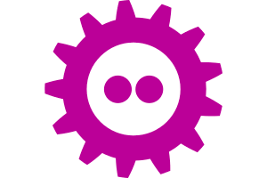
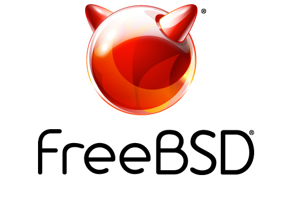

# 活动日历

- 原文链接：[2025 Events Calendar](https://freebsdfoundation.org/our-work/journal/browser-based-edition/virtualization-2/events-calendar/)
- 作者：Anne Dickison

## 截至 2025 年 3 月的 BSD 活动

如发现此处未列出的 FreeBSD 相关活动或对 FreeBSD 用户有益的活动，请将详情发送至 [freebsd-doc@FreeBSD.org](mailto:freebsd-doc@FreeBSD.org)。

## FOSDEM 2025

2025 年 2 月 1-2 日

比利时布鲁塞尔

FOSDEM 是由志愿者组织的为期两天的活动，旨在推动自由和开源软件的广泛应用。FOSDEM 于 2025 年 2 月 1-2 日举办，为开源和自由软件开发者提供一个相聚、交流想法、协作的平台。

## SCALE 22X

2025 年 3 月 6-9 日

美国加州帕萨迪纳

SCALE 22X——第 22 届年度南加州 Linux 大会——将于 2025 年 3 月 6-9 日在加州帕萨迪纳举行。

SCALE 是北美规模最大的社区主办的开源和自由软件大会。

## AsiaBSDCon 2025

2025 年 3 月 20-23 日

日本东京

AsiaBSDCon 是面向基于 BSD 的系统用户和开发者的大会。下一届大会将于 2025 年 3 月 20-23 日在日本东京举行。大会面向所有开发、部署和使用基于 FreeBSD、NetBSD、OpenBSD、DragonFlyBSD、Darwin 和 MacOS X 系统的人。AsiaBSDCon 是一场技术大会，旨在汇集最优秀的技术论文和演讲，确保开源社区中的最新进展能被最广泛的受众所了解。
