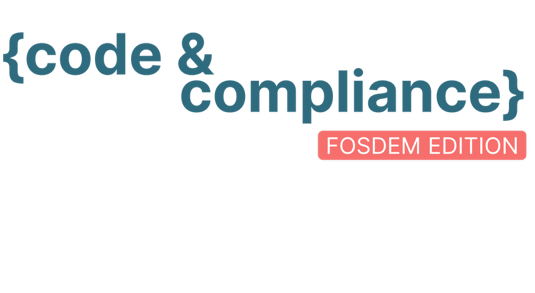
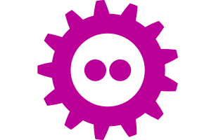
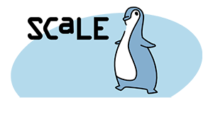
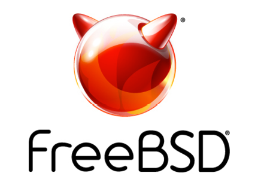

# 活动日历

- 作者：**Anne Dickison**

截至 2026 年 3 月的 BSD 活动。如有任何 FreeBSD 相关活动或对 FreeBSD 用户有吸引力的活动未在此处列出，请将详情发送至 <freebsd-doc@FreeBSD.org>。

## Code & Compliance FOSDEM 特别版

2026 年 1 月 26 日

比利时布鲁塞尔

<https://www.eclipse-foundation.events/event/code-compliance-2026/>

欢迎来布鲁塞尔参加下一届 Code & Compliance 聚会。在这场开放、社区驱动的活动中，开源开发者、项目维护者和行业领袖齐聚一堂，深入探讨欧盟《网络弹性法案》，改进开源合规实践，并分享提升软件安全性的实用方法。

## FOSDEM 2026

2026 年 1 月 31 日 – 2 月 1 日

比利时布鲁塞尔

<https://fosdem.org/2026/>

FOSDEM 是由志愿者组织的为期两天的活动，旨在推广自由和开源软件的广泛使用。FOSDEM 于 2026 年 1 月 31 日至 2 月 1 日举办，为开源和自由软件开发者提供交流、分享想法与协作的场所。活动以高度面向开发者著称，汇聚来自世界各地的 8000 多名开发者。今年还将设立 BSD 开发者房间和展台。

## SCALE 23X

2026 年 3 月 5–8 日

美国加州帕萨迪纳

<https://www.socallinuxexpo.org/scale/23x>

SCaLE 23X——第 23 届南加州 Linux 年度博览会，是北美规模最大的社区主办的开源与自由软件大会。每年在大洛杉矶地区举办。基金会今年将设展参展。

## AsiaBSDCon 2026

2026 年 3 月 19–22 日

中国台湾台北

<https://2026.asiabsdcon.org/>

AsiaBSDCon 是一场面向基于 BSD 系统用户和开发者的会议。这是一场技术大会，旨在汇集最优秀的技术论文和演讲，确保开源社区中的最新进展能传播给尽可能广泛的受众。
