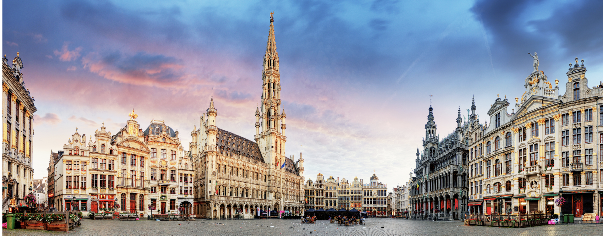

# 会议报告：FOSDEM 2025

- 原文链接：[Conference Report: FOSDEM 2025](https://freebsdfoundation.org/our-work/journal/browser-based-edition/downstreams/conference-report-fosdem-2025)
- 作者：Tom Jones

参与开源软件有很多方式。开发是大家首先想到的显而易见的方式，但许多人并不是开发者，还有其他贡献方式。

你可以写代码，但也可以测试进行中的开发和发布、阅读并修正文档、撰写新文档、在上千个地方回答问题、做推广、筹款、协调贡献者，或者组织活动。组织活动是回馈社区的好方式，但光是凑齐十个人就需要大量工作。

在 BSD 世界里，我们很幸运有三大地理上分散的会议，每年的日程都塞满了活动。问问任何想塞进一场黑客马拉松的人，他们必须协调多少冲突。

大多数开源项目不具备举办常规会议所需的规模和基础设施。见面很难，有些人或许有幸得到雇主支持，每年能与其他开发者见几次面。举办会议的成本对大多数小项目来说太高，互动往往只限于线上。

在欧洲，FOSDEM 填补了重要的生态位。FOSDEM 是世界上最大的开源会议，向所有人开放。这场活动完全占据了布鲁塞尔的 ULB 校园，参会者约 8000 人。FOSDEM 处理了寻找场地的复杂后勤，为项目提供见面、讨论和演讲的场地，以及展示 demo 的空间。如此大规模的活动不仅让项目开发者得以见面，还创造了项目之间的大量交叉授粉。

为让大家都有事可做，会议设有主议题演讲、数百个项目或主题专用的开发者房间（dev rooms），以及供项目展示的摊位。FOSDEM 需要各种规模的项目来运转，作为交换，它让参会者有机会接触到所有来布鲁塞尔的人。

## 在 FOSDEM 2025 推广 FreeBSD

我志愿帮忙照看 FOSDEM 的 FreeBSD 摊位。活动筹备期间，一大袋贴纸和一条桌旗送到了我家，我还协助把一条横幅运到比利时。

为帮助项目向外界介绍自己，FOSDEM 提供桌位或展位。这些桌位是新老用户前来提问的固定地点，也让项目有机会吸引路过的访客偶然发现一个有趣的项目。

两天的大部分时间我都站在桌后回答问题、分发贴纸，与其他项目成员讨论 FreeBSD 想法。

在开源项目的摊位值班是检验你知识水平的好方式。有时人流近乎源源不断，从当前用户、过去用户到完全新接触项目的人都有。以下是 FOSDEM 期间我被问到的一些关于我们如何推广 FreeBSD 的问题。

- FreeBSD 跑什么桌面？
- FreeBSD 能做什么？
- 我能拿一张贴纸吗？
- 谁在用 FreeBSD？
- 为什么选 FreeBSD 而不是 << 我最喜欢的 >> Linux 发行版？
- 说服我这位朋友用 FreeBSD。
- FreeBSD 上能跑容器吗？
- 你们项目怎么筹钱？

你的回答是什么？

我发现这些问题以及其他问题——尤其是那些用法语问的，我完全听不懂也完全没听清——是了解开源社区心态的绝佳切入点。

在这种环境下听到人们提出的问题，能反映出那些考虑其他操作系统的人（或者那些可怜又困惑、被拒绝了五次还以为我们是 Linux 发行版的人）感兴趣的是什么。

对切换和桌面的关注，暴露了我们在参加活动时展示项目方式的巨大缺口。贴纸很棒，横幅能让人找到我们，但我们缺少一些简单的 demo 来展示——是的，FreeBSD 是桌面，能做 Linux 上几乎一切能做的事。桌面环境的问题很有意思，许多提问者已经把我们划入了与围绕单一桌面环境构建的小型、专注的 Linux 发行版同一类。我们能跑所有桌面环境，虽然这让我们自己满意，但对来访摊位的人来说还不够有说服力，难以让人记住。

这些问题让我满怀想法，想如何更好地推广 FreeBSD——用桌面使用案例，也用我们那些酷而吸引人的功能。带上几块 SBC，展示同一版 FreeBSD 在所有设备上运行——无需配置——并不需要太多。

## 更多推广

回看这些问题。你准备好答案了吗？

如果你参加过会议、社区活动，或者在商场看到过慈善机构的摊位，你会熟悉这种场景。我们能怎样更好地回答这类问题？

开源会议上的摊位是高接触地点，你有数小时源源不断的机会让人对 FreeBSD 产生兴趣。我们带来了贴纸、马克杯和速查表，但最大的成功将来自我们能在这些场合带给人们持久的正面体验。

如果你对如何在会议上更好地推广 FreeBSD 有想法，请给我发邮件（[thj@freebsd.org](mailto:thj@freebsd.org)），我们可以开始讨论如何向开源社区推介 FreeBSD。

Tom Jones 是 FreeBSD committer，致力于让网络栈保持快速。
