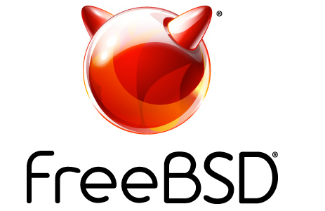

# 活动日历

截至 2025 年 9 月的 BSD 活动
作者：Anne Dickison

如有任何 FreeBSD 相关活动，或对 FreeBSD 用户有益却未在此列出的活动，请将详情发送至 [freebsd-doc@FreeBSD.org](mailto:freebsd-doc@FreeBSD.org)。

## 2025 年 6 月 FreeBSD 开发者峰会

2025 年 6 月 11-12 日  
加拿大渥太华  
[https://wiki.freebsd.org/DevSummit/202506](https://wiki.freebsd.org/DevSummit/202506)

欢迎参加 2025 年 6 月 FreeBSD 开发者峰会。本次峰会与 BSDCan 2025 同地举办，地点位于加拿大渥太华。为期两天的活动于 2025 年 6 月 11-12 日举行，内容包括开发者讨论会、厂商演讲和工作组。

## BSDCan 2025

2025 年 6 月 11-14 日  
加拿大渥太华  
[https://www.bsdcan.org/2025/](https://www.bsdcan.org/2025/)

BSDCan 是一场技术大会，面向使用 BSD 操作系统及相关项目的开发者和使用者。大会以开发者会议的形式，重点关注新兴技术、研究项目和工作进展，同时涵盖用户空间基础设施项目，欢迎自由软件开发者和商业厂商贡献者共同参与。

## EuroBSDCon 2025

2025 年 9 月 25-28 日  
克罗地亚萨格勒布  
[https://2025.eurobsdcon.org/](https://2025.eurobsdcon.org/)

年度大会提供了了解 BSD 领域最新动态、观摩当代部署案例，和与使用 BSD 相关技术的用户和公司面对面交流的难得机会。EuroBSDCon 也是思想、讨论与信息交流的起点，常常催生编程项目。
