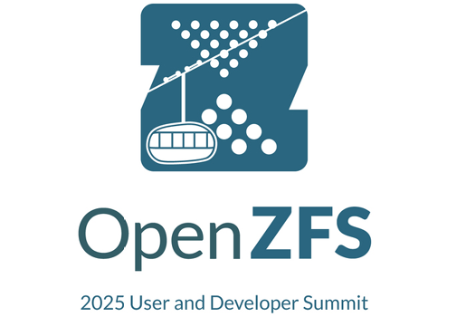
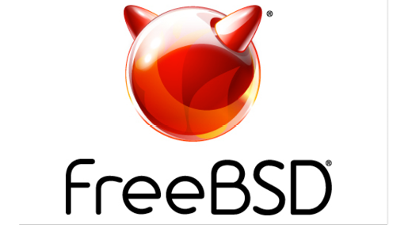

# 活动日历

作者：Anne Dickison

## 截至 2025 年 11 月举办的 BSD 活动

如有任何 FreeBSD 相关活动或 FreeBSD 用户感兴趣的活动未在此列出，请将详情发送至 [freebsd-doc@FreeBSD.org](mailto:freebsd-doc@FreeBSD.org)。

## EuroBSDCon 2025

2025 年 9 月 25-28 日
克罗地亚萨格勒布
[https://2025.eurobsdcon.org/](https://2025.eurobsdcon.org/)

这一年度大会提供了绝佳机会，让你了解 BSD 领域的最新动态，见证当代部署案例，并亲自结识其他使用 BSD 技术的用户与企业。EuroBSDCon 也是创意、讨论与信息交流的温床，这些交流常常会催生编程项目。

## OpenZFS 用户与开发者峰会 2025

2025 年 10 月 25-28 日
美国俄勒冈州波特兰
[https://openzfs.org/wiki/OpenZFS_Developer_Summit_2025](https://openzfs.org/wiki/OpenZFS_Developer_Summit_2025)

今年的用户峰会将探讨广泛的主题，旨在支持并连接 OpenZFS 社区。

## 2025 年 11 月 FreeBSD 厂商峰会

2025 年 11 月 6-7 日
美国加利福尼亚州圣何塞

该峰会为商业 FreeBSD 用户提供了独特的机会，让他们能与开发者和贡献者面对面交流，推动所需功能的实现、问题的解决和需求的满足。峰会也为改进和增强操作系统开启了讨论。
