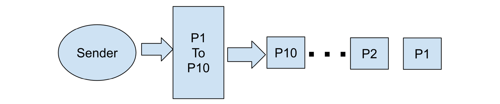
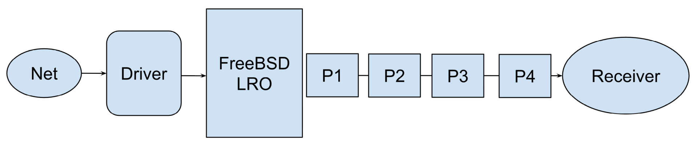
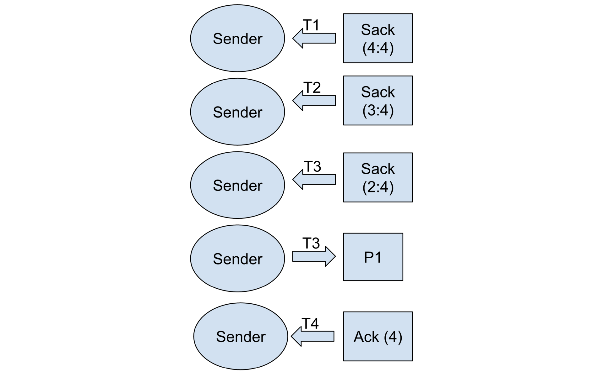

# TCP/IP 历险记：改进 TCP 对重排序的响应

- 原文：[Adventures in TCP/IP: Improving TCP’s Responses to Reordering](https://freebsdfoundation.org/our-work/journal/browser-based-edition/laptop-desktop/adventures-in-tcp-ip-improving-tcps-responses-to-reordering/)
- 作者：**Randall Stewart**

本专栏与本系列中的其他专栏略有不同。它介绍了使用 TCP 时出现的一系列问题，并详细描述了如何排查这些问题，展示了之前专栏中介绍的信息。它还将参考本系列之前专栏中介绍的一些 TCP 机制。最后，将把所有内容联系起来，不仅展示问题是如何解决的，还展示由于发现并修复了驱动程序 bug，RACK 栈如何变得更能抵抗数据包重排序。

## 问题

去年某个时候，Drew Gallatin 向我提出了他遇到的 TCP 问题。问题始于他尝试使用 FreeBSD 软件包工具 (pkg) 在新位置下载一组要更新的软件包。速度慢得令人痛苦。他期望达到 Mbps 级别的速度，但实际上下载速度极其缓慢。于是，他开始使用他可以访问的另一个 FreeBSD 站点进行测试。这促使他尝试改用 RACK 栈，因为过去对他来说性能更好。果然，正如他告诉我的，使用 RACK 栈的性能是 FreeBSD 默认栈的三倍。但 10 kbps 的三倍只有 30 kbps，而他期望的性能至少比这高两个数量级。他将这个问题发给我，询问为什么 RACK 栈和 FreeBSD 栈中的 TCP 在他的“高速”互联网上表现如此之差。

### 识别问题

正如在关于黑盒日志记录的专栏 [1] 中所讨论的，黑盒日志记录 (BBlog) 提供了详细的调试信息，尤其是对于 RACK 栈。首先要在发送方和接收方都启用 BBlog。有关如何启用 BBlog 的详细说明，请参阅该专栏。

针对 Drew 的情况，我最终为他提供了几个自定义的客户端-服务器程序，这些程序会发送并丢弃文件，同时启用 BBlogs。然后 Drew 运行 BBlog 收集器 (tcplog_dumper) 和特定程序来发送大小相当的文件，类似于他试图下载到新位置的文件。获取 BBlogs 后，他便让我阅读并解读。我不会用 BBlog 包含的大量文本来烦你，但它们很快就描绘了发送方和接收方的状况，立刻揭示了 TCP 层发生的情况。基本上，发送方会以大约 10 MSS（14,600 字节）的初始窗口开始，并向内部驱动程序 TSO 机制发送突发数据：

数据包将穿过互联网并到达 TCP 接收方，如下所示：

接收方发送了 SACK 和 ACK，表明接收方按 P4、P4、P2，最后是 P1 的顺序处理了数据包。

现在，从 BBlogs 中，我无法确定重排序来自哪里——毕竟你只看到了 TCP 的视角。FreeBSD LRO 层以下（即驱动程序和网络）发生的情况在 BBlogs 中不可见（请注意，BBlogs 中有一些 LRO 日志）。正如 Bennett、Partridge 和 Shectman [2] 所示，在网络中看到重排序也并不罕见。因此，我要求 Drew 调查为什么他的网络会出现大规模重排序——而且确实非常大规模。

似乎每 4-5 个数据包一组，都会以与发送顺序相反的顺序到达。因此，你会看到 10 个初始数据包的突发变成 P4、P3、P2、P1 的到达模式，然后是 P8、P7、P6、P5，接着是 P10 和 P9。这种行为会导致 FreeBSD TCP 栈不断进入恢复状态，因为它看到三个重复的 ACK/SACK，这会就在所有数据包的 ACK 到达时开始重传。一旦进入快速恢复，如 [3] 中所讨论的，在确认所有在途数据后退出恢复，并最终将拥塞窗口减半，将 ssthresh 点（我们从慢启动切换到拥塞避免的点）设置为相同的值。

这意味着 FreeBSD TCP 栈永远无法真正长时间摆脱恢复状态，这很容易解释 Drew 看到的糟糕性能。一旦恢复结束，它会回到拥塞避免状态。每当拥塞窗口允许四包突发时，栈会再次看到三个重复的 ACK/SACK 并重新进入恢复状态。

### 问题的根本原因

Drew 是 FreeBSD 开发者（他喜欢处理驱动程序），经过一番调查后发现，实际上是驱动程序与 LRO 的接口存在错误，导致了重排序。基本上是硬件禁用了多队列，因此硬件停止计算 RSS 哈希，因为不再需要。然而，驱动程序仍然将 RSS 哈希标记为有效。FreeBSD LRO 代码使用 RSS 哈希对接收的数据包进行排序。这种错误标记导致 LRO 对数据包进行错误排序。修补他的驱动程序以将数据包按正确顺序发送到 LRO 后，RACK 和 FreeBSD 栈的性能都大幅改善，达到了他期望的数量级。用 BBlogs 帮助 Drew 找到这个问题很棒，但整个事件从 TCP 角度引发了我更多疑问。如果你不熟悉 RACK 栈，甚至可能在你脑海中产生一个疑问。

## 由 bug 引发的进一步问题

### 为什么 RACK 栈比 FreeBSD 栈表现更好？

对于那些不熟悉 RACK 的人，你可能想知道为什么 RACK 的性能是 FreeBSD 栈的三倍（尽管只有 30 kbps，但仍然有相当大的差异）。这是因为，如 [4] 中所讨论的，RACK 栈具有防止重排序的保护措施。它通过结合使用计时器和丢失报告来实现这一点。当 SACK 到达表明数据丢失时，如果经过的时间不够长，它会等待重传。计时器通常是最新的 RTT 加上小的额外延迟，但当 RACK 通过 DSACK（DSACK 是表明 TCP 段被接收方多次接收的 SACK）看到网络中的重排序时，它会将这个计时器扩展到最近 RTT 的两倍。这意味着在初始恢复后，当额外延迟较小时，DSACK 的到达会增加 RACK 延迟计时器，足以使其不会不断进入恢复状态，而是等待足够长的时间让所有确认流回。

### 为什么 RACK 栈仍然如此缓慢？

对我来说，这是这个 bug 引发的根本问题。RACK 有这种奇妙的机制来防止重排序，那么为什么在初始恢复后，RACK 没有迅速加速以达到 Drew 预期的兆比特每秒？通过深入研究 BBlog，我最终找到了答案。

这个问题要回到拥塞控制的工作原理。一旦因丢失/恢复事件退出初始慢启动，ssthresh 就设置为 5 个数据包（初始 10 个减半）。这意味着 RACK 永远处于拥塞避免状态。这对 TCP 造成了显著的拖累。在拥塞避免状态下，每次确认一个完整拥塞窗口的数据时，你会将拥塞窗口增加一个 MSS。所以，你发送并确认了五个数据包，现在将拥塞窗口提高到六个数据包。现在你发送并确认了六个数据包，然后将其提高到七个。这一直持续到发生其他错误或连接数据全部发送完毕，连接完成。

因此，看看他的往返时间（大约 45 毫秒），这意味着每 45 毫秒你会将拥塞窗口增加一个数据包。这听起来不错，直到你意识到要充分利用 1,000 Mbps 的网络，在 45 毫秒 RTT 下，你的拥塞窗口需要打开到大约 3,850-3,900 个数据包。所以，RACK 需要大约 380 次往返才能开始充分利用他的网络，这大约需要 170-180 秒。如果他只有一次超大传输，这在整体大局中不会太明显，但每次传输完成时，它会启动新的 TCP 连接，再次遇到相同的问题。这让他的“快速”网络在他看来非常缓慢。

所以，这让我产生了根本性的疑问。我们如何改变 RACK 栈以更好地从这种情况中恢复？

### 现在集成到 RACK 栈中的改进是什么？

所以，我想到一种方法，让 RACK“重新进入”慢启动（请注意，慢启动在我看来名不副实，因为它是指数增长，每个 RTT 拥塞窗口翻倍），这样它可以更快地打开窗口。回顾初始情况时，RACK 会看到以下情况：

这里的关键是时间标记 T3（与传输时间相比）刚好比 RTT 长一点，让 RACK 知道该重传数据包了。这是因为 RACK 到目前为止还没有看到任何重复的确认，并且从初始发送到 T3 的时间长于 RTT 加上 RACK 使用的小初始增量。但更重要的是，T4——移动累积点到 P4 的确认实际到达——用时远少于 RTT。基本上，T4 和 T3 之间的时间总是少于 RTT 的一半。这为如何调整 RACK 以应对这种情况提供了思路。

RACK 现在跟踪已重传的数据量（以字节为单位）。任何时候到达的 SACK 或 ACK 只涉及一次重传，并且确认（SACK 或 ACK）距离重传发送的时间少于 SRTT 的一半，它会减少该计数。如果计数减少来自 ACK（累积确认点向前移动）并且计数降至零，这意味着我们遇到了实际进入恢复是误判的情况，我们应该恢复之前的 ssthresh 和拥塞窗口，并重新开始慢启动。

为 RACK 添加上述小改动后，其糟糕的性能会接近没有重排序时的表现，并让 RACK 栈更好地防止重排序。

1. R. Stewart, M. Tüxen, “Adventures in TCP/IP: TCP Black Box Logging”, in The FreeBSD Journal May/June, 2024.
2. C. R. Bennett, C. Partridge and N. Shectman, “Packet reordering is not pathological network behavior,” in IEEE/ACM Transactions on Networking, vol. 7, no. 6, pp. 789-798, Dec. 1999.
3. R. Stewart, “Dynamic Goodput Pacing: A New Approach to Packet Pacing”, in The FreeBSD Journal November/December, 2024.
4. R. Stewart, M. Tüxen, “RACK and Alternate TCP Stacks for FreeBSD”, in The FreeBSD Journal January/February, 2024.

---

**RANDALL STEWART** ([rrs@freebsd.org](mailto:rrs@freebsd.org)) 从事操作系统开发 40 余年，自 2006 年以来一直是 FreeBSD 开发者。他专门研究包括 TCP 和 SCTP 在内的传输层，但也以涉足操作系统的其他领域而闻名。他目前是一名独立顾问。
