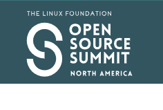

# 活动日历

- 作者：**Anne Dickison**

本文列出了截至 2026 年 6 月的 BSD 相关活动。如有任何未在此列出的 FreeBSD 相关活动或对 FreeBSD 用户感兴趣的活动，请发送至 <freebsd-doc@FreeBSD.org>。

## 202604 黑客马拉松

2026 年 4 月 24-26 日
德国威斯巴登
<https://wiki.freebsd.org/Hackathon/202604>

我们很高兴地宣布，今年 4 月将在威斯巴登举办一场区域性 FreeBSD 黑客马拉松，目前正处于规划阶段。本次活动面向本地社区成员，同时也欢迎所有对 FreeBSD 贡献感兴趣的人参与。活动目标是协作、交流，在专注且友好的环境中推动 FreeBSD 取得实质性进展。

## 2026 开源峰会北美站

2026 年 5 月 18-20 日
美国明尼苏达州明尼阿波利斯
<https://events.linuxfoundation.org/open-source-summit-north-america/>

峰会设有涵盖 Linux、云与容器、AI、安全、嵌入式系统等多个领域的专题。与会者将听到主题演讲、技术报告，并与更广泛的开源社区交流。FreeBSD 基金会执行董事 Deb Goodkin 将在大会上发表演讲。

## 2026 渥太华 FreeBSD 开发者峰会

2026 年 6 月 17-18 日
加拿大安大略省渥太华
<https://wiki.freebsd.org/DevSummit/202606>

本次活动与 BSDCan 2026 同期举办，为期两天，内容包括开发者讨论会、厂商演讲和工作组讨论。

## BSDCan 2026

2026 年 6 月 17-20 日
加拿大渥太华
<https://www.bsdcan.org/2026/>

BSDCan 是一场技术大会，面向使用 BSD 操作系统家族及相关项目的开发者和用户。大会以开发者会议的形式，重点关注新兴技术、研究项目和工作进展，同时涵盖用户空间基础设施项目，欢迎自由软件开发者和商业厂商贡献者共同参与。
