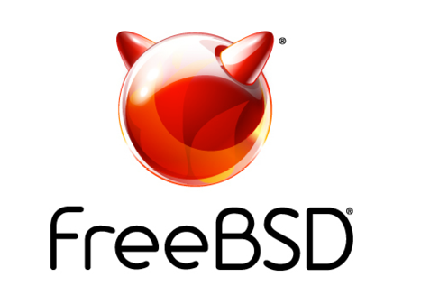

# 活动日历

- 作者：**Anne Dickison**

本文列出了截至 2026 年 9 月的 BSD 相关活动。如有任何未在此列出的 FreeBSD 相关活动或对 FreeBSD 用户感兴趣的活动，请发送至 <freebsd-doc@FreeBSD.org>。

## 2026 FreeBSD 黑客马拉松

2026 年 9 月 4-6 日

德国柏林

<https://wiki.freebsd.org/Hackathon/202609>

欢迎加入 FreeBSD 社区，参加 2026 年 9 月的 FreeBSD 黑客马拉松。活动将在德国柏林举办，时间在 EuroBSDCon 2026 前的周末。黑客马拉松汇聚 FreeBSD 开发者和贡献者，协作推进项目、分享想法、并肩工作，随后一同前往 EuroBSDCon。

## 2026 年 9 月 FreeBSD 开发者峰会

2026 年 9 月 9-10 日

比利时布鲁塞尔

<https://wiki.freebsd.org/DevSummit/202609>

2026 年 9 月 FreeBSD 开发者峰会与 EuroBSDCon 2026 同期举办，将汇聚开发者、贡献者和工作组，进行深入讨论与协作。开发者峰会提供了面对面交流、分享进展、提出问题、与 FreeBSD 社区同仁共同探讨想法的宝贵机会。

## EuroBSDCon 2026

2026 年 9 月 9-13 日

比利时布鲁塞尔

<https://2026.eurobsdcon.org/>

EuroBSDCon 是年度国际技术大会，每年在欧洲不同国家举办。大会聚焦于汇聚使用 4.4BSD（伯克利软件发行版）操作系统家族及相关项目的用户和开发者。FreeBSD 基金会很荣幸成为本次活动的银级赞助商。
